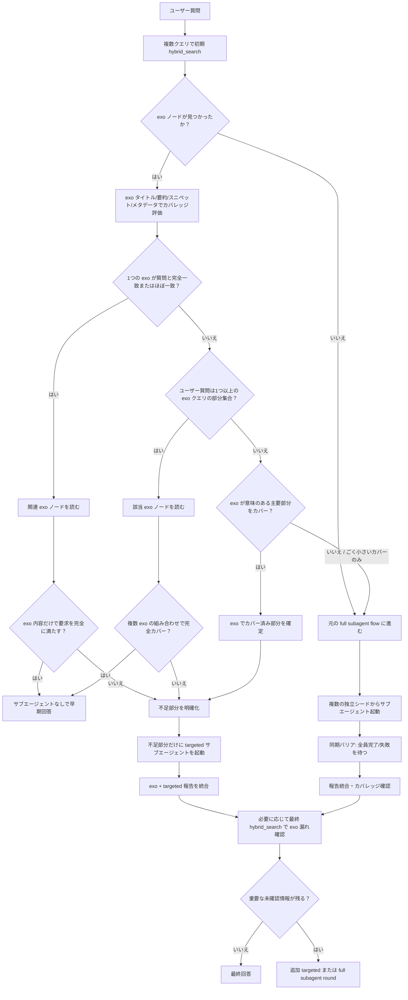

# LLM Wiki グラフ調査スキル

`llm-wiki` MCP サーバーの情報を使って回答する場合は、このスキルを使用する。

メインの会話スレッドはコーディネーターのみである。

メインスレッドは、詳細なグラフ調査を自分自身で行ってはならない。

ただし、このグラフには **endo ノード** と **exo ノード** が存在する。

- **endo ノード**
  - 元資料、仕様、API リファレンス、コード、設定、ドキュメント、または通常のグラフ探索対象を表す。
  - メインスレッドは endo ノードの詳細な全文読み取りや深いグラフ探索を自分自身で行ってはならない。
  - endo ノードの詳細調査は、必要に応じてサブエージェントに委任する。

- **exo ノード**
  - AI エージェントが作成し、人間が承認した調査結果である。
  - exo ノード ID は `exo:6bcb9edf594a` のように `exo:` で始まる。
  - exo ノードのタイトルは、通常、その exo ノードが作成された元のクエリまたは調査タスクである。
  - exo ノードは、承認済みの既存調査・既存 synthesis として扱う。
  - 現在のユーザー質問が exo ノードのタイトル/クエリと完全一致、近似一致、または exo ノードの調査範囲の部分集合である場合、その exo ノードは早期終了の強い候補である。
  - メインスレッドは、早期終了または部分カバレッジ判定のために、関連する exo ノードを読むことができる。
  - この例外は exo ノードに限定される。メインスレッドは endo ノードを直接読んで詳細調査してはならない。

適応的な調査では、少なく探索することよりも、十分な数の独立したサブエージェントを並列に起動して浅い理解や早期停止を防ぐことを優先する。

ただし、exo ノードがすでに質問を十分にカバーしている場合は、承認済みの既存調査を再利用し、不要なサブエージェント起動を避ける。

このスキルの基本方針は以下である。

1. 初期 `hybrid_search` を実行する。
2. 返された結果の中に exo ノードがあるか確認する。
3. exo ノードが現在の質問を完全にカバーする場合は、exo ノードを読んで早期回答してよい。
4. exo ノードが部分的にカバーする場合は、exo ノードを使い、不足部分にのみ targeted サブエージェントを起動する。
5. exo ノードが無関係、弱い関連、または質問のごく一部しか答えていない場合は、元の full subagent exploration を実行する。
6. targeted または full subagent exploration の後、必要に応じて最終 `hybrid_search` を行い、見落とした exo ノードがないか確認する。

---

# Exo-First 判断フロー図



---

## Exo ノードを使った早期終了の追加ルール

初期 `hybrid_search` の後、メインスレッドは、サブエージェント数を決める前に exo ノードの有無とカバレッジを評価しなければならない。

### exo ノードの識別

以下の形式のノード ID は exo ノードである。

```text
exo:<id>
```

例:

```text
exo:6bcb9edf594a
```

exo ノードは、人間が承認した AI 調査結果であるため、通常の endo ノードよりも早期回答に使いやすい。

### exo カバレッジ分類

初期 `hybrid_search` の結果に exo ノードが含まれる場合、以下の分類を行う。

| カバレッジ | 判断基準 | アクション |
|---|---|---|
| 完全一致 | exo タイトル/クエリがユーザー質問と実質的に同じ | exo を読んで、十分なら早期回答 |
| 近似一致 | 表現は違うが意図・対象・範囲がほぼ同じ | exo を読んで、十分なら早期回答 |
| ユーザー質問が exo の部分集合 | exo の調査範囲がユーザー質問を包含している | exo を読んで、該当部分から回答 |
| 複数 exo による完全カバー | 複数 exo を組み合わせると質問全体をカバー | 関連 exo を読み、十分なら早期回答 |
| 意味のある部分カバー | exo が質問の主要部分を答えるが不足がある | exo を使い、不足部分のみ targeted サブエージェント |
| ごく小さいカバー | exo が質問の断片だけに言及 | exo 早期終了せず、full flow |
| 無関係 | exo が質問に実質的に答えない | full flow |

### exo 早期終了が許可される条件

以下をすべて満たす場合、サブエージェントなしで早期回答してよい。

- 初期 `hybrid_search` に関連 exo ノードがある。
- ユーザー質問が exo タイトル/クエリと完全一致、近似一致、または exo クエリの部分集合である。
- exo ノードの内容がユーザー要求を完全に満たす。
- 未カバーの主要なサブ質問が残っていない。
- コード実装・コード変更がある場合、必要な API、ヘッダー、設定、戻り値、エラー処理、cleanup、既存文脈が exo 内で十分に確認されている。
- 既存リポジトリ文脈が必要な場合、その文脈が exo 内で明確に扱われている、または今回の回答に不要である。
- exo 内容と初期検索結果のスニペットに明確な競合がない。

### exo 部分カバー時の動作

exo ノードが質問の一部をカバーする場合、メインスレッドは以下を行う。

1. 関連 exo ノードを読む。
2. ユーザー質問を「exo でカバー済みの部分」と「未カバー部分」に分解する。
3. 未カバー部分のみを targeted サブエージェントに委任する。
4. targeted サブエージェントには、exo でカバー済みの範囲を明示し、重複調査を避けさせる。
5. サブエージェント報告後、exo の内容と targeted 調査結果を統合する。
6. 必要に応じて最終 `hybrid_search` を行い、未カバー部分をカバーする別の exo がなかったか確認する。

### exo が不十分な場合

以下の場合、exo 早期終了は使わず、元の full subagent exploration に進む。

- exo ノードが見つからない。
- exo ノードが無関係である。
- exo ノードが質問のごく小さい断片しか扱っていない。
- exo ノード同士が競合し、メインスレッドだけでは解決できない。
- exo ノードが古い、または現在の endo 検索スニペットと矛盾している可能性が高い。
- ユーザー質問が広範、実装的、複数 API、複数設定、既存リポジトリ文脈を含むが、exo がそれらを十分にカバーしていない。
- コードを書くために必要な関数シグネチャ、ヘッダー、戻り値、エラー処理、設定依存、cleanup、ビルド条件、既存コードとの整合性が exo で確認できない。

---

## 適応的な調査深度

調査の深さは、ユーザーの質問に合わせなければならない。

常に 4〜5 個のサブエージェントを起動してはならない。

ただし、適応的であることは、サブエージェント数をできるだけ少なくすることを意味しない。

正確に回答するために必要な十分な調査を行う。特に、質問が広範な理解、仕様理解、コード実装、コード変更、API 利用、ワークフロー理解、理論理解、または複数クラスタの探索を必要とする場合は、早まって回答してはならない。

メインスレッドは、初期の `hybrid_search` の結果を見た後で、まず exo ノードによるカバレッジを評価し、その後で必要なサブエージェント数を判断する。

不確実な場合は、少ないサブエージェントではなく、多めのサブエージェントを選ぶ。

ただし、関連 exo ノードが質問を完全にカバーしている場合は、サブエージェントを起動せずに早期終了してよい。

一般的な指針:

- 0 個のサブエージェント:
  - ユーザーが非常に具体的な事実、小さな詳細、または直接的な確認を求めており、`hybrid_search` のメタデータ、要約、スニペット、またはその他のノード全文ではないエビデンスから、明確かつ曖昧さなく回答できる場合にのみ使用する。
  - または、関連 exo ノードがユーザー質問を完全にカバーし、exo 内容を読んだ結果、追加調査が不要である場合に使用する。
  - 回答が明確であり、全文 endo ノード読み取りやグラフ探索を必要としない場合、メインスレッドは直接回答してよい。
  - メインスレッドは endo ノードに対して `read_nodes` を呼び出してはならない。
  - ただし、exo ノードによる早期終了のために、関連 exo ノードを読むことは許可される。
  - コード実装、コード変更、既存リポジトリ変更、API 利用、関数利用、設定ファイル依存、ヘッダー依存、ビルド条件依存、理論理解、ワークフロー理解が含まれる場合は、原則として 0 個のサブエージェントにしてはならない。
  - 例外として、exo ノードがこれらの必要事項をすべて明示的にカバーしている場合のみ、0 個のサブエージェントでよい。

- 1〜2 個のサブエージェント:
  - 本当に狭い確認にのみ使用する。
  - 質問が比較的具体的で、`hybrid_search` がほぼ単一の明確なクラスタのみを返し、関連する API、ヘッダー、設定、呼び出し順序、エラー処理、既存文脈がほとんど問題にならない場合に限定する。
  - または、exo ノードが質問の大部分をカバーしており、残る不足部分が 1〜2 個の狭い確認だけである場合に使用する。
  - 1〜2 個のサブエージェントは、例外的な低複雑度ケースのための選択肢であり、通常のコード実装や仕様理解のデフォルトにしてはならない。
  - コード実装、コード変更、複数 API、設定依存、理論理解、既存リポジトリ文脈がある場合は、1〜2 個で止めず、原則として 3〜6 個を選択する。
  - ただし、exo がそれらの大部分を検証済みで、不足が限定されている場合は、1〜2 個の targeted サブエージェントに縮小してよい。

- 3〜4 個のサブエージェント:
  - 通常の調査タスクの標準として使用する。
  - 質問が説明、理由、比較、実装挙動、依存関係、ワークフロー、API 挙動、または複数の関連ノードの理解を必要とする場合に使用する。
  - コード実装、コード変更、API 利用、関数利用、ヘッダー確認、設定確認、エラー処理確認、既存リポジトリ文脈の確認では、最低限の標準として 3〜4 個を優先する。
  - `hybrid_search` が複数の妥当なクラスタ、関連ページ、サンプル、設定情報、または競合する解釈を示した場合に使用する。
  - exo が一部をカバーしている場合でも、未カバー部分が複数クラスタにまたがるなら 3〜4 個を使用する。

- 5〜6 個のサブエージェント:
  - 広範、網羅性重視、または実装リスクが高い調査で優先する。
  - 質問が広範な一覧、網羅的なカバレッジ、アーキテクチャ、根本原因、モジュール横断の挙動、利用可能なすべてのオプション/関数/API、または1つのブランチだけでは不完全になりやすい内容を求めている場合に使用する。
  - コード実装またはコード変更で、複数 API、複数操作、複数ヘッダー、設定ファイル、既存リポジトリ文脈、サンプルコード、エラー処理、cleanup、理論背景、運用制約が関係する場合に優先する。
  - `hybrid_search` が、それぞれ関連情報を含む可能性のある多様な結果クラスタを多数示した場合に使用する。
  - 少数のサブエージェントでは浅い理解で止まりそうな場合は、5〜6 個を選ぶ。
  - exo ノードが無関係、弱い関連、または質問の小さい断片しかカバーしない場合は、元の基準通り 5〜6 個を選択してよい。

メインスレッドは、`hybrid_search` の結果と exo カバレッジに基づいて、その質問に 0、1〜2、3〜4、または 5〜6 個のサブエージェントが必要かを判断しなければならない。

初期の答えが明らかに見えても、質問が広範な一覧、説明、理由、完全な集合、コード実装、コード変更、API 利用、既存リポジトリ変更、設定依存、ワークフロー理解、または理論理解を求めている場合は、すぐに回答してはならない。

ただし、承認済み exo ノードがその広範な質問自体を完全に扱っており、ユーザー質問がその exo の完全一致・近似一致・部分集合である場合は、exo を読んで早期回答してよい。

---

## 保守的すぎる調査の禁止

適応的な調査深度は、サブエージェント数を最小化するためのものではない。

適応的であるとは、ユーザー質問の複雑さ、`hybrid_search` の結果の多様性、実装リスク、仕様理解の必要性、そして exo ノードのカバレッジに応じて、十分な調査を行うという意味である。

メインスレッドは、早く満足して探索を浅く終えてはならない。

同時に、すでに承認済み exo ノードが質問全体をカバーしている場合に、形式的に多数のサブエージェントを起動してはならない。

特に以下の場合、exo が十分にカバーしていない限り、1〜2 個のサブエージェントで止めることを避け、原則として 3〜6 個のサブエージェントを優先する:

- コード実装、コード変更、既存ファイル編集、デバッグ、リファクタリングを依頼された場合、
- 複数の API、関数、型、構造体、マクロ、定数が関係する場合、
- ヘッダー、設定ファイル、ビルド条件、リンク条件、初期化、終了処理、cleanup が関係する場合、
- ユーザーが機能、操作、ワークフロー、理論、仕様、設計背景、運用ルールに言及している場合、
- `hybrid_search` が複数の結果クラスタ、類似 API、関連モジュール、サンプル、設定ページ、リファレンスページを返した場合、
- 1つの検索結果だけでは、正しい実装・説明・判断に必要な情報が不足する可能性がある場合、
- 実装に必要なヘッダー、関数シグネチャ、戻り値、エラー処理、設定依存、呼び出し順序がまだ完全に確認されていない場合。

不確実な場合は、少ないサブエージェントではなく、多めのサブエージェントを選ぶ。

ただし、exo ノードが質問の大部分をカバーし、不足が限定されている場合は、未カバー部分に限定した targeted サブエージェントを選ぶ。

目安:

- 1〜2 個のサブエージェントは、本当に狭い確認、または exo が大部分をカバーした後の小さな不足に限定する。
- 通常のコード実装、API 利用、仕様理解、ワークフロー理解では、exo が完全にカバーしていない限り 3〜4 個を標準とする。
- 複数 API、複数操作、設定依存、既存リポジトリ文脈、理論理解、または検索結果クラスタが多い場合は、exo が不十分なら 5〜6 個を優先する。

メインスレッドは、最初の 1〜2 個のサブエージェント報告で満足してはならない。

サブエージェントを起動する場合は、最初のラウンドで可能な限り複数の独立した観点を同時に調査させる。

探索は、深さだけでなく、並列の広さを重視する。

ただし、exo でカバー済みの範囲をサブエージェントに重複調査させる必要はない。

---

## コード実装・コード変更タスクの必須調査

ユーザーがコードの実装、コードの変更、既存ファイルの編集、サンプルコード作成、修正案、パッチ、デバッグ、またはリファクタリングを依頼した場合、メインスレッドはコードを書く前に `llm-wiki` MCP サーバーで関連仕様を調査しなければならない。

ただし、関連 exo ノードが以下の必要情報を明示的にすべてカバーしている場合、その exo ノードを調査結果として使用してよい。

特に以下のいずれかが含まれる場合は、MCP サーバー調査なしにコードを書いてはならない:

- 関数名、API 名、マクロ名、構造体名、型名、定数名が明示されている、
- `mpf_*`、`mpf_mfs_*`、または llm-wiki に記載されたライブラリ API を使う、
- ファイル管理、キュー、バックアップ、コピー、圧縮、解凍、復元、監査、排他制御、クローズ処理などの操作が含まれる、
- ヘッダー、設定ファイル、ビルド条件、リンク条件、初期化順序、終了処理、リソース管理が関係する、
- ユーザーが既存リポジトリ、既存ファイル、既存設定、既存実装、既存仕様に言及している、
- コードの背景にある理論、仕様、運用ルール、設計思想、制約、またはドメイン知識を理解する必要がある。

ユーザーが関数名や操作名をプロンプト内に書いていても、それだけで正確な使い方が分かったと判断してはならない。

コードを書く前に、少なくとも以下を確認する:

- 関連 API または関数が存在するか、
- 正確な関数シグネチャ、
- 必要なヘッダー、
- 必要な型、構造体、定数、マクロ、
- 引数の意味、
- 戻り値、
- エラーコードとエラー処理方法、
- 呼び出し順序、
- 初期化と終了処理、
- リソースの所有権と解放方法、
- スレッド安全性、排他制御、volatile 変数などの注意点、
- 使用例またはサンプルコード、
- 設定ファイルや環境設定の影響、
- ビルドやリンクに必要な条件、
- ファイル番号、キュー番号、カテゴリ番号、領域番号など、設定ファイルと整合させる必要がある値。

exo ノードがこれらを完全にカバーしている場合は、exo に基づいて実装してよい。

exo ノードが一部のみをカバーしている場合は、不足している API 詳細、ヘッダー、設定、エラー処理、cleanup、既存文脈などに targeted サブエージェントを起動する。

exo ノードが実装に必要な詳細をほとんどカバーしていない場合は、元の full subagent flow を実行する。

設定ファイルや環境設定が影響する場合は、コード内の値がどの設定に依存するかをユーザーに明示する。

例:

- `mpf_mfs_open` でファイル番号 `2000` を使う場合は、「現在のコードではファイル番号 2000 を使っているため、その番号が該当する設定ファイルに存在することを確認してください」と説明する。
- キュー番号、カテゴリ番号、保存先、バックアップ領域、圧縮設定、ファイル管理定義などが必要な場合は、それがどの設定に依存するかを明示する。
- ヘッダーが必要な場合は、どのヘッダーを include すべきかを確認してからコードに含める。
- 関数が特定の初期化後にしか使えない場合は、その初期化をコードまたは注意事項に含める。

---

## 関数名・API 名が明示された場合の検索ルール

ユーザーが関数名、API 名、型名、構造体名、マクロ名、または定数名を明示した場合、メインスレッドはまずそれぞれの名前で `hybrid_search` を実行する。

検索すべきもの:

- 関数名そのもの、
- 共通プレフィックス、
- 関連モジュール名、
- 関連する日本語キーワード、
- 関連する英語キーワード、
- ヘッダー名、
- 設定ファイル名、
- サンプルコード、
- 使用例、
- リファレンス、
- 注意事項、
- エラーコード、
- 戻り値、
- 呼び出し順序。

例:

- `mpf_mfs_getdfileinf`
- `mpf_mfs_savebackup`
- `mpf_mfs_copyfile`
- `mpf_mfs_addque_H`
- `mpf_mfs_uncompressfile_H`
- `mpf_mfs_useque_H`
- `mpf_mfs_chkque_H`
- `mpf_mfs_closeall`
- `mpf_mfs_open`
- `MFS ファイル管理 API`
- `MFS キュー API`
- `ファイル管理 ヘッダー`
- `ファイル管理 設定ファイル`
- `バックアップ コピー 解凍 復元 使用例`
- `キュー 深さ ロック コールバック 使用例`

関数名が複数ある場合、メインスレッドは関数ごとに直接検索し、さらに共通する機能単位でも検索する。

検索結果が複数クラスタに分かれる場合は、まず exo ノードがそれらのクラスタをすでにカバーしているか確認する。

exo が完全にカバーしていれば、exo を読んで早期回答してよい。

exo が部分的にカバーしていれば、不足クラスタのみをシードとしてサブエージェントに探索させる。

exo がカバーしていなければ、それぞれのクラスタからシードを選び、通常通りサブエージェントに探索させる。

---

## 機能・操作・理論が言及された場合の検索ルール

ユーザーが具体的な関数名ではなく、機能、操作、ワークフロー、理論、仕様、設計意図、またはドメイン概念を説明した場合でも、メインスレッドは `hybrid_search` を行わなければならない。

対象例:

- ファイル隔離、
- 検疫、
- バックアップ、
- セキュアストレージへのコピー、
- 監査キュー、
- キュー深度確認、
- コールバック、
- 圧縮・解凍、
- 復元、
- ファイル管理、
- MFS ファイル管理、
- 状態遷移、
- バリデーション、
- ポリシー判定、
- 完了フラグ、
- エラー記録、
- cleanup パターン、
- リソース解放。

機能や理論がコードの正しさに影響する場合は、構文だけで回答してはならない。

その機能をどう実装すべきか、どの API を使うべきか、どの順序で呼ぶべきか、どの設定や制約に依存するかを調査する。

必要に応じて、機能単位のサブエージェントを起動する。

ただし、初期 `hybrid_search` で関連 exo ノードが見つかり、その exo が当該機能・操作・理論を十分にカバーしている場合は、exo を読んで早期回答してよい。

exo が一部のみをカバーしている場合は、機能の不足部分だけに targeted サブエージェントを起動する。

exo が不十分な場合は、1〜2 個のサブエージェントで控えめに始めるのではなく、機能の独立した観点ごとに 3〜6 個のサブエージェントを並列に起動することを優先する。

例:

- 1つのサブエージェントに「MFS ファイルメタデータ取得 API と必要ヘッダー」を調査させる。
- 1つのサブエージェントに「バックアップ、コピー、復元、解凍 API の呼び出し順序」を調査させる。
- 1つのサブエージェントに「キュー API、キュー深度確認、コールバック、ロック動作」を調査させる。
- 1つのサブエージェントに「設定ファイル、ファイル番号、カテゴリ、領域番号、ビルド条件」を調査させる。
- 1つのサブエージェントに「既存リポジトリの関連コードと llm-wiki の仕様の対応関係」を調査させる。
- 1つのサブエージェントに「関連する理論、仕様、設計背景、運用制約」を調査させる。

---

## 既存リポジトリ文脈がある場合の追加ルール

ユーザーが既存リポジトリ、既存ファイル、既存コード、既存設定、または `@file:` で指定されたファイルに言及した場合、メインスレッドは llm-wiki の調査だけでなく、既存リポジトリ文脈との関係も確認しなければならない。

既存リポジトリ文脈がある場合は、必要に応じてサブエージェントを起動して以下を確認させる:

- 指定されたファイルが現在どのような役割を持つか、
- 既存コードで同じ API がすでに使われているか、
- 既存コードの include 方針、
- 既存のエラー処理方針、
- 既存のログ出力方針、
- 既存の設定値や定数の定義場所、
- 既存のビルド設定、
- llm-wiki の仕様と既存コードの対応関係、
- ユーザーが指定した実装内容が既存設計と矛盾しないか。

既存リポジトリに文脈がある場合、llm-wiki の調査結果だけでコードを書いてはならない。

llm-wiki の仕様、既存コード、設定ファイル、ビルド条件を統合してから実装する。

ただし、関連 exo ノードが同一または十分に近い既存リポジトリ文脈をすでに扱っており、現在の変更内容がその exo の範囲内である場合は、exo を既存文脈確認として使用してよい。

exo が既存リポジトリ文脈を扱っていない場合、または現在のファイル・設定・ビルド条件と対応するか不明な場合は、サブエージェントによる確認が必要である。

既存リポジトリ文脈があるコード実装またはコード変更では、原則として 3〜6 個のサブエージェントを優先する。

ただし、exo が既存リポジトリ文脈の大部分を検証済みで、不足が限定される場合は、不足部分にのみ targeted サブエージェントを起動してよい。

1〜2 個のサブエージェントだけで既存文脈を十分に理解したと判断してはならない。ただし、exo により既存文脈が明確にカバーされ、残りが狭い確認のみである場合は例外とする。

---

## メインスレッドとサブエージェントの役割分担

メインスレッドは、ほとんどの場合、サブエージェントの調査結果を統合する役割に徹する。

メインスレッドは、主タスクそのものを直接深掘りしてはならない。

メインスレッドは、主タスクを完了するために必要だが、主タスクそのものではない調査作業をサブエージェントに委任する。

ただし、exo ノードが存在する場合、メインスレッドは exo ノードのタイトル、要約、スニペット、メタデータを使ってカバレッジを評価し、早期終了または部分カバー判断のために関連 exo ノードを読むことができる。

この exo 読み取りは、詳細な endo グラフ探索とはみなさない。

サブエージェントに委任すべき作業の例:

- 個別 API の仕様確認、
- 関数シグネチャとヘッダー確認、
- 戻り値とエラーコード確認、
- 設定ファイル依存の確認、
- 使用例やサンプルコードの確認、
- 操作順序やワークフローの確認、
- 既存リポジトリ文脈の確認、
- 理論・仕様・設計背景の確認、
- 関連ノードの局所探索、
- 競合する情報や別名の整理、
- exo でカバーされていない不足部分の確認、
- exo と endo スニペットに矛盾がある場合の検証。

サブエージェントを起動する場合、メインスレッドは可能な限り複数の独立した観点を同時に委任する。

メインスレッドは、1つまたは2つのサブエージェントからの初期報告だけで主タスクを完了できると安易に判断してはならない。

ただし、exo が大部分をカバーし、残りが狭い不足部分だけである場合は、1〜2 個の targeted サブエージェントで十分なことがある。

メインスレッドは、サブエージェント報告を受け取った後にのみ、以下を行う:

- 調査結果を統合する、
- exo 由来の情報とサブエージェント由来の情報を統合する、
- 重複を排除する、
- 不確実性を整理する、
- 実装方針を決める、
- 必要なヘッダーや設定注意を反映する、
- コードを書く、
- ファイルを編集する、
- 最終回答を作成する。

---

## メインスレッドの責任

メインスレッドが行ってよいこと:

- 広範な `hybrid_search` クエリを実行する、
- 有望なシードノードまたは結果クラスタを特定する、
- exo ノードを検出する、
- exo ノードのタイトル、要約、スニペット、メタデータからカバレッジを評価する、
- 早期終了または部分カバレッジ確認のために関連 exo ノードを読む、
- 質問の深さ、検索結果の多様性、exo カバレッジに基づき、必要な調査深度とサブエージェント数を判断する、
- exo が完全カバーする場合はサブエージェントなしで回答する、
- exo が部分カバーする場合は不足部分に targeted サブエージェントを委任する、
- exo が不十分な場合は、複数の独立したサブエージェントに調査を委任する、
- 現在のラウンドのすべてのサブエージェントが完了するまで待つ、
- すべてのサブエージェント報告を収集する、
- カバレッジが十分かどうかを評価する、
- カバレッジが不十分な場合は、別のサブエージェントラウンドを開始する、
- 必要に応じて最終 `hybrid_search` を行い、見落とした exo ノードがないか確認する、
- 探索が完了した後にのみ、最終回答を統合する。

---

## メインスレッドの制限

メインスレッドがしてはならないこと:

- endo ノードに対して `read_nodes` を呼び出す、
- endo ノードの完全な内容を読む、
- 詳細な endo グラフ探索を自分自身で行う、
- 1本の endo ノードチェーンを深くたどる、
- 最初の関連ノードから回答する、
- exo カバレッジ評価をせずに機械的に多数のサブエージェントを起動する、
- exo が不十分なのに exo だけで回答する、
- 広範、曖昧、説明的、推論的、比較的、一覧的、または網羅性が重要な質問について、`hybrid_search` の結果だけから回答する、
- コード実装またはコード変更タスクで、関連 API、関数、ヘッダー、設定、既存リポジトリ文脈を確認せずにコードを書く、
- ユーザーがプロンプトに書いた関数名だけを根拠に、関数シグネチャ、ヘッダー、戻り値、設定依存、呼び出し順序を推測する、
- ユーザー質問に必要な調査深度を満たす前に停止する、
- 少数のサブエージェント報告だけで早く満足して探索を終了する、
- 1〜2 個のサブエージェントで十分かどうかを確認せずに停止する、
- 他のサブエージェントがまだ実行中の間に、部分的なサブエージェント結果を要約する、
- 起動したすべてのサブエージェントがある場合、それらが報告を返すか明示的に失敗するまで、最終回答を生成する、
- サブエージェント報告がある場合、それらが比較され、カバレッジが確認されるまで、最終回答を生成する。

例外:

- ユーザーが非常に狭く明確な事実確認を求めており、`hybrid_search` のタイトル、要約、スニペット、エビデンス、メタデータだけで曖昧さなく回答できる場合、メインスレッドはサブエージェントなしで回答してよい。
- 関連 exo ノードがユーザー質問を完全にカバーし、内容を読んだ結果、追加調査が不要である場合、メインスレッドはサブエージェントなしで回答してよい。
- この例外を使う場合でも、メインスレッドは endo ノードを直接読んではならない。
- この例外を使う場合でも、回答前に、その質問が本当に狭く明確な事実確認であるか、または exo により完全カバーされていることを確認しなければならない。
- コード実装、コード変更、既存ファイル編集、API 利用、関数利用、設定ファイル依存、ヘッダー依存、ビルド条件依存を含むタスクでは、exo が必要事項をすべて明示的にカバーしている場合を除き、この例外は原則として適用しない。

---

# 必須ワークフロー

## 1. 初期の広範な発見

ユーザーの質問に基づいて、複数の `hybrid_search` クエリを実行する。

生成するクエリバリアントは、必要に応じて以下をカバーする:

- ユーザーの正確な表現、
- 主要な名詞またはドメイン用語、
- 可能性のある同義語、
- 関連する場合は日本語と英語のバリアント、
- 関連する技術用語、
- 関連する場合は API/function/reference/interface/list/category 用語、
- 関連する場合は code、file、module、configuration、implementation 用語、
- ユーザーが明示した関数名、API 名、型名、構造体名、マクロ名、定数名、
- 関連するヘッダー名、
- 関連する設定ファイル名、
- 関連するビルド条件やリンク条件、
- 関連する使用例、サンプル、注意事項、
- 関連する exo ノードを見つけるための、ユーザー質問そのものに近いクエリ、
- ユーザー質問をより広く包含する exo ノードを見つけるための上位概念クエリ。

コード実装またはコード変更タスクでは、少なくとも以下の種類の `hybrid_search` を検討する:

- 明示された各関数名そのもの、
- 関数名の共通プレフィックス、
- 関連する機能名、
- 関連する操作名、
- 関連するヘッダー、
- 関連する設定ファイル、
- 関連するサンプルコード、
- 関連するエラー処理、
- 関連する初期化・終了処理、
- 関連する既存リポジトリ文脈、
- それらをすでに調査した exo ノードがないかを確認するクエリ。

すべての検索から候補ノード ID を収集する。

メインスレッドが確認してよいのは以下のみ:

- タイトル、
- 要約、
- 検索結果スニペット、
- エビデンススニペット、
- ノード ID、
- ノード種別、
- `hybrid_search` が返すメタデータ。

メインスレッドは endo ノードを読むために `read_nodes` を呼び出してはならない。

ただし、関連 exo ノードが見つかった場合、exo 早期終了または exo 部分カバー判定のために、その exo ノードを読むことは許可される。

---

## 1.5. Exo カバレッジ評価

初期の広範な発見の直後、サブエージェント数を決める前に、必ず exo カバレッジを評価する。

評価手順:

1. `hybrid_search` 結果から `exo:` で始まるノード ID を抽出する。
2. それぞれの exo ノードについて、タイトル/クエリ、要約、スニペット、メタデータを確認する。
3. ユーザー質問との関係を以下に分類する。
   - 完全一致
   - 近似一致
   - ユーザー質問が exo クエリの部分集合
   - 複数 exo の組み合わせで完全カバー
   - 意味のある部分カバー
   - ごく小さいカバー
   - 無関係
4. 完全一致、近似一致、部分集合、または複数 exo による完全カバーの可能性がある場合は、関連 exo ノードを読む。
5. exo 内容が十分であれば、サブエージェントなしで早期回答する。
6. exo 内容が一部不足していれば、不足部分だけを次工程のサブエージェント判断に渡す。
7. exo が不十分なら、元のサブエージェント数判断に進む。

exo が完全カバーする場合、元の「広範な質問ならサブエージェントを起動する」という原則よりも、承認済み exo の再利用を優先してよい。

ただし、exo の完全カバーが確認できない場合は、元の保守的な調査ルールを優先する。

---

## 2. 調査深度とサブエージェント数の判断

統合された `hybrid_search` 結果と exo カバレッジ評価を確認した後、質問の複雑さと検索結果の多様性に基づいて、適切な調査深度を選択する。

判断では以下を考慮する:

- 質問が非常に具体的な事実確認か、
- 質問が狭いが確認を必要とする内容か、
- 質問が説明、理由、比較、実装挙動、依存関係、ワークフロー、API 挙動などを求めているか、
- 質問が広範な一覧、網羅性、アーキテクチャ、根本原因、モジュール横断の理解を求めているか、
- 質問がコード実装、コード変更、既存ファイル編集、デバッグ、リファクタリングを求めているか、
- 明示された関数名、API 名、型名、構造体名、マクロ名、定数名があるか、
- ヘッダー、設定ファイル、ビルド条件、リンク条件、初期化順序、終了処理が関係するか、
- 既存リポジトリ文脈を理解する必要があるか、
- 理論、仕様、設計背景、運用ルールを理解する必要があるか、
- `hybrid_search` が1つの明確なクラスタだけを返したか、
- `hybrid_search` が複数の異なるクラスタを返したか、
- 結果間に競合、別名、重複、または複数の解釈があるか、
- 回答が1つの検索結果だけに依存すると不完全または誤答になりそうか、
- exo ノードが存在するか、
- exo ノードが完全一致、近似一致、または部分集合として質問をカバーするか、
- 複数 exo ノードを組み合わせると質問全体をカバーできるか、
- exo ノードが意味のある部分だけをカバーするか、
- exo ノードが無関係または小さすぎるカバーに留まるか。

サブエージェント数を判断するとき、メインスレッドは保守的に少なく見積もってはならない。

ただし、exo ノードが完全にカバーしている場合は、サブエージェントを起動しない判断が許される。

以下のいずれかに該当し、exo が完全にカバーしていない場合、初回ラウンドでは 3 個以上のサブエージェントを起動することを強く優先する:

- コードを書く、変更する、修正する、または既存ファイルに反映する必要がある、
- API の正確な使い方を確認する必要がある、
- 関数シグネチャ、ヘッダー、戻り値、エラー処理、設定依存、呼び出し順序のいずれかが未確認である、
- 複数の関数名または操作名が含まれている、
- 機能の背景にある理論、仕様、ワークフロー、設計意図を理解する必要がある、
- 既存リポジトリ文脈と llm-wiki の仕様を照合する必要がある、
- `hybrid_search` が複数の関連クラスタを返した、
- 最初の検索結果だけでは実装や回答が不完全になる可能性がある。

1〜2 個のサブエージェントで十分と判断する場合は、その理由が明確でなければならない。

特に 1〜2 個で十分と判断できるのは、以下のような場合である。

- exo が大部分をカバーしており、不足が 1〜2 個の明確な小項目だけである。
- `hybrid_search` がほぼ単一クラスタに集中している。
- 未確認の API、ヘッダー、設定、既存文脈、理論背景がほとんどない。
- コード実装リスクが低い、または exo が実装詳細を十分に検証している。

迷う場合は、3〜4 個を選ぶ。

広範または実装リスクが高い場合は、5〜6 個を選ぶ。

サブエージェント数の目安:

- 0 個:
  - 狭く明確な事実確認であり、`hybrid_search` の非全文エビデンスだけで回答できる場合。
  - または、exo ノードが質問を完全にカバーし、内容確認後に追加探索が不要な場合。
  - ただし、コード実装、コード変更、API 利用、関数利用、設定依存、ヘッダー依存、既存リポジトリ変更を含む場合は、exo が必要事項を完全にカバーしている場合を除き、原則として使用しない。

- 1〜2 個:
  - 本当に狭い確認にのみ使用する。
  - `hybrid_search` がほぼ単一の明確なクラスタだけを返し、未確認の API、ヘッダー、設定、サンプル、既存文脈、理論背景がほとんどない場合に限定する。
  - または、exo が大部分をカバーし、不足部分が 1〜2 個だけの場合に使用する。
  - 通常のコード実装、コード変更、仕様理解、ワークフロー理解のデフォルトにしてはならない。

- 3〜4 個:
  - 通常の調査タスクの標準として使用する。
  - 説明、理由、比較、実装理解、挙動理解など、複数の関連情報を統合する必要がある場合。
  - コード実装、コード変更、API 利用、ヘッダー確認、設定確認、使用順序、既存リポジトリ文脈を確認する必要がある場合。
  - exo が部分的だが、残りの調査が中程度の範囲である場合。

- 5〜6 個:
  - 広範な一覧、網羅性、アーキテクチャ、モジュール横断、全 API/全関数/全オプションなど、探索範囲が広く不完全性のリスクが高い場合。
  - 複数の機能領域、複数の操作、複数の設定ファイル、複数の既存コード箇所、または理論的背景が実装に影響する場合。
  - 少数のサブエージェントでは浅い理解で止まりそうな場合。
  - exo が無関係または不十分であり、検索結果が多様なクラスタに分かれる場合。

サブエージェント数は固定してはならない。

ただし、固定数を避けることを理由に、必要な探索を少なくしすぎてはならない。

また、exo が完全カバーする場合に、固定的に多数のサブエージェントを起動してはならない。

---

## 3. 探索シードの選択

サブエージェント探索が必要な場合、統合された `hybrid_search` 結果から、質問の複雑さ、検索結果の多様性、exo カバレッジに基づいて、適切な数の有望なシードノードを選択する。

シードノード数は通常、サブエージェント数と一致させる。

ただし、exo が部分カバーしている場合、シードは未カバー部分に対応するものを優先する。

適応的な範囲:

- 0 個のシードノード:
  - サブエージェント探索が不要であり、質問が非常に具体的な事実確認で、`hybrid_search` が明確かつ曖昧でない回答を提供している場合。
  - または、exo ノードが完全にカバーしている場合。

- 1〜2 個のシードノード:
  - 限定的な確認が必要な本当に狭い質問の場合。
  - exo が大部分をカバーし、不足部分が狭い場合。
  - コード実装、仕様理解、複数 API、設定依存、既存リポジトリ文脈がある場合は、exo が明確にカバーしていない限り、この数で止めない。

- 3〜4 個のシードノード:
  - 説明、推論、比較、コード実装、コード変更、仕様理解、ワークフロー理解、または中程度に広い調査の場合。
  - 通常のコード実装・API 利用・仕様確認では標準として優先する。

- 5〜6 個のシードノード:
  - 広範、一覧的、アーキテクチャ的、モジュール横断的、網羅性が重要な質問、または複数 API/設定/既存リポジトリ文脈が関係するコード実装の場合。
  - `hybrid_search` が複数の多様なクラスタを示した場合は優先する。
  - exo が不十分な場合は元の基準通りに選択する。

複数のシードを選択する場合、シードは可能な限り多様でなければならない。

以下の異なるものからシードを優先する:

- 結果クラスタ、
- ドキュメントタイプ、
- カテゴリ、
- モジュール、
- リファレンスページ、
- 概要ページ、
- 実装領域、
- インターフェース/仕様ページ、
- サンプルコード、
- ヘッダー関連ページ、
- 設定ファイル関連ページ、
- ビルド条件関連ページ、
- 既存リポジトリ文脈に関係するページ、
- リンクされたグラフ近傍、
- exo でカバーされていない不足部分に対応するページ。

明確に異なる代替候補が存在する場合は、ほぼ重複するシードを避ける。

---

## 4. 並列サブエージェントラウンドの起動

`hybrid_search` のメタデータ、要約、スニペット、エビデンス、または exo ノードの内容だけでは安全に回答できない場合にのみ、サブエージェントを起動する。

質問が非常に具体的な事実確認であり、初期発見から回答が明確な場合、メインスレッドはサブエージェントを起動せずに回答してよい。

また、exo ノードが完全にカバーしている場合も、サブエージェントを起動せずに回答してよい。

ただし、コード実装、コード変更、既存ファイル編集、API 利用、関数利用、設定ファイル依存、ヘッダー依存、ビルド条件依存、既存リポジトリ文脈、または理論理解が含まれる場合は、exo が必要事項をすべてカバーしていない限り、原則としてサブエージェントを起動する。

サブエージェントが必要な場合、選択した各シードノードにつき、1つの独立したサブエージェントを起動する。

サブエージェント数は適応的でなければならない:

- 本当に狭い確認には 1〜2 個、
- exo が大部分をカバーし、不足が狭い場合は 1〜2 個の targeted サブエージェント、
- 通常の説明、推論、仕様理解、コード実装、API 利用には 3〜4 個、
- 広範、曖昧、一覧的、網羅性が重要、または実装リスクが高い質問には 5〜6 個、
- コード実装またはコード変更では、関数数、操作数、設定依存、既存リポジトリ文脈、理論理解の必要性に応じて 3〜6 個を優先する。
- ただし、exo が完全にカバーしている場合は 0 個でよい。

固定数のサブエージェントをデフォルトで起動してはならない。

ただし、「固定数を避ける」ことを理由に、必要な探索を少なくしすぎてはならない。

サブエージェントを起動する場合、初回ラウンドでは可能な限り複数の独立した観点を同時に探索させる。

通常のコード実装または仕様理解では、exo が完全にカバーしていない限り、1〜2 個だけで始めるよりも、3〜4 個を並列に起動することを優先する。

複数 API、設定ファイル、既存リポジトリ文脈、理論理解、ワークフロー理解、または複数クラスタがあり、exo が不十分な場合は、5〜6 個を優先する。

メインスレッドは、少数のサブエージェントで得た初期報告に早く満足してはならない。

各サブエージェントは以下を受け取る:

- 元のユーザー質問、
- 割り当てられた1つのシードノード ID、
- 利用可能な場合はシードノードのタイトルまたは要約、
- exo でカバー済みの範囲がある場合は、その範囲、
- そのサブエージェントが調査すべき未カバー部分、
- そのローカルなグラフ近傍のみを探索するという指示、
- 発見事項、エビデンス、関連ノード ID、不確実性を報告するという指示。

コード実装またはコード変更タスクでは、サブエージェントに以下のうち必要な観点を明示してよい:

- 関数シグネチャ、
- 必要なヘッダー、
- 必要な型、構造体、定数、マクロ、
- 引数の意味、
- 戻り値とエラー処理、
- 呼び出し順序、
- 初期化と終了処理、
- リソース管理、
- 設定ファイル依存、
- ビルド条件、
- 使用例、
- 既存リポジトリとの関係、
- 実装すべき機能の理論的背景、
- exo では確認できなかった点。

サブエージェントは並列に実行されているものとして扱う。

重要:

- 結果をまとめる前に、選択したすべてのサブエージェントを起動する、
- 他のブランチを開始する前に、1つのブランチを深く完了させない、
- 起動したサブエージェントがまだ実行中の間は、まとめ、要約、回答を行わない、
- 現在のラウンドのすべてのサブエージェントが完了するか明示的に失敗するまで待つ。

---

## 5. 同期バリア

サブエージェントラウンドを起動した後、同期バリアで待機する。

バリア条件は以下である:

> 現在のラウンドで起動したすべてのサブエージェントが、報告または明示的な失敗ステータスを返すこと。

この条件が満たされるまで、メインスレッドは以下をしてはならない:

- 結果をまとめる、
- 結論を出す、
- ユーザーに回答する、
- コードを書く、
- ファイルを編集する、
- パッチを作成する、
- 探索が完了したと判断する、
- 部分的な報告を最終的な根拠として使用する。

サブエージェントが失敗またはタイムアウトした場合は、以下を記録する:

- 割り当てられたシードノード ID、
- 失敗またはタイムアウト、
- 欠落したブランチが信頼度に影響するかどうか。

サブエージェントを起動しなかった場合、この同期バリアは適用されない。

ただし、回答前に、その質問がサブエージェントなしで回答可能な狭く明確な事実確認であること、または exo ノードにより完全にカバーされていることを確認しなければならない。

---

## 6. サブエージェント報告要件

各サブエージェント報告には以下を含めるべきである:

- 割り当てられたシードノード ID、
- 既知の場合はシードノードのタイトル、
- 関連する近傍ノード ID、
- ユーザー質問に関連する発見事項、
- exo でカバー済みだった範囲との関係、
- 補強するエビデンススニペットまたは要約、
- 競合、重複、または別名がある場合はそれら、
- exo 内容と矛盾する点がある場合はそれ、
- スキップした無関係なノード、
- 不確実性、
- そのブランチが尽きたように見えるかどうか、
- さらに探索が必要な場合の推奨される次のフロンティアノード。

コード実装またはコード変更タスクでは、関連する場合、各サブエージェント報告に以下も含めるべきである:

- 対象関数/API 名、
- 正確な関数シグネチャ、
- 必要なヘッダー、
- 必要な型、構造体、定数、マクロ、
- 引数の意味、
- 戻り値、
- エラーコードとエラー処理、
- 使用前に必要な初期化、
- 使用後に必要な終了処理またはクローズ処理、
- リソース所有権と解放方法、
- 呼び出し順序の制約、
- 設定ファイル依存、
- ビルド条件またはリンク条件、
- 使用例またはサンプルコード、
- 既存リポジトリ文脈との関係、
- exo で確認済みの事項、
- exo では確認できなかった事項、
- 実装時にユーザーへ明示すべき注意事項。

メインスレッドは endo ノードに対して `read_nodes` を呼び出して、不足している調査を補完してはならない。

不足がある場合は、追加の targeted サブエージェントラウンドを起動する。

---

## 7. すべてのサブエージェント完了後にのみ結果をまとめる

現在のラウンドのすべてのサブエージェントが完了するか明示的に失敗したら、それらの報告をまとめる。

メインスレッドは以下を行うべきである:

- すべてのサブエージェントによって発見された関連する発見事項を統合する、
- exo ノード由来の情報とサブエージェント由来の情報を統合する、
- 必要

## 参照ノード ID の記載ルール

最終回答の末尾には、回答の根拠として使用したすべてのソースノード ID を以下の形式で記載する。

回答の途中ではノードIDを記載せず、必ず最後に記載してください


```text
参照:

ノードのタイトル : node_id
```

複数のノードを参照した場合は、各ノードを1行ずつ記載する。

例:

```text
参照:

MFS ファイル管理 API 概要 : <node_id>
mpf_mfs_open リファレンス : <node_id>
```

`queue_agent_note` にドキュメントや調査結果を渡す場合、末尾の参照欄を削除してはならない。

元ドキュメントに以下の形式の参照欄が含まれている場合、必ずそのまま保持する。

## queue_agent_note 参照欄保持ルール

`queue_agent_note` に渡す `body` の末尾には、必ず参照欄を文字列として含める。

`source_node_ids` 配列だけに依存してはならない。

`body` の末尾は、以下の形式にする。

```text
参照:

ノードのタイトル : node_id
ノードのタイトル : node_id
```

要約、整形、翻訳、短縮、再構成を行う場合でも、`body` 末尾の `参照:` セクションを削除してはならない。

参照欄に含まれるノードタイトルと node_id は、根拠追跡のために必要であるため、省略・削除・別形式への変換をしてはならない。

良い例

{
  "question": "{{USER_QUESTION}}",
  "body": "{{ANSWER_OR_NOTE_BODY}}\n\n参照:\n\n{{NODE_TITLE_1}} : {{NODE_ID_1}}\n{{NODE_TITLE_2}} : {{NODE_ID_2}}\n{{NODE_TITLE_3}} : {{NODE_ID_3}}",
  "source_node_ids": [
    "{{NODE_ID_1}}",
    "{{NODE_ID_2}}",
    "{{NODE_ID_3}}"
  ]
}
