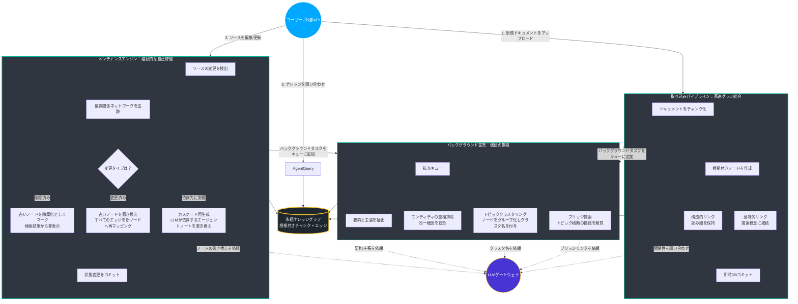
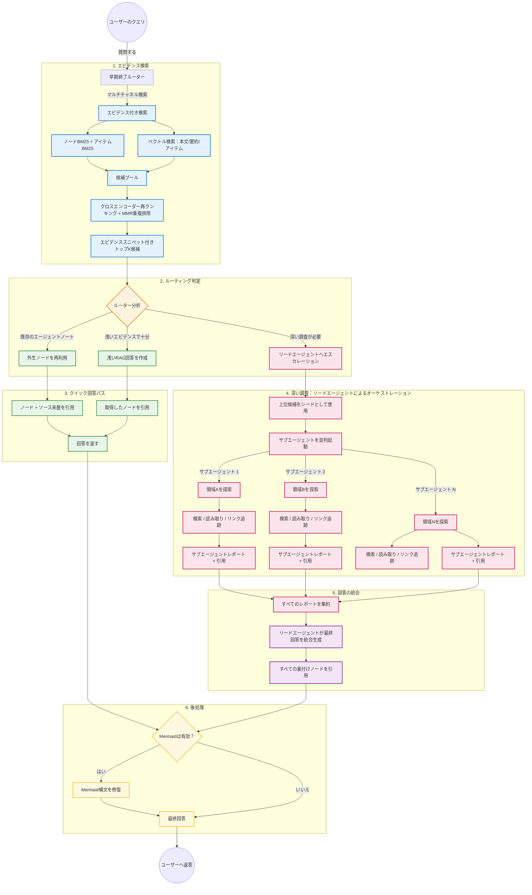
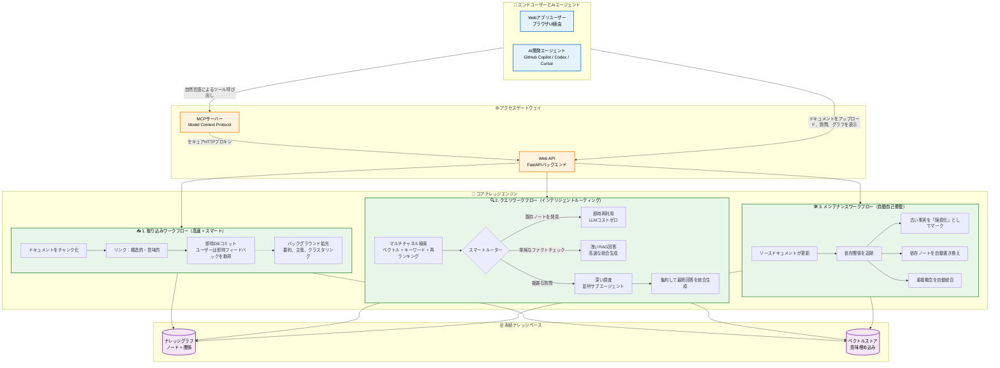

Source : https://gist.githubusercontent.com/karpathy/442a6bf555914893e9891c11519de94f/raw/ac46de1ad27f92b28ac95459c782c07f6b8c964a/llm-wiki.md

> # LLM Wiki
>
> A pattern for building personal knowledge bases using LLMs.
>
> This is an idea file, it is designed to be copy pasted to your own LLM Agent (e.g. OpenAI Codex, Claude Code, OpenCode / Pi, or etc.). Its goal is to communicate the high level idea, but your agent will build out the specifics in collaboration with you.
>
> ## The core idea
>
> Most people's experience with LLMs and documents looks like RAG: you upload a collection of files, the LLM retrieves relevant chunks at query time, and generates an answer. This works, but the LLM is rediscovering knowledge from scratch on every question. There's no accumulation. Ask a subtle question that requires synthesizing five documents, and the LLM has to find and piece together the relevant fragments every time. Nothing is built up. NotebookLM, ChatGPT file uploads, and most RAG systems work this way.
>
> The idea here is different. Instead of just retrieving from raw documents at query time, the LLM **incrementally builds and maintains a persistent wiki** — a structured, interlinked collection of markdown files that sits between you and the raw sources. When you add a new source, the LLM doesn't just index it for later retrieval. It reads it, extracts the key information, and integrates it into the existing wiki — updating entity pages, revising topic summaries, noting where new data contradicts old claims, strengthening or challenging the evolving synthesis. The knowledge is compiled once and then *kept current*, not re-derived on every query.

LLM-Wikiというアイデアの前提は、おおむね正しいものです。著者は、生のソースとLLMの間にミドルウェア層を提案しています。毎回生のドキュメントに直接クエリを発行するのではなく、システムがソース素材を持続的なウィキのような構造に変換するというものです。

私が提案されているフローを解釈すると、おおよそ以下のようになります。

生のソース
→ エンティティと概念を抽出
→ それらの間の関係を構築
→ コーパスが成長するにつれて、既存のエンティティページを更新するか、新しいページを作成
→ 蓄積されたウィキに対してクエリを実行

言い換えれば、ウィキはコンパイルされた知識層となります。重要なエンティティ、要約、矛盾、相互参照はすでに時間とともに維持されているため、LLMはクエリごとに同じ事実や関係をゼロから再発見する必要がありません。

私たちの実装は、このアイデアのよりシンプルなバリエーションです。各ドキュメントから標準的なエンティティを抽出し、すべてのエンティティに対して専用のウィキページを維持する代わりに、ドキュメントの各チャンク自体をナレッジグラフのノードとして扱います。

取り込み時、新しいチャンクが追加されると、そのチャンクと既存のチャンクの間にリンクを作成します。これらのリンクの一部は構造的なものであり、同じドキュメント内の隣接するチャンク間の `previous`（前）および `next`（次）の接続などです。他のリンクは意味的なものであり、参照、使用法、言及、説明、例、または概念的な依存関係などです。

したがって、私たちのシステムの基本的な形状は次のようになります。

生のソース
→ ドキュメントをチャンク化
→ チャンクをグラフのノードとして扱う
→ 新しいチャンクを、近くにある関連する既存のチャンクにリンク
→ クエリ時の推論中にエージェントがこのグラフを走査できるようにする

著者の元のLLM-Wikiアプローチは、特に重要なエンティティを数回のパスで特定でき、それらの間の関係が比較的明確である場合、小規模または中規模のドキュメントコレクションで非常にうまく機能します。たとえば、記事、エッセイ、短いレポート、会議のメモ、または小規模な研究コレクションは、かなり確実にエンティティページやトピックページに変換できることがよくあります。

私の仮定では、これは大規模なコーパス（書籍、マニュアル、技術仕様書、法的文書、または数百ページから数千ページに及ぶドメイン固有のコレクション）でははるかに難しくなります。長く専門的なテキストからエンティティを抽出するのは簡単な作業ではありません。さらに重要なのは、どのエンティティに独自のページを与える価値があるか、どの詳細が中心的であるか、どの関係が重要であるかを決定することは、ドメインと下流のタスクに大きく依存するということです。

人間が本を読むとき、500ページ目に到達する頃には、前の499ページのメンタルモデルを持っています。どの概念が中心的で、どの詳細が二次的で、どの参照が狭い文脈でのみ重要であるかについての感覚を持っています。LLM、特に小規模またはローカルなモデルは、それを取り巻くかなり複雑なパイプラインを構築しない限り、コーパス全体にわたってそのような長期の理解を自然に維持することはできません。

大規模なドキュメントを完全なエンティティウィキシステムに取り込むには、エージェントはウィキの現在の状態を繰り返し理解し、最も重要な既存の概念を特定し、新しい素材がそれらの概念を更新するか新しい概念を導入するかを決定し、矛盾を検出し、関連するすべてのページを更新する必要があります。これは可能ですが、すぐにコストがかかり、遅くなり、検証が困難になる可能性があります。

より深い問題は、大規模なコーパスでは、エンティティはしばしば孤立して存在しないということです。それらの意味は、周囲の文脈と密接に結びついています。

たとえば、歴史的文脈で「恐怖政治（Reign of Terror）」と言えば、通常は革命政府、公安委員会、マクシミリアン・ロベスピエールに関連するフランス革命の時期として解釈されます。しかし、「恐怖政治」は、どこでも意味が安定している完全に独立した概念ではありません。それはフランス革命というより広範な文脈の一部です。まったく異なる文脈で同じフレーズを使用する別のイベント、比喩、書籍のタイトル、記事のタイトル、または地域の歴史的エピソードが存在する可能性もあります。

したがって、概念的には `French Revolution`（フランス革命）と `Reign of Terror`（恐怖政治）という2つのエンティティを作成できますが、一方は他方の内部に深く埋め込まれています。小さなエンティティの意味は、それを取り巻くより大きな枠組みによって変化します。

同様の問題はプログラミングにも現れます。「競合状態（race condition）」、「ロック（lock）」、「スレッド（thread）」、「アクター（actor）」、「トランザクション（transaction）」、または「イベントループ（event loop）」といった用語には一般的な意味がありますが、それらの操作的な詳細は、プログラミング言語、ランタイム、ライブラリ、オペレーティングシステム、データベース、またはタスクによって変化します。マルチスレッドのC++プログラム、JavaScriptの非同期ワークフロー、分散データベース、およびKubernetesコントローラーにおける競合状態は、家族的な類似性を共有しているかもしれませんが、実用的な意味とデバッグ戦略は非常に異なる可能性があります。

これにより、情報はしばしば密結合の形で存在するという結論に至りました。ドキュメントから「エンティティ」を常に分離することはできますが、それらを分離する正しい方法は、情報自体と、後でそれを使って何をしたいかによって異なります。

もう1つの問題もあります。エンティティを別々のウィキページに抽出した後でさえ、それらのエンティティ間の関係はエンティティ自体と同じくらい複雑になる可能性があるということです。エンティティや理論は、ドキュメント全体で数十回または数百回言及される可能性があります。別のエンティティとの関係は、章、例、例外、エッジケースを通じて進化する可能性があります。ある時点で、関係自体が独自のノードまたはページを持つに値するようになるかもしれません。

したがって、この情報のスパゲッティをきれいなエンティティ関係ウィキに完全に解きほぐそうとするのではなく、私の哲学は、エージェントに元の素材を通るより良いパスを与えることです。

これは、クラシックなRAGと完全なLLM-Wikiシステムの中間を目指しています。

クラシックなRAGは通常、キーワード検索、ベクトル検索、またはハイブリッド検索を使用して少数のチャンクを取得し、LLMにそれらのチャンクから回答するように求めます。より高度なエージェント型RAGシステムは、複数の検索を実行し、クエリを書き換え、反復する場合があります。しかし、エージェントには依然として境界の問題があります。「すべての関連情報」がどこで終わるかを知らないのです。検索を続けて迷子になるか、現在の取得範囲のすぐ先に何があるかを知らなかったために、誤った自信を持って早すぎる段階で停止する可能性があります。

完全なLLM-Wikiシステムは、事前に持続的な要約、エンティティページ、矛盾、相互参照を維持することでこれを解決します。しかし、大規模で変化するコーパスの場合、それは非常に有能で高価なモデル、または複雑なローカルモデルパイプラインのいずれかを必要とする可能性があります。ソース素材が主に静的である場合、このコストは正当化されるかもしれません。たとえば、歴史的なコーパスや安定した教科書は、高価な処理を一度だけ行い、その後は時折更新するだけでよいかもしれません。しかし、ソースドキュメントが頻繁に変更される場合、すべての改訂がより多くの抽出、調整、事実確認、および相互参照の維持をトリガーする可能性があります。それはすぐに非常に高価になる可能性があります。

ローカルまたは weaker なLLMの場合、問題は異なります。それらは1回のパスで長期の合成を確実に実行できない可能性があるため、取り込みパイプラインを抽出、検証、リンク、矛盾検出、要約の更新、およびリントなど、多くの小さなステップに分割する必要があります。そのパイプラインの構築とテストは、それ自体がプロジェクトになります。また、エンティティの抽出、関係の作成、およびページの更新が実際に正しく機能しているかどうかを確認するために、人間の判断も必要です。多くのエッジケースがあり、取り込みが遅く、壊れやすく、または労働集約的になった場合、収益は減少する可能性があります。

したがって、私たちの実装は中間地点です。

完璧なセマンティックウィキを構築する代わりに、ナビゲート可能なチャンクグラフを構築します。

各チャンクは元のドキュメントの文脈に根ざしたままですが、もはや孤立していません。隣接するチャンクへの構造的リンクと、コーパスの他の場所にある関連するチャンクへの意味的リンクを持っています。これにより、エージェントはクエリ時に従うべきガイド付きパスを得ることができます。

クエリは、取得されたトップkのチャンクのみに頼る必要はありません。エージェントは、最初に取得されたチャンクから開始し、隣接するチャンク、参照されたチャンク、説明的なチャンク、例、定義、反例、または使用法に移動できます。これにより、システムは盲目的にさらにキーワード検索を発行するのではなく、制御された方法でコンテキストを拡張できます。

哲学は次のとおりです。

知識を抽象的なエンティティページに完全に正規化しない。
知識を切断されたチャンクのままにもしない。
元のチャンクを保持するが、エージェントがそれらをナビゲートするのに十分な構造を追加する。

これはソースの局所性を維持しながら、構造的な複利効果を可能にします。システムは、ドメインの標準的なエンティティが何であるかを一度きりで決定する必要はありません。テキストの断片間に有用なリンクを作成するだけでよいのです。時間が経つにつれて、それらのリンクは軽量なナレッジグラフになります。

このアプローチは、LLMが維持する完全なウィキほど野心的ではありませんが、より安価で、デバッグが容易で、大規模または頻繁に変更されるコーパスにより適しています。情報はしばしば文脈に依存し、密結合していることを認め、それを早期にきれいなエンティティページに押し込むのではなく、エージェントが意味のあるパスを通じてソース素材を走査できるようにします。

要約すると：

クラシックなRAGは、エージェントに取得されたチャンクを提供します。
LLM-Wikiは、エージェントに合成されたエンティティページを提供します。
私たちのアプローチは、エージェントにナビゲートするための根ざしたチャンクのグラフを提供します。

目標はLLM-Wikiのアイデアを置き換えることではなく、その核心的な洞察（持続的な構造は時間とともに複利効果を生む）を、大規模で、乱雑で、ドメイン固有で、または頻繁に更新されるドキュメントコレクションにより実用的な形式に適応させることです。

> This is the key difference: **the wiki is a persistent, compounding artifact.** The cross-references are already there. The contradictions have already been flagged. The synthesis already reflects everything you've read. The wiki keeps getting richer with every source you add and every question you ask.
>
> You never (or rarely) write the wiki yourself — the LLM writes and maintains all of it. You're in charge of sourcing, exploration, and asking the right questions. The LLM does all the grunt work — the summarizing, cross-referencing, filing, and bookkeeping that makes a knowledge base actually useful over time. In practice, I have the LLM agent open on one side and Obsidian open on the other. The LLM makes edits based on our conversation, and I browse the results in real time — following links, checking the graph view, reading the updated pages. Obsidian is the IDE; the LLM is the programmer; the wiki is the codebase.
>
> This can apply to a lot of different contexts. A few examples:
>
> - **Personal**: tracking your own goals, health, psychology, self-improvement — filing journal entries, articles, podcast notes, and building up a structured picture of yourself over time.
> - **Research**: going deep on a topic over weeks or months — reading papers, articles, reports, and incrementally building a comprehensive wiki with an evolving thesis.
> - **Reading a book**: filing each chapter as you go, building out pages for characters, themes, plot threads, and how they connect. By the end you have a rich companion wiki. Think of fan wikis like [Tolkien Gateway](https://tolkiengateway.net/wiki/Main_Page) — thousands of interlinked pages covering characters, places, events, languages, built by a community of volunteers over years. You could build something like that personally as you read, with the LLM doing all the cross-referencing and maintenance.
> - **Business/team**: an internal wiki maintained by LLMs, fed by Slack threads, meeting transcripts, project documents, customer calls. Possibly with humans in the loop reviewing updates. The wiki stays current because the LLM does the maintenance that no one on the team wants to do.
> - **Competitive analysis, due diligence, trip planning, course notes, hobby deep-dives** — anything where you're accumulating knowledge over time and want it organized rather than scattered.
>

ここでも困難さが見え始めます。

上記の例でも、「エンティティ」の意味はドメインによって変化します。

個人のナレッジベースでは、エンティティは目標、習慣、感情、健康上の症状、または繰り返される生活イベントである可能性があります。  
研究では、論文、著者、主張、手法、データセット、または仮説である可能性があります。  
書籍やメディアの設定では、キャラクター、場所、プロット、テーマ、およびイベントになります。  
ビジネスウィキでは、顧客、プロジェクト、決定、会議、リスク、および所有者である可能性があります。

したがって、エンティティの抽出はドメイン中立な操作ではありません。モデルは、コーパスにどのような知識構造が適切であるかを理解する必要があります。

非常に強力な長文脈モデルは、これらの区別を独自に推測し、維持できるかもしれません。しかし、大規模なコーパスや、小規模/ローカルモデルの場合、これは信頼するのが難しくなり、維持コストも高くなります。

それが、私たちの実装がよりドキュメントに依存しないパイプラインを使用する理由です。すべてのコーパスを最初にきれいなエンティティウィキ構造に押し込むのではなく、根ざしたチャンクを基本単位として使用し、リンク、要約、主張、クラスター、およびエージェントが作成したメモを通じて構造が現れるようにします。

---

> ## Architecture
>
> There are three layers:
>
> **Raw sources** — your curated collection of source documents. Articles, papers, images, data files. These are immutable — the LLM reads from them but never modifies them. This is your source of truth.
>
> **The wiki** — a directory of LLM-generated markdown files. Summaries, entity pages, concept pages, comparisons, an overview, a synthesis. The LLM owns this layer entirely. It creates pages, updates them when new sources arrive, maintains cross-references, and keeps everything consistent. You read it; the LLM writes it.
>
> **The schema** — a document (e.g. CLAUDE.md for Claude Code or AGENTS.md for Codex) that tells the LLM how the wiki is structured, what the conventions are, and what workflows to follow when ingesting sources, answering questions, or maintaining the wiki. This is the key configuration file — it's what makes the LLM a disciplined wiki maintainer rather than a generic chatbot. You and the LLM co-evolve this over time as you figure out what works for your domain.
>

これは、LLMがウィキ上でデータベースのような操作を実行する際に従うことが期待される、ドメイン固有のワークフローです。

GPTやClaudeのような長期コンテキストモデルは、多くの場合これをかなりうまく処理できます。しかし、非常に長いドキュメントの場合、コストは急速に増大します。800ページのドキュメントを完全なエンティティ/概念ウィキとして取り込み、維持することは、特にすべての更新にページの調整、矛盾のチェック、および相互参照の維持が必要な場合、高価になる可能性があります。

私たちのスキーマは同じ広範なアイデアを維持していますが、よりグラフ指向にしています。

ノードとエッジがあります。

ノードは次のように分類できます。

- **内生的（endogenous）**: ソーステキストから直接作成される
- **外生的（exogenous）**: エージェントによって作成される（通常はメモ、回答、要約、またはウィキページとして）。ただし、人間の承認の対象となる

```python
#  whether a node was created from source file or made by AI Agent
class NodeType(str, Enum):
    endogenous = "endogenous"
    exogenous = "exogenous"


# whether a node is overruled by newer version, with updated version
class NodeStatus(str, Enum):
    active = "active"
    stale = "stale"
    superseded = "superseded"
    deleted = "deleted"


# Contains the actual information
class Node(BaseModel):
    id: str
    body: str
    type: NodeType = NodeType.endogenous
    title: str = ""
    original_document_name: str | None = None
    source_path: str | None = None
    source_ranges: list[tuple[int, int]] = Field(default_factory=list)
    source_version: str | None = None
    source_material_hash: str | None = None
    entity: str = ""
    claims: list[str] = Field(default_factory=list)
    keywords: list[str] = Field(default_factory=list)
    summary: str = ""
    cluster: str | None = None
    # HyDE-style probe: "what broader concept/field does this connect to",
    # embedded separately (vec_bridge) to surface analogically related nodes
    # that plain body/summary embeddings would never rank as neighbors.
    bridge_probe: str = ""
    status: NodeStatus = NodeStatus.active
    created_at: str = Field(default_factory=now_iso)
    updated_at: str = Field(default_factory=now_iso)


# Connecting nodes so agent knows what to read next
class Edge(BaseModel):
    id: str
    source_node_id: str
    target_node_id: str
    label: str
    summary: str = ""

    # In case new information comes existing relation is invalidated
    created_at: str = Field(default_factory=now_iso)
    valid_at: str | None = None
    invalid_at: str | None = None
    expired_at: str | None = None
    source_episode_ids: list[str] = Field(default_factory=list)
```

重要な変化は、取り込み中にLLMがコーパス全体をエンティティページに完全に正規化することを要求しないことです。

代わりに、ソースに根ざしたチャンクをノードとして保持し、それらを構造的および意味的なエッジで接続し、その上に高レベルのメモを作成できるようにします。

---

> ## Operations
>
> **Ingest.** You drop a new source into the raw collection and tell the LLM to process it. An example flow: the LLM reads the source, discusses key takeaways with you, writes a summary page in the wiki, updates the index, updates relevant entity and concept pages across the wiki, and appends an entry to the log. A single source might touch 10-15 wiki pages. Personally I prefer to ingest sources one at a time and stay involved — I read the summaries, check the updates, and guide the LLM on what to emphasize. But you could also batch-ingest many sources at once with less supervision. It's up to you to develop the workflow that fits your style and document it in the schema for future sessions.
>
> **Query.** You ask questions against the wiki. The LLM searches for relevant pages, reads them, and synthesizes an answer with citations. Answers can take different forms depending on the question — a markdown page, a comparison table, a slide deck (Marp), a chart (matplotlib), a canvas. The important insight: **good answers can be filed back into the wiki as new pages.** A comparison you asked for, an analysis, a connection you discovered — these are valuable and shouldn't disappear into chat history. This way your explorations compound in the knowledge base just like ingested sources do.
>
> **Lint.** Periodically, ask the LLM to health-check the wiki. Look for: contradictions between pages, stale claims that newer sources have superseded, orphan pages with no inbound links, important concepts mentioned but lacking their own page, missing cross-references, data gaps that could be filled with a web search. The LLM is good at suggesting new questions to investigate and new sources to look for. This keeps the wiki healthy as it grows.
>
> ## Indexing and logging
>
> Two special files help the LLM (and you) navigate the wiki as it grows. They serve different purposes:
>
> **index.md** is content-oriented. It's a catalog of everything in the wiki — each page listed with a link, a one-line summary, and optionally metadata like date or source count. Organized by category (entities, concepts, sources, etc.). The LLM updates it on every ingest. When answering a query, the LLM reads the index first to find relevant pages, then drills into them. This works surprisingly well at moderate scale (~100 sources, ~hundreds of pages) and avoids the need for embedding-based RAG infrastructure.
>
> **log.md** is chronological. It's an append-only record of what happened and when — ingests, queries, lint passes. A useful tip: if each entry starts with a consistent prefix (e.g. `## [2026-04-02] ingest | Article Title`), the log becomes parseable with simple unix tools — `grep "^## \[" log.md | tail -5` gives you the last 5 entries. The log gives you a timeline of the wiki's evolution and helps the LLM understand what's been done recently.
>

## 取り込みワークフロー：ナビゲート可能なチャンクグラフの構築

LLMに抽象的で標準的なエンティティを抽出し、すぐに一元化されたウィキを書き換えることを強制するのではなく、私たちのシステムは中間的なアプローチを使用します。

新しいドキュメントが追加されると、それを根ざしたチャンクに分割し、各チャンクを持続的なナレッジグラフのノードとして扱います。

取り込みプロセスには2つのパスがあります。

1. **高速パス（Fast Path）**: ユーザー向けの即座の統合
2. **低速パス（Slow Path）**: バックグラウンドでの拡張

高速パスでは、システムはドキュメントをチャンク化し、主に2種類のリンクを作成します。

- **構造的リンク（Structural links）**: 前/次のチャンクへのリンクなど、読み取り順序を保持します。
- **意味的リンク（Semantic links）**: 新しいチャンクを、グラフ内にある関連する概念、定義、例、または主張に接続します。

新しいノードとエッジは即座にコミットされるため、ユーザーは迅速なフィードバックを得られ、ドキュメントはすぐに検索可能になります。

より重い処理はバックグラウンドで行われます。システムは徐々に主張を抽出し、要約を作成し、重複する概念を重複排除し、クラスターを割り当て、ブリッジリンクを発見します。

これにより、バルク取り込みの応答性を維持しながら、グラフが時間とともに複利効果を生むことを可能にします。

## メンテナンス/リントワークフロー：継続的な自己修復

Karpathyのバージョンは定期的な手動リントを使用します。ユーザーはLLMに矛盾、陳腐化した主張、孤立したページ、欠落している相互参照がないかチェックするよう求めます。

大規模または頻繁に変更されるコーパスの場合、グラフ全体を手動でスキャンするのはコストが高すぎます。

私たちのシステムは、リントを継続的でイベント駆動型のメンテナンスに変えます。

ソースが変更されると、システムは新しいバージョンと古いバージョンを比較します。

チャンクが削除された場合、古いノードは「陳腐化（stale）」としてマークされ、監査用に利用可能なままアクティブな検索から非表示になります。  
チャンクが変更された場合、古いノードは「置き換えられた（superseded）」としてマークされ、新しいノードが作成され、関連するエッジが再マッピングされます。

その後、システムはエージェントが作成したメモ、要約、またはウィキページなどの依存する外生的ノードを追跡します。それらのメモが変更された素材に依存していた場合、それらは再生成されます。サポートできなくなった場合は、陳腐化としてマークされます。

その後、バックグラウンドのグラフ修復プロセスが重複排除、再クラスタリング、および意味的再リンクを実行します。



## クエリワークフロー：早期終了を備えたインテリジェントなマルチパスリサーチ

クエリシステムは、すべての質問に対して高コストな深いリサーチを実行することを回避します。

まず、以下を使用してマルチチャネル検索を実行します。

- BM25キーワード検索
- 本文、要約、および抽出されたアイテムに対するベクトル検索
- クロスエンコーダによる再ランキング
- MMRスタイルの重複排除

その後、早期終了ルーターが次のアクションを決定します。

既存のエージェントメモがすでに質問に回答している場合、システムはそれを再利用します。  
取得された証拠が狭い質問に十分である場合、浅いRAG回答を生成します。  
質問が複雑な場合、深いリサーチにエスカレーションします。

深いリサーチモードでは、リードエージェントがトップ候補ノードから開始し、複数のサブエージェントを生成します。各サブエージェントは、検索、読み取り、およびリンク追跡ツールを使用してグラフの異なる領域を探索します。その後、リードエージェントはそれらのレポートを集約し、最終的な引用付き回答を生成します。

これにより、回答がすでに利用可能な場合は速度が得られ、質問が実際に探索を必要とする場合は深さが得られます。



---

> ## Optional: CLI tools
>
> At some point you may want to build small tools that help the LLM operate on the wiki more efficiently. A search engine over the wiki pages is the most obvious one — at small scale the index file is enough, but as the wiki grows you want proper search. [qmd](https://github.com/tobi/qmd) is a good option: it's a local search engine for markdown files with hybrid BM25/vector search and LLM re-ranking, all on-device. It has both a CLI (so the LLM can shell out to it) and an MCP server (so the LLM can use it as a native tool). You could also build something simpler yourself — the LLM can help you vibe-code a naive search script as the need arises.
>

## バックエンドとMCPサーバーアーキテクチャ

私たちの実装は、FastAPIバックエンドとMCPサーバーを使用します。

バックエンドは実際のグラフシステムを管理します。MCPサーバーは、LLMエージェントがそれを使用するための構造化されたツールを提供します。

バックエンドには4つの主要なアクターがあります。

- **ModelGateway**: LLM、埋め込み（embedding）、および再ランキング（reranker）クライアントを管理
- **GraphStore**: ノード、エッジ、埋め込み、メタデータ、およびログを永続化
- **Librarian**: シリアル化されたジョブキューを介して書き込みを処理
- **Researcher**: 制限された同時実行性で読み取り、検索、トラバース、およびエージェントクエリを処理

システムは複数の独立したウィキをサポートします。リバースプロキシルートは、以下のようなURLを異なるデータベースにマッピングできます。

```text
/llm-wiki/wiki1/api/search
/llm-wiki/wiki2/api/search
```

ウィキがまだロードされていない場合、バックエンドは遅延初期化（lazy initialization）し、検証し、必要に応じて埋め込みのキャッチアップを実行し、使用可能な状態に準備します。

MCPサーバーはステートレスです。以下のようなツールを公開します。

- `hybrid_search`
- `read_nodes`
- `explore_links`
- `queue_agent_note`

これにより、エージェントはデータベースに直接触れることなくグラフを使用できます。

書き込みは、同時実行によるSQLiteの問題を回避するためにLibrarianキューを介して行われます。読み取りは、リソースの枯渇を防ぐために、制限された同時実行性でResearcherを介して行われます。

システムは、検索深度、サブエージェント数、再ランキング設定、またはLLMエンドポイントなど、リクエストごとの設定オーバーライドもサポートしています。



---

> ## Tips and tricks
>
> - **Obsidian Web Clipper** is a browser extension that converts web articles to markdown. Very useful for quickly getting sources into your raw collection.
> - **Download images locally.** In Obsidian Settings → Files and links, set "Attachment folder path" to a fixed directory (e.g. `raw/assets/`). Then in Settings → Hotkeys, search for "Download" to find "Download attachments for current file" and bind it to a hotkey (e.g. Ctrl+Shift+D). After clipping an article, hit the hotkey and all images get downloaded to local disk. This is optional but useful — it lets the LLM view and reference images directly instead of relying on URLs that may break. Note that LLMs can't natively read markdown with inline images in one pass — the workaround is to have the LLM read the text first, then view some or all of the referenced images separately to gain additional context. It's a bit clunky but works well enough.
> - **Obsidian's graph view** is the best way to see the shape of your wiki — what's connected to what, which pages are hubs, which are orphans.
> - **Marp** is a markdown-based slide deck format. Obsidian has a plugin for it. Useful for generating presentations directly from wiki content.
> - **Dataview** is an Obsidian plugin that runs queries over page frontmatter. If your LLM adds YAML frontmatter to wiki pages (tags, dates, source counts), Dataview can generate dynamic tables and lists.
> - The wiki is just a git repo of markdown files. You get version history, branching, and collaboration for free.
>

Web Clipper拡張機能を除き、これらの大部分をカスタムフロントエンドに置き換えます。

フロントエンドは以下を提供します。

1. グラフに対して質問をし、回答またはウィキページを生成するためのクエリインターフェース。各回答はサイドバーに使用したソースドキュメントを表示するため、ユーザーは証拠に直接ジャンプできます。
2. 元のドキュメントとエージェントが作成したウィキページのためのリッチなドキュメントエクスプローラー。ユーザーは元のソースを読み、チャンク間を移動し、関連するトピックを追跡できます。
3. クラスター、ハブ、リンク、およびウィキの全体的な形状を視覚化するためのグラフエクスプローラー。
4. ソースの追加、削除、更新のためのドキュメント管理、および長時間実行されるバックグラウンドジョブのキュー表示。
5. 論文、書籍、マニュアル、レポートをより簡単に取り込むための組み込みPDF-to-Markdownパーサー。

したがって、ユーザーはKarpathyが説明するのと同じ一般的な体験（ソースの探索、グラフのナビゲーション、生成されたメモ、および複利効果を生む知識）を依然として得ることができます。しかし、主にObsidianとMarkdownファイルに依存する代わりに、システムはグラフ専用のUIを提供します。

---

> ## Why this works
>
> The tedious part of maintaining a knowledge base is not the reading or the thinking — it's the bookkeeping. Updating cross-references, keeping summaries current, noting when new data contradicts old claims, maintaining consistency across dozens of pages. Humans abandon wikis because the maintenance burden grows faster than the value. LLMs don't get bored, don't forget to update a cross-reference, and can touch 15 files in one pass. The wiki stays maintained because the cost of maintenance is near zero.
>
> The human's job is to curate sources, direct the analysis, ask good questions, and think about what it all means. The LLM's job is everything else.
>
> The idea is related in spirit to Vannevar Bush's Memex (1945) — a personal, curated knowledge store with associative trails between documents. Bush's vision was closer to this than to what the web became: private, actively curated, with the connections between documents as valuable as the documents themselves. The part he couldn't solve was who does the maintenance. The LLM handles that.
>
> ## Note
>
> This document is intentionally abstract. It describes the idea, not a specific implementation. The exact directory structure, the schema conventions, the page formats, the tooling — all of that will depend on your domain, your preferences, and your LLM of choice. Everything mentioned above is optional and modular — pick what's useful, ignore what isn't. For example: your sources might be text-only, so you don't need image handling at all. Your wiki might be small enough that the index file is all you need, no search engine required. You might not care about slide decks and just want markdown pages. You might want a completely different set of output formats. The right way to use this is to share it with your LLM agent and work together to instantiate a version that fits your needs. The document's only job is to communicate the pattern. Your LLM can figure out the rest.

全体として、私たちのシステムはKarpathyが説明するパターンに非常に近いですが、より大規模なコーパスと小規模/ローカルモデルに合わせて適応されています。

主な違いは表現方法です。

Karpathyのバージョンは、LLMが維持するMarkdownページのウィキを中心にしています。  
私たちのバージョンは、根ざしたチャンクの持続的なグラフを中心にしており、時間とともに要約、主張、クラスター、意味的リンク、および人間が承認したエージェントメモによって拡張されます。
