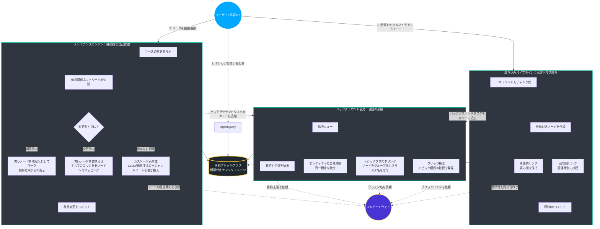
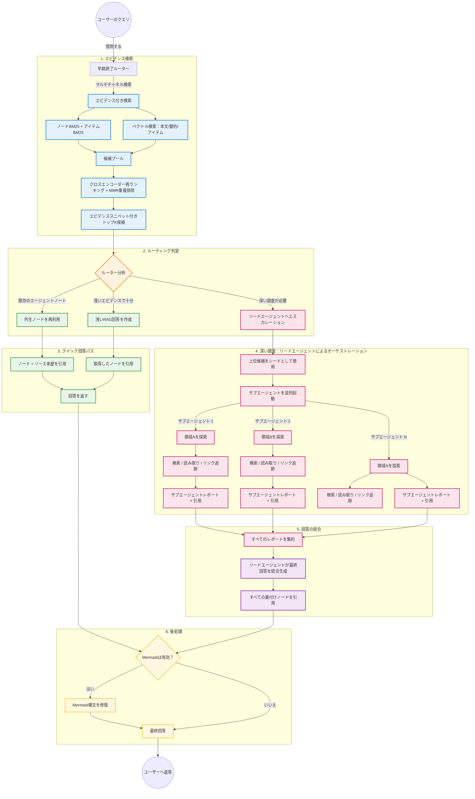
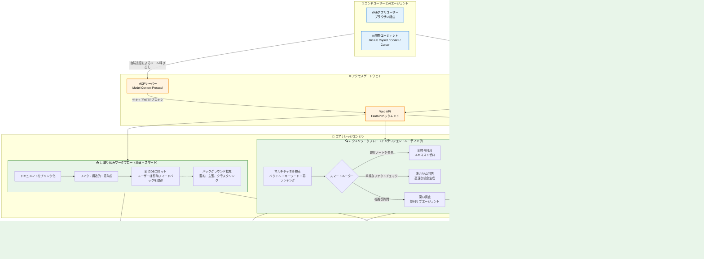

# Andrej Karpathy版との差分分析

Source : https://gist.githubusercontent.com/karpathy/442a6bf555914893e9891c11519de94f/raw/ac46de1ad27f92b28ac95459c782c07f6b8c964a/llm-wiki.md

この文書では、Karpathyの原文に書かれている考え方と、私たちが実装したシステムを対応させて比較します。原文の引用は英語のまま残し、解釈と実装上の差分は以下の表で説明します。

> # LLM Wiki
>
> A pattern for building personal knowledge bases using LLMs.
>
> This is an idea file, it is designed to be copy pasted to your own LLM Agent (e.g. OpenAI Codex, Claude Code, OpenCode / Pi, or etc.). Its goal is to communicate the high level idea, but your agent will build out the specifics in collaboration with you.
>
> ## The core idea
>
> Most people's experience with LLMs and documents looks like RAG: you upload a collection of files, the LLM retrieves relevant chunks at query time, and generates an answer. This works, but the LLM is rediscovering knowledge from scratch on every question. There's no accumulation. Ask a subtle question that requires synthesizing five documents, and the LLM has to find and piece together the relevant fragments every time. Nothing is built up. NotebookLM, ChatGPT file uploads, and most RAG systems work this way.
>
> The idea here is different. Instead of just retrieving from raw documents at query time, the LLM **incrementally builds and maintains a persistent wiki** — a structured, interlinked collection of markdown files that sits between you and the raw sources. When you add a new source, the LLM doesn't just index it for later retrieval. It reads it, extracts the key information, and integrates it into the existing wiki — updating entity pages, revising topic summaries, noting where new data contradicts old claims, strengthening or challenging the evolving synthesis. The knowledge is compiled once and then *kept current*, not re-derived on every query.

## 中心的な考え方と知識表現の比較

| Karpathyが説明していること | 私たちの実装・判断 |
|---|---|
| LLM-Wikiの中心的な着眼点は、生のソースとLLMの間に持続的な知識層を置くことです。毎回生のドキュメントに直接クエリを発行するのではなく、システムがソース素材を持続的なウィキのような構造に変換します。私が提案されているフローを解釈すると、生のソースからエンティティと概念を抽出し、それらの間の関係を構築し、コーパスが成長するにつれて既存のエンティティページを更新するか新しいページを作成し、蓄積されたウィキに対してクエリを実行するという流れです。<br><br>言い換えれば、ウィキはコンパイルされた知識層となります。重要なエンティティ、要約、矛盾、相互参照はすでに時間とともに維持されているため、LLMはクエリごとに同じ事実や関係をゼロから再発見する必要がありません。 | 私たちは同じ持続的な知識層という考え方を維持しますが、知識表現としては、最初から完全なエンティティWikiへ正規化することを必須にしません。各ドキュメントをチャンクに分割し、各チャンク自体をナレッジグラフのノードとして扱います。<br><br>取り込み時に新しいチャンクが追加されると、そのチャンクと既存のチャンクの間にリンクを作成します。リンクの一部は構造的なもので、同じドキュメント内の隣接するチャンク間の `previous` と `next` の接続など、読み取り順序を保持します。他のリンクは意味的なもので、参照、使用法、言及、説明、例、または概念的な依存関係を表します。<br><br>したがって、私たちのシステムの基本的な形状は、生のソースをドキュメントに分割し、チャンクをグラフのノードとして扱い、新しいチャンクを関連する既存のチャンクにリンクし、クエリ時の推論中にエージェントがこのグラフを走査できるようにする、というものです。 |
| Karpathyの原文は、重要なエンティティや概念をページとして整理し、記事、エッセイ、短いレポート、会議のメモ、研究、書籍、チームの資料などを継続的にWikiへ統合するパターンとして提示されています。重要なエンティティを特定でき、それらの関係が比較的明確なコレクションほど、このページ中心の構造を適用しやすいと考えられます。 | 私たちの評価では、この方法は大規模なコーパス、たとえば書籍、マニュアル、技術仕様書、法的文書、または数百ページから数千ページに及ぶドメイン固有のコレクションでは、はるかに難しくなります。長く専門的なテキストからエンティティを抽出するのは簡単な作業ではありません。さらに、どのエンティティに独自のページを与える価値があるか、どの詳細が中心的であるか、どの関係が重要であるかは、ドメインと下流のタスクに大きく依存します。<br><br>人間が本を読むとき、500ページ目に到達する頃には、前の499ページのメンタルモデルを持っています。どの概念が中心的で、どの詳細が二次的で、どの参照が狭い文脈でのみ重要であるかについての感覚を持っています。LLM、特に小規模またはローカルなモデルは、それを取り巻くかなり複雑なパイプラインを構築しない限り、コーパス全体にわたってそのような長期の理解を自然に維持できない可能性があります。<br><br>大規模なドキュメントをエンティティ中心のWikiシステムに取り込むには、エージェントはウィキの現在の状態を繰り返し理解し、最も重要な既存の概念を特定し、新しい素材がそれらの概念を更新するか新しい概念を導入するかを決定し、矛盾を検出し、関連するすべてのページを更新する必要があります。これは可能ですが、コストが高く、遅く、検証が難しくなる可能性があります。 |
| Karpathy版では、エンティティページや概念ページ、要約、相互参照などを維持することで、クエリ時に蓄積された知識を利用できます。これは、ソースをより高いレベルの意味的なページにまとめる方向の設計です。 | 私たちが重視するのは、エンティティを早い段階で完全に分離することの難しさです。大規模なコーパスでは、エンティティはしばしば孤立して存在せず、その意味は周囲の文脈と密接に結びついています。<br><br>たとえば、歴史的文脈で「恐怖政治」と言えば、通常は革命政府、公安委員会、マクシミリアン・ロベスピエールに関連するフランス革命の時期として解釈されます。しかし、「恐怖政治」は、どこでも意味が安定している完全に独立した概念ではありません。それはフランス革命というより広範な文脈の一部です。まったく異なる文脈で同じフレーズを使用する別のイベント、比喩、書籍のタイトル、記事のタイトル、または地域の歴史的エピソードが存在する可能性もあります。<br><br>概念的には `French Revolution` と `Reign of Terror` という2つのエンティティを作成できますが、一方は他方の内部に深く埋め込まれています。小さなエンティティの意味は、それを取り巻くより大きな枠組みによって変化します。<br><br>同様の問題はプログラミングにも現れます。「競合状態」、「ロック」、「スレッド」、「アクター」、「トランザクション」、または「イベントループ」といった用語には一般的な意味がありますが、それらの操作的な詳細は、プログラミング言語、ランタイム、ライブラリ、オペレーティングシステム、データベース、またはタスクによって変化します。マルチスレッドのC++プログラム、JavaScriptの非同期ワークフロー、分散データベース、およびKubernetesコントローラーにおける競合状態は、家族的な類似性を共有しているかもしれませんが、実用的な意味とデバッグ戦略は非常に異なる可能性があります。<br><br>このため、情報はしばしば密結合の形で存在すると考えています。ドキュメントからエンティティを分離することはできますが、それらを分離する正しい方法は、情報自体と、後でそれを使って何をしたいかによって異なります。さらに、エンティティを別々のWikiページに抽出した後でも、それらの間の関係はエンティティ自体と同じくらい複雑になる可能性があります。エンティティや理論は、ドキュメント全体で数十回または数百回言及される可能性があり、別のエンティティとの関係は、章、例、例外、エッジケースを通じて進化する可能性があります。ある時点で、関係自体が独自のノードまたはページを持つに値することもあります。したがって、情報のスパゲッティをきれいなエンティティ関係Wikiに完全に解きほぐすのではなく、エージェントに元の素材を通るより良いパスを与えることを選びます。 |
| クラシックなRAGは、キーワード検索、ベクトル検索、またはハイブリッド検索を使用して少数のチャンクを取得し、LLMにそれらのチャンクから回答するよう求めます。より高度なエージェント型RAGシステムは複数の検索を実行し、クエリを書き換え、反復する場合があります。しかし、エージェントには境界の問題が残ります。「すべての関連情報」がどこで終わるかを知らないため、検索を続けて迷子になるか、現在の取得範囲のすぐ先に何があるかを知らずに、誤った自信を持って早く停止する可能性があります。<br><br>LLM-Wikiは、事前に持続的な要約、エンティティページ、矛盾、相互参照を維持することで、この問題に対処します。ただし、大規模で変化するコーパスの場合、それには非常に有能で高価なモデル、または複雑なローカルモデルパイプラインが必要になる可能性があります。ソース素材が主に静的であれば、このコストは正当化されるかもしれませんが、ソースドキュメントが頻繁に変更される場合、改訂のたびに抽出、調整、事実確認、相互参照の維持が発生し、すぐに高価になる可能性があります。<br><br>小規模またはローカルのLLMでは、1回のパスで長期の合成を確実に実行できない可能性があります。そのため、取り込みパイプラインを抽出、検証、リンク、矛盾検出、要約の更新、リントなどの多くの小さなステップに分割する必要があり、そのパイプラインの構築とテスト自体がプロジェクトになります。また、エンティティの抽出、関係の作成、ページの更新が実際に正しく機能しているかを確認するために、人間の判断も必要です。多くのエッジケースがあり、取り込みが遅く、壊れやすく、または労働集約的になった場合、収益は減少する可能性があります。 | 私たちの実装は、クラシックなRAGと完全なLLM-Wikiシステムの中間を目指します。完璧なセマンティックWikiを構築する代わりに、ナビゲート可能なチャンクグラフを構築します。各チャンクは元のドキュメントの文脈に根ざしたままですが、もはや孤立していません。隣接するチャンクへの構造的リンクと、コーパスの他の場所にある関連するチャンクへの意味的リンクを持つため、エージェントはクエリ時に従うべきガイド付きパスを得られます。<br><br>クエリは、取得されたトップkのチャンクだけに頼る必要はありません。エージェントは、最初に取得されたチャンクから開始し、隣接するチャンク、参照されたチャンク、説明的なチャンク、例、定義、反例、または使用法に移動できます。これにより、システムは盲目的にさらにキーワード検索を発行するのではなく、制御された方法でコンテキストを拡張できます。<br><br>私たちの哲学は、知識を抽象的なエンティティページに完全に正規化せず、同時に知識を切断されたチャンクのままにもせず、元のチャンクを保持しながらエージェントがそれらをナビゲートするのに十分な構造を追加することです。これはソースの局所性を維持しながら、構造的な複利効果を可能にします。システムは、ドメインの標準的なエンティティが何であるかを一度きりで決定する必要はなく、テキストの断片間に有用なリンクを作成すればよいのです。時間が経つにつれて、それらのリンクは軽量なナレッジグラフになります。<br><br>このアプローチはLLMが維持する完全なWikiほど野心的ではありませんが、より安価で、デバッグが容易で、大規模または頻繁に変更されるコーパスにより適しています。情報が文脈に依存し密結合していることを認め、早期にきれいなエンティティページへ押し込むのではなく、エージェントが意味のあるパスを通じてソース素材を走査できるようにします。<br><br>要約すると、クラシックなRAGはエージェントに取得されたチャンクを提供し、LLM-Wikiは合成されたエンティティページを提供し、私たちのアプローチはナビゲートするための根ざしたチャンクのグラフを提供します。目標はLLM-Wikiのアイデアを置き換えることではなく、その核心的な洞察、つまり持続的な構造は時間とともに複利効果を生むという考えを、大規模で、乱雑で、ドメイン固有で、または頻繁に更新されるドキュメントコレクションにより実用的な形式で適応させることです。 |

> This is the key difference: **the wiki is a persistent, compounding artifact.** The cross-references are already there. The contradictions have already been flagged. The synthesis already reflects everything you've read. The wiki keeps getting richer with every source you add and every question you ask.
>
> You never (or rarely) write the wiki yourself — the LLM writes and maintains all of it. You're in charge of sourcing, exploration, and asking the right questions. The LLM does all the grunt work — the summarizing, cross-referencing, filing, and bookkeeping that makes a knowledge base actually useful over time. In practice, I have the LLM agent open on one side and Obsidian open on the other. The LLM makes edits based on our conversation, and I browse the results in real time — following links, checking the graph view, reading the updated pages. Obsidian is the IDE; the LLM is the programmer; the wiki is the codebase.
>
> This can apply to a lot of different contexts. A few examples:
>
> - **Personal**: tracking your own goals, health, psychology, self-improvement — filing journal entries, articles, podcast notes, and building up a structured picture of yourself over time.
> - **Research**: going deep on a topic over weeks or months — reading papers, articles, reports, and incrementally building a comprehensive wiki with an evolving thesis.
> - **Reading a book**: filing each chapter as you go, building out pages for characters, themes, plot threads, and how they connect. By the end you have a rich companion wiki. Think of fan wikis like [Tolkien Gateway](https://tolkiengateway.net/wiki/Main_Page) — thousands of interlinked pages covering characters, places, events, languages, built by a community of volunteers over years. You could build something like that personally as you read, with the LLM doing all the cross-referencing and maintenance.
> - **Business/team**: an internal wiki maintained by LLMs, fed by Slack threads, meeting transcripts, project documents, customer calls. Possibly with humans in the loop reviewing updates. The wiki stays current because the LLM does the maintenance that no one on the team wants to do.
> - **Competitive analysis, due diligence, trip planning, course notes, hobby deep-dives** — anything where you're accumulating knowledge over time and want it organized rather than scattered.
>

## ドメイン依存性の比較

| Karpathyが説明していること | 私たちの実装・判断 |
|---|---|
| Karpathyが挙げる用途には、個人のナレッジベース、研究、書籍の読解、ビジネスやチームの内部Wiki、競合分析、デューデリジェンス、旅行計画、コースノート、趣味の深掘りなどがあります。個人のナレッジベースでは目標、習慣、感情、健康上の症状、または繰り返される生活イベントがエンティティになり得ます。研究では論文、著者、主張、手法、データセット、または仮説、書籍やメディアの設定ではキャラクター、場所、プロット、テーマ、イベント、ビジネスWikiでは顧客、プロジェクト、決定、会議、リスク、所有者などがエンティティになり得ます。 | ここから、エンティティの抽出はドメイン中立な操作ではないと考えています。モデルは、コーパスにどのような知識構造が適切であるかを理解する必要があります。非常に強力な長文脈モデルは、これらの区別を独自に推測し、維持できるかもしれません。しかし、大規模なコーパスや小規模またはローカルなモデルの場合、これを信頼することは難しく、維持コストも高くなります。<br><br>それが、私たちの実装がよりドキュメントに依存しないパイプラインを使用する理由です。すべてのコーパスを最初にきれいなエンティティWiki構造に押し込むのではなく、根ざしたチャンクを基本単位として使用し、リンク、要約、主張、クラスター、およびエージェントが作成したメモを通じて構造が現れるようにします。 |

---

> ## Architecture
>
> There are three layers:
>
> **Raw sources** — your curated collection of source documents. Articles, papers, images, data files. These are immutable — the LLM reads from them but never modifies them. This is your source of truth.
>
> **The wiki** — a directory of LLM-generated markdown files. Summaries, entity pages, concept pages, comparisons, an overview, a synthesis. The LLM owns this layer entirely. It creates pages, updates them when new sources arrive, maintains cross-references, and keeps everything consistent. You read it; the LLM writes it.
>
> **The schema** — a document (e.g. CLAUDE.md for Claude Code or AGENTS.md for Codex) that tells the LLM how the wiki is structured, what the conventions are, and what workflows to follow when ingesting sources, answering questions, or maintaining the wiki. This is the key configuration file — it's what makes the LLM a disciplined wiki maintainer rather than a generic chatbot. You and the LLM co-evolve this over time as you figure out what works for your domain.
>

## アーキテクチャとスキーマの比較

| Karpathyが説明していること | 私たちの実装・判断 |
|---|---|
| LLM-Wikiは、LLMがウィキ上でデータベースのような操作を実行する際に従う、ドメイン固有のスキーマを中心に構成されます。スキーマ文書は、ウィキの構造、規約、ソースの取り込み、質問への回答、メンテナンスのワークフローをLLMに指示します。これにより、LLMは単なる汎用チャットボットではなく、規律あるWikiメンテナーとして動作します。ユーザーとLLMは、ドメインに合う方法を見つけながら、このスキーマを共同で進化させます。<br><br>GPTやClaudeのような長期コンテキストモデルは、このような運用をかなりうまく処理できる可能性があります。 | 私たちのスキーマも同じ広範なアイデアを維持しますが、知識表現をよりグラフ指向にしています。非常に長いドキュメントの場合、800ページの資料を完全なエンティティまたは概念Wikiとして取り込み、維持するコストは急速に増大します。特に、すべての更新でページの調整、矛盾のチェック、および相互参照の維持が必要になる場合は高価です。<br><br>そのため、取り込み中にLLMがコーパス全体をエンティティページに完全に正規化することは要求しません。ソースに根ざしたチャンクをノードとして保持し、それらを構造的および意味的なエッジで接続し、その上に高レベルのメモを作成できるようにします。 |
| Karpathyのアーキテクチャには、第一にLLMが読み取るが変更しない、キュレーションされた生のソースがあります。第二に、要約、エンティティページ、概念ページ、比較、概観、統合を含むLLM生成のMarkdownファイルのディレクトリとしてのWikiがあります。LLMがこの層を所有し、新しいソースが来たときにページを作成・更新し、相互参照を維持し、全体の一貫性を保ちます。第三に、Wikiの構造とワークフローを定義するスキーマ文書があります。 | 私たちは、生のソース、生成された知識、エージェントの動作規約を分離する考え方を維持しつつ、Wikiページだけではなく、ノードとエッジを永続化します。ノードは、ソーステキストから直接作成される内生的ノードと、エージェントが作成するメモ、回答、要約、Wikiページなどの外生的ノードに分類できます。外生的ノードは、人間による承認の対象にできます。<br><br>なお、私たちの実装はエンティティを扱わないわけではありません。ノードにはエンティティ、主張、要約、キーワード、クラスターなどの派生情報を保持できます。ただし、それらを取り込み時の唯一の正規化された基本単位にはせず、ソースに根ざしたチャンクを基本単位として扱います。 |

---

> ## Operations
>
> **Ingest.** You drop a new source into the raw collection and tell the LLM to process it. An example flow: the LLM reads the source, discusses key takeaways with you, writes a summary page in the wiki, updates the index, updates relevant entity and concept pages across the wiki, and appends an entry to the log. A single source might touch 10-15 wiki pages. Personally I prefer to ingest sources one at a time and stay involved — I read the summaries, check the updates, and guide the LLM on what to emphasize. But you could also batch-ingest many sources at once with less supervision. It's up to you to develop the workflow that fits your style and document it in the schema for future sessions.
>
> **Query.** You ask questions against the wiki. The LLM searches for relevant pages, reads them, and synthesizes an answer with citations. Answers can take different forms depending on the question — a markdown page, a comparison table, a slide deck (Marp), a chart (matplotlib), a canvas. The important insight: **good answers can be filed back into the wiki as new pages.** A comparison you asked for, an analysis, a connection you discovered — these are valuable and shouldn't disappear into chat history. This way your explorations compound in the knowledge base just like ingested sources do.
>
> **Lint.** Periodically, ask the LLM to health-check the wiki. Look for: contradictions between pages, stale claims that newer sources have superseded, orphan pages with no inbound links, important concepts mentioned but lacking their own page, missing cross-references, data gaps that could be filled with a web search. The LLM is good at suggesting new questions to investigate and new sources to look for. This keeps the wiki healthy as it grows.
>
> ## Indexing and logging
>
> Two special files help the LLM (and you) navigate the wiki as it grows. They serve different purposes:
>
> **index.md** is content-oriented. It's a catalog of everything in the wiki — each page listed with a link, a one-line summary, and optionally metadata like date or source count. Organized by category (entities, concepts, sources, etc.). The LLM updates it on every ingest. When answering a query, the LLM reads the index first to find relevant pages, then drills into them. This works surprisingly well at moderate scale (~100 sources, ~hundreds of pages) and avoids the need for embedding-based RAG infrastructure.
>
> **log.md** is chronological. It's an append-only record of what happened and when — ingests, queries, lint passes. A useful tip: if each entry starts with a consistent prefix (e.g. `## [2026-04-02] ingest | Article Title`), the log becomes parseable with simple unix tools — `grep "^## \[" log.md | tail -5` gives you the last 5 entries. The log gives you a timeline of the wiki's evolution and helps the LLM understand what's been done recently.
>

## 取り込み・メンテナンス・クエリの比較

### 取り込みワークフロー

| Karpathyが説明していること | 私たちの実装・判断 |
|---|---|
| 新しいソースを生のコレクションに追加してLLMに処理させます。LLMはソースを読み、ユーザーと重要なポイントを議論し、Wikiに要約ページを書き、インデックスを更新し、Wiki全体の関連するエンティティページや概念ページを更新し、ログに記録を追加します。1つのソースが10〜15ページのWikiページに影響することもあります。Karpathy自身はソースを1つずつ取り込み、要約を読み、更新を確認し、何を重視するかをLLMに指示する運用を好んでいますが、監督を減らして複数のソースをまとめて取り込むこともできます。重要なのは、自分のスタイルに合うワークフローを作り、それを将来のセッションのためにスキーマに記録することです。 | 私たちは、LLMに抽象的で標準的なエンティティを抽出し、すぐに一元化されたWikiを書き換えることを強制するのではなく、中間的なアプローチを使用します。新しいドキュメントが追加されると、それをソースに根ざしたチャンクに分割し、各チャンクを持続的なナレッジグラフのノードとして扱います。<br><br>取り込みプロセスには、高速パスと低速パスの2つがあります。高速パスはユーザー向けの即座の統合を担当し、低速パスはバックグラウンドでの拡張を担当します。高速パスでは、ドキュメントをチャンク化し、主に構造的リンクと意味的リンクを作成します。構造的リンクは、前または次のチャンクへのリンクなど、読み取り順序を保持します。意味的リンクは、新しいチャンクをグラフ内の関連する概念、定義、例、または主張に接続します。<br><br>新しいノードとエッジは即座にコミットされるため、ユーザーは迅速なフィードバックを得られ、ドキュメントはすぐに検索可能になります。より重い処理はバックグラウンドで行われ、システムは徐々に主張を抽出し、要約を作成し、重複する概念を重複排除し、クラスターを割り当て、ブリッジリンクを発見します。これにより、バルク取り込みの応答性を維持しながら、グラフが時間とともに複利効果を生むことができます。 |

### インデックスとログ

| Karpathyが説明していること | 私たちの実装・判断 |
|---|---|
| Wikiが成長するにつれてLLMとユーザーが移動しやすくするために、2つの特別なファイルを使用します。`index.md` は内容を中心としたカタログで、Wiki内のすべてのページをリンク、1行の要約、必要に応じて日付やソース数などのメタデータとともに一覧にします。エンティティ、概念、ソースなどのカテゴリで整理され、取り込みのたびにLLMが更新します。質問に答えるときは、LLMがまずインデックスを読み、関連するページを探してから詳細に進みます。中程度の規模では、埋め込みベースのRAG基盤なしでもうまく機能します。<br><br>`log.md` は時系列の追記専用記録で、取り込み、クエリ、リントの実行履歴を残します。各エントリが一定の接頭辞で始まれば、単純なUnixツールで解析でき、Wikiがどのように進化したかを把握し、LLMが最近行われた作業を理解するのに役立ちます。 | 私たちは、Markdownのインデックスとログを中心にする代わりに、ノード、エッジ、埋め込み、メタデータ、処理履歴をグラフストアに永続化します。エージェントは、グラフ全体をファイル一覧として読むのではなく、検索、ノード読み取り、リンク探索のインターフェースを通じて必要な領域へ移動できます。これにより、元のソースと、そこから派生した要約・主張・エージェントメモを同じ来歴構造の中で扱えます。 |

### メンテナンスとリント

| Karpathyが説明していること | 私たちの実装・判断 |
|---|---|
| Wikiを定期的にヘルスチェックします。ページ間の矛盾、新しいソースによって置き換えられた古い主張、内向きリンクのない孤立ページ、言及されているが専用ページのない重要概念、欠落している相互参照、Web検索で埋められるデータの空白を確認します。LLMは、調査すべき新しい質問や探すべき新しいソースを提案するのにも役立ちます。これにより、Wikiが成長しても健全な状態を維持できます。 | 大規模または頻繁に変更されるコーパスの場合、グラフ全体を手動でスキャンするのはコストが高すぎます。そのため、私たちのシステムはリントを継続的でイベント駆動型のメンテナンスに変えます。ソースが変更されると、システムは新しいバージョンと古いバージョンを比較します。<br><br>チャンクが削除された場合、古いノードは `stale` としてマークされ、監査用に利用可能なままアクティブな検索から非表示になります。チャンクが変更された場合、古いノードは `superseded` としてマークされ、新しいノードが作成され、関連するエッジが再マッピングされます。<br><br>その後、システムは、エージェントが作成したメモ、要約、またはWikiページなどの依存する外生的ノードを追跡します。それらのメモが変更された素材に依存していた場合は再生成し、サポートできなくなった場合は陳腐化としてマークします。最後に、バックグラウンドのグラフ修復プロセスが重複排除、再クラスタリング、および意味的再リンクを実行します。 |



### クエリワークフロー

| Karpathyが説明していること | 私たちの実装・判断 |
|---|---|
| ユーザーはWikiに対して質問します。LLMは関連するページを検索して読み、引用付きの回答を統合します。質問に応じて、回答はMarkdownページ、比較表、Marpのスライドデッキ、Matplotlibのチャート、キャンバスなど、さまざまな形を取れます。重要なのは、良い回答を新しいページとしてWikiに戻せることです。質問した比較、作成した分析、発見したつながりは、チャット履歴に消えるべきではありません。取り込んだソースと同じように、探索の成果もナレッジベースに蓄積できます。 | 私たちのクエリシステムは、すべての質問に対して高コストな深いリサーチを実行することを避けます。まず、BM25キーワード検索、本文・要約・抽出された項目に対するベクトル検索、クロスエンコーダによる再ランキング、MMRスタイルの重複排除を組み合わせたマルチチャネル検索を実行します。<br><br>その後、早期終了ルーターが次のアクションを決定します。既存のエージェントメモがすでに質問に回答している場合はそれを再利用し、取得された証拠が狭い質問に十分であれば浅いRAG回答を生成し、質問が複雑な場合は深いリサーチにエスカレーションします。<br><br>深いリサーチモードでは、リードエージェントがトップ候補ノードから開始して複数のサブエージェントを生成します。各サブエージェントは、検索、読み取り、リンク追跡ツールを使用してグラフの異なる領域を探索します。その後、リードエージェントがレポートを集約し、最終的な引用付き回答を生成します。これにより、回答がすでに利用可能な場合は速度を得られ、質問が実際に探索を必要とする場合は深さを得られます。 |



---

> ## Optional: CLI tools
>
> At some point you may want to build small tools that help the LLM operate on the wiki more efficiently. A search engine over the wiki pages is the most obvious one — at small scale the index file is enough, but as the wiki grows you want proper search. [qmd](https://github.com/tobi/qmd) is a good option: it's a local search engine for markdown files with hybrid BM25/vector search and LLM re-ranking, all on-device. It has both a CLI (so the LLM can shell out to it) and an MCP server (so the LLM can use it as a native tool). You could also build something simpler yourself — the LLM can help you vibe-code a naive search script as the need arises.
>

### CLIと検索ツールの比較

| Karpathyが説明していること | 私たちの実装・判断 |
|---|---|
| Wikiを効率よく操作するために、小さな補助ツールを追加できます。最も自然なものはWikiページの検索エンジンです。小規模ではインデックスファイルで十分ですが、Wikiが成長すると専用の検索が必要になります。Karpathyは、ローカルで動作し、BM25とベクトル検索を組み合わせ、LLMによる再ランキングも端末上で行える `qmd` を例に挙げています。CLIとしてLLMがシェルから呼び出すことも、MCPサーバーとしてネイティブツールのように使うこともできます。必要になった段階で、LLMと一緒にもっと単純な検索スクリプトを作ることもできます。 | 私たちは、Markdownファイル向けの補助的な検索CLIを後から追加するのではなく、検索をグラフシステムの主要な機能として実装しています。MCPサーバーが `hybrid_search`、`read_nodes`、`explore_links` などのツールを公開し、エージェントは検索結果をそのままグラフのノードとリンク探索へつなげられます。検索はキーワード、ベクトル、再ランキングを組み合わせ、必要に応じて検索結果から隣接ノードや意味的に接続されたノードへ進めます。 |

## バックエンドとMCPサーバーアーキテクチャ

| Karpathyの原文における位置づけ | 私たちの実装 |
|---|---|
| Karpathyの文書は意図的に抽象的であり、特定の実装を記述するものではありません。正確なディレクトリ構造、スキーマの規約、ページ形式、ツールは、ドメイン、ユーザーの好み、使用するLLMによって決まります。言及されている要素はすべて任意かつモジュール式であり、必要なものだけを選べます。小規模なWikiであればインデックスファイルだけで十分かもしれず、大規模になれば検索エンジンを追加できます。 | 私たちの実装は、その抽象的なパターンをFastAPIバックエンドとMCPサーバーに具体化しています。バックエンドは実際のグラフシステムを管理し、MCPサーバーはLLMエージェントがそれを使用するための構造化されたツールを提供します。<br><br>バックエンドには4つの主要なアクターがあります。**ModelGateway** はLLM、埋め込み、再ランキングクライアントを管理します。**GraphStore** はノード、エッジ、埋め込み、メタデータ、ログを永続化します。**Librarian** はシリアル化されたジョブキューを介して書き込みを処理します。**Researcher** は制限された同時実行性で読み取り、検索、トラバース、エージェントクエリを処理します。<br><br>システムは複数の独立したWikiをサポートし、リバースプロキシルートを異なるデータベースにマッピングできます。Wikiがまだロードされていない場合、バックエンドは遅延初期化し、検証し、必要に応じて埋め込みのキャッチアップを実行して、使用可能な状態に準備します。MCPサーバーはステートレスで、`hybrid_search`、`read_nodes`、`explore_links`、`queue_agent_note` などのツールを公開します。これにより、エージェントはデータベースに直接触れることなくグラフを使用できます。<br><br>書き込みは、同時実行によるSQLiteの問題を回避するためにLibrarianキューを介して行われ、読み取りはリソースの枯渇を防ぐために制限された同時実行性でResearcherを介して行われます。検索深度、サブエージェント数、再ランキング設定、LLMエンドポイントなど、リクエストごとの設定オーバーライドもサポートします。 |

```text
/llm-wiki/wiki1/api/search
/llm-wiki/wiki2/api/search
```



---

> ## Tips and tricks
>
> - **Obsidian Web Clipper** is a browser extension that converts web articles to markdown. Very useful for quickly getting sources into your raw collection.
> - **Download images locally.** In Obsidian Settings → Files and links, set "Attachment folder path" to a fixed directory (e.g. `raw/assets/`). Then in Settings → Hotkeys, search for "Download" to find "Download attachments for current file" and bind it to a hotkey (e.g. Ctrl+Shift+D). After clipping an article, hit the hotkey and all images get downloaded to local disk. This is optional but useful — it lets the LLM view and reference images directly instead of relying on URLs that may break. Note that LLMs can't natively read markdown with inline images in one pass — the workaround is to have the LLM read the text first, then view some or all of the referenced images separately to gain additional context. It's a bit clunky but works well enough.
> - **Obsidian's graph view** is the best way to see the shape of your wiki — what's connected to what, which pages are hubs, which are orphans.
> - **Marp** is a markdown-based slide deck format. Obsidian has a plugin for it. Useful for generating presentations directly from wiki content.
> - **Dataview** is an Obsidian plugin that runs queries over page frontmatter. If your LLM adds YAML frontmatter to wiki pages (tags, dates, source counts), Dataview can generate dynamic tables and lists.
> - The wiki is just a git repo of markdown files. You get version history, branching, and collaboration for free.
>

| Karpathyが説明していること | 私たちの実装 |
|---|---|
| Karpathyは、Wikiを効率よく操作するための補助ツールとして、Obsidian Web Clipper、ローカルへの画像保存、Obsidianのグラフビュー、Marp、Dataview、Git管理を挙げています。Web ClipperはWeb記事をMarkdownに変換して生のコレクションへ取り込むために使います。画像を固定の添付フォルダへ保存すれば、LLMが壊れたURLに依存せず画像を参照できます。ただし、LLMはインライン画像を含むMarkdownを一度に自然に読めないため、まず本文を読み、その後に一部または全部の画像を個別に確認するという運用になります。Obsidianのグラフビューは、何が何につながっているか、どのページがハブか、どのページが孤立しているかを見るために使えます。MarpはWikiの内容からプレゼンテーションを生成するためのMarkdownベースの形式で、Dataviewはページのフロントマターをクエリして動的な表や一覧を生成します。Wikiを単なるGitリポジトリとして管理すれば、バージョン履歴、ブランチ、コラボレーションも利用できます。 | Web Clipper拡張機能を除き、これらの大部分をカスタムフロントエンドに置き換えます。フロントエンドは、第一に、グラフに対して質問し、回答またはWikiページを生成するためのクエリインターフェースを提供します。各回答はサイドバーに使用したソースドキュメントを表示するため、ユーザーは証拠へ直接ジャンプできます。第二に、元のドキュメントとエージェントが作成したWikiページのためのリッチなドキュメントエクスプローラーを提供し、元のソースを読み、チャンク間を移動し、関連するトピックを追跡できます。第三に、クラスター、ハブ、リンク、Wikiの全体的な形状を視覚化するグラフエクスプローラーを提供します。第四に、ソースの追加、削除、更新のためのドキュメント管理と、長時間実行されるバックグラウンドジョブのキュー表示を提供します。第五に、論文、書籍、マニュアル、レポートをより簡単に取り込むための組み込みPDF-to-Markdownパーサーを提供します。<br><br>したがって、ユーザーはKarpathyが説明するのと同じ一般的な体験、つまりソースの探索、グラフのナビゲーション、生成されたメモ、複利効果を生む知識を得られます。ただし、主にObsidianとMarkdownファイルに依存する代わりに、システムはグラフ専用のUIを提供します。 |

---

> ## Why this works
>
> The tedious part of maintaining a knowledge base is not the reading or the thinking — it's the bookkeeping. Updating cross-references, keeping summaries current, noting when new data contradicts old claims, maintaining consistency across dozens of pages. Humans abandon wikis because the maintenance burden grows faster than the value. LLMs don't get bored, don't forget to update a cross-reference, and can touch 15 files in one pass. The wiki stays maintained because the cost of maintenance is near zero.
>
> The human's job is to curate sources, direct the analysis, ask good questions, and think about what it all means. The LLM's job is everything else.
>
> The idea is related in spirit to Vannevar Bush's Memex (1945) — a personal, curated knowledge store with associative trails between documents. Bush's vision was closer to this than to what the web became: private, actively curated, with the connections between documents as valuable as the documents themselves. The part he couldn't solve was who does the maintenance. The LLM handles that.
>
> ## Note
>
> This document is intentionally abstract. It describes the idea, not a specific implementation. The exact directory structure, the schema conventions, the page formats, the tooling — all of that will depend on your domain, your preferences, and your LLM of choice. Everything mentioned above is optional and modular — pick what's useful, ignore what isn't. For example: your sources might be text-only, so you don't need image handling at all. Your wiki might be small enough that the index file is all you need, no search engine required. You might not care about slide decks and just want markdown pages. You might want a completely different set of output formats. The right way to use this is to share it with your LLM agent and work together to instantiate a version that fits your needs. The document's only job is to communicate the pattern. Your LLM can figure out the rest.

## 結論

| Karpathyが説明していること | 私たちの実装・判断 |
|---|---|
| ナレッジベースの維持で面倒なのは、読解や思考ではなく、相互参照の更新、要約の維持、新しいデータが古い主張と矛盾することの記録、複数ページ間の一貫性維持といった帳簿作業です。人間はメンテナンスの負担が価値より速く増えるとWikiを放棄しますが、LLMは飽きず、相互参照の更新を忘れず、1回の処理で複数のファイルを扱えます。人間の役割はソースを選び、分析の方向を決め、良い質問をし、全体の意味を考えることであり、LLMの役割はそれ以外の維持作業を担うことです。この発想は、ドキュメント間の連想的な経路を持つ個人管理の知識ストアというVannevar BushのMemexにも通じます。<br><br>また、この文書は特定の実装ではなく、パターンを説明する抽象的な文書です。ディレクトリ構造、スキーマ規約、ページ形式、ツールはドメイン、好み、LLMによって変わり、言及されている要素は任意かつモジュール式です。 | 全体として、私たちのシステムはKarpathyが説明するパターンに近いですが、より大規模で、乱雑で、ドメイン固有で、頻繁に更新されるコーパスと、小規模またはローカルなモデルに合わせて適応しています。<br><br>主な違いは、知識をどのタイミングと粒度で構造化するかです。Karpathyのバージョンは、LLMが維持するMarkdownページのWikiを中心にする、いわばpage-firstの設計です。私たちのバージョンは、取り込み時にはソースに根ざしたチャンクを基本単位として保持し、時間とともに要約、主張、クラスター、意味的リンク、および人間が承認したエージェントメモを重ねる、chunk-firstの設計です。エンティティや派生ページを排除するのではなく、それらをチャンクグラフの上に段階的に追加できるようにしています。<br><br>したがって、私たちの目標はLLM-Wikiのアイデアを置き換えることではありません。その核心的な洞察である、持続的な構造は時間とともに複利効果を生むという考えを、より大規模で変化の多いコーパスに適用しやすい表現へ適応することです。 |
