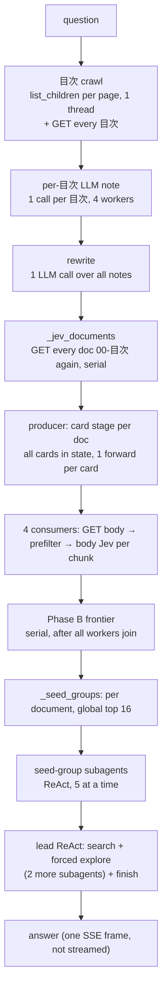
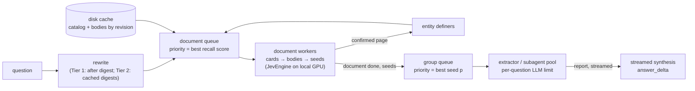

# Search speedup: implementation guide

Status: implementation guide, written 2026-09-26 against commit `62eca14` ("added jev
support"). Nothing here is implemented yet.

This document tells an implementer **exactly** what to build, in which order, where
the code goes, and how to prove each step works. The reasoning behind the decisions
(measurements, GROWI API research, Jev model research, alternatives rejected) is in the
**Appendix** at the end. Read the appendix only when you need to know *why*. **When the
appendix disagrees with Parts 0–2, Parts 0–2 win.**

All paths below are relative to `llm-wiki-air/` unless they start with `docs/` or `/`.
Line numbers refer to `62eca14`; if they have drifted, search for the function name
given next to them.

---

## Part 0 — Read this first

### 0.1 How to use this guide

1. Work packages (WP-01 … WP-17) are listed **in the order they must be implemented**.
   Each one lists what it depends on. Do not start a WP before its dependencies are
   merged and their tests pass.
2. Each WP has the same sections:
   - **Goal**: one paragraph, what changes for the user.
   - **Depends on**: earlier WPs.
   - **Files**: every file you create or modify.
   - **Settings**: every new `.env` variable, with its default and parsing rule.
   - **Steps**: numbered instructions. Follow them in order.
   - **Tests**: the exact test classes and test methods to add, and what each asserts.
   - **Manual check**: what to run by hand, when a unit test cannot prove it.
   - **Done when**: the acceptance checklist. Every box must be true.
   - **Pitfalls**: mistakes that are easy to make here.
3. This guide specifies **what** to build and **how it must behave**; writing the code
   is your job. Code blocks are used only for:
   - signatures, data formats and file layouts that other code depends on;
   - exact strings (Jev questions, event names, setting names), which you copy verbatim;
   - short pseudo-code where an algorithm's order of operations matters.

   Pseudo-code describes the required behaviour, not the required code. Tests are
   described as *scenario → assertion*; write them in the style of the neighbouring
   tests in the same file.
4. If the code you find does not match what a step describes (a function was renamed,
   a field is missing), **stop and report it** instead of guessing. Section 0.9 lists
   the questions that are already known to be open; do not implement anything that
   depends on an open question beyond what the WP says.
5. One WP = one commit (or one PR). Commit message format:
   `search-speedup WP-NN: <title>`. Never mix two WPs in one commit.

### 0.2 Golden rules (repository conventions you must keep)

1. **Keep the flat layout.** `llm-wiki-air/` keeps `graph/`, `publisher/`, `growi-search/`,
   `main.py`. The only new top-level folder is `jev/` (WP-09). Do not create
   `src/`, nested packages under `growi-search/`, or a sync script.
2. **growi-search never imports `sqlite3`, `sqlite_vec`, `GraphStore` or `Librarian`.**
   `growi-search/tests/test_researcher.py:516-535` (`NoForbiddenImports`) enforces this
   for every `growi-search/*.py` file. The local mirror (WP-07) therefore stores plain
   files. The builder (`graph/`, `publisher/`) may keep using SQLite as it does today.
3. **Tests use the standard library `unittest`.** No pytest, no network, no GPU in the
   default suites. Tests that need a real model are **opt-in**: they are skipped unless
   the environment variable `WIKI_JEV_LIVE_TEST=1` is set (see 0.5).
4. **Behaviour changes are opt-in until the evaluation (WP-15) says otherwise.** Every
   WP says which setting turns its behaviour on and what the default is. Defaults keep
   today's behaviour unless the WP explicitly says it changes the default.
5. **Deliberate simplifications carry a `ponytail:` comment** naming the ceiling and the
   upgrade path, for example
   `# ponytail: in-memory trigram index per linker run; persist it if runs get slow`.
   The existing code already uses this style (see `researcher.py:71`, `:507`).
6. **Do not reword existing prompts** (`growi-search/prompts.py`, `graph/linker/prompts.py`,
   `graph/common/prompts.py`). New Jev questions are given in this guide word for word;
   copy them exactly, including the Japanese punctuation.
7. **No hardcoded domain vocabulary.** The app ingests any kind of document. Never add
   lists of subject-specific words, entity kinds or document genres to code or
   questions. Every Jev question in this guide is domain-neutral; keep it that way.
8. **Secrets never appear in logs, events, file names or API responses.** This includes
   `GROWI_TOKEN`, `WIKI_CHAT_API_KEY`, `WIKI_JEV_API_KEY`. The mirror's folder name uses a
   hash of the token, never the token (WP-07).
9. **Team folders are isolation boundaries** (decision 2026-09-26). No link, alias,
   index page, cache entry or Jev pairing may combine content from two different teams.
   A team is the first path segment of a document under the project root; documents
   directly at the root belong to the pseudo-team `general`. The helper
   `graph/workspace/project.py:team_of(rel)` already implements this rule; reuse it.
10. **Every LLM call respects the configured concurrency limits** (WP-03). Never create a
    `ChatOpenAI` in growi-search without the shared HTTP client from WP-03.

### 0.3 Machines and environments

There are two kinds of machine. Code must work on both.

| Machine | Has | Used for |
|---|---|---|
| **Dev machine** (this checkout) | Python 3.13 venv from `uv sync`. **torch and transformers are NOT installed** (verified: `import transformers` fails). No GPU. | Writing code, running the default test suites. |
| **GPU host** | torch, transformers ≥ 5 with `transformers.models.qwen3_5`, `tokenizers`, and (for speed) `flash-linear-attention` + `causal-conv1d`. Optionally the llama.cpp `jev-score` binary. | Running growi-search and the builder with Jev; running the opt-in live tests, the parity check and the benchmark. |

Consequences:

- **Never import `torch`, `transformers` or `numpy` at module top level** in files that the
  default test suites import. Import them inside the function that needs them
  (the existing code already does this, for example `gateway.py:_jev_runtime_options`).
- The default suites must pass on the dev machine.

### 0.4 Running things

Run everything from `llm-wiki-air/` unless stated otherwise. Use `uv run python` (it
picks the project's virtual environment wherever `uv` keeps it); if you prefer, call the
venv's python directly.

```bash
# growi-search default suite (must stay green)
cd growi-search && uv run python -m unittest discover -s tests -v; cd ..

# builder default suite
uv run python -m unittest discover -s tests -v

# jev package suite (exists from WP-09 on)
uv run python -m unittest jev.test_jev -v

# frontend build (exists today; there is no JS test runner)
cd growi-search/frontend && npm ci && npm run build; cd ../..
```

### 0.5 Baseline you must not regress (measured on `62eca14`)

| Suite | Result on `62eca14` |
|---|---|
| growi-search (`growi-search/tests`) | **136 tests, OK** |
| builder (`tests/`) | **85 tests: 1 failure, 27 skipped.** The failure is pre-existing: `test_mount_diff_pipeline.DiffDocxFixtureTest.test_diff_project_config_and_docx_fixture_exist` fails because `configs/diff_test_local.ini` was deleted in `62eca14`. It is **not** yours to fix; it must stay the only failure. The 27 skips are opt-in live tests. |

After every WP: the growi-search suite has **0 failures**, the builder suite has **at most
that one known failure**, and the jev suite (once it exists) has 0 failures.

**Opt-in live tests.** Any test that needs a real Jev model, a GPU or a real GROWI must
start with:

```python
LIVE = os.environ.get("WIKI_JEV_LIVE_TEST") == "1"

@unittest.skipUnless(LIVE, "set WIKI_JEV_LIVE_TEST=1 on the GPU host")
class LiveSomething(unittest.TestCase):
    ...
```

### 0.6 Architecture map

**What exists today** (the parts this guide touches):

| Path | Role |
|---|---|
| `growi-search/app.py` | FastAPI routes; `/api/ask/stream` turns researcher events into SSE frames. |
| `growi-search/config.py` | `Settings` (pydantic) + `Settings.from_env()`. Reads `growi-search/.env`, then `../.env`. |
| `growi-search/growi_client.py` | Sync GROWI client: `search_pages`, `get_page`, `list_children`, `fetch_attachment`. |
| `growi-search/gateway.py` | `LlmClient` (one-shot chat), `Embedder`, `Reranker`, and today's Jev adapters (`HostedJevClassifier`, `LocalJevClassifier`, `build_jev`). |
| `growi-search/researcher.py` | `IndexMap`, `PageCache`, `ResearchSession` (sweep, routing, lead + subagents), `Researcher` (service facade). |
| `growi-search/markdown.py` | Pure parsing: sections, links, `parse_index` for `00-目次` pages. |
| `growi-search/prompts.py` | LLM prompts (Japanese). |
| `growi-search/frontend/` | React SPA. `src/hooks/useAskStream.js` consumes SSE; `src/components/SettingsView.jsx` sends per-request overrides. |
| `publisher/index.py` | Builds `00-目次` index pages (per document + one flat root). |
| `publisher/pipeline.py` | Publish sweep; calls `build_index` after a clean batch (`:422`). |
| `graph/linker/` | Cross-document linker: `chunks.py` (LLM chunk metadata), `catalog.py` (SQLite), `neo.py` (candidates), `service.py` (orchestration, LLM edge judging, page curation), `render.py` (footer), `prompts.py`. |
| `graph/config.py` | Builder `Settings` + `from_env`. |
| `graph/workspace/writer.py` | `wiki_config` (planner/rewrite concurrency), `run_linkers`. |

**What this guide adds:**

| Path | Role | WP |
|---|---|---|
| `jev/` (new top-level package) | The Jev inference engine: types, config, backends (`torch`, `gguf`, `hosted`), batching engine, parity and benchmark tools. Used by growi-search and by the linker. | 09, 10 |
| `growi-search/mirror.py` | Local on-disk copy of every page in scope, kept current every 10 s. | 07 |
| `growi-search/walker.py` | The Jev walker: best-first search over the folder/document/page tree. | 11 |
| `growi-search/cascade.py` | The cascade research mode (walker → verify → sections → packed subagents → streamed synthesis). | 17 |
| `growi-search/eval_run.py`, `growi-search/eval_compare.py` | Evaluation: record a teacher run, compare a candidate run. | 15 |
| `graph/linker/jev_judge.py` | The seven yes/no Jev jobs of the linker. | 12 |
| `publisher/index.py` (rewritten parts) | Folder index tree, one per team; document relations. | 04, 12 |

### 0.7 Glossary

| Term | Meaning in this guide |
|---|---|
| **project root** | `/<target_name>` in GROWI (the INI's `target_name`); `data/<target>/wiki/` locally. |
| **team** | First path segment of a document under the project root (`team_of(rel)`); `general` for root-level documents. An isolation boundary. |
| **document** | One source file's wiki folder, e.g. `teamA/sub/NativeCoreAPIReference_jp.r15`. Its pages are `001-…md`, `002-…md`. |
| **page** | One wiki page (one GROWI page). |
| **index page** | A GROWI page named `00-目次` carrying the marker `<span hidden data-llm-wiki-index="<kind>"></span>`. Kinds: `document` (lists page cards), `folder` (lists child folder/document cards), `root` (the index at the search root). |
| **card** | One `- [title](target) — summary` item of an index page, plus its indented fields (`章`, `キーワード`, `エンティティ`, …). |
| **mirror** | growi-search's local copy of GROWI pages (WP-07). |
| **catalog** | The mirror's list of every page in scope: id, path, revision, updatedAt. |
| **revision id** | GROWI's id of a page version. A body keyed by (page id, revision id) never changes. |
| **Jev** | `chaoliangUNSW/Jev-Style-0.8B-Decision-v3`, a 0.75B decision model. Input = state + question; output = probabilities. |
| **noul** | Jev's yes/no question type. Result `probabilities = {"false": p0, "true": p1}`; this guide calls `p1` **p** or **p(yes)**. |
| **engine** | `jev.JevEngine` (WP-09/10): the one object that owns the model and batches every Jev call. |
| **walker** | WP-11: best-first Jev search over folders → documents → pages → links. |
| **seed** | A page whose full body Jev confirmed with p ≥ `jev_seed_threshold`. |
| **group / bin** | The set of seeds (or evidence) given to one subagent. |
| **slot-round** | One LLM call occupying one of the configured concurrent LLM slots. |
| **GPU host / dev machine** | See 0.3. |

### 0.8 Work package overview

| WP | Title | Area | Depends on | Changes default behaviour? |
|---|---|---|---|---|
| 01 | Stage timings | growi-search | – | No (adds an event) |
| 02 | Three bug fixes | growi-search | 01 | Yes (fixes) |
| 03 | Configurable LLM concurrency | growi-search, builder, frontend | – | Yes (enforces a ceiling) |
| 04 | Folder index tree, one per team | publisher, growi-search | – | Yes (new index pages; root index no longer lists team documents) |
| 05 | Embeddings and reranker off | config only | – | Yes (config) |
| 06 | GROWI bulk endpoints in the client | growi-search | – | No |
| 07 | Local mirror | growi-search | 06 | Yes when `WIKI_MIRROR_DIR` is set (default set in `.env`) |
| 08 | RAM and CPU fixes | growi-search | 07 | No (same results) |
| 09 | `jev/` package, phase P0 (no batching yet) | jev, growi-search | – | No (same results) |
| 10 | `jev/` engine batching and `decide_many` | jev | 09 | No (same results within parity tolerance) |
| 11 | Jev walker + subagent `find` tool | growi-search | 04, 07, 10 | Yes (`find` tool added when Jev is on) |
| 12 | Linker Jev judge | builder | 10 | No (`WIKI_LINKER_JUDGE=llm` default) |
| 13 | Card stage fix + exact token counting | growi-search | 10 | Yes (same decisions, much cheaper) |
| 14 | Streaming pieces | growi-search, frontend | 01, 03 | Yes (answer streams where a synthesis call exists) |
| 15 | Evaluation harness | growi-search | 01 | No |
| 16 | Exhaustive-mode improvements (Tier 1.5) | growi-search | 10, 13, 14 | Partly (each behind a setting) |
| 17 | Cascade mode | growi-search | 11, 13, 14, 15 | No (`WIKI_JEV_MODE=exhaustive` default until WP-15 passes) |

WP-03, 04, 05, 06 and 09 have no dependencies among themselves and may be done in any
order after WP-01/02; the table order is the recommended one.

### 0.9 Open questions (do not decide these yourself)

These are unresolved product decisions. Where a WP touches one, it implements the
safe default described and nothing more.

| # | Question | Safe default used in this guide |
|---|---|---|
| Q1 | Team isolation in growi-search: one instance per team (`GROWI_ROOT_PATH=/<target>/<team>`), or per-user GROWI tokens? | growi-search scopes everything to `GROWI_ROOT_PATH` (it already does). Deploy one instance per team. No per-user tokens are implemented. |
| Q2 | May growi-search use an admin token (needed for the audit log)? Is `AUDIT_LOG_ENABLED` on at work? | `WIKI_MIRROR_CHANGES=auto`: try the audit log, fall back to `pages/recent` on 401/403/400. |
| Q3 | May the lead agent's forced extra `explore` be dropped when seed reports exist? | `WIKI_LEAD_AFTER_REPORTS=agent` (today's behaviour). WP-16 adds `synthesis` as an option. |
| Q4 | Should exhaustive mode stay reachable per question? | Yes: `WIKI_JEV_MODE` is a server setting; exhaustive stays implemented. |
| Q5 | Which GPU runs the app? | Batch budget is a setting (`WIKI_JEV_MAX_BATCH_TOKENS`). |
| Q6 | Several growi-search instances on one host with the same token? | Supported: they may share one mirror folder (WP-07 is written to be safe for that). |
| Q7 | Folder tree shape at work (depth, documents per folder)? | Nothing assumes a shape. |
| Q8 | Jev question types beyond yes/no (choice, score)? | **Not implemented.** This guide uses yes/no (`noul`) only. The `jev/` types accept `choice`/`score` so they can be added later without changing callers. |
| Q9 | How does GROWI assign grants to new pages created under a restricted folder at work? | The publisher sets no grants today (`graph/growi/client.py:create_page` sends only `path` and `body`). This guide does not add grant logic; per-team index pages live inside the team folder so they are treated exactly like that team's documents. |

---

## Part 1 — Work packages

## WP-01 — Stage timings

**Goal.** Every `/api/ask` question reports where its time went: per-stage durations
and counts of GROWI calls, LLM calls and Jev questions. Every later WP is judged
against these numbers, so this comes first.

**Depends on:** nothing.

**Files:**
- `growi-search/researcher.py` (modify)
- `growi-search/tests/test_researcher.py` (add tests)

**Settings:** none.

### Design

A small thread-safe `StageTimer` object lives on each `ResearchSession`
(`self.timer`). It has:

| Member | Behaviour |
|---|---|
| `stage(name)` | A context manager. Adds the elapsed milliseconds of the block to `stage_ms[name]`. |
| `count(name, amount=1)` | Adds to a `Counter`. |
| `snapshot()` | Returns `{"stage_ms": {...}, "counts": {...}, "total_ms": <wall clock since the session was created>}`. |

- Durations from different threads **add up**, so a stage that ran on four threads for
  one second reports about 4000 ms. That is intended: it shows where the work was, and
  `total_ms` gives the wall clock. Say so in the class docstring.
- Use one `Lock` for all fields.
- Use `time.monotonic()`.

### Steps

1. Implement `StageTimer` in `researcher.py` next to `RunBudget` / `_check_stop`, and
   create one in `ResearchSession.__init__`.

2. Count these events (counter name → where):

   | Counter | Increment it |
   |---|---|
   | `page_memo_hit` | `_fetch_page`, when the request-local memo answers |
   | `page_cache_hit` | `_fetch_page`, when `PageCache` answers |
   | `growi_get` | `_fetch_page`, immediately before `client.get_page` |
   | `growi_search` | before every `client.search_pages` call (`_search`, `fast_search`) |
   | `growi_list` | before every `client.list_children` call (`_jev_walk`, `_jev_documents`, `_jev_toc_blocks`) |
   | `jev_calls` / `jev_questions` | before every `self.jev.score_many(...)` call (`_jev_score_cards`, `_jev_score_body`): +1 call, +len(questions) |
   | `llm_calls`, `llm_input_tokens`, `llm_output_tokens` | in `_record_usage` (it runs after every one-shot `LlmClient` call). Read the tokens from `self.llm.last_usage`, and keep today's behaviour of appending the usage to `_extra_usage`. |
   | `agent_messages` | after `agent.invoke(...)` in `_run_lead` and `_run_subagent`: add `_count_steps(state)`. It is a proxy for agent LLM steps, since each LLM step adds one AI message. |

3. Time these stages. Wrap exactly the named block and nothing else:

   | Stage | Block |
   |---|---|
   | `toc_inventory` | `_jev_toc_blocks(...)` call inside `_jev_toc_digest` |
   | `toc_notes` | the thread pool that writes the `目次` notes in `_jev_toc_digest` |
   | `rewrite` | the `_jev_target_query(...)` call in `_run_jev_sweep` |
   | `sweep` | crawler + consumer threads start … join in `_run_jev_sweep` |
   | `frontier` | the Phase B `while work.frontier:` loop |
   | `jev_cards` / `jev_bodies` | the `score_many` call in `_jev_score_cards` / `_jev_score_body` |
   | `seed_groups` | the `_run_seed_groups(...)` call in `_try_route` |
   | `es_route` | search + map merge + router call in `_try_route` (the non-Jev path) |
   | `shallow_answer` | `_answer_shallow(...)` in `_try_route` |
   | `lead` | `_run_lead(...)` in `ask()` |

4. At the end of `ask()`, after `_log_usage(...)` and before returning, emit **one**
   event `{"type": "timings", "stage_ms": …, "counts": …, "total_ms": …}` and log the
   same JSON at INFO with the prefix `timings `.

   - The event must be sent on every return path of `ask()`: reuse, shallow and lead.
     That is why it goes in `ask()`, not in `_try_route`.
   - The frontend ignores unknown event types (`activityLine` returns nothing for them),
     so there is no frontend change.

### Tests (add to `test_researcher.py`)

| Test | Scenario → assertion |
|---|---|
| `TimingTests.test_stage_timer_sums_across_threads` | Two threads each spend 50 ms inside `timer.stage("x")` → `stage_ms["x"] >= 90`. |
| `TimingTests.test_ask_emits_one_timings_event` | `make_session()` with `_try_route` stubbed to return an `AgentAnswer` (as `test_citations_use_pages_read_during_the_run` does) → exactly one event of type `timings`, whose keys are exactly `type, stage_ms, counts, total_ms`. |
| `TimingTests.test_sweep_counts_jev_questions_and_growi_reads` | Build a session like `JevSweepTests.make(jev=FakeJev(["概説"]))` and run `_run_jev_sweep("概説について", …)` → `"sweep" in stage_ms`, `counts["jev_questions"] > 0`, `counts["growi_get"] > 0`. |

### Manual check

Against a real GROWI, ask one question and confirm exactly one `timings {…}` log line
with plausible numbers: the `growi_list` count roughly matches the page count of the
wiki today.

### Done when

- [ ] Every counter and stage in the two tables exists at the named place.
- [ ] Exactly one `timings` event per `ask()`, on every return path.
- [ ] The new tests pass; the growi-search suite is green.

---

## WP-02 — Three bug fixes in growi-search

**Goal.** Fix three defects:
- one wastes subagent LLM steps;
- one silently drops indexed documents to the slow path;
- one wastes one GROWI call per leaf page.

**Depends on:** WP-01 (only so the effect shows up in the timings).

**Files:**
- `growi-search/researcher.py` (modify)
- `growi-search/tests/test_researcher.py` (fixture updates + tests)

**Settings:** none.

### Fix A — the seed-group backlog names pages the subagent may not read

**Defect.**
- `_run_seed_groups` (`researcher.py:1981-2001`) builds the "already read, free to read"
  backlog (`extra`) from the **kept groups**.
- `extra` is therefore exactly the seeds that the same document's *other* groups own,
  which are in `blocked`, and `_sub_read` refuses each of them (`:2183`).
- Seeds dropped by the `jev_subagent_groups` cap, which the comment says should be
  offered, never are.

**Required behaviour.**
- `extra` for a group = the ids of confirmed seeds of the **same document** that are in
  **no kept group**.
- A seed owned by any kept group must never appear in any `extra`.

**How.**
- `_run_seed_groups` needs the full confirmed list. Add a `confirmed` parameter and pass
  it from `_try_route`.
- `_seed_groups` builds its groups from the same dict objects that are in `confirmed`,
  so object identity (`id(result)`) is enough to tell kept from leftover. Do not copy
  those dicts anywhere in between.
- Delete the now-unused `mine`.

**Test** `JevSweepTests.test_seed_group_backlog_lists_only_readable_leftovers`:
- **Setup:**
  - document A has 7 seeds with scores 0.99 … 0.93, document B has 1 seed at 0.985;
  - `groups = R._seed_groups(confirmed, group_size=5, max_groups=2)`, which keeps
    A[0:5] and B and drops A[5:7];
  - patch `R._run_subagent` to capture each run's prompt and `offlimits`.
- **Assertions:**
  - A's prompt mentions both dropped A seeds, and neither is in A's `offlimits`;
  - B's prompt contains no `追加候補ページ` backlog.
- The existing `test_group_prompt_lists_the_already_read_document_backlog` passes
  `extra` directly and must stay unchanged.

### Fix B — `/<pageId>` references are sent to GROWI as paths

**Defect.**
- Once the ledger knows page ids, the publisher writes index links as `/{pageId}`.
- `_fetch_ref` (`:799-804`) sends every `/…` reference as `path=`.
- GROWI's `GET /_api/v3/page?path=` does not resolve permalinks (it uses
  `findByPathAndViewer`), so those reads 404. The sweep then treats indexed documents
  as having no index and walks every page.
- `IndexMap._read` (`:241-249`) already handles this case; `_fetch_ref` does not.

**Required behaviour.** One rule, one helper `_is_page_id(ref)`: true when the
reference, after stripping whitespace and one leading/trailing `/`, is exactly 24 hex
characters. `_fetch_ref` reads such references **by page id**, other `/…` references
by path, and anything else by page id (as today). Use the helper in `IndexMap._read`
and `IndexMap.card_page` too, replacing their inline regex.

**Known limit.** A page literally *named* with 24 hex characters is read as an id; the
same rule already exists in `IndexMap._read`. Mark it with a `ponytail:` comment.

**Test** `PathReads.test_permalink_reference_reads_by_page_id`: an `IndexClient` session
calls `_fetch_ref("/" + IndexClient.DOC_A_ID)` → a page comes back, and the client's
last `page_calls` entry is the bare id. Check that this test **fails** without the fix.

### Fix C — the recursive walk lists leaves

**Defect.** `_jev_walk` (`:1170-1202`) calls `list_children` on every node. GROWI
listings carry `descendantCount`, which `_page_dict` stores as
`WikiPage.descendant_count`; for a leaf the call can only return nothing.

**Required behaviour.**
- The walk remembers, for each queued node, whether it came **from a listing**. The
  start node did not; children did.
- Skip `list_children` for a node that came from a listing **and** has
  `descendant_count == 0`.
- Always list the start node: the synthetic roots built in `_jev_documents`
  (`WikiPage(id="", path=...)`) have count 0 but do have children.

**Fixture updates (required).** Test fixtures build folder nodes with `page_of(...)`,
whose `descendant_count` defaults to 0. Without updates, several existing tests would
stop finding nested pages. Give these entries a non-zero `descendant_count` and change
nothing else:

| Fixture | Entries |
|---|---|
| `JevClient.children_map["/Moove"]` | `f-a` (2), `f-b` (2), `f-c` (4) |
| `JevClient.children_map["/Moove/C"]` | `f-cs` (2) |
| `WideClient.__init__` | `f-cs` (2), and **each of the 30 wide pages (1)**. `test_classification_overlaps_the_crawl` relies on the crawl issuing one list call per wide page, so it stays slower than classification. |

**Test** `JevSweepTests.test_walk_does_not_list_leaves`: walk from
`page_of("f-c", "/Moove/C")` with an unlimited budget → the client's `list_calls` is
exactly `["/Moove/C", "/Moove/C/sub"]`.

### Done when

- [ ] Each new test fails without its fix and passes with it.
- [ ] All existing tests pass after the fixture updates, with no other test edited.
- [ ] `_is_page_id` is the only place that decides "is this an id".

---

## WP-03 — Configurable LLM concurrency

**Goal.** Every LLM call path takes its limit from `.env`:
- **Builder:** one setting per stage.
- **growi-search:** a ceiling for the whole instance (`.env` only), plus a per-question
  default that the frontend may change, but never above the ceiling.

The hardcoded maximum of 4 disappears.

**Depends on:** nothing.

**Files:**
- growi-search: `config.py`, `gateway.py`, `researcher.py`,
  `frontend/src/components/SettingsView.jsx`, and tests in `tests/test_researcher.py`
  and `tests/test_app.py`.
- builder: `graph/config.py`, `graph/workspace/writer.py`.
- `tests/test_search_speedup.py`: **new**. This is the single builder-side test file for
  this whole plan (WP-03, 04, 12 add classes to it).
- `README.md` (document the settings).

**Settings:**

| Variable | Default | Parse | Meaning |
|---|---|---|---|
| `WIKI_SEARCH_LLM_MAX_CONCURRENCY` (new) | 4 | int, clamp 1..256 | growi-search `Settings.llm_max_concurrency`: LLM requests in flight for the whole process, all users together. **Not** overridable per request. |
| `WIKI_SUBAGENT_CONCURRENCY` (exists) | 2 | int, clamp 1..64, then `min(…, ceiling)` | Per-question default. The frontend may override it per request (`overrides.subagent_concurrency`), clamped to the ceiling. |
| `WIKI_PLANNER_CONCURRENCY` (new) | `WIKI_CONCURRENCY` | int ≥ 1 | Builder `Settings.wiki_planner_concurrency`. Also settable from a project INI (`[settings] wiki_planner_concurrency = …`) and set by the INI's shared `concurrency` key like the other stage settings. |
| `WIKI_REWRITE_CONCURRENCY`, `WIKI_LINKER_CONCURRENCY`, `WIKI_INGEST_CONCURRENCY` (exist) | `WIKI_CONCURRENCY` | unchanged | builder stages |

### Design: how the growi-search ceiling is enforced

**One process-wide `httpx.Client`** with
`limits=httpx.Limits(max_connections=N, max_keepalive_connections=N)`:

- It is passed as `http_client=` to **every** `ChatOpenAI` in growi-search. That covers
  `LlmClient._make_llm` in `gateway.py` and `_model` in `researcher.py`; grep to confirm
  there are no others.
- httpx never runs more than N requests at once; the others wait for a free connection.
- It covers one-shot calls, LangGraph agent steps and streaming answers alike, and a
  streamed answer holds its connection until it ends.
- Expose it as `gateway.llm_http_client(max_concurrency) -> httpx.Client`: a
  lock-protected module-level singleton whose size is fixed by the **first** call.
  Document that in its docstring.
- **Timeout:** the client and every `ChatOpenAI` use
  `httpx.Timeout(<seconds>, pool=None)`. With a plain `timeout=300` the OpenAI SDK also
  limits the time spent *waiting for a free connection*, and queued calls fail with
  `PoolTimeout` under load.

**Per-question limit.**
- It is the existing subagent `ThreadPoolExecutor(max_workers=subagent_concurrency)`.
- The `目次` notes in `_jev_toc_digest` currently borrow `jev_workers` as their thread
  count (`:1413`); switch them to `subagent_concurrency`. They are LLM calls of one
  question, so they obey the per-question limit.

### Steps (growi-search)

1. **`config.py`:**
   - add the `llm_max_concurrency` field (default 4);
   - parse both variables as in the table;
   - add a `validate_strict` check that
     `1 <= subagent_concurrency <= llm_max_concurrency`.
2. **`gateway.py`:**
   - add `llm_http_client`;
   - `LlmClient.__init__` gains a keyword `max_concurrency: int = 4`, and `_make_llm`
     passes the shared client and the pool-less timeout.
3. **`researcher.py`:**
   - `_model(settings)` uses the shared client and the pool-less timeout;
   - both `LlmClient(...)` constructions (`ResearchSession.__init__` and
     `apply_overrides`) pass `max_concurrency=settings.llm_max_concurrency`;
   - `_jev_toc_digest` uses `subagent_concurrency`.
4. **Overrides:**
   - remove `subagent_concurrency` from `_OVERRIDE_MAX` and keep it in `_OVERRIDE_KEYS`;
   - in `_sanitize_overrides` clamp it to `1 … settings.llm_max_concurrency`.
5. **Frontend:**
   - `SettingsView.jsx:113` computes `Math.min(n, 4)`; replace the 4 with the server
     default `llm_max_concurrency` (`/api/settings` returns every non-secret setting,
     so it is there once the field exists);
   - add `llm_max_concurrency: 4` to `FALLBACK_DEFAULTS` for the offline case;
   - `agentsFields` / `buildPatch` need the cap passed in, since they are module-level
     functions.

### Steps (builder)

1. **`graph/config.py`:**
   - add the `wiki_planner_concurrency` field (default `app_concurrency()`) and its env
     parsing next to `wiki_rewrite_concurrency`;
   - add it to the tuple of stage fields that the INI key `concurrency` fills in
     (around `graph/config.py:453`).
2. **`graph/workspace/writer.py:wiki_config`:** `planner_concurrency` comes from
   `settings.wiki_planner_concurrency`, falling back to `concurrency`.
3. **Do not change `chunks.describe_all` here.** It accepts `concurrency` but
   deliberately runs one chunk at a time: every prompt carries the entities of the
   chunks before it. WP-12 removes that dependency and parallelizes it.
4. **`README.md`, "Configuration" section:** document the five builder variables and the
   two growi-search variables, plus the sentence "growi-search never runs more than
   `WIKI_SEARCH_LLM_MAX_CONCURRENCY` LLM requests at once, across all users; the
   settings screen can change the per-question value up to that ceiling."

### Tests

| File / class | Test | Scenario → assertion |
|---|---|---|
| `test_researcher.py` `Overrides` | `test_subagent_concurrency_override_is_capped_by_the_ceiling` | Ceiling 6: override 50 becomes 6, override 3 stays 3. |
| same | `test_env_ceiling_clamps_the_per_question_default` | Env ceiling 3 and per-question 10 → `Settings.from_env()` gives (3, 3). |
| `test_researcher.py` new `LlmCeilingTests` | `test_process_never_exceeds_the_ceiling` | Start a stdlib `ThreadingHTTPServer` on `127.0.0.1:0` that answers `POST /v1/chat/completions` with a minimal OpenAI chat-completion JSON after sleeping 0.2 s, and records the peak number of requests in flight. Six threads call `LlmClient("m", base, "k", max_concurrency=2, retry_attempts=0).complete(...)` → all six return the content, and the peak is exactly 2. |
| `test_app.py` `NewReadOnlyRoutes` | `test_settings_hides_secrets` (extend) | `/api/settings` includes `llm_max_concurrency`. |
| `tests/test_search_speedup.py` `PlannerConcurrencyTest` | `test_planner_setting_reaches_wiki_config` | A `SimpleNamespace` with `wiki_planner_concurrency=2`, `wiki_rewrite_concurrency=8`, `concurrency=4` plus the chat fields `wiki_config` reads → the returned config has planner 2 and rewrite 8. |
| same | `test_env_and_ini_parse` | Temporary INI with `[project] target_name / data_root / source_mount` (absolute paths): env `WIKI_PLANNER_CONCURRENCY=3` → 3. Then without the env variable but with `[settings] concurrency = 5` → 5. |

Notes for `LlmCeilingTests`:
- **Why a real server:** the ceiling lives in httpx's connection pool, which
  `httpx.MockTransport` bypasses, so a mock cannot prove it.
- **Reset the singleton:** reset `gateway._LLM_HTTP_CLIENT` to `None` in `setUp` and
  `tearDown` (closing it first), because the pool size is fixed by its first user.
- **Minimal completion JSON:** `id`, `object: "chat.completion"`, `created`, `model`,
  one `choices` entry with `message.role/content` and `finish_reason`, and `usage` with
  the three token counts.
- **The server handler:**
  - set `protocol_version = "HTTP/1.1"`;
  - send `Content-Length`;
  - silence `log_message`.

### Manual check

1. Set `WIKI_SEARCH_LLM_MAX_CONCURRENCY=2` and ask two questions at once from two tabs.
   The LLM server's request log (or `ss -tnp`) never shows more than 2 concurrent
   requests from this process.
2. On the settings screen, the agent-concurrency value can be raised up to the ceiling
   and not beyond.
3. `npm run build` succeeds.

### Done when

- [ ] `grep -n "ChatOpenAI(" growi-search/*.py` shows only sites that pass the shared client.
- [ ] No literal 4 limits concurrency in `researcher.py`, `config.py` or `SettingsView.jsx`.
- [ ] New tests pass; all suites are green (builder: only the known failure).

### Pitfalls

- **The shared `.env` sets `WIKI_SUBAGENT_CONCURRENCY=5`.** With the default ceiling of
  4, growi-search clamps it to 4. Set the ceiling explicitly when deploying.
- **Don't add a second gate** (for example a semaphore around `LlmClient.complete`). It
  would double-count, and agent calls would still bypass it.

---

## WP-04 — Folder index tree, one per team

**Goal.** After every publish, every folder that contains documents gets its own
`00-目次`. Each lists the folder's child folders and child documents as cards, with
mechanically aggregated vocabulary, so search can prune a whole folder with one
decision (WP-11).

At the same time this fixes an isolation leak: today the project's root `00-目次` lists
**every document of every team** with its summary and keywords. After this WP:
- the root lists only team **names** plus the documents that sit directly at the root;
- nothing on any page combines content from two teams.

**Depends on:** nothing. This is publisher code plus a parser change in growi-search. It
does not need Jev.

**Files:**
- publisher: `publisher/index.py` (rewrite the index-building parts)
- growi-search: `markdown.py` (parser fields), `researcher.py` (`IndexMap` recursion,
  `_jev_documents` key change, `_jev_toc_blocks` filter)
- tests: `tests/test_search_speedup.py` (builder), plus `tests/test_markdown.py` and
  `tests/test_researcher.py` (growi-search)
- `README.md`: the "`index` runs inside the publish sweep" description

**Settings:** none. The tree is always built. Its cost is local JSON reads plus GROWI
upserts of changed pages only.

### Today (what you are changing)

- `build_index` (`publisher/index.py:129-200`) walks every published document
  (`_folders(project)`, keyed by the document's wiki-relative path such as
  `teamA/sub/Foo.r15`).
- For each document it:
  - renders `<doc>/00-目次` with one card per page (`render_document_index`);
  - writes it locally to `metadata/index/<doc>/index.md`;
  - upserts it to GROWI at `growi_path(write_path, doc, "00-目次")`.
- Finally it renders **one** root index (`render_root_index`) that lists every document
  flat. That list is written to `metadata/index/index.md` and upserted at
  `growi_path(write_path, "00-目次")`.
- The page marker is `<span hidden data-llm-wiki-index="{kind}"></span>`, with kind
  `document` or `root`.
- The publish sweep calls `build_index(only=<raw rels of this batch>, locked=True,
  ledger=…)` after a clean batch (`publisher/pipeline.py:422`), and
  `delete_document_index` when a document is deleted.

### Target structure

Take the documents `teamA/sub/docA`, `teamA/docB`, `teamB/docC` and `docRoot`.
`docRoot` sits directly at the project root, so its team is `general`.

```
/<target>/00-目次                 kind=root   → cards: teamA (folder, name only), teamB (folder, name only), docRoot (document, full card)
/<target>/teamA/00-目次           kind=folder → cards: sub (folder, aggregated), docB (document)
/<target>/teamA/sub/00-目次       kind=folder → cards: docA (document)
/<target>/teamB/00-目次           kind=folder → cards: docC (document)
/<target>/teamA/sub/docA/00-目次  kind=document (unchanged: one card per page)
…
```

**Rules:**

1. **Folder set.** Every proper ancestor folder of every document gets an index. The
   project root (`""`) counts as a folder with kind `root`; every other folder has kind
   `folder`.

2. **Team isolation (must hold).**
   - On the **root** index, a card for a team folder carries **only** the name and
     `種別: フォルダ`. No summary text (write `— チーム` after the link), no
     `文書数`/`ページ数`/`内容`/`章`/`キーワード`/`エンティティ`.
   - A root card for a root-level document (team `general`) is a full document card.
   - A non-root folder aggregates only its own descendants, which by construction all
     belong to one team.
   - Use `graph/workspace/project.py:team_of(rel)` for the team rule; do not reimplement
     it.

3. **Links.**
   - Folder and document index pages are linked by **GROWI path**:
     - folder index: `growi_path(connection.write_path, folder, INDEX_NAME)`;
     - document index: `growi_path(doc_path, INDEX_NAME)`;
     - with no connection: `/<folder>/00-目次` and `/<doc>/00-目次`.
   - Page cards inside a document index keep today's `link_for` (page id if published,
     else path).
   - Why paths: a folder index is rendered before or after its children in any order,
     and its body must stay identical across runs so that `_upsert` skips unchanged
     pages. Page ids only exist after an upsert and would make both harder.

4. **A path that is both a document and a folder** (a source file `x.pdf` next to a
   folder `x/`, giving documents `teamA/x` and `teamA/x/y`):
   - there is **no** separate folder index for `teamA/x`;
   - the document index of `teamA/x` gets an extra section at the end, headed
     `## サブフォルダ`, holding the child cards a folder index would have had;
   - the page cards above it stay as they are.

5. **Card formats.** Every card is one item line plus indented fields, in the syntax
   `parse_index` already reads:
   - item line: `- [title](link) — summary`;
   - field lines: two spaces, then `- <label>: <value>`.

   Document card (in a folder, root or サブフォルダ section):

   ```
   - [<document display name>](<document index link>) — <document scope line>
     - 種別: 文書
     - ページ数: <number of page cards>
     - 章: <up to 20 chapter names in page order, deduplicated>
     - キーワード: <top 30 keywords>
     - エンティティ: <top 20 defined entities>
   ```

   Folder card (non-root parent):

   ```
   - [<folder name>](<folder index link>) — <folder scope line>
     - 種別: フォルダ
     - 文書数: <documents anywhere below this folder>
     - ページ数: <pages of those documents>
     - 内容: <up to 20 direct child titles, then （他N件） if more>
     - 章: <top 15 chapter names below this folder>
     - キーワード: <top 30 keywords below this folder>
     - エンティティ: <top 20 defined entities below this folder>
   ```

   - Omit a field line when its value would be empty, as `render_document_index`
     already does.
   - Page cards inside document indexes do **not** get a `種別` line; they stay exactly
     as today.

6. **Aggregation.** Mechanical only: no LLM, no GROWI reads.
   - Per document, start from `document_cards(folder)` (it already returns title,
     summary, chapter, keywords and entities per page).
   - **Document display name:** the last path segment of the document path. Today's
     root index uses the same `Path(document).name` idea.
   - **Chapters:** non-empty `card["chapter"]` values, deduplicated, in first-seen order.
   - **Keywords / entities:** count occurrences across all pages (a `Counter`), take the
     most common, and break ties by first appearance.
     `# ponytail: raw frequency; weight against sibling folders if routing needs more contrast.`
   - Always pass values through the existing `_join(values, limit)`, which dedupes, cuts
     each value to 80 characters and joins with `、`. Do not write a second joiner.
   - **Folder aggregates:** the same rules applied to the union of all descendant
     documents' page cards.
   - **Scope lines**, always passed through `_one_line(text, 300)`:
     - document: its chapters joined with `、`, or, when there are no chapters, the
       first five page titles joined with `、`; if still empty, `要約なし` (today's
       placeholder);
     - folder: its direct child titles joined with `、`;
     - team folder on the root: the literal `チーム`.
   - **Order of cards** on a folder page: child folders first, then documents, each
     sorted by name. Use the same natural sort (`sorted(..., key=str)`) everywhere so
     the output is deterministic.

7. **Page header.** A folder index starts with `# <folder name>` (for the root, the
   target name), then a blank line, the marker, a blank line, and the sentence
   `このフォルダに含まれるフォルダと文書の索引です。`, mirroring
   `render_document_index`'s header.

### Steps (publisher)

1. **Pure helpers** in `publisher/index.py`, all testable without a project:

   | Function | Input | Output |
   |---|---|---|
   | `folder_tree(documents: list[str]) -> dict[str, FolderNode]` | wiki-relative document paths | one node per folder (root key `""`) with `folders: list[str]` and `documents: list[str]` (direct children) |
   | `document_summary(document: str, cards: list[dict]) -> dict` | one document's page cards | `{"name", "pages", "chapters", "keywords", "entities", "scope"}` |
   | `folder_summary(folder, tree, summaries) -> dict` | a folder and every document's summary | `{"name", "documents", "pages", "contents", "chapters", "keywords", "entities", "scope"}` |
   | `render_folder_index(title, kind, child_cards: list[str]) -> str` | pre-rendered card blocks | the full page body |
   | `render_document_card(summary, link) -> str` / `render_folder_card(summary, link, *, name_only: bool) -> str` | | one card block each |

   `FolderNode` can be a small dataclass. Keep these functions free of I/O.

2. **Rewrite `build_index`** around these helpers. Keep its signature and return shape
   (`{"run_id", "done", "failures"}`).
   1. Read `_folders(project)` and compute `document_summary` for **every** document.
      This is cheap (local JSON), and folder aggregates need all of them.
   2. **Scope:**
      - `only is None` → every document and every folder is in scope;
      - otherwise convert `only` (raw rels) to document paths **without** filtering by
        existence (`project.wiki_dir(rel)` is a pure path function). This is what makes
        deleted documents' ancestors count.
      - The affected folders are every ancestor of every scoped document; the root is
        always affected.
   3. **Document index pages:**
      - render and upsert every scoped document that still exists, exactly as today,
        plus the `## サブフォルダ` section when rule 4 applies;
      - also re-render any *unscoped* document that is an affected folder under rule 4.
   4. **Folder index pages:** for every affected folder that still has documents, render
      it and write `metadata/index/<folder>/index.md` (the root keeps
      `metadata/index/index.md`), then upsert.
   5. **Folders left with no documents:**
      - delete the local file;
      - call the existing `_delete_if_index(client, path)`, which only deletes pages
        carrying the index marker.
   6. **`done` entries:**
      - document entries keep today's shape;
      - folder entries are `{"folder": "<folder or ''>", "status": "indexed" | "unchanged" | "written" | "deleted"}`;
      - drop the old `{"root": True}` entry and report the root as `{"folder": ""}`.
   7. **Failure policy stays:** an exception for one page is appended to `failures`, and
      the rest continue.
3. **Delete `render_root_index`** and update `__all__`. Its only caller is `build_index`
   (verified with grep).
4. **`delete_index_pages`** (used by `index --delete` and `reset`) must also delete every
   folder index: compute the folder set with `folder_tree(list(_folders(project)))` and
   add each folder's index path before the root.
5. **`README.md`:** replace the paragraph describing "a root index listing every document"
   with the tree description and the isolation rule.

### Steps (growi-search)

1. **`markdown.py`:**
   - `IndexCard` gains `kind: str = ""`, `documents: int = 0` and
     `contents: list[str] = field(default_factory=list)`.
   - `_INDEX_FIELDS` gains `"種別": "kind"`, `"文書数": "documents"` and `"内容": "contents"`.
   - `parse_index` maps kind values: `フォルダ` → `"folder"`, `文書` → `"document"`,
     anything else → `""`.
   - `内容` splits like keywords (`、` or `,`) and drops a trailing `（他N件）` item.
   - Add `index_kind(body) -> str`: the marker's kind value (`document`, `folder`, `root`,
     or `1` in legacy fixtures), or `""` when there is no marker.
2. **`IndexMap._build` becomes a breadth-first recursion:**
   - Start at the root index `<GROWI_ROOT_PATH>/00-目次` (unchanged).
   - Read each level's child index pages in parallel with the existing thread pool.
   - Interpret each card by kind:
     - `"folder"` → read its index page and recurse;
     - `"document"`, or `""` inside a root/folder index (legacy root indexes have no
       `種別`) → read the document index and collect its page cards exactly as today;
     - `""` inside a document index → page card.
   - Guard with a visited set of normalized refs and a depth limit of 32.
   - Folders with a missing or non-index page are skipped with an INFO log; the Jev sweep
     already walks documents it cannot index.
3. **`_MapState` gains:**
   - `folders: list[IndexCard]`;
   - `parent: dict[str, str]`: normalized ref of any card's target → normalized ref of
     the index page that listed it;
   - `children: dict[str, list[IndexCard]]`: normalized index-page ref → the cards it
     lists.

   The normalized ref is `target.strip().strip("/")`: a bare id for permalink targets,
   the path without its leading slash otherwise. Put that rule in one helper, `_ref()`.
4. **Re-key `cards_by_document` by the document's normalized ref** instead of its title
   (two documents in different folders can share a title).
   - `_jev_documents` reads it with the same key.
   - Keep `card.document` as the display title (used in `card_text`) and add
     `card.doc_ref` for keys.
5. **`_jev_toc_blocks`:** skip index pages whose `index_kind` is `folder` or `root`.
   Their content repeats the document indexes below them, and each would cost one more
   LLM `目次` note in exhaustive mode. Document indexes (kind `document` or legacy `1`)
   stay.

### Tests

**Builder (`tests/test_search_speedup.py`, class `IndexTreeTest`).**

Fixture helper `make_project(tmp, documents)` builds a temporary project:
- `open_project(SimpleNamespace(data_root=…, target_name="t", mount_path=…))`;
- for every document, `wiki/<doc>/` gets:
  - `_planning/linker.json` = `{"status": "complete"}`;
  - `_planning/manifest.json`, `coverage.json` and `chunks.json` with one or two pages
    that carry chapters, keywords and entities with role `defines` (see
    `document_cards` for the exact keys it reads);
  - page files `001-p.md` starting with `# <title>`.

Run with `GROWI_URL` removed from the environment (`mock.patch.dict(os.environ, …)`) and
`publish=False`.

| Test | Scenario → assertion |
|---|---|
| `test_root_lists_team_names_only` | Documents `teamA/sub/docA`, `teamA/docB`, `teamB/docC`, `docRoot`. On the root file, the marker kind is `root`: `teamA` and `teamB` appear as name-only folder cards (no `キーワード`, `エンティティ` or `内容` lines under them), and `docRoot` is a full document card. None of docA/docB/docC's titles, keywords or entities appear. |
| `test_team_folder_aggregates_only_its_descendants` | The `teamA` index lists `sub` (folder, `文書数: 1`, docA's keywords) and `docB`. It contains none of teamB's keywords. |
| `test_nested_folder_index` | `teamA/sub` index lists `docA` with `ページ数` equal to its page count. |
| `test_document_index_page_cards_unchanged` | Byte-compare a document index with what `render_document_index` produced before this WP (the same card lines, no `種別`). |
| `test_scoped_build_touches_only_ancestors` | `build_index(only=[raw rel of docB])` → `done` has folder entries for `teamA` and `""` only (not `teamB`, not `teamA/sub`). |
| `test_document_that_is_also_a_folder` | Documents `teamA/x` and `teamA/x/y` → `teamA/x`'s document index ends with `## サブフォルダ` listing `y`; there is no separate folder index for `teamA/x`. |
| `test_empty_folder_index_is_removed` | Build, delete the `teamB/docC` wiki folder, build with `only=[docC's raw rel]` → the local `metadata/index/teamB/index.md` is gone, and `teamB` no longer appears on the root. |
| `test_growi_upserts_and_deletes` | Patch `publisher.index._publisher` and `_connection` to return a fake publisher whose `client` has async `get_page`, `create_page`, `update_page` and `delete_pages` (record calls; return objects with `page_id` / `revision_id` / `body`). One full build creates each folder index once; a second identical build creates or updates nothing; deleting a team's last document calls `delete_pages` for that team's folder index. |

**growi-search.**

| File / class | Test | Scenario → assertion |
|---|---|---|
| `test_markdown.py` | `test_parse_index_reads_folder_fields` | A folder card with `種別: フォルダ`, `文書数: 3`, `内容: a、b（他2件）` → kind `folder`, documents 3, contents `["a", "b"]`. |
| same | `test_legacy_cards_have_no_kind` | Today's document index text → every card has kind `""`. |
| `test_researcher.py` `IndexMapTests` | `test_tree_index_is_followed_to_page_cards` | New fixture `TreeIndexClient`: root (kind root) → `/Moove/teamA/00-目次` (kind folder) → `/Moove/teamA/A/00-目次` (kind document) → page cards. `rank("alpha", 2)` finds the page card; `state.children` and `state.parent` link root → teamA → A. |
| same | `test_cards_by_document_keyed_by_ref` | Two documents with the same title in different folders both keep their cards. |
| same | existing `IndexMapTests` and `JevSweepTests` | Pass unchanged (legacy root indexes without `種別`). |
| `JevSweepTests` | `test_toc_digest_skips_folder_indexes` | Add a folder-kind index page to the walk fixture → `_jev_toc_blocks` does not return it. |

### Manual check

1. `main.py index --project <p> --no-publish` on a real project, then inspect
   `data/<target>/metadata/index/**/index.md`: one file per folder, no team vocabulary on
   the root.
2. Publish to a test GROWI and open `/<target>/00-目次` and a team's `00-目次` in the
   browser: the links work.
3. Start growi-search against it: the log line of the index-map refresh counts all
   documents' cards (compare with before).

### Done when

- [ ] The root index contains no content from inside any team folder.
- [ ] Every folder with documents has exactly one index (or a サブフォルダ section under
  rule 4).
- [ ] An identical second build writes nothing to GROWI.
- [ ] growi-search finds the same page cards as before on a legacy wiki, and all cards
  on a tree wiki.
- [ ] All suites green.

### Pitfalls

- **Scope from the path, not the folder.** Do not compute the scope with
  `_scoped_folders` (it drops documents whose folder no longer exists); deleted
  documents must still mark their ancestors.
- **Always write `種別: 文書` on document cards.** growi-search treats `""` as a document
  only for legacy compatibility.
- **Keep every body deterministic.** Sort everything; never include timestamps. Otherwise
  `_upsert` rewrites unchanged pages on every run.

---

## WP-05 — Embeddings and reranker off

**Goal.** Switch the embedding model and the reranker off in both growi-search and the
builder (decision 2026-09-26). Page finding moves to Jev (WP-11). They can come back
later as optional channels.

**Depends on:** nothing.

**Files:** `.env` (shared), `growi-search/.env` (create if missing),
`growi-search/README.md`, `README.md`. **No code changes** unless the checks below fail.

### Why no code is needed

- **growi-search:**
  - `Embedder.build(settings)` returns `None` when `embed_base_url` or `embed_model` is
    empty, and `Reranker.build` returns `None` when `reranker_configured` is false
    (`gateway.py`).
  - `IndexMap.rank` then uses keyword overlap only; `_rank_candidates` keeps
    Elasticsearch order; `hydrate_shallow` skips section reranking.
  - `/api/ready` reports `embedder: false, reranker: false`.
- **Builder:**
  - `Embedder(settings)` raises `ValueError` when `embed_backend != "server"`
    (`graph/clients/embeddings.py`).
  - Both construction sites in the publish pipeline catch the exception and continue
    with `embedder=None` (`publisher/pipeline.py:538-542` and `:1186-1190`).
  - The linker then runs on trigram full-text search only (`catalog.embed_pending`
    returns immediately without an embedder).
  - The reranker is configured in `graph/config.py` but never called by the air builder.

### Steps

1. **`growi-search/.env`:** add the lines `WIKI_EMBED_BASE_URL=` and
   `WIKI_RERANK_BASE_URL=` with empty values. `config.py:_load_env_files` loads this file
   first, and `load_dotenv(override=False)` then keeps the shared `.env` from filling
   them back in.
   - **Verify** by starting the service and checking `/api/ready`.
   - If a process-level environment variable already sets them, the service-local file
     cannot override it. Document that.
2. **Shared `.env`:** set `WIKI_EMBED_BACKEND=off` for the builder. Keep the URLs, so
   switching back is one line.
3. **Warning noise:** the builder logs `stage=embedder error=ValueError …` once per
   publish run. Downgrade it to an INFO log with the message
   `embedder disabled (WIKI_EMBED_BACKEND=off)` when the reason is the backend setting.
   This is the only code change in this WP. Keep the `except` as it is for real
   failures.
4. **Docs:**
   - `growi-search/README.md`: the "Requirements" and "How retrieval works" sections no
     longer describe the reranker as part of the default path; mention the two empty
     variables.
   - `README.md`: the requirements list no longer needs the embedding endpoint.

### Tests

| Where | Test | Scenario → assertion |
|---|---|---|
| `growi-search/tests/test_app.py` `Readiness` | `test_capabilities_without_models` | `Settings` with empty embed/rerank URLs → `/api/ready` has `embedder: false, reranker: false` and `ready: true` (with the mock GROWI). |
| `tests/test_search_speedup.py` | `EmbedderOffTest.test_backend_off_raises_value_error` | `Embedder(SimpleNamespace(embed_backend="off", …))` raises `ValueError`, which proves the pipeline's catch path is what disables it. |

### Done when

- [ ] `/api/ready` on the real deployment shows both off.
- [ ] A publish run completes and the linker writes links, with at most one INFO line
  about the embedder.

---

## WP-06 — GROWI bulk endpoints in the growi-search client

**Goal.** Add the four read-only GROWI v3 calls that the local mirror (WP-07) needs.
Each is fully tested with `httpx.MockTransport`, so WP-07 can rely on them.

**Depends on:** nothing.

**Files:** `growi-search/growi_client.py`, `growi-search/tests/test_growi_client.py`.

**Settings:** none.

### Methods to add to `GrowiSearchClient`

All of them:
- go through `self._request` (auth header, concurrency slots, error mapping);
- apply `_in_scope(path, self.root_path)` to every returned page, and drop pages
  outside the scope;
- tolerate both a bare object and a `{"data": …}` wrapper, like the existing methods.

| Method | GROWI call | Returns | Notes |
|---|---|---|---|
| `list_descendants(path: str, *, limit: int = 500, page: int = 1) -> tuple[list[WikiPage], int]` | `GET /_api/v3/pages/list?path=&limit=&page=` | (pages of this page-number, `totalCount`) | Response `{"pages": [...], "totalCount": n, "offset", "limit"}`. `page` is 1-based. Always pass `limit`: GROWI's default is the tiny `customize:showPageLimitationS`. Results are sorted by `updatedAt` newest first, empty pages and trash excluded. Map each page with `_page_dict` (it reads `_id`, `path`, `revision` (a string id here), `updatedAt`, `descendantCount`). |
| `iter_descendants(path, *, limit=500) -> Iterator[WikiPage]` | repeats `list_descendants` | every page once | Loop `page = 1, 2, …` until a page returns fewer than `limit` items or the running count reaches `totalCount`. **Dedupe by id**: an edit during the loop moves a page to the front (the sort is `updatedAt`), which can shift pages across page boundaries. |
| `recent_pages(*, limit: int = 100, offset: int = 0) -> list[WikiPage]` | `GET /_api/v3/pages/recent?limit=&offset=` | newest-updated pages | Response has `pages`. Only published, non-trash pages. |
| `activity(*, limit: int = 100, offset: int = 0, actions: list[str] \| None = None) -> list[dict]` | `GET /_api/v3/activity?limit=&offset=&searchFilter=<json>` | raw activity docs `{"_id", "action", "target", "targetModel", "createdAt", "snapshot"}` | **Admin-only**, and needs GROWI's `AUDIT_LOG_ENABLED`; `limit` ≤ 100. **Always** send `offset` explicitly (an absent offset becomes 1 and silently skips the newest record) and **always** send `searchFilter` as a JSON string, at least `{}` (absent → HTTP 400). With `actions`, send `{"actions": [...]}`. Response: `serializedPaginationResult.docs`, newest first. |
| `page_infos(page_ids: list[str], *, short_body: bool = True) -> dict[str, dict]` | `GET /_api/v3/page-listing/info?pageIds[]=…&attachShortBody=true` | page id → info (incl. `revisionShortBody`, first 350 chars) | Send ids with the key `pageIds[]`, repeated (httpx `params={"pageIds[]": ids}`) so GROWI's parser always sees an array, even for one id. Chunk to 100 ids per call to keep the URL short. Not used by WP-07; used by WP-11 for pages without index cards. |

**Page actions to request from `activity`** (define them as a module-level tuple
`PAGE_ACTIONS`): `PAGE_CREATE`, `PAGE_UPDATE`, `PAGE_RENAME`, `PAGE_DUPLICATE`,
`PAGE_DELETE`, `PAGE_DELETE_COMPLETELY`, `PAGE_REVERT`, `PAGE_RECURSIVELY_RENAME`,
`PAGE_RECURSIVELY_DELETE`, `PAGE_RECURSIVELY_DELETE_COMPLETELY`, `PAGE_RECURSIVELY_REVERT`,
`PAGE_EMPTY_TRASH`. These names come from GROWI's `interfaces/activity.ts` on `master`.
Add a comment asking to re-check them against the GROWI version at work.

**Errors.** Keep the existing mapping:
- 401/403 raise `GrowiAPIError` with that status;
- the mirror uses them to fall back from the audit log to `recent_pages`;
- 404 on `list_descendants` returns `([], 0)`.

### Tests (`test_growi_client.py`, one class per method)

| Test | Scenario → assertion |
|---|---|
| `ListDescendants.test_request_shape_and_mapping` | The handler checks path `/_api/v3/pages/list`, params `path`, `limit=500`, `page=1`; returns two pages, one outside the root → one `WikiPage` with `revision_id` and `descendant_count` set; the total is returned. |
| `ListDescendants.test_iterates_pages_and_dedupes` | The handler serves page 1 = [A, B] and page 2 = [B, C] with `limit=2`, `totalCount=3` → the iterator yields A, B, C once each. |
| `ListDescendants.test_404_is_empty` | 404 → `([], 0)`. |
| `RecentPages.test_request_shape` | Params `limit`, `offset` sent; pages mapped; out-of-scope pages dropped. |
| `Activity.test_offset_and_filter_always_sent` | Call with no arguments → the request has `offset=0` and `searchFilter={}`; with `actions=["PAGE_UPDATE"]` → `searchFilter` parses as JSON with that list. |
| `Activity.test_forbidden_raises` | 403 → `GrowiAPIError` with status 403. |
| `PageInfos.test_array_param_and_chunking` | 150 ids → two requests; the first has 100 `pageIds[]` values; the results are merged. |

### Done when

- [ ] Five methods and `PAGE_ACTIONS` exist, each covered by the tests above.
- [ ] No method returns an out-of-scope page.

---

## WP-07 — Local mirror (a disk copy of every page, refreshed every 10 s)

**Goal.**
- growi-search keeps a copy of every page in its scope on local disk, keyed by page id
  and revision id.
- After the first warm-up, a question reads no page bodies from GROWI and makes no
  listing calls.
- Changes in GROWI show up within about 10 seconds, including deletes and renames.
- RAM stays small: bodies live on disk, and only a bounded hot set sits in memory.

**Depends on:** WP-06 (client methods).

**Files:**
- `growi-search/mirror.py` (**new**)
- `growi-search/config.py`, `researcher.py`, `app.py` (modify)
- `growi-search/tests/test_mirror.py` (**new**)
- `.env`, `.gitignore` (the default mirror folder is inside `data/`, which is already
  ignored; verify)
- `growi-search/README.md`

**Settings** (growi-search `Settings` fields plus `from_env`):

| Variable | Default in `from_env` | `Settings()` default | Meaning |
|---|---|---|---|
| `WIKI_MIRROR_DIR` | `<llm-wiki-air>/data/growi-search-mirror` | `""` (disabled) | Root folder of all mirrors. Empty = mirror off (today's behaviour). The different defaults keep every existing unit test mirror-free. |
| `WIKI_MIRROR_POLL_SECONDS` | 10 | 10 | Change-poll interval. |
| `WIKI_MIRROR_RELIST_SECONDS` | 1800 | 1800 | Full relist + garbage collection interval. |
| `WIKI_MIRROR_CHANGES` | `auto` | `auto` | `audit`, `recent` or `auto` (= try audit, fall back to recent on 400/401/403). |
| `WIKI_MIRROR_WARM_CONCURRENCY` | 8 | 8 | Parallel body downloads during warm-up. It never exceeds `growi_concurrency`, because the client's own slots cap it anyway. |
| `WIKI_MIRROR_LIST_LIMIT` | 500 | 500 | `pages/list` page size. |
| `WIKI_PAGE_CACHE_MB` | 64 | 64 | Byte limit of the in-memory hot set, both for the mirror and for `PageCache` when the mirror is off. |

### Design

**Namespace.**
- One sub-folder per (GROWI URL, root path, token): the first 16 hex characters of
  `sha256("<growi_url>\n<root_path>\n<sha256(token)>")`.
- The token itself never appears in a path, a file or a log.
- Instances with the **same** token on one host share the folder safely (open
  question Q6): files are written atomically and the catalog is a function of GROWI's
  state.

**Disk layout.**

```
<WIKI_MIRROR_DIR>/<ns>/
  meta.json                              {"version": 1, "root_path", "growi_url",
                                          "changes": "audit"|"recent", "watermark": "<ISO time>",
                                          "watermark_ids": [...], "last_relist": <epoch s>,
                                          "catalog_version": <int>}
  catalog.json.gz                        list of {"id","path","revision","updated_at","descendant_count"}
  pages/<id[:2]>/<id>.<revision>.json.gz {"id","revision","path","title","body","updated_at"}
  (answers/ and verdicts/ are added by WP-16/17)
```

- **Formats:** use stdlib `gzip` + `json` (no new dependency).
- **Atomic writes, every time:** write `<final>.tmp-<pid>-<random>` in the same folder,
  then `os.replace` it onto the final name. A reader that finds no file treats it as
  "not cached".
- **No sqlite**: growi-search must not import it (rule 0.2-2).

**In memory:**
- `rows: dict[id, Row]` and `by_path: dict[path, id]`;
- a `catalog_version` integer, incremented whenever a sync changes anything;
- a bytes-bounded LRU of recently read pages (`page_cache_mb`).

`Row` is a small frozen dataclass with the five catalog fields.

**Public API of `Mirror`:**

| Member | Behaviour |
|---|---|
| `Mirror(client, settings)` | No I/O in the constructor. |
| `start()` / `stop()` | Start or stop the background thread `growi-search-mirror`. `stop()` sets an `Event` and joins. |
| `ready: bool` | True once a catalog exists, either loaded from disk or relisted. |
| `version: int` | `catalog_version`. |
| `get(*, page_id=None, path=None) -> WikiPage \| None` | Resolve the row → hot LRU → body file → **fallback**: live `client.get_page` by id. The fallback stores the body and adds or updates the row. A page not in the catalog also falls back to a live read, and is added if it is in scope. Returns a copy each time: callers mutate `WikiPage.summary` and similar fields. Set `document=path`, as `GrowiSearchClient.get_page` does. |
| `children_of(path) -> list[WikiPage]` | Direct children from the catalog: rows whose parent path is `path`. `descendant_count` is computed from the catalog, and `body` is empty. Same shape as `list_children`. |
| `revision_of(page_id) -> str` | `""` if unknown. |
| `sync_once()` | One step of the loop, used by the tests: load if needed → relist if due → warm missing bodies → poll changes → garbage collection if a relist happened. **The thread only calls this in a loop**, so the whole behaviour is testable without threads. |

**Loop timing.** Poll every `poll_seconds`; relist when
`now − last_relist ≥ relist_seconds` or when a poll decides it missed events.

**Sync step details:**

1. **Load.** If `catalog.json.gz` exists, load it and mark ready before anything else.
   A restart serves questions immediately from the stale copy.
2. **Relist** (first run and every `relist_seconds`):
   - `client.iter_descendants(root_path, limit=list_limit)` → a new catalog;
   - swap the dicts atomically under the mirror's lock;
   - bump `catalog_version`;
   - save `catalog.json.gz` and `meta.json`.
3. **Warm.** For every row whose body file is missing, fetch the body with
   `client.get_page(page_id=id)` on a thread pool of `warm_concurrency`:
   - write the file;
   - if the fetched revision differs from the row, update the row;
   - log progress every 500 pages;
   - check the stop event between pages.
   Warm-up runs in the background; until a body is warm, `get` falls back to a live read.
4. **Poll, audit mode.**
   - Call `client.activity(limit=100, offset=0, 100, …, actions=PAGE_ACTIONS)` newest
     first.
   - Stop at the first record older than the watermark, or at the watermark time with
     an id in `watermark_ids`.
   - Read at most 20 pages of records per poll. If the cap is hit, schedule a relist:
     too much happened to replay.
   - For each distinct `target` page id, newest record first:
     - **Structural actions** (`PAGE_RENAME`, `PAGE_RECURSIVELY_RENAME`, `PAGE_DELETE`,
       `PAGE_DELETE_COMPLETELY`, `PAGE_RECURSIVELY_DELETE`,
       `PAGE_RECURSIVELY_DELETE_COMPLETELY`, `PAGE_RECURSIVELY_REVERT`):
       1. take the old path from the catalog;
       2. drop that row and every row under `old_path + "/"`;
       3. read the page live by id;
       4. if it still exists, is in scope and is not trash, re-list its subtree with
          `iter_descendants(new_path)`, add the page itself if the listing did not
          include it, and fetch the bodies.
     - **Content actions** (`PAGE_CREATE`, `PAGE_UPDATE`, `PAGE_DUPLICATE`,
       `PAGE_REVERT`): read live by id; upsert the row and the body; drop the row if
       the page is gone or out of scope.
     - `PAGE_EMPTY_TRASH`: ignore (trash is never mirrored).
   - Set the watermark to the newest `createdAt` seen, plus the ids at that timestamp.
   - **Permission and version errors.** A 400/401/403 on the first audit call:
     - with `changes=auto`: switch to recent mode, log once at INFO, and persist the
       choice in `meta.json`;
     - with `changes=audit`: log ERROR and retry on the next poll.
5. **Poll, recent mode.** Page through `client.recent_pages(limit=100)` until an item's
   `updated_at` is older than the watermark. Upsert every row whose revision changed and
   fetch its body. Deletes and renames are only caught by the periodic relist; state
   that in the README.
6. **Garbage collection** (after a relist): delete every `pages/**/<id>.<rev>.json.gz`
   whose (id, rev) is not in the catalog, and every leftover `*.tmp-*` older than an hour.

### Integration steps

1. **`config.py`:** the settings above; `validate_strict` checks that
   `mirror_poll_seconds ≥ 1` and `mirror_relist_seconds ≥ 60`.
2. **`Researcher.__init__`:**
   - create `self.mirror = Mirror(client, settings)` when `settings.mirror_dir` is set,
     else `None`;
   - pass it to `IndexMap` and to every `ResearchSession` (new keyword argument
     `mirror=None`).
3. **`app.py` lifespan:** start the mirror only when `transport is None` (the same
   condition as the index-map warm-up, so offline tests never start it), and stop it
   at shutdown. `/api/ready` gains `"mirror": bool(mirror and mirror.ready)`.
4. **`ResearchSession._fetch_page`.** The new lookup order:
   1. request memo;
   2. mirror, when present and ready;
   3. `PageCache` (only when the mirror is off);
   4. GROWI.

   On a mirror hit, count `mirror_hit` (WP-01 timer). **Budgets** (`RunBudget`,
   `JevSweepBudget`) are charged only for real GROWI reads, exactly like cache hits
   today. Write that down in the method's docstring: with the mirror on, budgets only
   limit fallback reads.
5. **`ResearchSession._jev_walk`, `_jev_documents`, `_jev_toc_blocks`, `children()`:** when
   the mirror is ready and the node has a path, use `mirror.children_of(path)` instead of
   `client.list_children`. Charge no list budget, and count `mirror_list` instead of
   `growi_list`.
6. **`IndexMap`:**
   - constructor gains `mirror=None`;
   - `_read` and the root read go through `mirror.get(...)` when ready;
   - in `snapshot()`, when the TTL has expired but `mirror.version` equals the version
     the current state was built from, extend the TTL without rebuilding. Store the
     version on `_MapState`.
7. **`Researcher.document_view`** reads the folder's index page through the mirror when
   ready.

### Tests (`growi-search/tests/test_mirror.py`, new)

Write a `FakeGrowi` that implements the WP-06 methods over an in-memory store:
- pages: `id → (path, revision, body, updated_at)`;
- an activity list, newest first;
- call counters;
- switches that make `activity` raise `GrowiAPIError(403, …)`.

It must obey the real contracts: descendant listing sorted by `updated_at` desc, and
`activity` newest first. Every test uses `tempfile.TemporaryDirectory()` as
`WIKI_MIRROR_DIR` and calls `sync_once()` directly, never threads.

| Test | Scenario → assertion |
|---|---|
| `test_first_sync_lists_and_warms` | 5 pages → after one `sync_once()`: 5 rows, 5 body files, and `get()` of each returns its body with no further `get_page` calls on the fake. |
| `test_update_via_audit_log` | Change one page's revision and body and append a `PAGE_UPDATE` record → `sync_once()` → `get()` returns the new body. After a forced relist + GC, the old body file is gone. |
| `test_recursive_rename_moves_the_subtree` | Rename `/Moove/A` → `/Moove/Z` in the fake (children move too) and append `PAGE_RECURSIVELY_RENAME` with A's id → the catalog has `/Moove/Z/...` paths and no `/Moove/A/...` paths; `get(path="/Moove/Z/x")` works. |
| `test_delete_via_audit_log` | Delete a page in the fake and append `PAGE_DELETE` → its row is gone; `get(page_id=…)` returns `None`. |
| `test_forbidden_audit_falls_back_to_recent` | `activity` raises 403, `changes=auto` → `meta.json` says `recent`; an update is still picked up through `recent_pages`. |
| `test_restart_serves_from_disk_before_any_call` | Sync, then a new `Mirror` on the same folder → `ready` is true after loading, before any client call; `get()` returns the body with zero calls on a fresh fake. |
| `test_namespace_never_contains_the_token` | Token `SEKRET-123`: no path under the mirror folder contains it, and two different tokens produce two different namespaces. |
| `test_out_of_scope_pages_are_never_stored` | The fake returns a page outside the root → no row, no file. |
| `test_children_of_matches_listing_shape` | `children_of("/Moove")` returns the direct children with correct `descendant_count`. |
| `test_no_tmp_files_left` | After several syncs, no `*.tmp-*` files remain. |

Add to `test_researcher.py`:

| Test | Scenario → assertion |
|---|---|
| `MirrorSessionTests.test_session_reads_through_the_mirror` | A session given a warmed mirror (backed by a `FakeGrowi`) → `_fetch_page(page_id=…)` makes no `get_page` call on the session's client; the timer shows `mirror_hit`; `budget.pages_used` stays 0. |
| `MirrorSessionTests.test_walk_uses_mirror_children` | `_jev_walk` over a mirrored tree makes zero `list_children` calls. |

Add to `test_app.py`:

| Test | Scenario → assertion |
|---|---|
| `test_mirror_not_started_offline` | `create_app(transport=…)` never starts the mirror thread, even with `mirror_dir` set. |

### Manual check

1. Start growi-search against a real GROWI with an empty mirror folder. Watch the warm-up
   log, then check `du -sh` of the mirror folder (expect roughly 30% of the raw text size).
2. Edit a page in GROWI; within about 15 s, growi-search's `/api/node/<id>` shows the
   edit.
3. Rename a folder in GROWI and check the same for a page inside it.
4. Restart growi-search: the first question is answered without waiting for a relist.
5. Compare `timings.counts.growi_get` for the same question before and after warm-up;
   after warm-up it should be about 0.

### Done when

- [ ] All mirror tests pass without threads or network.
- [ ] With the mirror on, a warmed question makes no `growi_get` and no `growi_list`
  calls. The only exceptions are pages created within the last poll interval (live
  fallback).
- [ ] Removing the mirror folder while the service runs does not crash it: reads fall
  back to live.
- [ ] All suites green.

### Pitfalls

- **Never** block `get()` on a relist. Relists swap the dicts under the lock at the very
  end; readers keep using the old dicts until then.
- An edit during a relist can shift pages between `pages/list` pages (the sort is
  `updatedAt`). `iter_descendants` dedupes, and the next audit poll repairs anything
  missed.
- `activity` needs `offset=0` sent explicitly (see WP-06), or the newest event is
  skipped.
- Keep the fake's behaviour faithful. A fake that returns everything unsorted hides
  watermark bugs.

---

## WP-08 — RAM and CPU fixes

**Goal.** Remove per-question work that is the same for every question, and memory that
grows with the corpus. Results stay identical.

**Depends on:** WP-07.

**Files:** `growi-search/researcher.py`, `growi-search/tests/test_researcher.py`.

**Settings:** none. `WIKI_PAGE_CACHE_MB` comes from WP-07.

### Changes

1. **`PageCache` gets a byte bound.** Add `max_bytes`, computed from `page_cache_mb`.
   Account for each entry as `len(body.encode("utf-8")) + 512`, and evict
   least-recently-used entries until the total fits. Keep the count bound as well. The
   mirror (WP-07) reuses this class for its hot set; do not write a second LRU.

2. **The request memo stops holding bodies when the mirror is on.**
   - The memo (`_page_memo`) exists so that one question never fetches a page twice, and
     so that `_memo_page` / `_cite` / `links_for` can resolve ids and paths.
   - With the mirror on, store a **body-less** copy in the memo
     (`page.model_copy(update={"body": ""})`).
   - On a memo hit, return `mirror.get(page_id=memo.id)` (a local read).
   - With the mirror off, keep today's behaviour (tests depend on it).

3. **Entity matching, precomputed once per index snapshot.**
   - Today, `_page_entities` (`:1165-1168`) re-sorts every known entity name on **every
     call** (`_known_entities`) and runs one substring search per name over up to 40,000
     characters.
   - Build an `entity_index` once in `IndexMap._build`: normalized first two characters
     → the names that start with them, longest first. Also keep a separate list of names
     shorter than two characters.
   - `_page_entities` then scans the normalized page text once, checking only the
     bucketed names at each position.
   - Its output must equal today's output (the same names, in the same longest-first
     order).
   - Store the index on `_MapState` (`entity_index`, `short_entities`), and delete the
     per-call `_known_entities` sort.

4. **Grams per page, cached by revision.** `_jev_prefiltered` recomputes
   `IndexMap.grams(...)` over 20,000 characters for every page of every question. Cache
   the result in a small LRU (4,096 entries) keyed by `(page id or path, revision_id)`.
   The question's grams are computed once per sweep, not once per page.

### Tests

| Test | Scenario → assertion |
|---|---|
| `Cache.test_byte_bound_evicts_oldest` | A cache with room for about 2 bodies of 1,000 characters receives 3 → the first is evicted, and the latest two are served. |
| `MirrorSessionTests.test_memo_holds_no_bodies_with_mirror` | After reading a page, the memo entry's `body` is `""`, and a second `_fetch_page` still returns the full body. |
| `JevSweepTests.test_entity_index_matches_old_scan` | For several texts (Japanese, ASCII, overlapping names such as `A` / `AB` / `ABC`, a 1-character name), the new `_page_entities` equals a reference implementation of the old algorithm, which you write inside the test. |
| `JevSweepTests.test_prefilter_grams_cached_per_revision` | Patch `IndexMap.grams` with a counting wrapper; two sweeps over the same pages → the page texts are gram'ed once each. |

### Done when

- [ ] Identical sweep results on all existing tests.
- [ ] The new tests pass.
- [ ] `_known_entities` is no longer called per page.

---

## WP-09 — The `jev/` package, phase P0 (one engine, same results, no batching yet)

**Goal.**
- Everything model-specific moves into one package, `jev/`, used by growi-search now and
  by the linker later (WP-12). Callers "ask Jev a question" and never see prompts,
  tokens or backends.
- Results stay **identical** to today; this WP only restructures. It also adds the
  parity tool and the benchmark that every later Jev optimization is measured with.

**Depends on:** nothing. It can run in parallel with WP-03…08.

**Files:**
- `jev/` (**new**): `__init__.py`, `config.py`, `types.py`, `engine.py`,
  `backends/__init__.py`, `backends/torch.py`, `backends/gguf.py`, `backends/hosted.py`,
  `parity.py`, `benchmark.py`, `test_jev.py`.
- growi-search:
  - `config.py`: import path;
  - `gateway.py`: remove today's Jev adapters, keep `JevQuestion` + `jev_question_text`;
    `build_jev` delegates to `jev/`;
  - `app.py`: startup log line;
  - `tests/test_researcher.py`: move the adapter tests out.
- `README.md` and `growi-search/README.md`: the Jev configuration section.

### Background facts you need (verified against the model's shipped runtime)

The model repo ships `jev_style_decision.py`. growi-search downloads it with the weights
and imports it by file path (`gateway.py:LocalJevClassifier.build`). Its shared core
(identical in the PyTorch, GGUF and MLX runtimes) provides:

| Name | What it is |
|---|---|
| `make_question(question, options=None, qtype=None)` | Builds the typed question dict `{"t": "noul"\|"choice"\|"score", "ins": text, "crit": …}`. |
| `DecisionBase._render(state, q)` | Returns `Rendered(ids, prefix_len, slots, names, head_tokens)`, or `SplitRendered` for long choice lists. It tokenizes **each segment separately** and concatenates them. It raises `InputBudgetError` beyond 25,600 input tokens or a 2,048-token head. |
| `DecisionBase._score_all(rendered_list)` | Flattens the list and calls `_scores(r)` for one item or `_scores_many(list)` for several. |
| `DecisionBase._result(r, q, scores)` | Softmax with the calibrated temperature. Returns `{"answer", "probabilities", "scores", "temperature", "top_probability", "entropy_concentration", "input_tokens", …}`. |
| `JevStyleDecision(model_dir, device=None, dtype="float32", …)` | The PyTorch runtime. `_scores` runs `self.model.model(input_ids, use_cache=False).last_hidden_state`, takes the hidden states at the verdict slots and multiplies by `self.direction` (`w_yes − w_no`). It **never** computes vocabulary logits. `_scores_many` is a plain Python loop over `_scores`. |
| `TEMPLATE_VERSION` | `"macjev-render-v1"`. |

The GGUF repo (`chaoliangUNSW/Jev-Style-0.8B-Decision-v3-GGUF`) ships
`jev_style_decision_gguf.py`:
- `JevStyleDecisionGGUF(model_dir, quant="F16", binary=None, many_mode="exact", …)` drives
  the `jev-score` subprocess (built from the shipped `jev_score.cpp`; found through
  `JEV_SCORE_BIN` or `PATH`);
- it has the same core API;
- its `_scores_many` sends one request per state. `many_mode="exact"` gives results
  identical to single calls; `"batched"` is faster, with probabilities that differ by up
  to about 1.7e-3.

**The noul result.** `probabilities = {"false": p0, "true": p1}`. **p(yes) = `probabilities["true"]`**.

### Package design

**`jev/types.py`**, all `@dataclass(frozen=True, slots=True)`:

```python
class JevQuestion:
    text: str
    kind: str = "noul"          # "noul" | "choice" | "score"
    options: object = None      # noul: None or {"false": str, "true": str}
                                # choice: tuple of names or {name: description | None}
                                # score: tuple of 2..10 level descriptions, lowest first
    key: str = ""               # caller's label, echoed in the result, never sent to the model

class JevRequest:
    state: object               # str, or a JSON-serializable dict (serialized with ensure_ascii=False)
    question: JevQuestion
    state_id: str = ""          # optional identity for grouping; empty = derived from the serialized state

class JevResult:
    key: str
    answer: str
    probabilities: dict         # option name -> probability
    top_probability: float
    entropy_concentration: float
    input_tokens: int           # 0 when the backend cannot count (hosted)
    # property p_yes -> probabilities["true"]; raises ValueError for non-noul results
```

Also define two exceptions:
- `JevInputTooLong(ValueError)` wraps the runtime's `InputBudgetError`;
- `JevUnavailable(RuntimeError)` for a backend that failed, timed out or returned a
  malformed answer.

**Backend protocol** (`jev/backends/__init__.py` documents it; there is no ABC):

| Member | Contract |
|---|---|
| `name: str` | `"torch"`, `"gguf"` or `"hosted"`. |
| `prepare(request) -> Prepared` | Runs **on the caller's thread**: validation, rendering and tokenization. Raises `JevInputTooLong` or `NotImplementedError` (hosted with a non-noul kind). `Prepared` holds `request`, `cost` (input tokens, or an estimate) and a backend-specific `payload`. |
| `run(batch: list[Prepared]) -> list[JevResult]` | Runs on the engine thread; results in input order. Raises `JevUnavailable`, or `JevOutOfMemory` (torch; WP-10 handles it). |
| `count_tokens(text) -> int` | Exact for torch/gguf (the runtime's `TextEncoder`); `len(text.encode()) // 2` for hosted. |
| `close()` | Releases the model or subprocess. |

`make_backend(config) -> backend` picks by `config.backend`.

**`jev/engine.py`, class `JevEngine`:**

| Method | Behaviour |
|---|---|
| `decide(state, question, *, state_id="")` | One request; blocks; returns `JevResult` or raises. |
| `decide_batch(requests, *, return_exceptions=False)` | Many independent requests; results in input order. With `return_exceptions=True`, failed items come back as exception objects instead of raising the first one. |
| `decide_many(state, questions, *, state_id="", return_exceptions=False)` | Many questions about one state. Same result contract. **Callers with one state and several questions must use this**, so later phases can share the state. |
| `adecide_batch(...)`, `adecide_many(...)` | `async` versions: submit, then `await asyncio.gather(*(asyncio.wrap_future(f) …))`. |
| `score_many(state, questions) -> list[float]` | **Compatibility shim** for growi-search's sweep. `questions` are growi-search's `gateway.JevQuestion(key, text)` objects (or anything with `.text` and optional `.key`); it returns the p(yes) list. It converts to `jev.JevQuestion(text=q.text, key=q.key)` and calls `decide_many`. It raises `RuntimeError` on any failure, so the sweep's existing fallback-to-Elasticsearch still works. |
| `count_tokens(text)` | Delegates to the backend. |
| `stats() -> dict` | Counters (see WP-10; P0 needs at least requests, runs, errors). |
| `close()` | Stops the worker thread and closes the backend. |

**Threading model (P0).**
- Callers call `backend.prepare(...)` themselves, so tokenization runs in parallel on
  their threads. They put `(Prepared, concurrent.futures.Future)` on a `queue.Queue` and
  wait on the future.
- **One** daemon worker thread, `jev-engine`, owns the backend:
  1. take the next item;
  2. without waiting, also take every immediately available item with the **same
     state id**, up to `max_batch_requests`;
  3. call `backend.run(group)` and resolve the futures.
- This reproduces today's behaviour exactly: one runtime call per state group, one
  model call at a time. The global `Lock` in `LocalJevClassifier` is replaced by "only
  the worker thread touches the model".
- The state id is `sha256` of the serialized state when the caller gives none.

**`get_engine(config=None) -> JevEngine` and `reset_engine()`.**
- A module-level singleton guarded by a lock: one model per process.
- `config=None` means `JevConfig.from_env()`.
- `reset_engine()` closes it (used by tests).

**`jev/config.py`, class `JevConfig`** (frozen dataclass plus `from_env(env=os.environ)`).
It reads today's variable names so existing `.env` files keep working:

| Field | Variable | Default | Notes |
|---|---|---|---|
| `backend` | `WIKI_JEV_BACKEND` | `torch` | Values `torch`, `gguf`, `hosted`. **Aliases:** `local` → `torch`; `auto` → `hosted` if a base URL is set and no local path, else `torch` (today's rule in `gateway.build_jev`). |
| `model` | `WIKI_JEV_MODEL` | `chaoliangUNSW/Jev-Style-0.8B-Decision-v3` | |
| `model_revision` | `WIKI_JEV_MODEL_REVISION` | `""` | Pin a Hugging Face commit in production, so the runtime file cannot change under us. |
| `local_path` | `WIKI_JEV_LOCAL_PATH` | `""` | |
| `device`, `dtype` | `WIKI_JEV_DEVICE`, `WIKI_JEV_DTYPE` | `auto`, `bfloat16` | Resolution rules moved unchanged from `gateway._jev_runtime_options`. |
| `base_url`, `api_key`, `timeout` | `WIKI_JEV_BASE_URL`, `WIKI_JEV_API_KEY`, `WIKI_JEV_TIMEOUT` | `""`, `""`, 60 | hosted |
| `gguf_model`, `gguf_local_path`, `gguf_quant`, `gguf_many_mode`, `gguf_binary` | `WIKI_JEV_GGUF_MODEL`, `WIKI_JEV_GGUF_LOCAL_PATH`, `WIKI_JEV_GGUF_QUANT`, `WIKI_JEV_GGUF_MANY_MODE`, `WIKI_JEV_SCORE_BIN` | GGUF repo id, `""`, `F16`, `exact`, `""` | gguf |
| `max_batch_requests` | `WIKI_JEV_MAX_BATCH_REQUESTS` | 64 | Also caps a P0 state group. |
| `record_path`, `record_max` | `WIKI_JEV_RECORD`, `WIKI_JEV_RECORD_MAX` | `""`, 300 | Parity recording (below). |
| (WP-10 adds `max_batch_tokens`, `batch_wait_ms`, `token_cache_mb`, `share_state`, `share_state_max_forks`, `stats_seconds`, `compile`) | | | |

`from_env` validates: a known backend, known dtype and device, `gguf_many_mode` in
{`exact`, `batched`}, positive numbers. It raises `ValueError` with the variable name
in the message.

**`jev/backends/torch.py`.**
- **Snapshot resolution.** Move `gateway._jev_local_snapshot` here unchanged: complete
  local folder → Hugging Face cache → download at startup. Required files are the ones in
  today's `JEV_REQUIRED_FILES`. Pass `revision=model_revision` to `snapshot_download`
  when set.
- **Runtime loading.** Load the module by file path, as today. Then **refuse** a runtime
  whose `TEMPLATE_VERSION` is not `"macjev-render-v1"` (raise `JevUnavailable` naming
  the version found): everything in this package assumes that template.
- **Construction.** `JevStyleDecision(path, device=…, dtype=…)`, with today's `TypeError`
  fallback for runtimes without those parameters.
- **`prepare`:**
  1. `q = module.make_question(typed)`, where `typed` comes from the `JevQuestion` (see
     the next bullet);
  2. `r = runtime._render(state, q)`;
  3. `cost = len(r.ids)`, or the sum over `SplitRendered.parts`.
  Map `module.InputBudgetError` to `JevInputTooLong`.
- **`JevQuestion` → typed dict:**
  - noul → `{"t": "noul", "ins": text, "crit": options or None}`;
  - choice → `{"t": "choice", "ins": text, "crit": {name: None…} | dict}`;
  - score → `{"t": "score", "ins": text, "crit": list(options)}`.
- **`run` (P0):**
  1. `scores = runtime._score_all([p.payload.rendered …])`;
  2. `runtime._result(r, q, s)` for each item, mapped into `JevResult`;
  3. any other exception becomes `JevUnavailable`.
- **Testability.** The constructor must accept an already-built `(module, runtime)` pair,
  so tests can pass fakes without torch. Loading from a snapshot is a separate
  classmethod `from_config(config)`.

**`jev/backends/gguf.py`.**
- Snapshot resolution works like torch, but for the GGUF repo. Required files:
  `jev_style_decision_gguf.py`, `readout_config.json`, `tokenizer/tokenizer.json` and
  `Jev-Style-0.8B-Decision-v3-<quant>.gguf`.
- The binary comes from `gguf_binary` or `JEV_SCORE_BIN`; the runtime's own
  `find_scorer` already checks that variable.
- `prepare` is the same as torch.
- `run` groups the batch by identical state; each group goes through
  `runtime._score_all(group)`, which issues one `jev-score` request, then `_result`.
- The runtime's own lock serializes subprocess I/O.

**`jev/backends/hosted.py`.** Move today's `HostedJevClassifier` wire contract here
**unchanged**:
- per state group, `POST {base}/score` with
  `{"model", "state", "questions": [{"key", "text"}], "options": {"yes": "はい", "no": "いいえ"}, "category": "noul", "many_mode": "batched"}`;
- the same response parser (positional `probabilities` or keyed `results`, with the
  same validation);
- the same retry rule: one retry on transport/5xx, never on 4xx.

Map each p to
`JevResult(answer="true" if p >= 0.5 else "false", probabilities={"false": 1-p, "true": p}, top_probability=max(p, 1-p), entropy_concentration=<same formula as the runtime's concentration()>, input_tokens=0)`.
`prepare` raises `NotImplementedError` for `choice`/`score` (the wire contract is noul
only), and its cost estimate is `len(json.dumps(state)) // 2`.

**Parity recording.** When `record_path` is set, the engine appends each of the first
`record_max` requests to that JSONL file: `{"state", "question": {text, kind, options}}`.
Do it from the caller thread, under a lock, one JSON per line. Real traffic then
produces the parity fixture.

**`jev/parity.py` (CLI).**

```
uv run python -m jev.parity check --fixture data/jev/parity.jsonl [--limit N] [--max-abs 0.002]
```

1. Build the configured engine (`get_engine()`), and a **reference** `JevStyleDecision`
   from the same snapshot with `dtype="float32"` on the same device.
2. For each fixture item, compare `engine.decide(...)` with `reference.decide(...)`:
   - the answer;
   - the per-option |Δp|.
3. Print a summary: items, max |Δp|, mean |Δp|, answer flips, and **hard flips**.
   - A hard flip is an answer change where the reference's top probability is ≥ 0.51
     (noul) or its margin to the runner-up is ≥ 0.02 (choice/score).
   - Near-ties may flip; hard flips may not.
4. Exit code 1 on any hard flip, or when max |Δp| > `--max-abs`.
5. Put the comparison in a pure function `compare(reference_results, engine_results,
   max_abs) -> dict`, so it is unit-testable.

**`jev/benchmark.py` (CLI).**

```
uv run python -m jev.benchmark --states 200 --lengths 2000,8000,16000,24000 \
    --questions 1,5,20 --concurrency 16 [--decide-many]
```

- **States:** synthetic, built by repeating a fixed Japanese paragraph (define it in the
  file) until `count_tokens` reaches the target length.
- **Questions:** noul, with a fixed domain-neutral text.
- **Load:** `--concurrency` threads submit either one `decide_many` per state (flag) or
  independent `decide_batch` calls.
- **Report:** requests/s, questions/s, input tokens/s, p50/p95/p99 latency, peak VRAM
  (`torch.cuda.max_memory_allocated()` when torch and CUDA are present) and
  `engine.stats()`.
- **Output:** a Markdown table on stdout, plus `--json out.json`.

### growi-search integration steps

1. **`growi-search/config.py`, top of the file.** Append the parent folder
   (`llm-wiki-air/`) to `sys.path` if it is not already there, with a comment:
   growi-search runs with its own folder as the working directory, and `jev/` lives next
   to it.
   - Use `append`, **not** `insert(0, …)`: growi-search's own modules (`config`,
     `markdown`, `models`, …) must keep winning name lookups.
   - Every growi-search module imports `config` before anything else that could need
     `jev`.
2. **`gateway.py`:**
   - **Delete** `JEV_YES_KEYS`, `JEV_OPTIONS`, `JEV_REQUIRED_FILES`, `JevClassifier`,
     `_jev_yes_probability`, `HostedJevClassifier`, `_jev_runtime_options`,
     `LocalJevClassifier`, `_jev_local_snapshot`, `_jev_none`.
   - **Before deleting `render_jev_state`,** grep for its callers. If it is only used by
     the old adapters, delete it too; otherwise keep it.
   - **Keep** `JevQuestion` (key, text) and `jev_question_text`.
3. **`build_jev(settings)`:**
   - return `None` when `settings.jev_enabled` is false;
   - otherwise build `JevConfig.from_env()`, then `dataclasses.replace` it with the
     growi-search `Settings` values that exist today (`jev_backend`, `jev_local_path`,
     `jev_device`, `jev_dtype`, `jev_base_url`, `jev_api_key`, `jev_model`,
     `jev_timeout`), so the service's own settings still win;
   - return `jev.get_engine(config)`;
   - on any exception, log a warning and return `None`. That is today's contract;
     `app.py` then refuses to start when Jev is enabled but `None`.
4. **`app.py`:** the startup line prints `backend=<engine backend name>`.
5. **`researcher.py` needs no change.** `self.jev.score_many(...)` now hits the engine
   shim, and the test fakes (`FakeJev`, `RecordingJev`, `BrokenJev`) keep implementing
   `score_many`.

### Tests

**Move** the following out of `growi-search/tests/test_researcher.py` (`JevAdapterTests`)
into `jev/test_jev.py`, adapting only construction and imports:
- the five `test_hosted_*` tests → `HostedBackendTests`, using `httpx.MockTransport`
  through a `transport=` constructor argument;
- `test_local_runtime_uses_official_decide_many_noul_api` → a `TorchBackendTests` case
  with a fake `(module, runtime)` pair;
- `test_local_build_loads_runtime_file` → loading a fake `jev_style_decision.py` from a
  temp folder. The fake file defines `TEMPLATE_VERSION`, `make_question`,
  `InputBudgetError` and a `JevStyleDecision` class; **no torch import**;
- `test_local_snapshot_uses_complete_directory_without_download` → snapshot resolution.

**Keep** in growi-search: `test_question_rendering`,
`test_settings_env_validation_and_public_dict`, `test_chunk_settings_validated`, and a
rewritten `test_build_jev_factory`:
- disabled → `None`;
- hosted without a URL → `None`;
- hosted with a URL → a `JevEngine` whose backend name is `hosted`.

Patch `jev.get_engine`'s backend factory so no model loads, and call
`jev.reset_engine()` in `tearDown`.

**New tests in `jev/test_jev.py`** (no torch; a `FakeBackend` returns p = 0.9 for
states that contain "yes" and 0.1 otherwise):

| Class / test | Scenario → assertion |
|---|---|
| `EngineTests.test_results_keep_input_order` | 10 mixed requests → results line up with their keys. |
| `EngineTests.test_same_state_requests_run_together` | 5 questions via `decide_many` → `FakeBackend.run` is called once, with 5 items. |
| `EngineTests.test_failures_are_per_future` | `run` raises `JevUnavailable` for one state group → that group's items raise; the other group succeeds; `return_exceptions=True` returns the exception objects in place. |
| `EngineTests.test_input_too_long_raises_before_queueing` | `prepare` raises `JevInputTooLong` → `decide` raises it, and `run` is never called. |
| `EngineTests.test_async_api` | `asyncio.run(engine.adecide_many(...))` equals the sync result. |
| `EngineTests.test_score_many_shim` | Objects with `.key` / `.text` → list of floats; a backend failure → `RuntimeError`. |
| `EngineTests.test_close_stops_worker` | After `close()`, the thread is not alive and `decide` raises `JevUnavailable`. |
| `EngineTests.test_recording` | `record_path` set and `record_max=2` → exactly 2 JSON lines with state and question. |
| `ConfigTests.*` | Aliases (`local` → torch; `auto` rules), validation errors naming the variable, defaults. |
| `TorchBackendTests.*` | The fake runtime receives typed noul questions; results map `probabilities["true"]` → `p_yes`; a wrong `TEMPLATE_VERSION` → `JevUnavailable`; `InputBudgetError` → `JevInputTooLong`. |
| `ParityTests.test_compare_flags_hard_flips_only` | Synthetic reference/engine results → near-tie flips are counted but not failed; hard flips fail; the max-abs threshold is honoured. |
| `LiveTorchTests` (opt-in, `WIKI_JEV_LIVE_TEST=1`) | Loads the real model and scores 3 items → each result equals the runtime's own `decide()` output exactly (P0 must be bit-identical). |

### Manual check (GPU host)

1. `WIKI_JEV_RECORD=data/jev/parity.jsonl` + growi-search: ask 5–10 real questions →
   the fixture has up to 300 lines.
2. `uv run python -m jev.parity check --fixture data/jev/parity.jsonl` exits 0. P0 should
   report max |Δp| = 0 against a reference in the **same** dtype; against float32 it
   reports the bf16 drift. Record both numbers in the "Measured results" table (Part 2).
3. Run `uv run python -m jev.benchmark …` and record the P0 row in the same table.

### Done when

- [ ] No `import torch` / `transformers` at the top level of any module the default
  suites import.
- [ ] growi-search has no Jev model code left; `grep -n "decide_many\|snapshot_download" growi-search/*.py`
  finds nothing.
- [ ] All suites green, plus `jev.test_jev`.
- [ ] Parity check passes on the GPU host; the P0 benchmark is recorded.

### Pitfalls

- **`_render`, `_score_all` and `_result` are underscore methods of the shipped runtime.**
  Depending on them is deliberate: they are the shared core of all its variants. That is
  also why the model revision must be pinned and `TEMPLATE_VERSION` checked.
- **Do not tokenize whole prompt strings yourself.** The runtime tokenizes each segment
  separately; whole-string tokenization gives different ids at segment boundaries, and
  parity fails.
- **The shim must not swallow errors.** The sweep relies on `RuntimeError` to fall back
  to Elasticsearch (`researcher.py:1701`).

---

## WP-10 — Engine batching (P1) and shared-state `decide_many` (P2)

**Goal.** The GPU receives full batches instead of one sequence at a time, with results
equal to P0 within the parity tolerance. Optionally, a long state is read once for many
questions.

**Depends on:** WP-09.

**Files:** `jev/engine.py`, `jev/config.py`, `jev/backends/torch.py`,
`jev/backends/gguf.py` (P2 settings only), `jev/test_jev.py`, and the "Measured
results" table in this document.

**Settings (added to `JevConfig`):**

| Variable | Default | Meaning |
|---|---|---|
| `WIKI_JEV_MAX_BATCH_TOKENS` | 65536 | Token budget per forward pass. |
| `WIKI_JEV_MAX_BATCH_REQUESTS` | 64 | Request cap per forward pass (exists from WP-09). |
| `WIKI_JEV_BATCH_WAIT_MS` | 2 | How long the worker waits to fill a batch after the first item. |
| `WIKI_JEV_TOKEN_CACHE_MB` | 512 | Memory for the cache of tokenized states. |
| `WIKI_JEV_SHARE_STATE` | 0 | P2 torch experiment: prefill a shared state once. Off by default. |
| `WIKI_JEV_SHARE_STATE_MAX_FORKS` | 8 | P2: questions forked from one prefill in one go. |
| `WIKI_JEV_STATS_SECONDS` | 60 | Interval of the stats log line; 0 = never. |
| `WIKI_JEV_COMPILE` | 0 | Try `torch.compile` on the backbone. Only after P1 is measured. |

### P1a — the engine loop

Replace the P0 "same state only" grouping with:

1. **Collect.** Take the first queued item, then keep taking items until
   `batch_wait_ms` has passed since the first one or `max_batch_requests` is reached.
2. **Bucket.** Put each item in a length bucket by `cost`. The upper bounds are 2K, 4K,
   8K, 12K, 18K and 26K tokens. Keep the bucket edges in one constant.
3. **Order.** Serve the bucket that holds the oldest waiting item first (FIFO across
   buckets). Items not run this round go back to the front of the queue in arrival
   order.
4. **Pack.** Inside a bucket, sort by cost and add items while the **sum of the padded
   size** (`len(batch) × max(cost)`) stays ≤ `max_batch_tokens`. An item whose cost alone
   exceeds the budget runs alone.
5. **Run.** `backend.run(batch)`, then resolve the futures.
6. **Out of memory.** On `JevOutOfMemory`:
   - split the batch in halves and retry each once;
   - a single item that still fails raises on its future;
   - after two out-of-memory events within 60 s, multiply the effective budget by 0.8,
     never below 8,192.
   - `# ponytail: the budget only shrinks; restart to reset it.`
7. **Stats.** Keep counters: requests, runs, batch sizes (sum and max), batch tokens
   (sum), padding tokens, queue-wait ms, run ms, errors, out-of-memory events, current
   budget, and token-cache hits and misses. Log one line every `stats_seconds`, and
   return them from `stats()`.

**Put the planning in pure functions**, so it is testable without threads or torch:

```python
def plan_batches(items: list[tuple[int, int]], budget_tokens: int, max_requests: int) -> list[list[int]]:
    """items: (arrival_index, cost). Returns batches of arrival indexes (the rules above)."""
```

### P1b — batched forward in the torch backend

At load, create a subclass of the loaded runtime class (`module.JevStyleDecision`) that
overrides **only** `_scores_many(self, rendered)`. `_score_all` and `_result` stay the
runtime's, so post-processing is untouched. The override:

1. Build one **right-padded** `(B, L)` id matrix on the CPU:
   - each row is `r.ids` followed by pad ids up to `L = max(len(r.ids))`;
   - use pinned memory on CUDA, then one non-blocking transfer.
2. Run `self.model.model(input_ids=ids, use_cache=False).last_hidden_state` under
   `torch.inference_mode()`, **without an attention mask**.
3. Gather every verdict slot of every row in one indexing operation
   (`h[row_idx, col_idx]`), convert to float, multiply by `self.direction`, then one
   `.cpu().tolist()`.
4. Split the scores back per item by its number of slots.
5. Map `torch.cuda.OutOfMemoryError` to `JevOutOfMemory`.

**Why right padding and no mask is exact.** Put this explanation in the docstring.
- Every one of the 24 layers is causal: 6 attention layers with a causal mask, and 18
  Gated DeltaNet layers that scan left to right with a causal conv1d.
- Padding placed **after** a row's real tokens therefore cannot change any real token's
  hidden state.
- Positions start at 0 for every row, exactly like an unpadded call.
- Left padding would shift positions and push padding through the recurrent layers
  before the real tokens. **Do not left-pad.**
- Verified in the upstream `modeling_qwen3_5.py`: the linear-attention layers only zero
  padded positions through the mask, and everything is causal.

The pad id value does not matter, but it must be a valid id: use the tokenizer's
`<|endoftext|>` id, or 0.

**Also in the torch backend:**

- **Pure helper.** The index construction (row lengths, slot rows and columns, split
  sizes) is a pure function `batch_layout(rendered_lengths, slots_per_item)`. It is
  unit-tested without torch.
- **Token cache.** Wrap the runtime renderer's `prefix_ids(state)` with an LRU keyed by
  the **serialized** state string (the runtime's `serialize_state`). Store the ids as
  `array("i")` and account `4 × len` bytes against `token_cache_mb`.
  `Renderer.render` calls `self.prefix_ids(state)`, so assigning the wrapper on the
  renderer **instance** is enough. Return a fresh `list` each time; `render` concatenates
  it with the head.
- **Kernel check.** At load, log whether `fla` and `causal_conv1d` import. Without them
  transformers runs the slow reference kernels for 18 of 24 layers, so include the result
  in `stats()` as `fast_kernels: bool`.
- **`WIKI_JEV_COMPILE=1`.** Wrap the backbone in `torch.compile(mode="reduce-overhead")`;
  on any error, log it and continue uncompiled. Only turn it on if the benchmark shows a
  gain.

### P2 — shared-state `decide_many`

- **gguf backend:** already shares whole 1,024-token blocks of the state in `exact` mode,
  with bit-identical results. `WIKI_JEV_GGUF_MANY_MODE=batched` shares the whole state
  with a small drift. Nothing to build: run the benchmark with `--decide-many` for both
  modes and record the results.
- **torch backend: an experiment behind `WIKI_JEV_SHARE_STATE=1`.** Implement it only if
  every step below works on the installed transformers; otherwise record "not possible
  with transformers X.Y" in the results table and stop.
  1. **When:** a group of ≥ 2 prepared items has an identical state prefix (the same
     `rendered.ids[:prefix_len]`), and `prefix_len ≥ 2048`.
  2. **Shared length:** `shared = (prefix_len // 64) * 64`. The Gated DeltaNet kernels
     process 64-token chunks, so aligning keeps the chunk grid of the shared part
     identical to an unshared call. The GGUF runtime applies the same idea with its
     1,024-token ubatches.
  3. **Prefill** `ids[:shared]` once with `use_cache=True`.
  4. **Expand the cache** to `n ≤ share_state_max_forks` copies along the batch dimension.
     Current transformers exposes `reorder_cache(beam_idx)` on both the attention cache
     layers and the linear-attention cache layers (`index_select` on the batch dimension).
     Pass `beam_idx = zeros(n)`.
  5. **Continue** with the right-padded remainders `ids[shared:]` and
     `past_key_values=cache`, and read the slots at `slot − shared`.
  6. **Parity:** run the parity check with the flag on. Accept only if max |Δp| ≤ 2e-3 and
     there are no hard flips. **Memory:** about 12 KB per state token per fork for the 6
     attention layers, so a 20K-token state × 8 forks is about 2 GB. The fork limit
     exists for this reason.

### Tests (`jev/test_jev.py`, no torch unless marked live)

| Test | Scenario → assertion |
|---|---|
| `PlanTests.test_budget_and_request_caps` | Costs [1000]×10, budget 4000 → batches of at most 4; `max_requests=2` → batches of at most 2. |
| `PlanTests.test_oversized_item_runs_alone` | One item of cost 100k with budget 64k → its own batch. |
| `PlanTests.test_buckets_not_mixed_when_avoidable` | Costs 500 and 20,000 → never in the same batch. |
| `PlanTests.test_fifo_across_buckets` | The oldest item's bucket runs first. |
| `EngineTests.test_window_collects_concurrent_submitters` | 8 threads submit at once, `batch_wait_ms=50` → `FakeBackend.run` is called ≤ 2 times in total. |
| `EngineTests.test_oom_splits_and_shrinks` | The fake raises `JevOutOfMemory` for batches > 2 items → all items succeed, split; after two such events, `stats()["budget"]` has dropped by 20%. |
| `TorchLayoutTests.test_batch_layout` | Lengths [3, 5], slots [[2], [3, 4]] → padded length 5, row/col indexes `[(0,2), (1,3), (1,4)]`, splits [1, 2]. |
| `TokenCacheTests.test_prefix_ids_cached_by_serialized_state` | A fake renderer's `prefix_ids` counts calls; two renders of the same dict state → one underlying call; the byte limit evicts. |
| `LiveTorchBatchingTests` (opt-in) | 20 mixed-length fixture items: batched vs one-at-a-time (P0 path) → max |Δp| ≤ 2e-3 and no hard flips. |
| `LiveTorchShareStateTests` (opt-in, only if P2 torch is implemented) | Same criteria with `share_state=1`. |

### Manual check (GPU host)

1. `jev.parity check` passes with the P1 engine.
2. Run the benchmark at concurrency 1, 8 and 32 and record the rows. Expect large gains
   for short inputs (card-sized, ~850 tokens) and small ones for 24K inputs.
3. Record whether `fast_kernels` is true. If it is false, install
   `flash-linear-attention` and `causal-conv1d` and measure again. This is usually the
   biggest single factor.

### Done when

- [ ] Parity passes at P1 (and at P2 if enabled).
- [ ] The Measured results table has P0, P1 (and P2 / gguf) rows from the same GPU.
- [ ] `stats()` reports batch fill and padding, so later tuning is data-driven.

### Pitfalls

- **Don't pass `attention_mask`** "to be safe". With right padding it is unnecessary, and
  some mask paths change which kernels run.
- **Don't batch across different `max_len`/`head_max` settings.** The engine always uses
  the runtime defaults, so this only matters if someone adds a per-request override.

---

## WP-11 — Jev walker and the subagent `find` tool

**Goal.** One best-first Jev search over the wiki's structure, used two ways:
- a subagent can call `find("a page that describes …")` from the page it is reading;
- the cascade (WP-17) uses it from the team root.

It judges **relevance to what the agent wants**, not text similarity, and needs no
embeddings.

**Depends on:** WP-04 (folder tree in `IndexMap`), WP-07 (mirror), WP-10 (batched engine).

**Files:**
- `growi-search/walker.py` (**new**), `gateway.py` (question builders),
  `researcher.py` (tool wiring), `config.py`
- frontend: `src/components/layout/strings.js`, `src/hooks/useAskStream.js` (activity
  line)
- `growi-search/tests/test_walker.py` (**new**)

**Settings:**

| Variable | Default | Meaning |
|---|---|---|
| `WIKI_WALKER_THRESHOLD` | 0.5 | Minimum p for a page to be returned. |
| `WIKI_WALKER_ROUTE_THRESHOLD` | 0.15 | Minimum p for a folder or document to be expanded (lenient). |
| `WIKI_WALKER_MIN_CHILDREN` | 2 | Always expand the best N children of an expanded folder (beam minimum). |
| `WIKI_WALKER_K` | 3 | Results per `find`. |
| `WIKI_WALKER_MAX_ITEMS` | 150 | Jev questions per walk. |
| `WIKI_WALKER_ES_RESCUE` | 0 | If 1, GROWI Elasticsearch hits for the description are added as extra start nodes. |

### Jev questions (copy verbatim into `gateway.py`, next to `jev_question_text`)

```python
def jev_route_question(description: str) -> str:
    return ("上記のフォルダまたは文書の配下に、次の内容を説明しているページ、またはその手がかりになる"
            "ページが含まれている可能性はありますか？\n"
            f"内容: {description}\n"
            "明らかに別の分野・別の種類の資料だけを含む場合のみ いいえ と答えてください。\n"
            "選択肢: はい / いいえ")


def jev_page_question(description: str) -> str:
    return ("上記のページは、次の内容そのもの（説明・定義・手順・一覧・値など）を実際に述べていますか？\n"
            f"内容: {description}\n"
            "関連する話題に触れているだけのページ、他のページへのリンクや目次だけのページは "
            "いいえ と答えてください。\n"
            "選択肢: はい / いいえ")
```

**States:**
- **Card being judged:**
  `{"document": <parent index path>, "card": {"kind", "title", "path", "summary", "chapter", "keywords", "entities", "contents"}}`,
  one card per state.
- **Page without an index card:**
  `{"page": {"title", "path", "text": <first 1,500 chars of the mirrored body>}}`.

### Design (`walker.py`)

```python
@dataclass
class WalkHit:
    page_id: str
    path: str
    title: str
    summary: str
    p: float
    trail: list[str]      # refs from the start node to the hit, for events and debugging

class Walker:
    def __init__(self, index_map, mirror, engine, settings): ...
    def find(self, description: str, *, start_ref: str | None, k: int | None = None,
             stop_event=None, emit=None) -> list[WalkHit]: ...
    def collect(self, description: str, *, start_ref: str | None, max_docs: int,
                page_threshold: float, stop_event=None, emit=None) -> list[WalkHit]: ...  # used by WP-17
```

**Tree access** (from WP-04's `_MapState.children` / `parent`, plus the mirror):
- the children of an index ref are its cards;
- the parent of a ref is `parent[ref]`;
- the children of a document ref are its page cards;
- **documents without an index page** (not in the map): list their pages with
  `mirror.children_of(path)` and judge them with the page-without-card state;
- a page's outgoing links: `ResearchSession.links_for`;
- entity definers: `IndexMap.definers_for`.

**Algorithm** (`find`):

```
frontier = max-heap of (priority, tie-breaker = tree distance from start, ref)
push the start node (the start page's document, or the team root when start_ref is None) with priority 1.0
while frontier and questions_used < max_items:
    pop the best node
    if it is a folder or root: score all child cards (lenient question), keep children with
        p >= route_threshold, plus the best min_children regardless, and push them
    if it is a document: score all page cards (strict question); pages with p >= walker_threshold
        become results; also push the document's parent folder once (the upward step)
    if it is a page (only reached from links/definers): score it strictly; it may become a result
    after expanding the start page's own document, push its outgoing-link targets and entity definers
    stop early when len(results) >= k and the best remaining frontier priority < k-th result's p
never push anything above the configured search root (GROWI_ROOT_PATH): team isolation
return the results sorted by p, top k
```

**Rules:**

- **Scoring:** one `engine.decide_batch(...)` per expansion. All children of a node form
  one batch, which is what makes the walk fast.
- **Each ref is scored at most once per walk.** Keep a `scored: dict[ref, p]`.
- **Priority** of a folder or document is its own p. Do **not** multiply along the path:
  products shrink with depth and would bias the walk towards shallow folders.
- **Missing index page:** a folder listed by the mirror that has no index page is
  expanded unconditionally (never pruned) by listing its children from the mirror.
  Legacy wikis therefore keep full recall.
- **`find` returns only pages** (never folders or documents), and never the page the
  subagent is currently on.
- **ES rescue** (only when enabled): `client.search_pages(description, limit=10)` hits
  are pushed as extra start nodes with priority 0.5.
- **Events:**
  - one event `{"type": "find", "agent", "description", "results": [{id, title, p}], "questions": n}`
    per `find` call;
  - one `{"type": "route", "node": ref, "p": p, "kept": bool}` per folder/document
    decision.

  `route` events are consumed by the evaluation (WP-15); `app.py` must **not** forward
  them to SSE, and should filter them like `jev_gate` in WP-14.
- **Cancellation:** check `stop_event` before each expansion.

**The `find` tool** (`researcher.py`):
- **Arguments:** add `FindArgs(description: str)` and a `find` tool to `_sub_tools`,
  available only when `session.jev is not None` and the walker exists.
- **Start node:** the subagent's last read page. Record it in `Subrun.last_read` inside
  `_sub_read`; fall back to `run.start_id`.
- **Output:** one line per hit,
  `- node_id: \`<id>\`  title: …  path: …  p=0.83  summary: …  next_action: read(node_id='<id>')`;
  when nothing is found, `該当するページは見つかりませんでした。別の言い方で find するか、これまでの根拠で finish してください。`
- **Budget:** a `find` does not consume `subagent_max_reads`; the subsequent `read` does.
- **Prompt:** add one line to `SUBAGENT_SYSTEM_PROMPT` describing the tool (this is the
  only prompt edit allowed in this WP):
  `- find(description)：探したい内容を説明すると、現在のページの周辺から関連ページを探して上位数件を返します。`

**Frontend:** add `finding: (who, d, n) => …` to both languages in `strings.js`
(ja: `${who} · 「${d}」を探索 (${n}件)`, en: `${who} · finding “${d}” (${n})`), and a
`case 'find':` in `activityLine`.

### Tests (`test_walker.py`)

Build fixtures from:
- a fake `IndexMap` state: root → teamA folder → docs A (API-like cards) and N (news-like
  cards) → page cards;
- a fake mirror;
- a `FakeEngine` whose `decide_batch` returns p from a dict `{(question-kind, ref): p}`
  and records every question.

| Test | Scenario → assertion |
|---|---|
| `test_irrelevant_folder_pruned_whole` | The route p for folder N is 0.05 → none of N's page cards are ever scored. |
| `test_beam_minimum_expands_best_two` | All route p are 0.1 (below the threshold) → the best two children are still expanded. |
| `test_upward_step_finds_sibling_document` | Starting in doc A, the matching page sits in sibling doc B → found via the parent folder. |
| `test_never_above_search_root` | The root is `/Moove/teamA` → no ref outside it is ever scored. |
| `test_each_ref_scored_once` | A diamond (page reachable by link and by tree) → one question for it. |
| `test_budget_stops_walk` | `max_items=5` → at most 5 questions, and the best results found so far are returned. |
| `test_early_stop_when_nothing_can_beat_results` | 3 results at p = 0.9 with the best frontier at 0.3 → stops without expanding it. |
| `test_missing_index_folder_expanded_from_mirror` | A folder with no index page → its pages are listed from the mirror and scored. |
| `test_find_tool_output_and_budget` (in `test_researcher.py`) | Call `_sub_find` → formatted lines; `run.read_ids` unchanged; the `find` event is emitted. |

### Done when

- [ ] `find` is available to subagents when Jev is on, and absent when it is off.
- [ ] Walker tests pass; no walker test needs torch.
- [ ] Manual: on the real wiki, `find` from a page returns relevant neighbours in ≤ 2 s
  (check the `find` event's `questions` count and the timings).

---

## WP-12 — Linker Jev judge (seven yes/no jobs, builder side)

**Goal.** Cross-document links inside a team become much denser and cheaper. Jev takes
every link decision; the LLM only extracts chunk metadata and writes the summaries of
the few kept non-entity links. This is behind `WIKI_LINKER_JUDGE=jev`; the default stays
`llm` until calibration passes.

**Depends on:** WP-10 (engine with `adecide_batch` / `adecide_many`). WP-04 for job 7.

**Files:**
- `graph/linker/jev_judge.py` (**new**)
- `graph/linker/`: `service.py`, `neo.py`, `catalog.py`, `chunks.py`, `wire.py`,
  `render.py`, `prompts.py`, `__main__.py`
- `graph/config.py`, `publisher/index.py` (job 7)
- `tests/test_search_speedup.py` (class `LinkerJevJudgeTest`)

**Settings** (builder `Settings`, `from_env`; also allowed in project INIs):

| Variable | Default | Meaning |
|---|---|---|
| `WIKI_LINKER_JUDGE` | `llm` | `llm` (today) or `jev`. |
| `WIKI_LINKER_ROLE_THRESHOLD` | 0.5 | Job 1: p ≥ → the role is `defines`, else `uses`. |
| `WIKI_LINKER_ALIAS_THRESHOLD` | 0.8 | Job 2: merge two names into one entity. Conservative, because a wrong merge makes wrong links. |
| `WIKI_LINKER_SCREEN_CANDIDATES` | 50 | Job 4: candidates screened per chunk. |
| `WIKI_LINKER_SCREEN_THRESHOLD` | 0.4 | Job 4. |
| `WIKI_LINKER_VERIFY_TOP` | 5 | Job 5: screened candidates verified per chunk. |
| `WIKI_LINKER_VERIFY_THRESHOLD` | 0.7 | Job 5. |
| `WIKI_LINKER_CURATE_KEEP` | 8 | Job 6: non-entity links per page sent to the LLM for summaries. |
| `WIKI_LINKER_HOP_CAPS` | `40,40,20` | Behaviour-hop caps (today 8/8/4, `neo.py:14`). |
| `WIKI_INDEX_RELATED_DOCS` | 0 | Job 7 on/off (only with `judge=jev`). |

The Jev engine itself is configured by the `WIKI_JEV_*` variables (WP-09/10). The
builder process builds it with `jev.get_engine()` on first use.

### The seven jobs (all inside one team; questions verbatim in `graph/linker/prompts.py`)

| # | Job | State | Question (noul) |
|---|---|---|---|
| 1 | Entity role | the chunk (`{"section": {"page", "heading", "text": model_text}}`), **one state, one question per entity** → `adecide_many` | `この節は「{name}」を定義・仕様説明していますか？ 単に使っている・言及しているだけの場合は いいえ と答えてください。\n選択肢: はい / いいえ` |
| 2 | Alias | `{"A": {"name", "text": ≤1,500 chars from A's defining chunk}, "B": {...}}` | `AとBは、それぞれの説明から見て同じ対象を指していますか？ 名前が似ているだけで別のものなら いいえ と答えてください。\n選択肢: はい / いいえ` |
| 3 | Main definition | each definer chunk of one canonical entity | `この節は「{name}」の主要な定義（最も詳しく完全な説明）ですか？\n選択肢: はい / いいえ` |
| 4 | Screen | `{"target": {"title","heading","summary","text": ≤1,500 chars}, "candidate": {"title","heading","summary","entities"}}`, one pair per state | `候補の節を読むことは、対象の節の読者が内容を理解・実行するのに具体的に役立ちますか？\n選択肢: はい / いいえ` |
| 5 | Verify | `{"target": {… "text": ≤6,000 chars}, "candidate": {… "text": ≤6,000 chars}}` | `候補の節は、対象の節の読者が内容を理解・実行するために読むべき具体的な情報（前提・結果・制約・代替・同じ対象の別の側面など）を含んでいますか？ 同じ語が出てくるだけ、一般的な関連があるだけなら いいえ と答えてください。\n選択肢: はい / いいえ` |
| 6 | Curate | the whole page (`strip_reader_references(original)`), **one state, one question per candidate link** → `adecide_many` | `このページの読者に、関連資料「{peer_title} › {peer_heading}」（{peer_summary}）を案内する価値がありますか？\n選択肢: はい / いいえ` |
| 7 | Document relation | `{"A": <document card text>, "B": <document card text>}` | `この2つの文書は、読者が相互に参照すべき関係（同じ対象の前提・続き・詳細・版違いなど）にありますか？\n選択肢: はい / いいえ` |

Inputs over the token limit (`JevInputTooLong`) mean "no decision": keep today's
behaviour for that item. Never crash the linker on a Jev error. Log it, and fall back to
the LLM path for that chunk, **counting** fallbacks in `LinkResult`.

### Steps

1. **Settings** as above. `wiki_linker_judge` is a `Literal["llm", "jev"]`.
2. **`wire.py`:** add `role_judge: str = ""` to `ChunkMeta`; `"jev-1"` means job 1 has
   run on this chunk text. The default keeps old `chunks.json` caches loadable.
3. **`chunks.describe_all`:** add `parallel: bool = False`.
   - When true (judge = jev):
     1. build every prompt with `known_entities=[]`;
     2. run the LLM calls concurrently under `asyncio.Semaphore(concurrency)`;
     3. then apply `_apply_entity_replacements` **in document order**, as the sequential
        loop does.
   - The cross-chunk name registry is replaced by job 2. This finally makes
     `WIKI_LINKER_CONCURRENCY` effective for chunk metadata (see WP-03).
4. **`catalog.py`:** add two tables in `_schema` (`CREATE TABLE IF NOT EXISTS`):
   - `entity_canon(team, name_norm, canon, PRIMARY KEY(team, name_norm))`;
   - `alias_decisions(team, a, b, version, p, PRIMARY KEY(team, a, b, version))`.

   Plus methods:
   - `canonical(team, name_norm) -> str` (defaults to `name_norm`);
   - `set_canonical(team, groups)`;
   - `entity_names(team) -> list[tuple[name_norm, name]]`.

   Change `entity_chunks` to join through `entity_canon` with
   `COALESCE(canon, name_norm) = ?`. With the table empty, results are identical to today.
5. **`jev_judge.py`**, one async function per job:
   - `check_roles(engine, chunks, settings)`: job 1, only for chunks whose
     `meta.role_judge != "jev-1"`; rewrites `entity.role` and sets `role_judge`;
   - `resolve_aliases(catalog, engine, team, new_names, settings)`: job 2;
   - `primary_definer(catalog, engine, team, canon, definers, settings)`: job 3, returns
     one chunk id;
   - `judge_edges(catalog, engine, target, candidates, settings)`: jobs 4 + 5, returns edge
     dicts in `_filter_groups`' shape;
   - `curate(engine, page_text, edges, settings)`: job 6, returns the kept edge ids;
   - `related_documents(engine, doc_cards, settings)`: job 7.
6. **Alias blocking (job 2).**
   - Candidate pairs are names of the **same team** that are similar after
     domain-neutral normalization:
     - NFKC;
     - casefold;
     - remove whitespace, every Unicode punctuation and symbol character, and the
       katakana long-vowel marks `ー` and `ｰ`.
   - A pair is a candidate when the normalized keys are equal, or when their character
     trigram Jaccard ≥ 0.5 (top 5 per new name).
   - Build the trigram index in memory per run.
     `# ponytail: in-memory per linker run; persist it if runs get slow.`
   - Only names new in this document are compared against the team's names.
   - Cache every decision in `alias_decisions`. Union-find the accepted pairs; the
     canonical name is the lexicographically smallest `name_norm` in the group.
7. **Candidates (`neo.candidates`, only when judge = jev):**
   - **Use → definer.** Look up by canonical name. With ≥ 2 definers, job 3 picks one and
     the link to it is programmatic, as today with one definer.
   - **Defines ↔ defines** on the same canonical name: candidates with
     `source="define_define"`, which skip screening and go straight to verify.
   - **Behaviour hops:** caps from settings. Remove the `obvious` exclusion.
   - **Topical:** trigram FTS top `screen_candidates` in the team (`catalog.fts_search`,
     `source="topical"`).
   - **Never** generate uses↔uses candidates, and never cross the team.
8. **`service.link_document`:**
   - `edge_version = EDGE_VERSION_JEV` (`"wiki-link-edge-jev-1"`) when judge = jev, so LLM
     and Jev decisions never mix in `edge_decisions`;
   - replace the single `_filter_groups(...)` call site (`service.py:617`) with
     `jev_judge.judge_edges(...)` when judge = jev;
   - run `check_roles` after `describe_all` and before `catalog.upsert_chunks`;
   - run `resolve_aliases` after the upsert;
   - `_neo_entity_edge_is_valid` must compare **canonical** names (an alias edge would
     otherwise be dropped on the next incremental run).
9. **Accepted Jev edges** are stored with `label="related"`, `source="jev"` and
   `via=[<original source>, *via]`, and an empty summary.
   - `render.footer_edges` must keep `source == "jev"` edges, even though "related" is not
     in `USEFUL_LABELS`; adjust its skip condition.
   - `_curate_page`, when judge = jev: first run job 6 over the non-entity candidates,
     then call the existing LLM curation with only the top `curate_keep` by p. It writes
     the placement, anchor and reader summary exactly as today.
10. **Job 7** (`publisher/index.py`, only when judge = jev and `WIKI_INDEX_RELATED_DOCS=1`):
    - candidate document pairs are in the same team with Jaccard ≥ 0.15 over
      (keywords ∪ entities) of their summaries, top 10 per document;
    - cache verdicts in `metadata/index/relations.json`, keyed by the sha1 of both card
      texts;
    - accepted pairs add a `## 関連文書` section, with path links, to both document
      indexes.
11. **Calibration CLI** (`graph/linker/__main__.py`), subcommand
    `calibrate-jev [--sample 300]`:
    - sample `edge_decisions` rows with `mode='neo'` and the **LLM** edge version;
    - resolve their chunks through `chunks.text_sha256`;
    - run job 5's question on each pair;
    - print precision/recall against the LLM's accept/reject at thresholds 0.3 … 0.9,
      and the threshold whose precision is ≥ 0.9 with the best recall.

    Record the output in Part 2 before switching the default.

### Tests (`tests/test_search_speedup.py`, class `LinkerJevJudgeTest`; fake engine, no torch)

| Test | Scenario → assertion |
|---|---|
| `test_role_check_overrides_llm_role` | The LLM says `uses`; the fake engine gives p = 0.9 → the entity becomes `defines`, `role_judge == "jev-1"`; a second run asks nothing. |
| `test_alias_merge_links_across_documents` | Doc 1 uses `ユーザID`, doc 2 defines `ユーザーID`, alias p = 0.9 → a programmatic use→define edge between them. |
| `test_alias_never_crosses_teams` | Same names in different teams → no alias question is asked. |
| `test_primary_definer_chosen` | Three definers with p 0.2 / 0.9 / 0.6 → the use edge points at the 0.9 one. |
| `test_no_uses_uses_candidates` | Two chunks that both only use X → no candidate between them. |
| `test_screen_then_verify_limits` | 60 topical candidates → at most 50 screened and at most 5 verified; accepted edges have `source="jev"`. |
| `test_jev_edges_survive_footer_filter` | A `render.footer_edges` input with a `source="jev"`, `label="related"` edge → kept. |
| `test_curation_sends_only_kept_links_to_llm` | 12 candidates, `curate_keep=8` → the fake LLM curation payload has 8 candidates. |
| `test_llm_mode_unchanged` | `judge=llm` → no engine calls; `_filter_groups` is used (patch and assert). |
| `test_parallel_describe_all_same_meta` | A fake model returns fixed metadata → sequential and parallel runs produce equal `chunks.json` (apart from `role_judge`). |
| `test_jev_error_falls_back_to_llm_for_that_chunk` | The engine raises `JevUnavailable` → the chunk uses `_filter_groups`, and the fallback count is 1. |

### Done when

- [ ] The linker suite (new tests) passes; default `judge=llm` behaviour is byte-identical
  on the existing builder tests.
- [ ] `calibrate-jev` has been run on a real catalog and its thresholds are recorded.
- [ ] Manual: on a copy of a real project, relink with `WIKI_LINKER_JUDGE=jev`, then
  compare `python -m graph.linker status` edge counts and spot-check 20 new links by hand.

---

## WP-13 — Card stage fix and exact token counting (exhaustive sweep)

**Goal.** The exhaustive sweep's card stage stops costing O(cards²). Today every card
question re-reads a state holding all ~50 cards of the batch
(`researcher.py:1253-1305`). Body chunks are also counted with the real tokenizer.

**Depends on:** WP-10.

**Files:** `growi-search/researcher.py`, `growi-search/config.py`,
`growi-search/tests/test_researcher.py`.

### Steps

1. **One card per state.** In `_jev_score_cards`:
   - build one state per card, `self._jev_state(doc["key"], cards=[card])`, with the same
     question as today (`jev_question_text(query, subject=f"{card.title} ({card.target})")`);
   - score the whole document's cards in **one** batch call;
   - delete the batch-planning loop with its repeated `json.dumps`.
2. **Batch helper.** Add `ResearchSession._jev_probs(items: list[tuple[dict, JevQuestion]]) -> list[float]`:
   - if `self.jev` has `decide_batch`, use it (convert with the WP-09 types, read `p_yes`);
   - otherwise fall back to calling `score_many(state, [question])` per item, which keeps
     the test fakes working.
3. **Remove `jev_batch_size`** (`WIKI_JEV_BATCH_SIZE`) from `Settings`. Log a deprecation
   warning in `from_env` if the variable is still set.
4. **Exact token counting.** `_jev_chunks` gains `count=_jev_est_tokens`.
   `_jev_score_body` passes `self.jev.count_tokens` when the engine has it. Keep the
   chunk budget arithmetic unchanged (`max_tokens − 512 − count(prefix)`), so the model's
   25,600-token limit still holds with margin.
5. **FakeJev in the tests:** its `score_many` receives one card per state now. Adjust
   `FakeJev.score_many` to also match the single card, since it already looks cards up
   by `question.key`. No test assertion may change.

### Tests

| Test | Scenario → assertion |
|---|---|
| `JevSweepTests.test_card_states_hold_one_card` | Record the states `FakeJev` receives at the card stage → each holds exactly one card. |
| `JevSweepTests.test_card_stage_one_batch_per_document` | A fake with `decide_batch` counts calls → one call per indexed document. |
| `JevChunkTests.test_custom_counter_used` | `_jev_chunks` with a `count` that says every character is 1 token → the chunk sizes follow it. |
| All existing `JevSweepTests` | Pass with identical results. |

### Done when

- [ ] Timings on the GPU host: `jev_cards` stage time drops by an order of magnitude
  for the same question.
- [ ] All suites green.

---

## WP-14 — Streaming pieces

**Goal.** The user sees progress and the answer sooner, without behaviour changes:
- the entity frontier runs in parallel;
- the SSE stream carries only what the UI needs;
- the answer streams token by token wherever a synthesis call exists.

**Depends on:** WP-01, WP-03.

**Files:** growi-search `researcher.py`, `gateway.py`, `app.py`,
`frontend/src/hooks/useAskStream.js`, and tests in `tests/test_researcher.py` and
`tests/test_app.py`.

### Steps

1. **Parallel frontier.** Phase B of `_run_jev_sweep` (`:1684-1698`) processes definers
   one by one after the pool joins. Replace it with **level-by-level** parallelism:
   1. take the current frontier;
   2. compute every definer target not yet visited;
   3. run `_jev_confirm` for all of them on a `ThreadPoolExecutor(max_workers=jev_workers)`;
   4. the pages they confirm form the next level;
   5. repeat until a level is empty.

   The confirmed set is the same closure: the same `visited` rule and deterministic
   scores. Keep `entity_edges_followed` counting identical.
2. **SSE filter** in `app.py` (`ask_stream.emit`):
   - drop events of type `jev_gate` and `route` (the UI ignores them; they can number in
     the tens of thousands);
   - forward `jev_progress` at most every 250 ms, **always** including the one with
     `percent == 100`.

   Researcher events are unchanged, so every researcher test still sees them.
3. **`LlmClient.stream(system, user, on_delta) -> str`.** Use `self.llm.stream(messages)`,
   call `on_delta(text_piece)` for each chunk with text, and return the full text. Fill
   `last_usage` from the final chunk's usage metadata (`stream_usage=True` is already
   set). The WP-03 connection limit applies automatically.
4. **Stream the synthesis calls that exist today.** Use `stream` in `_answer_shallow`
   (the shallow route) and emit `{"type": "answer_delta", "text": piece}` for each piece.
   The final `answer` event stays as today and remains authoritative (it replaces the
   streamed text). WP-16/17 add more synthesis calls that stream the same way.
5. **Frontend (`useAskStream.js`):**
   - add `if (ev.type === 'answer_delta') return patchLast((m) => ({ ...m, text: (m.text || '') + ev.text }))`
     before the `answer` handling;
   - `finalizeAnswer` already replaces the message on `answer`.

### Tests

| Test | Scenario → assertion |
|---|---|
| `JevSweepTests.test_frontier_runs_levels_in_parallel` | Two definers at the same level with a `FakeJev` that sleeps 0.05 s per body → the frontier stage takes < 0.09 s, and the results equal today's. |
| existing entity-tree tests (`test_entity_definer_followed_across_documents`, `test_entity_cycle_terminates`, `test_low_confidence_definer_prunes_descendants`) | Unchanged and passing. |
| `SSE.test_gates_dropped_and_progress_throttled` (`test_app.py`) | A fake researcher emits 1,000 `jev_gate`, 1,000 `jev_progress` (last at 100%) and one `answer` → no `jev_gate` frames, < 50 progress frames, the 100% frame present, the answer frame present. |
| `AskRouting.test_shallow_answer_streams_deltas` | A fake LLM with `stream` yielding "a", "b" → `answer_delta` events "a", "b" before the `answer` event, whose text is "ab". |

### Done when

- [ ] Manual: in the browser, the shallow-route answer appears progressively.
- [ ] The network tab shows no `jev_gate` frames.
- [ ] All suites green; `npm run build` succeeds.

---

## WP-15 — Evaluation harness (teacher run, candidate run, comparison)

**Goal.** Prove "similar quality" with numbers before switching any default. Today's
exhaustive pipeline is the teacher.

**Depends on:** WP-01 (timings). WP-11 for route metrics.

**Files:** `growi-search/eval_run.py` (**new**), `growi-search/eval_compare.py`
(**new**), `growi-search/tests/test_eval.py` (**new**), and `data/eval/` (gitignored:
questions and runs).

### Design

**Questions file** `data/eval/questions.jsonl`, one object per line:
`{"id": "q01", "question": "...", "kind": "fact"|"list"|"procedure"|"other"}`.
- 30–50 real questions from work: mostly Japanese, a few English, and at least 8 "list
  every X" questions.
- `kind` is a label for reporting only; the pipeline never reads it.

**`eval_run.py`**:

```
uv run python growi-search/eval_run.py --questions data/eval/questions.jsonl \
    --out data/eval/runs/<name> [--mode exhaustive|cascade] [--set KEY=VALUE ...]
```

- Builds `Settings.from_env()`, applies `--set` overrides (validated like
  `_sanitize_overrides`, plus server settings) and `WIKI_JEV_MODE=<mode>`, then creates a
  `Researcher` without FastAPI.
- For each question, collects **all** events (including `jev_gate` and `route`) and
  writes `<out>/<id>.json`:

  ```json
  {"id", "question", "mode", "answer", "cited_ids": [...],
   "seeds": [{"id", "p", "document"}],   // from jev_gate status=confirmed
   "routed_documents": [...],             // from route events kept=true (cascade) or sweep documents
   "timings": {...},                      // the WP-01 event
   "events_count": {...}}
  ```

- Runs questions **sequentially**, so timings are not distorted.

**`eval_compare.py`**:

```
uv run python growi-search/eval_compare.py --teacher data/eval/runs/teacher \
    --candidate data/eval/runs/cascade-v1 [--judge]
```

Per question, then aggregated (mean, plus p50/p95 for timings):

| Metric | Definition | Target |
|---|---|---|
| seed recall | \|teacher seeds with p ≥ seed threshold ∩ candidate seeds\| / \|teacher seeds\| | ≥ 0.95 |
| document recall | the same, at the document level (seed path's document) | ≥ 0.98 |
| route recall (cascade) | teacher seeds whose document is in `routed_documents` or was rescued | ≥ 0.99 |
| citation overlap | Jaccard of `cited_ids` | report only |
| answer judge (`--judge`) | Pairwise LLM verdict (teacher vs candidate, order randomized): better / same / worse | "worse" ≤ 10% |
| time | `total_ms` p50/p95, plus stage breakdown | report |

- The judge prompt lives in `eval_compare.py`: Japanese, asking which answer better
  answers the question using only the cited facts, with the output `A`, `B` or `同等`.
- It uses `LlmClient`, so it respects the WP-03 ceiling. **Never run the judge against
  production during working hours**; it adds load.
- Output: a Markdown table on stdout and `summary.json` in the candidate folder.

### Tests (`test_eval.py`; pure functions only)

| Test | Scenario → assertion |
|---|---|
| `test_seed_and_document_recall` | Hand-made teacher and candidate JSON → the exact recall values. |
| `test_route_recall_counts_rescues` | A teacher seed whose document was rescued counts as routed. |
| `test_percentiles` | p50/p95 on known lists. |
| `test_judge_parsing` | `A` / `B` / `同等` / garbage → better / worse / same / invalid (invalid is excluded and counted). |

### Done when

- [ ] A teacher run of all questions is stored (it may take hours, which is the point).
- [ ] The comparison runs end to end on two small runs.
- [ ] The Measured results table (Part 2) has an evaluation section filled in by the
  implementer.

---

## WP-16 — Exhaustive-mode improvements (Tier 1.5, each behind a setting)

**Goal.** Make today's exhaustive mode (`WIKI_JEV_MODE=exhaustive`) cheaper where the
effect on decisions is small and measurable. Every item has its own setting, so the
evaluation (WP-15) can switch them on one at a time.

**Depends on:** WP-10, WP-13, WP-14. The evaluation needs WP-15.

**Files:** growi-search `researcher.py`, `gateway.py`, `config.py`, `prompts.py` (one new
prompt), `mirror.py` (the verdict cache folder), `tests/test_researcher.py`.

| Setting | Default | Item |
|---|---|---|
| `WIKI_JEV_TOC_GATE` | 0 | A: a Jev gate before each LLM `目次` note. |
| `WIKI_JEV_TOC_GATE_THRESHOLD` | 0.2 | A |
| `WIKI_JEV_DETERMINISTIC` | 0 | B: temperature 0 for the notes and the rewrite. |
| `WIKI_JEV_VERDICT_CACHE` | 0 | B: on-disk cache of body verdicts (needs the mirror). |
| `WIKI_LEAD_AFTER_REPORTS` | `agent` | C: `agent` (today) or `synthesis` (open question Q3). |
| `WIKI_AGENT_TOOL_CONCURRENCY` | 1 | D: `max_concurrency` of the LangGraph tool node. |

### A — Jev gate for the `目次` notes

- Before each LLM note in `_jev_toc_digest`, ask Jev about the whole `目次` text. The
  state is `{"document": name, "toc": text}`; chunk it with `_jev_chunks` if it is too
  long, and take the max p over chunks.
- Below the threshold, the note is the literal `関連なし` and no LLM call is made.
- Question (verbatim, in `gateway.py`):

  `この目次に、次の質問に関係する項目は含まれていますか？\n質問: {query}\n選択肢: はい / いいえ`

- **Rewrite material:** drop `関連なし` lines when building the rewrite material in
  `_jev_target_query`. The `jev_toc` events are still emitted for every document.
- **Test:** 3 `目次` pages, the fake engine says p = 0.05 for two of them → only one LLM
  note call; the rewrite payload lists one document.

### B — deterministic notes and rewrite, plus a verdict cache

- **Deterministic LLM calls.** Create a second `LlmClient` with temperature 0 (same
  model, same shared HTTP client) and use it for `_jev_toc_note` and `_jev_target_query`
  when enabled. Repeated questions then produce the same rewritten question.
- **Verdict cache.** Files `<mirror ns>/verdicts/<sha1(jev_query)[:2]>/<sha1(jev_query)>.json.gz`,
  holding `{"<page id>:<revision>:<chunk index>": p, ...}`.
  - `_jev_score_body` looks up each chunk before asking Jev and stores new verdicts.
  - Write atomically (the WP-07 helper).
  - Prune files older than 30 days during the mirror's garbage collection.
  - The cache only works with the mirror on, since the key needs the revision.
- **Test:** the same question twice with the fake engine → the second sweep asks zero
  body questions and gives identical seeds.

### C — synthesis instead of the lead's second round (open question Q3)

- With `synthesis`, when seed-group reports exist, `_try_route` returns an answer made
  by **one streamed LLM call** over the question, the seed blocks and the reports,
  instead of running the lead agent.
  - The lead is forced to explore again (`prompts.py:94`); the synthesis replaces that.
  - Use a new prompt `SYNTHESIS_PROMPT` in `prompts.py`. It follows the citation rules of
    `MAIN_AGENT_SYSTEM_PROMPT` ("引用:" section, `page_id : Title` lines) and forbids
    adding facts not in the reports.
  - Stream the answer with `answer_delta` (WP-14).
  - `cited_node_ids` = the ids in the answer's citation lines that belong to seeds or
    report citations. Parse the lines strictly; ignore unknown ids.
- **Fallback:** if the synthesis fails, run the lead agent as today.
- **Test:** with reports present and `synthesis` on, no agent is compiled (patch
  `_compile_agent` to fail), `answer_delta` events arrive, and the answer cites only
  known ids.

### D — parallel tool calls inside an agent step

- Pass `max_concurrency=settings.agent_tool_concurrency` in both `agent.invoke` configs
  (`researcher.py:1895`, `:2251`) instead of the literal 1. Values > 1 let several
  `read`s of one step run at once; with the mirror these are local reads.
- **Test:** a settings round-trip, plus an assertion that the config passed to a patched
  `create_react_agent(...).invoke` has the configured value.

### Done when

- [ ] Each item is off by default and works when switched on (its test).
- [ ] The evaluation has been run with each item on and the results recorded in Part 2.
- [ ] Items whose recall stays within the targets are then enabled by default in `.env`.

---

## WP-17 — Cascade mode (`WIKI_JEV_MODE=cascade`)

**Goal.** The design for 100K pages. Per-question work stops growing with the corpus:
- the walker routes from the team root;
- Jev verifies the candidate pages and picks their relevant sections;
- 10–20 subagents each start with up to 48K tokens of Jev-selected evidence, and start as
  soon as their documents are verified;
- one streamed synthesis writes the answer.

**Default:** `exhaustive` until WP-15 shows the targets are met; then switch
`WIKI_JEV_MODE=cascade` in `.env`.

**Depends on:** WP-11, WP-13, WP-14, WP-15. WP-16 C's synthesis prompt is reused.

**Files:** `growi-search/cascade.py` (**new**), `researcher.py` (dispatch + tools),
`config.py`, `gateway.py` (questions), `prompts.py` (packed-subagent prompt),
`tests/test_cascade.py` (**new**), frontend `strings.js` / `useAskStream.js` (activity
lines only).

**Settings:**

| Variable | Default | Meaning |
|---|---|---|
| `WIKI_JEV_MODE` | `exhaustive` | `exhaustive` (today's sweep) or `cascade`. Server-side only. |
| `WIKI_CASCADE_MAX_DOCS` | 40 | Documents the walker may route into (plus rescues). |
| `WIKI_CASCADE_SECTION_THRESHOLD` | 0.3 | Minimum p for a section to enter a subagent's context. |
| `WIKI_CASCADE_SUBAGENTS` | 15 | Subagents per question. Clamp 1..32; the frontend `subagent_count` override maps to it, capped at 32. |
| `WIKI_CASCADE_CONTEXT_TOKENS` | 48000 | Evidence tokens per subagent. |
| `WIKI_CASCADE_SUBAGENT_STEPS` | 4 | Tool steps after the packed read; 1 = one-shot extraction. |
| `WIKI_CASCADE_EARLY_STOP` | 0.9 | p at which Jev's "reports suffice" check cancels queued subagents (never for list questions). |
| `WIKI_ANSWER_CACHE` | 0 | Cache answers by question + mirror version (needs the mirror). |

LLM concurrency comes from WP-03: a subagent pool of `subagent_concurrency`, under the
instance ceiling.

### Pipeline (`cascade.py`, `run_cascade(session, question, emit, stop_event) -> AgentAnswer`)

| Step | What | Details |
|---|---|---|
| Q0 | Question shape | Jev decides two yes/no questions over the state `{"question": q}`; they select a profile (table below). Questions (verbatim): `この質問は、該当する項目をすべて列挙することを求めていますか？\n選択肢: はい / いいえ` and `この質問は、1つの事実や値だけで答えられますか？\n選択肢: はい / いいえ`. |
| Q1 | Rewrite | The existing `JEV_QUERY_REWRITE_PROMPT`, with **material** = card texts of the root index and first-level folder cards (`IndexMap.card_text`), cut to 20,000 characters. One LLM call. GROWI ES on the raw question may start in parallel only if `WIKI_WALKER_ES_RESCUE=1`. |
| Q2 | Route | `walker.collect(rewritten, start_ref=None, max_docs=profile.max_docs, page_threshold=jev_threshold)` returns the page cards that passed the strict card question inside the routed documents. Add **entity-definer rescue**: definers (`IndexMap.definers_for`) of the entities on passed cards, depth ≤ 2, even when their folder was pruned. Each is recorded as a rescue in the `route` events. |
| Q3 | Verify | For each passed page, the existing `_jev_score_body` (full body, chunked) with the rewritten question; p ≥ `jev_seed_threshold` → seed. **Streamed per document:** when all pages of a document are verified, emit `{"type": "cascade_doc_done", "document", "seeds": n}` and hand its seeds to step Q4. |
| Q4 | Sections | Split each seed body with `md.split_sections(body, max_chars=3000)`. Score each section with the strict section question (below), in one batch per page. Keep sections with p ≥ `section_threshold`; if none pass, keep the page's best section. Evidence units are `(p, page, section, tokens)`, with tokens counted by `engine.count_tokens`. |
| Q5 | Packed subagents | Pack evidence into bins (next section) and run one packed subagent per bin, highest-p bin first, on the subagent pool as bins become ready. |
| Q6 | Early stop | After each finished report (not for list questions), ask Jev over the state `{"question": q, "reports": [...]}`: `これらの報告だけで、質問に完全に答えられますか？\n選択肢: はい / いいえ`. p ≥ `early_stop` → cancel bins that have not started (`Future.cancel()`) and emit `{"type": "cascade_early_stop"}`. |
| Q7 | Synthesis | One streamed LLM call with the `SYNTHESIS_PROMPT` from WP-16 C over the question, the seed list and the reports, with `answer_delta` events. The final `AgentAnswer` cites ids that appear in the reports or seeds. |
| – | Answer cache | With `WIKI_ANSWER_CACHE=1` and the mirror on, key `sha1(normalized question)` + `mirror.version` → `<mirror ns>/answers/<key>.json`. Only without per-request overrides. A hit emits the cached answer as `answer` directly. |

**Section question** (verbatim, in `gateway.py`):
- default profile: `上記の節は、次の質問に対する答えの全部または一部を実際に含んでいますか？\n質問: {query}\n選択肢: はい / いいえ`;
- list profile: `上記の節は、次の質問が求める項目の一部（一覧の一項目など）を実際に含んでいますか？\n質問: {query}\n選択肢: はい / いいえ`.

**Profiles** (from Q0; a request override still wins):

| Q0 answers | Subagents | Context tokens | Max docs | Early stop | Section question |
|---|---|---|---|---|---|
| "one fact" p ≥ 0.5 and "list" p < 0.5 | 3 | 32,000 | 10 | on | default |
| neither | settings (15) | settings (48K) | settings (40) | on | default |
| "list" p ≥ 0.5 | 20 | 96,000 | 100 | **off** | list |

### Packing (Q5)

- **Sort documents** by their best section p.
- **Fill bins** of `context_tokens` with **whole documents**:
  - a document's kept sections stay together, in page order;
  - prefer putting documents from the same folder into the same bin.
- **An oversized document** (larger than one bin) is split across bins at page
  boundaries.
- **Bin count** = min(`subagents`, bins needed).
- **Overflow:** when there is more evidence than all bins hold, drop the lowest-p
  sections first. Record the dropped count; the subagent prompt says so.
- **Order inside a bin:** highest p first, because long contexts lose the middle.
- **The bin's text:**
  - one block per section: `### <page title> › <heading> (page_id: <id>, p=0.87)`,
    then the section text;
  - after the blocks, a list of up to 10 Jev-ranked **next reads**: pages linked from
    the bin's pages, scored with `jev_page_question(rewritten)`, each with id, title
    and p.

### Packed subagent

- **Prompt:** a new `PACKED_SUBAGENT_PROMPT` in `prompts.py`. It explains:
  - the evidence is already provided;
  - read more only if the evidence is insufficient;
  - report concrete facts with page ids;
  - list every item for list questions (reuse the wording of the existing group prompt:
    `質問が一覧・列挙を求める場合、報告には見つけた項目を省略せず全部書いてください。`).
- **Tools:**
  - `read`: in cascade mode, a long page returns its Jev-selected sections instead of
    the first 2,500 chars; cache the selection per (page, revision, question);
  - `follow_link`, `find` (WP-11) and `finish`.
  - `subagent_min_reads` is 0 for these agents, and the recursion limit follows
    `cascade_subagent_steps`.
- **Isolation:** each bin's page ids are claimed in a shared dict; `read` refuses a page
  claimed by another bin with today's message.
- **Events:** reuse `subagent_start` / `subagent_done`, and add `"report"` (the report
  text) to `subagent_done` so the UI can show findings as they arrive.

### Dispatch

In `ResearchSession._try_route`:
- when `self.jev` is set and `settings.jev_mode == "cascade"`, call `run_cascade(...)` and
  return its answer;
- if the cascade raises `JevUnavailable` or finds no seeds, fall back to today's ES
  router path, emitting `{"type": "cascade_fallback", "reason"}`.

The exhaustive code path stays untouched.

### Tests (`tests/test_cascade.py`; fakes only)

Fixtures:
- a small tree (two teams' worth of folders is not needed: one team root, 3 folders, 6
  documents, 20 pages);
- a `FakeEngine` with rule-based p (keyword → p);
- a `FakeLLM` returning a fixed rewrite and synthesis;
- `_run_subagent` patched to return canned reports.

| Test | Scenario → assertion |
|---|---|
| `test_profiles_from_shape_questions` | Fake p for list/fact → the right subagent count, context size and early-stop flag. |
| `test_pruned_folder_never_scored` | The news-like folder's route p is 0.05 → none of its pages are verified. |
| `test_definer_rescue_crosses_pruned_folder` | The only definer of an entity lives in the pruned folder → verified and reported as a rescue. |
| `test_sections_selected_and_best_kept` | A page with 4 sections, one p ≥ threshold → one evidence unit; a page with none passing → its best section. |
| `test_packing_keeps_documents_whole_and_orders_by_p` | Evidence for 3 documents with a 2-bin budget → no document split unless oversized; within a bin, p is descending. |
| `test_overflow_drops_lowest_p_and_says_so` | Evidence exceeds all bins → the lowest-p sections are dropped and the prompt mentions the count. |
| `test_bins_start_before_all_documents_verified` | Verification of doc 2 blocks on an event → bin 1's subagent starts first. |
| `test_early_stop_cancels_queued_bins` | 4 bins, pool of 1, stop p = 0.95 after report 1 → at most 2 subagents ran; `cascade_early_stop` emitted. |
| `test_list_profile_never_early_stops` | The list profile with stop p = 0.99 → all bins run. |
| `test_synthesis_streams_and_cites_known_ids` | `answer_delta` events arrive; cited ids ⊆ seeds ∪ report citations. |
| `test_fallback_to_es_when_no_seeds` | All verify p = 0.1 → a `cascade_fallback` event, then the ES router path runs. |
| `test_answer_cache_hit` | The same question twice with the cache on → the second makes no engine or LLM calls. |

### Manual check

1. `WIKI_JEV_MODE=cascade` on a copy of the real wiki. Ask 5 questions and compare with
   exhaustive-mode answers in the UI.
2. Run the WP-15 evaluation: teacher = exhaustive, candidate = cascade. All targets must
   be met before switching the default.
3. Check `timings` for time to the first `subagent_done` and the first `answer_delta`.
   The targets at the design scale (100K pages): first finding < 30 s, first answer token
   < 45 s, done < 2 min with the default profile.

### Done when

- [ ] All cascade tests pass; the exhaustive tests are unchanged.
- [ ] The evaluation meets every target, and the results are recorded in Part 2.
- [ ] Only then: `.env` switches to `WIKI_JEV_MODE=cascade`.

---

## Part 2 — Reference

### 2.1 All new or changed settings

| Variable | Component | Default | Introduced |
|---|---|---|---|
| `WIKI_SEARCH_LLM_MAX_CONCURRENCY` | growi-search | 4 | WP-03 |
| `WIKI_SUBAGENT_CONCURRENCY` (changed: clamp 1..64 and ≤ ceiling; overridable) | growi-search | 2 | WP-03 |
| `WIKI_PLANNER_CONCURRENCY` | builder | `WIKI_CONCURRENCY` | WP-03 |
| `WIKI_EMBED_BASE_URL=` / `WIKI_RERANK_BASE_URL=` (empty, in `growi-search/.env`) | growi-search | – | WP-05 |
| `WIKI_EMBED_BACKEND=off` | builder | – | WP-05 |
| `WIKI_MIRROR_DIR`, `WIKI_MIRROR_POLL_SECONDS`, `WIKI_MIRROR_RELIST_SECONDS`, `WIKI_MIRROR_CHANGES`, `WIKI_MIRROR_WARM_CONCURRENCY`, `WIKI_MIRROR_LIST_LIMIT`, `WIKI_PAGE_CACHE_MB` | growi-search | see WP-07 | WP-07 |
| `WIKI_JEV_BACKEND` (values changed: `torch`\|`gguf`\|`hosted`; `local` and `auto` still accepted) | jev | `torch` | WP-09 |
| `WIKI_JEV_MODEL_REVISION`, `WIKI_JEV_GGUF_*`, `WIKI_JEV_SCORE_BIN`, `WIKI_JEV_RECORD`, `WIKI_JEV_RECORD_MAX` | jev | see WP-09 | WP-09 |
| `WIKI_JEV_MAX_BATCH_TOKENS`, `WIKI_JEV_MAX_BATCH_REQUESTS`, `WIKI_JEV_BATCH_WAIT_MS`, `WIKI_JEV_TOKEN_CACHE_MB`, `WIKI_JEV_SHARE_STATE`, `WIKI_JEV_SHARE_STATE_MAX_FORKS`, `WIKI_JEV_STATS_SECONDS`, `WIKI_JEV_COMPILE` | jev | see WP-10 | WP-10 |
| `WIKI_WALKER_THRESHOLD`, `WIKI_WALKER_ROUTE_THRESHOLD`, `WIKI_WALKER_MIN_CHILDREN`, `WIKI_WALKER_K`, `WIKI_WALKER_MAX_ITEMS`, `WIKI_WALKER_ES_RESCUE` | growi-search | see WP-11 | WP-11 |
| `WIKI_LINKER_JUDGE`, `WIKI_LINKER_ROLE_THRESHOLD`, `WIKI_LINKER_ALIAS_THRESHOLD`, `WIKI_LINKER_SCREEN_CANDIDATES`, `WIKI_LINKER_SCREEN_THRESHOLD`, `WIKI_LINKER_VERIFY_TOP`, `WIKI_LINKER_VERIFY_THRESHOLD`, `WIKI_LINKER_CURATE_KEEP`, `WIKI_LINKER_HOP_CAPS`, `WIKI_INDEX_RELATED_DOCS` | builder | see WP-12 | WP-12 |
| `WIKI_JEV_BATCH_SIZE` (**removed**; warning if set) | growi-search | – | WP-13 |
| `WIKI_JEV_TOC_GATE`, `WIKI_JEV_TOC_GATE_THRESHOLD`, `WIKI_JEV_DETERMINISTIC`, `WIKI_JEV_VERDICT_CACHE`, `WIKI_LEAD_AFTER_REPORTS`, `WIKI_AGENT_TOOL_CONCURRENCY` | growi-search | see WP-16 | WP-16 |
| `WIKI_JEV_MODE`, `WIKI_CASCADE_*`, `WIKI_ANSWER_CACHE` | growi-search | see WP-17 | WP-17 |

`WIKI_JEV_WORKERS` stays: it is the number of sweep threads. With the batching engine,
more threads give bigger batches; 8 is a sensible start on a GPU host. Every new
variable must also be:
- added to `growi-search/README.md` or `README.md` (whichever component owns it);
- excluded from `Settings.public_dict()` if it is a secret.

### 2.2 Event vocabulary added by this plan

| Event | Emitted by | Sent over SSE? |
|---|---|---|
| `timings` | `ask()` (WP-01) | yes (the UI ignores it) |
| `answer_delta` | synthesis and shallow answer (WP-14/16/17) | yes |
| `find` | walker `find` (WP-11) | yes (activity line) |
| `route` | walker (WP-11) | **no** (dropped in `app.py`) |
| `jev_gate` (existing) | sweep | **no** after WP-14 |
| `cascade_doc_done`, `cascade_early_stop`, `cascade_fallback` | cascade (WP-17) | yes |
| `subagent_done` (extended with `report`) | subagents (WP-17) | yes |

### 2.3 Measured results (fill in as you go; same GPU host and same corpus for every row)

| Row | Date | Corpus (pages) | Setting under test | Key numbers |
|---|---|---|---|---|
| Baseline | | | `62eca14`, exhaustive | timings of 5 fixed questions (WP-01) |
| WP-07 mirror | | | warmed mirror | `growi_get`, `growi_list` per question |
| WP-09 P0 | 2026-09-26 | synthetic (3 parity cases) | RTX 5060 Ti; local 0.8B model, bf16 | max \|Δp\| vs float32 `0.0008957`; 0 flips |
| WP-10 P1 | 2026-09-26 | synthetic 2K-token states (10 states, concurrency 4) | batched scoring; `fast_kernels=false` | `3.75 q/s` (1 q/state); `5.54 q/s` (5 q/state) |
| WP-10 P2 | 2026-09-26 | synthetic parity | shared-state scoring | max \|Δp\| `0.0172`; parity failed, remains disabled |
| WP-12 | | | `calibrate-jev` | chosen thresholds, precision / recall |
| WP-13 | | | per-card states | `jev_cards` ms before/after |
| WP-16 A–D | | | each item on | evaluation metrics |
| WP-17 | | | cascade | evaluation metrics, time to first finding / answer token |

**WP-15 evaluation status (2026-09-26):** The sequential runner and comparison harness
are implemented, and the two-run comparison smoke test passes on synthetic records.
No real teacher run or quality metrics are available: this host has no
`data/eval/questions.jsonl`, and the configured Growi endpoint timed out. The real
corpus evaluation gate remains open; no recall target is claimed as met.
The WP-09/10 values above are synthetic GPU smoke measurements, not corpus-level
performance or quality gates; no unmeasured concurrency rows are inferred.

### 2.4 Final acceptance checklist (the whole plan)

- [ ] All default suites green on the dev machine (builder: only the known pre-existing
  failure); all opt-in live tests green on the GPU host.
- [ ] No page, link, alias, cache entry or Jev pairing combines two teams (WP-04, WP-12).
  Spot-check the root index and one link footer per team.
- [ ] growi-search never exceeds `WIKI_SEARCH_LLM_MAX_CONCURRENCY` in-flight LLM requests
  (WP-03 manual check).
- [ ] Embeddings and reranker are off in both components (WP-05).
- [ ] The Jev parity check passes for the deployed backend and settings (WP-09/10).
- [ ] The evaluation targets are met before `WIKI_JEV_MODE=cascade` and
  `WIKI_LINKER_JUDGE=jev` become the defaults.
- [ ] This guide's Part 2 tables are filled in.

---

## Appendix — Design background (for context only)

> Background only: the overview and research that led to Parts 0–2. **Do not implement from this appendix**; where it disagrees with Parts 0–2, Parts 0–2 win. Section numbers (§) inside the appendix refer to the appendix's own sections.

Status: research only. No code was changed. Written 2026-09-26 against `62eca14`
("added jev support"). Scope is `llm-wiki-air/growi-search/`, mostly
`researcher.py`, `gateway.py` and `growi_client.py`. All line numbers below refer to
that commit.

The goal is at least 100× faster per question with the same logic, then roughly
1000× with similar quality, and a streamed answer.

---

### 0. TL;DR

1. **Where the time goes.** Four things dominate. Each is linear or worse in the
   corpus size, and each runs again for every question:
   - **A crawl of the whole tree to find every `目次`.** It makes one `list_children`
     call per page, on a single thread (`researcher.py:1343`, `:1192`).
   - **One 31B LLM call per `目次` page** (`researcher.py:1386-1420`).
   - **The Jev card stage, which is O(cards²).** The state holds all ~50 cards of a
     batch, and the PyTorch runtime's `decide_many` runs one full forward pass per
     question with no prefix sharing (`researcher.py:1282-1290`, runtime
     `jev_style_decision.py:358-359, 580-586`). Every card therefore costs about the
     same as a 15K-token page. At scale this is about **97% of all Jev tokens**.
   - **Hard barriers everywhere.** No subagent starts before the whole sweep and the
     serial entity frontier have finished (`:1684-1698`, `:1803-1814`). After that,
     the lead prompt forces a **second** subagent wave (`prompts.py:94`).
2. **At 100K pages, the exhaustive per-question sweep cannot be interactive**, even
   with every same-logic fix. Two things stay linear per question: about 1,000 `目次`
   notes at 4 LLM calls at a time (~17 min), and 100K card verdicts (~85M Jev tokens
   even without the O(n²) waste). So **the cascade (Tier 2, §5.7) is the default
   design for 100K pages.** Exhaustive mode stays as an explicit mode and as the
   offline teacher for evaluation.
3. **Today's corpus (1K pages) is limited by the agent phase, not the sweep.** About
   200 LLM steps across 16 ReAct subagents plus the lead's forced second wave take
   ~4–5 min, compared with ~13 min for the card stage. Different levers matter at
   each scale (§3).
4. **Your per-document idea is right, and half-built already.** Seed groups are
   already per document (`_seed_groups`, `researcher.py:664`). They only wait for the
   global sweep because of a top-N cut and a cross-group `offlimits` set. Both can be
   made incremental (§5.6).
5. **How your constraints (§1) shape the design:**
   - **Disk cache** (§5.1). Plain immutable files keyed by GROWI revision id,
     compressed with zstd, with numpy memmaps for vectors. RAM stays roughly flat as
     the corpus grows, and every piece is already a dependency.
   - **LLM concurrency comes from `.env`** (§5.2): one setting per builder stage, and
     for growi-search an instance-wide ceiling plus a per-question default that the
     frontend can change (never above the ceiling). The plan's timings use 4 as the
     example value.
     The cap turns *LLM calls per question* into the main budget.
   - **Local-first Jev** (§5.3). One engine thread on the app's GPU reads the disk
     cache directly and batches work across all questions. The HTTP adapter keeps the
     same `decide_batch` / `decide_many` interface (§5.3).
6. **Scaling to 100K means giving Jev more work, not the LLM** (§5.7–5.11).
   - **Folder index tree** (§5.8). The publisher adds a `00-目次` to every folder, built
     mechanically from cards it already has. Jev descends the tree with a lenient
     "could it be under here?" question, so one verdict on a `news/` folder card drops
     its thousands of pages.
   - **One Jev walker** (§5.13) does all page finding, with **embeddings and reranker
     off for now**. It starts at the team root for the question, and at the current
     page for a subagent's `find("a page that describes …")` tool. It walks
     best-first down folders and documents and up to parents, and returns the top 2–3
     pages.
   - **Entity edges** (and, optionally, GROWI's Elasticsearch) add documents the tree
     walk pruned, and each such rescue is logged.
   - **Jev selects evidence.** It picks sections of confirmed pages, ranks links and
     next reads, sets priorities, checks the question shape (two yes/no questions) and
     signals early stop.
   - **10–20 subagents by default** (§5.9). Each starts with up to 48K tokens of
     Jev-picked sections instead of hunting pages through tool calls. That is up to
     ~720K tokens of targeted evidence per question, in ~12–15 LLM slot-rounds.
   - **Result at 100K pages:** ~2.5–3 min per question (first findings in ~20–30 s),
     or ~1.5 min on the fast profile.
7. **GROWI v3 has the batch endpoints we need, except one:**
   - `GET /_api/v3/pages/list` returns every page under a path as a flat, paginated
     list with revision ids. That is ~100–200 calls for 100K pages instead of ~100K.
   - `page-listing/info?pageIds[]` returns bulk metadata plus the first 350 characters
     of each body.
   - `pages/recent` works as an incremental change feed.
   - **There is no bulk full-body read**, hence the revision-keyed disk cache.
8. **The wiki builder's linker gets Jev too** (§6). Cross-document links are weak
   inside a team for four reasons:
   - entities only join on the exact same name
   - a wrong `defines`/`uses` role kills the link
   - neo excludes topical neighbours
   - the LLM budget allows only 8 candidates in and 2 edges out per chunk

   Seven **yes/no** Jev jobs (roles, aliases, main definition, candidate screening,
   verification, page curation, document relations) replace all LLM edge judging
   (~10–15K calls at 1K pages → 0) and judge ~50 candidates per chunk instead of 8.
   Links never cross teams, uses↔uses links are dropped, and Jev uses beyond yes/no
   are parked for discussion (§6.7).
9. **Fix or verify these first** (§4.3):
   - **The seed-group `extra` / `offlimits` contradiction.** Subagents are told
     certain pages are free to read, and every read of them is refused. That burns
     scarce LLM slots.
   - **`/<pageId>` card targets sent as `path=`.** GROWI does not resolve permalinks
     on that lookup.
   - **The in-memory `IndexMap`** would need about 6 GB of RAM at 100K cards (§4.4).
   - **Team isolation leaks on the read side** (§4.3 #12). The root `00-目次` lists
     every team's documents, and growi-search answers across teams with one token.

---

### 1. Decisions and constraints (2026-09-26)

| Topic | Decision | Consequence in this plan |
|---|---|---|
| Scale | About 1,000 pages today, possibly 1,000 documents later. **Design for 100K pages.** | Cascade (Tier 2) by default; exhaustive only as a mode or teacher. All numbers are given at 1K and 100K pages. |
| Memory | **Cache on disk**; do not load the server's RAM. | §5.1: revision-keyed files. §4.4: remove the RAM hot spots (`IndexMap` vectors and grams, request memo). |
| LLM | gemma-4-31B on one H200, shared with other users. **LLM concurrency configurable in `.env`**: per builder stage; for growi-search an instance-wide ceiling plus a per-question default the frontend can override (clamped to the ceiling). | §5.2: a shared `httpx` connection limit enforces the ceiling across every call path. LLM calls per question become the scarce resource, which favours one call per document over ReAct loops. |
| Jev | The app may run on its own GPU. **Local first, but keep the API path.** | §5.3: an in-process engine reading the cache directly, with dynamic batching. The hosted adapter shares the interface. |
| Division of work | **Jev does filtering and prioritizing so the LLM does less.** | §5.7: every select, rank, gate and stop decision is a Jev verdict; the LLM only reads Jev-picked evidence and writes. |
| Subagents | **10–20 by default, each reading more documents, configurable.** | §5.9: context packed by Jev (whole documents, highest p first, 48K each); §5.11: settings plus automatic profiles by question shape (yes/no). |
| Index | **Folder-level `目次` built after publish**, so irrelevant folders drop out as a whole. | §5.8: publisher writes a folder index tree (mechanical, incremental); search runs a Jev best-first descent plus entity-edge rescue. |
| Teams | **Teams are isolation boundaries.** | §6.5: links, aliases and index trees stay inside a team; the cross-team root `00-目次` goes; growi-search needs team-scoped instances or per-user tokens. |
| Linker | **Use Jev in the linker to strengthen cross-document links. No uses↔uses links** (they are only keyword co-occurrence). | §6: seven yes/no Jev jobs replace LLM edge judging and widen candidates, all inside a team. |
| Jev questions | **Yes/no only for now. No hardcoded domain option lists**, because the app takes any kind of information. | §6.7: choice and score uses are parked for discussion; any options must come from the corpus. |
| Embeddings + reranker | **Off for now**, in search and in the builder; they may return later as optional channels. | §5.13: one Jev walker finds pages (question-level from the team root, and a subagent `find` tool from the current page). Switching off is config only. |
| Mirror | **growi-search keeps a full local copy**, refreshed every 10 s from the GROWI audit log. | §5.1: audit-log polling (needs an admin token + `AUDIT_LOG_ENABLED`; falls back to `pages/recent` + periodic relist). |

---

### 2. What one `/api/ask` does today (Jev enabled)

`Researcher.ask` → `ResearchSession.ask` → `_try_route`. When `jev` is set, that
calls `_run_jev_sweep` (`researcher.py:1535`) and then `_run_seed_groups`, and
always ends in `_run_lead`.



| # | Stage | Code | Work per question | Scales with |
|---|---|---|---|---|
| 1 | `目次` inventory | `_jev_toc_blocks` `:1343`, `_jev_walk` `:1170` | BFS over **every** page under root, one `list_children` per node (leaves included), then `_fetch_ref` for every `目次` body. Single thread. | pages N |
| 2 | `目次` notes | `_jev_toc_digest` `:1386`, `_jev_toc_note` `:1378` | One 31B call per `目次`, with the whole index page as input. | `目次` count ≈ D |
| 3 | Rewrite | `_jev_target_query` `:1422` | One call over all notes (≤500 chars × D). | D (context risk at 1,000 docs) |
| 4 | Document list | `_jev_documents` `:1204` | Re-GETs each document's `00-目次` **serially**. | D |
| 5 | Card stage | `_jev_score_cards` `:1253` | Batches of ≤64 cards (≤25.6K estimated tokens); state = all cards in the batch, one question per card. Runs in the producer thread. | cards × batch state size |
| 6 | Body stage | `_jev_confirm` `:1465`, `_jev_score_body` `:1307` | GET body, keyword prefilter, entity definitions, one Jev call per 25.6K chunk (10K overlap). | candidates |
| 7 | No-index docs | produce `:1625` | Walk every page (one list call per node) and body-score **every** page. | pages in no-index docs |
| 8 | Frontier | `:1684-1698` | Entity-definer pages scored one by one after the pool joins. | confirmed × definers |
| 9 | Seed groups | `_run_seed_groups` `:1968` | ≤16 ReAct subagents (`.env`), 5 at a time, min 4 / max 10 reads, ≤30 steps. | groups × steps |
| 10 | Lead | `_run_lead` `:1886` | ReAct that must search first and `explore` at least once (`prompts.py:88,94`), which means another subagent wave, then `finish`. | steps |
| 11 | Answer | `app.py:308` | Sent as a single `answer` event at the end. | – |

**Are subagents per document?** Yes. `_seed_groups` groups confirmed seeds by
`document`, slices each document into groups of ≤5 seeds, sorts groups by their best
score and keeps the top `jev_subagent_groups`. It only runs once the sweep **and** the
frontier are completely done (`:1803-1814`).

---

### 3. Where the time goes, at 1K and 100K pages

These numbers are illustrative and must be replaced by Tier 0 measurements.

Assumptions:

- **1K pages** = today: about 30 documents, 24 `目次`, ~1,019 sweep units in the
  README log.
- **100K pages** = 1,000 documents × 100 pages, about 1,000 `目次`.
- Sizes: body ≈ 2.5K tokens, card ≈ 300 tokens, Jev head ≈ 550 tokens, card-batch
  state ≈ 15K tokens. About 3% of cards pass to the body stage.
- GROWI call ≈ 50 ms.
- gemma on the H200, with **4 in flight** (the example setting, §5.2): a short-output call ≈ 4 s; a long final
  answer ≈ 60 s.
- Jev throughput: θ₁ ≈ 20K tokens/s (PyTorch batch 1, today); θ_b ≈ 100K tokens/s
  (batched with the linear-attention kernels, still to be measured).

| Stage | 1K pages | 100K pages |
|---|---|---|
| 1. `目次` crawl | ~1K list calls ≈ 1 min | ~100K list calls ≈ **85 min** |
| 2. `目次` notes | 24 calls ≈ 30 s | ~1,000 calls / 4 slots × 4 s ≈ **17 min** |
| 4. Document index re-read | seconds | ~1 min |
| 5. **Card stage** | 1K × 15.5K ≈ 15.5M tokens ≈ **13 min** | 100K × 15.5K ≈ 1.55B tokens ≈ **21 h** |
| 6. Body stage | seconds | 3K × 4K ≈ 12M tokens ≈ 10 min |
| 9–10. Agents (≤4 slots) | ~200 steps / 4 × 4 s ≈ **4 min** + answer 1 min | same ≈ 5 min |
| **Total** | **~20 min** | **~1 day** |

What this means:

- **At 1K pages**, the card stage (13 min) and the agent phase (~5 min) are
  what matter. Fix the card stage and the remaining time is almost all LLM steps.
- **At 100K pages**, everything that runs once per page per question is fatal:
  the crawl, the per-`目次` notes and every card and page verdict. Even with the O(n²)
  gone, 100K card verdicts are ~85M Jev tokens, or ~14 min at θ_b. Only the cascade
  gets the per-question work independent of the corpus size.

---

### 4. Findings

#### 4.1 GROWI REST v3: what can be batched

Sources: the OpenAPI spec (`https://docs.growi.org/openapi-spec-apiv3.json`, v8.0.1-RC.0)
and the GROWI source (§10).

| Endpoint | What it gives | Use |
|---|---|---|
| `GET /_api/v3/pages/list?path=P&limit=L&page=K` | **All descendants of P, flat** (`Page.findListWithDescendants`), with `totalCount`, `_id`, `path`, `revision` (id), `updatedAt`, `status`. The `limit` is not capped in code (the default is the tiny `showPageLimitationS`, so always pass it). | The catalog: 100K pages at `limit=500–1000` ≈ 100–200 calls, instead of one call per page. |
| `GET /_api/v3/page-listing/info?pageIds[]=…&attachShortBody=true` | Bulk info per page id, plus `revisionShortBody` (**first 350 chars**, `MAX_LENGTH = 350`). Grant-filtered. | Bulk "still there / which revision / head text", about 100 ids per call (URL length). |
| `GET /_api/v3/pages/recent?limit=&offset=` | Recently updated pages, newest first. | Incremental catalog refresh: page through until `updatedAt` passes the watermark. |
| `GET /_api/v3/page?pageId=&revisionId=` | One page including `revision.body`; can pin a revision. | The only way to get a full body, so fetch each revision once, into the disk cache. |
| `GET /_api/v3/page?path=&findAll=true` | All pages at **that exact path**, not descendants. | Not useful here. |
| `GET /_api/v3/page/page-paths-with-descendant-count?paths[]=` (≤300 paths) | Descendant counts for many paths. Present in source, not in the spec. | Optional. |
| `POST /_api/v3/export {collections:["pages","revisions"]}` | Admin-only async zip of whole collections. | Optional bootstrap for 100K bodies. Per-page warm-up at 16 concurrent requests takes ~5–6 min once, then only changes are read. |
| `GET /_api/v3/revisions/changes` | Only the **authenticated user's own** edits. | Not a general change feed. |

Four facts that shape the plan:

- **No bulk body read exists.** A body keyed by `(id, revision)` never goes stale, and
  revision ids come for free from `pages/list` and `pages/recent`.
- **Listings already carry `descendantCount`** (`growi_client.py:125`), but `_jev_walk`
  still calls `list_children` on **leaves** (`researcher.py:1189-1192`). Skipping nodes
  with `descendant_count == 0` is a one-line, exactly-equivalent interim fix.
  Synthetic roots have count 0, so do not skip those.
- **`GET /page?path=` does not resolve permalinks.** `findPageAndMetaDataByViewer`
  uses `findByPathAndViewer(path)` whenever `pageId` is null
  (`find-page-and-meta-data-by-viewer.ts:85-89`). See §4.3 #2.
- **All listing and info endpoints are grant-filtered by the token's user.** The cache
  must therefore be namespaced by the token (§5.1).

#### 4.2 The Jev runtime

- The model is `Qwen3_5ForCausalLM` with 0.75B parameters and **24 layers: 18 Gated
  DeltaNet (linear) + 6 full attention**. It has 2 KV heads × 256 dimensions and a
  25,600-token input limit, of which at most 2,048 tokens may be the head.
- **Readout.** The input is laid out as `State:\n<state>\n\nQuestion [...] ... <option> ->`.
  The score is `h·(w_yes − w_no)` at each ` ->` slot, and
  `p = softmax(scores / T)` with T = 0.88 globally. **The state always comes before
  the question**, so the question-dependent part is a short tail.
- **The PyTorch backend never shares the state between questions.**
  `DecisionBase._scores_many` is `[self._scores(r) for r in rendered]`, and `_scores`
  runs a fresh `use_cache=False` forward at batch 1. `decide_many(state, 50 questions)`
  therefore costs 50 full passes over the state, which is what makes the card stage
  O(n²).
- **The GGUF runtime (`jev_score.cpp`) does share it.** In the default "exact" mode it
  shares whole 1,024-token blocks with identical results. With `many_mode="batched"`
  it reads the state once for all questions, with a probability difference of at most
  0.002. The hosted adapter already sends `many_mode="batched"` (`gateway.py:429`).
- **`LocalJevClassifier` serializes everything behind one global lock**
  (`gateway.py:544`), across workers and across concurrent questions. The GPU sees
  batch-1 inputs one at a time. That is fine for 25K-token chunks and wasteful for the
  300–900-token card inputs that dominate in count.
- **Caching page prefixes across questions does not work at corpus scale.** A
  snapshot costs about 12 KB per token of KV (6 attention layers) plus about 9–19 MB
  of DeltaNet state, so roughly 40 MB per 2.5K-token page. At 100K pages that is about
  4 TB. The same arithmetic applies to the 31B model's KV for 1,000 `目次` prompts.
- **The size estimate `_jev_est_tokens` = UTF-8 bytes / 2** (`researcher.py:506`)
  counts about 1.5 tokens per Japanese character against roughly 0.7–1 real. That
  produces up to about 2× more body chunks than needed, each also carrying a 10K
  overlap. The model ships `tokenizer.json`, so exact counts are cheap.
- **Not the pipeline's job, noted for your Jev work.** Install
  `flash-linear-attention` + `causal-conv1d` (without them the DeltaNet layers run on
  the reference kernels), and make the engine accept batches (§5.3).

#### 4.3 Bugs and inefficiencies (sorted by impact)

1. **`extra` pages are advertised and then refused**
   (`researcher.py:1981-2001` vs `:2183`).
   - `by_document` is built from the kept `groups`, so `extra` (a document's seeds
     outside this group) is exactly the set of seeds owned by the document's *other*
     groups, which are in `blocked`.
   - The prompt says "already read, zero cost, read them" (`:2025-2030`), and
     `_sub_read` refuses every one of them. Each refusal wastes one LLM
     slots for a whole step.
   - Seeds cut by the top-16 limit, which the comment says should be offered, are
     never offered.
   - Fix: build `extra` from `confirmed` minus the kept groups.
2. **Permalink card targets may never be read.**
   - Once the ledger has ids, the publisher writes card and root links as `/{pageId}`
     (`publisher/index.py`, `link_for` and `entry["link"]`).
   - `_fetch_ref("/5f…")` sends that as `path=` (`researcher.py:799-804`), and GROWI
     returns 404. `IndexMap._read` handles the 24-hex case (`:241-249`);
     `_fetch_ref` does not.
   - If this happens, every indexed document silently drops to the slow path, and the
     root-listing fallback walks and body-scores **every page**. Your README log
     showing `card_avg_p` suggests your test used path targets.
   - Check the `jev_gate status=unread` count on a real run, or just reuse the
     `IndexMap._read` rule.
3. **Card-stage O(n²)** (§4.2). The largest cost at both scales.
4. **Leaf `list_children` calls** plus a **single-threaded** BFS for the `目次`
   inventory, then a second walk for no-index documents.
5. **Serial loops inside the pipeline:**
   - `_jev_documents` GETs (`:1213`)
   - `目次` body fetches inside the walk (`:1372`)
   - the Phase B frontier (`:1685`)
   - `_distinct_starts` (`:1944`)
6. **Caches that never hit across questions.**
   - `PageCache` is keyed `(id, "")` with a 120 s TTL and 256 entries
     (`config.py:115-116`).
   - `IndexMap._build` bypasses it by reading through `client.get_page` (`:254,259`).
7. **Question-independent CPU work per page per question, under the GIL:**
   - `IndexMap.grams` on 20K characters (`:1462`)
   - `_known_entities` re-sorting every entity for every call (`:1162`), then a
     substring scan per entity (`:1165-1168`)
   - `sanitize_text` over whole bodies
   - O(n²) `json.dumps` for batch planning (`:1261-1277`) and for fitting entity
     definitions (`:1321-1330`)
8. **The lead redoes work.** With seed reports in hand it is still forced to "search
   first" and to "explore at least once" (`prompts.py:88,94`), which costs another
   subagent wave. `max_concurrency: 1` (`:1895`, `:2251`) also serializes parallel
   tool calls inside a step.
9. **LLM concurrency is unbounded today** (§5.2). `.env` sets
   `subagent_concurrency=5`, the notes use 4 workers, and `service_max_agents=4`
   questions each run their own pools. That is up to ~20 requests in flight against the
   shared H200.
10. **SSE volume.** Every card and page emits `jev_gate` + `jev_progress`
    (`:1596-1602`): 200K+ frames per question at 100K pages, and the UI ignores the
    gates. Throttle progress to about 4/s and keep the gates in logs only.
11. **The answer is not streamed.** It is one `answer` event at the end (`app.py:308`).
12. **Team isolation is not enforced on the read side** (teams are isolation
    boundaries, §6.5).
    - The publisher's root `00-目次` lists **every document of every team** with its
      summary and keywords (`render_root_index`), created with the default grant.
    - growi-search reads with **one service token** under `GROWI_ROOT_PATH=/` and has
      no user identity. A question from team A can be answered and cited from team B's
      pages, and the Jev sweep and seed groups cross teams freely.

#### 4.4 RAM hot spots at 100K pages (relevant to "don't overload server memory")

| Structure | Code | At 100K cards/pages | Replace with |
|---|---|---|---|
| `IndexMap` vectors as `list[list[float]]` | `:275-287` | ~2.5 GB (a Python float object per dimension). `rank()` also computes cosine in pure Python, ~5–10 s per query. | `np.memmap` float16 `[n, 768]` on disk (~150 MB, OS page cache), cosine as one matmul (~ms) |
| `IndexMap._vector_cache` (text → vector) | `:214`, `:287` | duplicates the above | vectors file keyed by `xxh64(card text)`; only new or changed cards are embedded |
| `IndexMap.grams` (one `set` per card) + `df` | `:288-291` | ~3–4 GB; `keyword_scores` loops over every card in Python on each query | not needed by the walker; at scale, drop the `IndexMap` merge from `/api/search` (it is the only remaining caller once embeddings are off) |
| `_page_memo` (per request, unbounded) | `:741` | holds every body the request reads: ~1 GB per exhaustive question | memo refs only; bodies via disk cache + small LRU |
| `PageCache` deep copies | `:170` | bounded by count, not bytes | byte-bounded hot LRU (e.g. 64 MB) in front of the disk cache |

---

### 5. Plan

Tiers are ordered by how much they change behaviour. §5.1–5.3 are the infrastructure
that all tiers sit on. Every step reuses an existing seam: the `IndexMap`
snapshot/stale-while-revalidate pattern, `_fetch_page`, `PageCache`, the sweep's
`Queue` pipeline, and `emit`. No database, no async rewrite, no job framework.

#### 5.0 Tier 0: measure first

Add `stage_ms` to `jev_complete` and a final `timings` event covering `catalog`,
`toc_llm`, `rewrite`, `cards`, `bodies`, `frontier`, `groups`, `lead`, `answer`, plus:

- GROWI calls
- Jev items, input tokens and padding tokens
- LLM calls, slot wait time, prompt/output tokens

This settles θ for your Jev runtime and the real per-call latency on the H200.

#### 5.1 Local mirror on disk, kept current every 10 s (RAM stays flat as the corpus grows)

growi-search keeps a copy of every page of its scope at all times. The walker (§5.13),
the cascade and the linker's document relations all read from this copy, never from
GROWI during a question.

**Principle.** Everything expensive is keyed by the GROWI **revision id**, so files are
immutable. There is no invalidation logic, only garbage collection of revisions the
catalog no longer references.

**Why plain files.** Writes use a temp file plus `os.replace`. There is no sqlite
(`tests/test_researcher.py:522` bans it, and immutable files do not need a database).
Everything needed is already in `pyproject.toml`: `zstandard`, `xxhash`, `orjson`,
`numpy`.

```
$WIKI_CACHE_DIR   (default llm-wiki-air/data/growi-search-cache/; data/ is gitignored)
  <ns>/                                   ns = xxh64(growi_url | root_path | token id)
    catalog.jsonl.zst                     id, path, revision, updatedAt, descendantCount per page
    catalog.meta.json                     audit-log watermark, time of last full relist
    pages/<id[:2]>/<id>.<rev>.json.zst    body + title + path              (immutable)
    digests/<tocId>.<rev>.json            Tier 2 document digest           (immutable)
    vectors/cards.f16  vectors/cards.keys np.memmap [n, 768]; only if embeddings return (§5.13)
    answers/<xxh64(q)>.<catalogVer>.json  optional answer cache
```

- **Namespace.** The `ns` folder is per GROWI URL, root path and token, so instances
  with different grants never share entries. Instances with the *same* token on one
  host can share the folder safely: files are immutable, and the catalog is
  last-writer-wins because it is a pure function of GROWI's state.
- **Warm-up.** After the first catalog, fetch the missing `(id, rev)` bodies at 8–16
  concurrent requests (reuses `growi_concurrency`). At 100K pages that takes about
  5–6 min once; afterwards only changed revisions are read (next bullet).
- **Change detection every 10 s from the GROWI audit log** (`GET /_api/v3/activity`,
  newest first, `limit ≤ 100`, paged back to the watermark).
  - **What it catches:** updates, creates, **deletes, renames and moves**, each with
    the page id. `pages/recent` misses deletes and renames.
  - **What each change triggers:** fetch the new revision, update the catalog row,
    re-parse the affected `00-目次` (the tree and the entity map), and drop the old
    revision's files. When embeddings come back, this is also the point where the
    changed cards are re-embedded.
  - **Requirements:** GROWI's `AUDIT_LOG_ENABLED`, and a token with admin rights and
    the `read:admin:audit_log` scope (the route is admin-only). The log is global, so a
    per-team instance filters it by its team path.
  - **Fallback when either is not available:** `pages/recent` every 10 s, plus a full
    `pages/list` relist every ~30 min to catch deletes and renames.
- **Size at 100K pages.**

  | Where | What | Size |
  |---|---|---|
  | Disk | bodies | ~1 GB raw → ~0.3 GB with zstd |
  | Disk | card vectors (only if embeddings return) | ~150 MB |
  | RAM | catalog dict | ~40 MB |
  | RAM | hot LRU | ~64 MB |
  | RAM | vectors (only if embeddings return) | OS page cache only |

- **Not persisted at first**: chunks, token ids, grams and entity mentions.
  Recomputing them for the ~500 candidates of a cascade question takes milliseconds.
  Persist them (as `derived/<id>.<rev>.v<N>.npz`) only if Tier 0 shows it matters,
  which is mainly for exhaustive mode.
- **GC** runs after each full relist: delete `pages/*/<id>.<rev>` where `rev` is no
  longer the catalog revision.

#### 5.2 LLM concurrency: set in `.env`, per builder stage and per growi-search question

No limit is hardcoded. Every path that calls the LLM takes its limit from `.env`. The
timing estimates in this plan use **4** as the example value; a higher setting makes
those stages proportionally faster.

**Builder** (`main.py sync`, `watch`, …). Documents are processed one at a time, so each
stage's setting is that stage's real limit. Most settings already exist:

| Setting | Stage | Status |
|---|---|---|
| `WIKI_CONCURRENCY` | the default for every stage below that is not set | exists (default 4) |
| `WIKI_PLANNER_CONCURRENCY` | seed-page planning | **new**; today planning simply uses `WIKI_CONCURRENCY` (`graph/workspace/writer.py:266`) |
| `WIKI_REWRITE_CONCURRENCY` | page rewrite, incremental page edits, Excel/tabular | exists |
| `WIKI_INGEST_CONCURRENCY` | legacy chunk ingest | exists |
| `WIKI_LINKER_CONCURRENCY` | linker: chunk metadata, page curation, LLM fallbacks | exists, but the chunk-metadata step ignores it today (§6.2); **fix** |

**growi-search** has two levels:

| Setting | Meaning | Changeable from the frontend? |
|---|---|---|
| `WIKI_SEARCH_LLM_MAX_CONCURRENCY` (**new**) | **Ceiling for the whole instance**: all questions and users together. It protects the shared H200. | **No**, `.env` only |
| `WIKI_SUBAGENT_CONCURRENCY` (exists) | **Default per question**: how many LLM calls one question may run at once. The rewrite runs before its subagents and the synthesis after them, so this equals the number of subagents running at once. | **Yes**, through the existing `subagent_concurrency` field on the settings screen, clamped to the ceiling |

- **The hardcoded maximum of 4 goes away.** It lives in two places today:
  `_OVERRIDE_MAX["subagent_concurrency"] = 4` in `researcher.py`, and
  `Math.min(n, 4)` in `frontend/src/components/SettingsView.jsx:113`. Both read the
  ceiling from `/api/settings` instead, so the frontend offers 1 up to the ceiling.
- **Enforcing the ceiling.** One shared
  `httpx.Client(limits=httpx.Limits(max_connections=<ceiling>))` per process, passed as
  `http_client=` to **every** `ChatOpenAI` (`LlmClient._make_llm` in `gateway.py` and
  `_model` in `researcher.py`). One-shot calls, agent steps and streaming synthesis then
  all queue for a connection, and a streaming answer holds its connection until it
  finishes.
- **Enforcing the per-question limit.** The subagent pool size (the existing
  `ThreadPoolExecutor(max_workers=subagent_concurrency)`), plus a per-question semaphore
  around the few calls outside the pool (rewrite, exhaustive-mode `目次` notes,
  synthesis). The `目次` notes stop borrowing `jev_workers` as their LLM limit.
- **Pool timeout.** Pass `timeout=httpx.Timeout(300, pool=None)` to `ChatOpenAI` as
  well. Otherwise the SDK's 300 s request timeout also covers *waiting* for a
  connection, and queued calls fail with `PoolTimeout`.
- **Fairness.**
  `ponytail: FIFO across all questions; add priorities (synthesis > extraction > rewrite)
  only if p95 shows one user starving another.`
- **What the limits mean for the design.** LLM calls per question are the budget, so
  the plan counts "slot-rounds" (one round = one call per slot):
  - per-`目次` notes at 1,000 documents are ~1,000 calls, which is why at 100K they are
    replaced by Jev routing over folder cards (§5.7–5.8);
  - a ReAct subagent costs ~12 calls per document, a one-shot extraction 1;
  - the streamed final answer holds one connection for ~60 s.
- **Jev is not an LLM call.** Its concurrency is the `JevEngine` batch size (§5.3),
  a separate setting.
- **Prefix caching.** vLLM's automatic prefix caching (if enabled on the H200 server)
  helps inside ReAct loops, whose message history is append-only. Keep it
  append-only, and put the question last in one-shot prompts that share a prefix.

#### 5.3 Jev inference engine (`jev/` package, local first, API kept)

This section adapts the "Fast Local Jev Inference Engine" proposal to this app. The goal
is to replace "one request = one GPU call" with **one persistent engine** that:

- batches requests from every caller;
- knows when several questions share the same input;
- only scores, never generates text.

Everything model-specific stays inside `jev/`. Callers ask Jev a question and never
see prompts, tokens or which backend is running.

**Where it lives, and who uses it:**

- `llm-wiki-air/jev/`, next to `graph/` and `publisher/`. That folder has one
  `pyproject.toml`, which already includes torch, transformers and tokenizers.
- **Users:**
  - growi-search: the walker (§5.13), the card gate, section selection and early stop;
  - the builder's linker (§6).
- **It replaces** `LocalJevClassifier`, `HostedJevClassifier`, `build_jev` and the
  global lock in `growi-search/gateway.py`.
- **Import path.** growi-search runs with its own folder as the working directory, so
  it needs `llm-wiki-air/` on its import path. It already reads `../.env` and
  `../configs`, so this is one line at startup or `PYTHONPATH`; decide when
  implementing.
- **Files**, fewer than the proposal:
  - `engine.py`: queue, GPU worker thread and public API; counters and the token cache
    live here until they grow;
  - `types.py`;
  - `render.py`: wraps the model's shipped Jev runtime;
  - `backends/torch.py`, `backends/gguf.py`, `backends/hosted.py`;
  - `config.py`;
  - `test_jev.py`: one file, stdlib `unittest`, per the repo's one-test-file rule;
  - `benchmark.py`.

**API: blocking and `await` versions of each call.** growi-search's research runs in
worker threads, while the builder is async. Both versions share one
`concurrent.futures.Future`; the async one wraps it with `asyncio.wrap_future`.

| Call | Use |
|---|---|
| `decide(state, question)` | one decision |
| `decide_batch([JevRequest, …])` | many independent decisions (walker expansions, card gate, section selection) |
| `decide_many(state, [JevQuestion, …])` | many questions about **one** input (linker jobs 1, 4 and 6; a page with many candidate links) |

- **Questions.** `JevQuestion(text, kind="noul", options=None)` maps to the runtime's
  typed question `{"t", "ins", "crit"}`. Only `noul` (yes/no) is used for now (§6.7),
  but the types also allow `choice` and `score`.
- **Results.** `JevResult` holds the probability of each option, the top option,
  `top_probability`, `entropy_concentration` and `input_tokens`. The runtime already
  returns all of these.
- **State identity.** `JevState(id, text)`. For mirror pages the id is
  `(page id, revision, chunk)`, which is already known, so no hashing is needed. Any
  other input (cards, reports) uses a sha256 of its text.

**Engine loop.** One dedicated GPU thread per GPU:

1. Collect requests for up to `batch_wait_ms` (2 ms).
2. Group them by state id, so the same state goes down the `decide_many` path.
3. Sort them into length buckets: 0–2K, 2–4K, 4–8K, 8–12K, 12–18K and 18–26K tokens.
4. Fill batches by a **token budget** (`max_batch_tokens`, 64K), not by request count.
5. Run one forward pass per batch, gather the hidden states at the verdict slots, score
   and calibrate.
6. Resolve each caller's future.

On CUDA out-of-memory, split the batch in half and retry once, then lower the budget
×0.8. Inputs over 25,600 tokens are rejected before scheduling; callers chunk them, as
they do today.

**The engine must match Jev's real scoring format.** These corrections to the proposal
come from the model's shipped runtime (`jev_style_decision.py`, §4.2):

| Proposal assumes | How Jev actually works | Consequence for the design |
|---|---|---|
| Options are scored through their name tokens ("candidate-only LM head"). | Each option has its own ` ->` verdict slot. Its score is `h·(w_yes − w_no)` at that slot, then a softmax with temperature T. | The shipped runtime **already** scores without vocabulary logits (hidden states from `model.model(...)` times one yes−no direction). Keep that. Never call the full model output: for a 25K-token input that is 25K × 248K logits, about 12 GB in bf16. |
| Tokenize whole prompts with `tokenizer(prompts, padding=True)`. | The runtime encodes each part (state, question, options, readout) **separately**, with special tokens disabled, and joins the ids. | Batch-encode the parts (for example all states at once) and join them with the runtime's `Renderer`. Tokenizing whole strings gives different ids where parts meet, and parity fails. |
| Several questions can follow one state in a single sequence. | The trained format has **exactly one question per input**. Question 2 would see question 1 and its verdict lines. | Results would change, so parity fails. Two parity-safe ways to read a state once: **GGUF `jev-score`** (exact mode shares 1,024-token blocks with identical results; batched mode differs by ≤0.002), or **PyTorch prefill once, then copy the cache per question** (the KV of 6 attention layers plus the recurrent and conv state of 18 DeltaNet layers) and run every question head as one batch. That needs a check that the Qwen3.5 cache can be copied. Until one of these works, `decide_many` is plain batching with the state repeated: correct, just not cheaper. |
| FlashAttention is the main attention lever. | 18 of 24 layers are Gated DeltaNet. | `flash-linear-attention` + `causal-conv1d` are the big kernel lever. FlashAttention/SDPA only affects 6 layers. |
| Pad variable-length inputs within a batch. | DeltaNet layers must not see padding. | The parity check decides between verified masking, equal-length buckets, and packing with `cu_seqlens` (the linear-attention kernels accept it). |

**Backends (one interface):**

- `torch` (default): the shipped runtime's model in bf16, driven by the engine loop.
- `gguf`: llama.cpp `jev-score`, which reads a state once for many questions by
  design. It is a strong candidate for the linker's `decide_many`-heavy jobs; the
  benchmark decides.
- `hosted`: today's `HostedJevClassifier` over HTTP, behind the same interface. This
  keeps the API path.
- `sglang`: later, only if benchmarks justify it.
- No HTTP boundary for local use.

**Settings (`.env`):**

| Setting | Default | Meaning |
|---|---|---|
| `WIKI_JEV_BACKEND` | `torch` | `torch`, `gguf` or `hosted` |
| `WIKI_JEV_DEVICE` / `WIKI_JEV_DTYPE` | `cuda` / `bfloat16` | exist today |
| `WIKI_JEV_MAX_BATCH_TOKENS` | 65536 | token budget per forward |
| `WIKI_JEV_MAX_BATCH_REQUESTS` | 64 | request cap per forward |
| `WIKI_JEV_BATCH_WAIT_MS` | 2 | collection window |
| `WIKI_JEV_TOKEN_CACHE_MB` | 512 | RAM limit for the cache of state token ids |
| `WIKI_JEV_COMPILE` | off | `torch.compile`, only once batching is stable |

These replace `WIKI_JEV_BATCH_SIZE` and `WIKI_JEV_WORKERS`.

**Startup.** Load the model, warm it up (512, 2K and 8K tokens), start the worker, then
report ready.
- growi-search already fails startup when Jev is enabled but unusable, and `/api/ready`
  already reports `jev`.
- The builder creates one engine per `main.py` process when `WIKI_LINKER_JUDGE=jev`.

**Measuring.**
- **Counters inside the engine:** requests, batches, batch tokens, queue wait,
  tokenize/forward/score time, questions per state, cache hits and GPU memory. They are
  logged as one summary line per interval and included in the Tier 0 `timings` event
  (§5.0). No metrics server.
- **`jev/benchmark.py`** replays mixed workloads (2K–24K-token states, 1–20 questions
  per state, 2–50 options). It reports requests/s, questions/s, tokens/s, p50/p95/p99
  latency, peak VRAM and how full the batches were.

**Parity gates every step.** A fixture of ~200 inputs recorded from our real uses
(Japanese and English, cards, long pages, many questions per state, mixed lengths),
scored by the shipped runtime's `decide()` in FP32. Every backend and every
optimization must keep the top answer identical and the probabilities within tolerance.
The small drift of bf16 against FP32 is accepted explicitly.

**Order (the proposal's P0–P5, adapted):**

1. **P0.** The `jev/` package, types, the `torch` backend wrapping the shipped runtime,
   the parity fixture and the benchmark. From here on, growi-search and the linker call
   only `jev/`.
2. **P1.** The engine thread, the 2 ms window, length buckets, token budget, batched
   part-encoding, one forward per batch. Install `flash-linear-attention` +
   `causal-conv1d`.
3. **P2.** `decide_many` with state grouping, then the parity-safe shared-state path
   (GGUF or cache copy), whichever passes parity and benchmarks faster.
4. **P3.** Profile, try `torch.compile`, add the out-of-memory split.
5. **P4, later.** CUDA graphs on fixed length buckets, a persistent state cache, an
   SGLang backend.

**Out of scope for now:** multi-GPU, quantization beyond one benchmark row, text
generation paths, and custom kernels.

**Done when:**
- every Jev call in growi-search and the linker goes through `jev/`;
- one model stays resident;
- concurrent callers are batched by tokens;
- parity passes;
- the benchmark compares old and new;
- switching backend is one setting.

#### 5.4 Tier 1: logically identical (same model inputs, same decisions)

| # | Change | Where | Effect |
|---|---|---|---|
| 1.1 | **Corpus catalog** from `pages/list` (`limit` 500–1000), held like `IndexMap` (snapshot + background refresh; incremental through the audit log every 10 s, §5.1), persisted as `catalog.jsonl.zst`. It serves all `目次` paths, document roots, page ids, revisions and descendant counts. | `GrowiSearchClient.list_descendants` + a `Catalog` next to `IndexMap` | The crawls (stages 1, 4, 7) go to **0 calls per question**. |
| 1.2 | **Revision-keyed disk cache** (§5.1) behind `_fetch_page`, with a byte-bounded hot LRU. `IndexMap._build` reads through it too. | `PageCache`, `_fetch_page`, `IndexMap._read` | GROWI body reads per question ≈ 0 after warm-up. |
| 1.3 | **RAM fixes** (§4.4): refs-only memo; no vectors are loaded while embeddings are off (memmap + matmul if they return). | `IndexMap`, `_page_memo` | Flat memory; `rank()` ~ms instead of seconds. |
| 1.4 | **CPU fixes**: precompute `_known_entities` once per snapshot, and match entities with one compiled alternation or `pyahocorasick`; sanitize and gram once per page per question. | `_page_entities`, `_jev_prefiltered` | Removes the GIL contention (#7). |
| 1.5 | **Exact tokenizer** in place of `_jev_est_tokens`. Same 25,600-token limit and 10K overlap, counted correctly. | `researcher.py:506` | Up to about 2× fewer body chunks. |
| 1.6 | **Card stage with a shared state**: read the same all-cards state once for every question. Use the GGUF runtime (`many_mode="batched"`, ≤0.002 difference), or PyTorch prefill with cache + heads in sub-batches of 8–16. | local engine / hosted | Card tokens ≈ 18× fewer. |
| 1.7 | **`jev/` engine batching** (§5.3). | `jev/engine.py` (replaces the Jev classes in `gateway.py`) | Several times the GPU throughput on short inputs. |
| 1.8 | **Frontier inside the queue**: push definers onto `targets` as soon as a page is confirmed. The closure is the same (same `visited` rule, deterministic scores), and the order does not matter. | `produce` / `_jev_confirm` | No serial tail. |
| 1.9 | **LLM limits from `.env`** (§5.2). This is not a speedup; it protects the shared H200. Notes use the per-question limit instead of `jev_workers`. | `gateway.py`, `researcher.py` | Stays within the cap you set. |
| 1.10 | **Fix #1 and #2** (§4.3). | `:1981-2001`, `:799` | Fewer wasted slot-rounds; indexed documents stay on the fast path. |
| 1.11 | **Stream per-document groups** (§5.6). | `_try_route`, `_run_seed_groups` | The agent phase overlaps the sweep, which uses a different resource (GPU vs LLM). |
| 1.12 | **Stream the answer** (`answer_delta`) and throttle SSE (#10). | `app.py`, `useAskStream.js` | First token at synthesis start instead of at the end. |

**Result.**

- **1K pages**: ~20 min → ~5–6 min (card stage ~13 min → ~10–40 s). What remains
  is the agent phase.
- **100K pages**: ~1 day → ~35–90 min. Most of that is the `目次` notes (~17 min) and
  100K card verdicts (~14–70 min). **Tier 1 is necessary but not sufficient.**

About 1.11: "identical" holds for everything except *which* 16 groups run when more
than 16 exist. Processing documents in descending recall order makes differences
rare, and the eval measures them.

#### 5.5 Tier 1.5: near-identical (small, measurable deltas)

| # | Change | Why it is safe | Gain |
|---|---|---|---|
| 1.5a | **Gate `目次` notes with Jev.** The LLM writes `関連なし` for most documents. Predict that with a Jev check on each root `00-目次` entry (summary + keywords, ~750 tokens with the head, threshold ≈0.2 for recall), and call the 31B only for documents that pass. Drop `関連なし` lines from the rewrite. | The rewrite only uses the relevant notes anyway. | ~1,000 LLM calls → ~20–50 (5–13 slot-rounds). |
| 1.5b | **One card per state** (`{document, chapter, card}`), or put `対象:` last in `jev_question_text`. | The other 49 cards are mostly distractors. | No runtime change needed; ideal input for engine batching. |
| 1.5c | **Temperature 0 for notes and rewrite** plus a verdict cache `(xxh64(jev_query), id, rev, chunk)` on disk. | A deterministic rewrite makes repeated questions reuse their verdicts. | Repeat questions become nearly free. |
| 1.5d | **Skip the lead's forced search + explore** when seed reports exist: go straight to one streamed synthesis, and fall back to the ReAct lead only if the synthesis reports gaps. | The reports already cover the seeds. | Saves ~40–60 slot-rounds (~3–5 min) per question. |
| 1.5e | Set `max_concurrency` > 1 for agent tools (parallel `read`s in one step); lower `subagent_min_reads` (4 in `.env`). | Reads are cache hits. | Fewer, cheaper steps. |

#### 5.6 Per-document streaming (your idea, made concrete)



- **The unit of work is a document.** A worker submits the document's cards to the
  `JevEngine`, then the bodies of its candidates. It emits
  `jev_doc_done {document, seeds}` and slices seeds into groups with the existing
  `_seed_groups` rules, restricted to that one document.
- **Claims replace the frozen `offlimits` set.** A shared `claims: dict[page_ref,
  group]` is filled as groups are created, and `_sub_read` checks it at call time.
- **The group cap becomes admission control.** The pool pulls the highest-priority
  waiting group, stops admitting at `jev_subagent_groups`, and drops the rest when the
  sweep ends.
- **Reports stream.** `subagent_done` carries the report text, so the UI can show
  per-document findings while other documents are still being scored. Synthesis
  starts when the pool drains and the sweep is done.
- **The rewrite is the only hard barrier left**, because every Jev question embeds it.
  That is why 1.5a and Tier 2 make it cheap.

#### 5.7 Tier 2: a Jev-first cascade (default at 100K pages)

**Principle.** There are two resources with very different prices:

- **LLM slots**: a configured number per instance (§5.2), each call several seconds. This is the scarce one.
- **Jev GPU tokens**: a 0.8B model on the app's own GPU, one verdict per forward pass,
  batched across everything. This is the cheap one.

So **every filter, rank and select decision moves to Jev, and the LLM only reads
what Jev picked and writes**. To scale to 100K pages, give Jev more work, not the
LLM.

**Jev's jobs:**

| Job | State | Question | Replaces |
|---|---|---|---|
| **Question shape** | the question | two domain-neutral yes/no questions: "does it ask for an exhaustive list of items?" and "can one fact or value answer it?" | the `ROUTER_PROMPT` LLM call; picks the budget profile (§5.11) |
| **Folder/document routing** (§5.8) | one folder or document card | *lenient*: "could the answer or a clue be under here?" | per-`目次` LLM notes; scanning every document |
| **Card gate** (existing) | one page card | *strict*: "does this page contain the answer?" | – |
| **Section selection** | one section of a confirmed page (≤25.6K tokens) | strict, or "contains part of the answer" for lists | `MAX_TEXT` truncation: long pages show subagents only their first 2,500 chars (`researcher.py:1115-1126`) |
| **Link and next-read ranking** | the target's card or 350-char head (`page-listing/info`) | lenient | the subagent's LLM deciding which link to open |
| **Priority** | – | the p of any of the above | FIFO ordering of documents, groups and LLM slots |
| **Early stop** | the reports so far | "do these reports fully answer the question?" | running every queued subagent (off for list questions) |

**Per question:**

| Step | What | LLM slot-rounds | Jev tokens | Time (100K pages) |
|---|---|---|---|---|
| Q0 | Question shape (two Jev yes/no questions). | 0 | ~1K | ms |
| Q1 | **Rewrite** into the corpus vocabulary. The material is the root and first-level folder cards (§5.8), which are small and cached, instead of ~1,000 per-`目次` notes. GROWI ES on the raw question starts at t=0 in parallel. | 1 | – | ~4 s |
| Q2 | **Walker from the team root** (§5.8, §5.13) plus **entity definers**, whose documents join even if an ancestor was pruned. GROWI ES as an extra channel only when `WIKI_WALKER_ES_RESCUE` is on. | 0 | ~0.15M | ~2 s |
| Q3 | **Card gate** on the routed documents (≤ `jev_max_docs`, highest p first), streamed per document. | 0 | ~3.4M (40 docs × ~100 cards) | ~35 s at θ_b, streamed |
| Q4 | **Section selection** on confirmed pages; the frontier is capped at depth 2. | 0 | ~1M | ~10 s at θ_b, streamed |
| Q5 | **Packed subagents** (§5.9): 10–20, each preloaded with Jev-picked sections, starting as their documents finish. | ~15 × ~2 / 3 at once ≈ 10 (example limit) | – | ~1.5–2 min, overlapping Q3–Q4 |
| Q6 | **Early stop** (Jev) after each report; off for list questions. | 0 | small | – |
| Q7 | **Streamed synthesis**. | 1 (held ~60 s) | – | first token ~2 s after Q5 |
| – | **Answer cache** keyed on question + catalog version. | 0 | – | repeats are instant |

**At 100K pages** a question costs about 12–15 LLM slot-rounds and about 4.5–5M Jev
tokens:

- about 45–50 s of GPU at θ_b, streamed, so the first documents are finished in
  seconds;
- about 4 min at θ₁. If your Jev runtime stays near θ₁, lower `jev_max_docs` to
  about 10.

End to end that is about 2.5–3 min, with the first findings in about 20–30 s. The
fast profile (10 subagents, 1 step each) takes about 1.5 min. Compare about a day
today. Most of that GPU work never touches the LLM.

#### 5.8 Folder index tree (publisher) + Jev tree descent (search)

Your "api docs vs news folder" example is exactly the lever. One routing verdict on a
folder card can remove thousands of pages at once, so the question-time work grows
with the depth and branching of the tree instead of with the page count.

**Today.**

- Documents are keyed by their path under `wiki/`, which mirrors the source mount
  (`publisher/pipeline.py:149-158`).
- The publisher writes `<doc>/00-目次` per document, plus a root `00-目次` that lists
  **every document flat** (`render_root_index`, `publisher/index.py`). At 1,000
  documents that is one ~300K-character list.
- There is **no folder level**.
- There is **no real document summary** either. The root entry uses the *first
  page's* summary (`next(c["summary"] for c in cards …)`), which is often a cover or
  introduction page.

**Publisher change** (`publisher/index.py`, inside the existing publish-sweep hook, so
sync/watch/queue/publish keep it current automatically):

1. **A folder index page for every folder that has at least one document below it**,
   at `<folder>/00-目次`, with marker kind `folder`. **One tree per team.** Teams are
   isolation boundaries (§6.5): each team's root index lists only that team's children
   and is written with that team's GROWI grant. No page lists documents from more than
   one team. The target root keeps only the list of teams (names, no document
   titles). If a path is both a document and a folder, the document index gets an
   extra サブフォルダ section.
2. **Card format**: the same `- [title](link) — summary` + indented fields that
   `parse_index` already reads, with three new labels (`種別`, `文書数`, `内容`):

   ```
   - [api](/<folder index id>) — <scope line>
     - 種別: フォルダ
     - 文書数: 12
     - ページ数: 830
     - 内容: <child titles, ≤20, "他N件">
     - 章: <most frequent chapter names, ≤15>
     - キーワード: <top 30, weighted against sibling folders>
     - エンティティ: <top 20 defined entities>
   - [NativeCoreAPIReference](/<doc index id>) — <scope line>
     - 種別: 文書
     - ページ数: 83
     - 章: <the document's chapter list in order, ≤20>
     - キーワード: …
     - エンティティ: …
   ```

   Every field is **aggregated mechanically** from the child cards the publisher
   already has on disk (`document_cards`). There is no GROWI read and no LLM call.
   Each card stays under about 1K tokens, so one card is one Jev item.
3. **The scope line** is mechanical by default: the document's chapter list, or the
   folder's child titles.
   `ponytail: mechanical scope lines; add an LLM-written 2-sentence scope per changed
   document or folder (cached by a hash of its children) only if routing recall on the
   eval falls short.` A chapter list plus keywords already separates "API reference"
   from "news" cleanly.
4. **Incremental updates.** A publish sweep with `only=<docs>` rebuilds just those
   documents' ancestors, bottom-up (deepest first, so each parent can link its
   children's page ids). It works from local aggregates in
   `metadata/index/<folder>/folder.json` and upserts only bodies that changed (the
   existing `_upsert` equality check). A deleted document re-renders its ancestors;
   a folder index left empty is trashed with the existing `_delete_if_index`. The
   cost is O(depth) small writes per changed document.

**Search side (tree descent).** The descent below is the Jev walker (§5.13) started at
the team root.

- **The tree comes from the catalog.** Every `00-目次` page in `pages/list` is a node;
  parent and child come from the paths; bodies come from the disk cache. There are no
  GROWI reads and no link following. Because links are `/{pageId}`, fix #2 (§4.3) is
  a prerequisite.
- **A folder with no index page** (for example, published before this change) is
  treated as **"always expand"**. It is never pruned, so older data stays safe for
  recall.
- **Descent is best-first.** The frontier is a priority queue by p.

  ```
  pop the best folder
  score all its child cards in one JevEngine batch   (lenient routing question)
  keep children with p ≥ route_threshold (≈0.15), and always keep the top route_min_children (2)
  kept folder   → back onto the queue
  kept document → the document queue (Q3), priority p
  stop when jev_max_docs documents are routed or the queue is empty
  ```

- **Two different questions.** Routing asks the lenient "could the answer be under
  here?", because a folder card never contains the answer itself: the strict question
  would prune everything. The strict "contains the answer" gate stays at card and page
  level, where precision matters. Relatedness saying yes to too much was the reason
  the page question was made strict; at folder level that bias toward recall is
  exactly what we want.
- **Cost.** For 1,000 documents in a typical tree (~100 folders), the descent scores
  about 150–250 cards (~0.15M tokens), and the subtrees it drops never cost anything
  again for that question.

#### 5.9 Subagents: 10–20 by default, each reading far more (packed by Jev)

Agreed on your direction: keep 10–20 subagents by default, and let each one cover more
documents. The 4-slot cap makes that work only if a subagent spends its LLM calls on
reading and reasoning, not on hunting for pages. **Jev does the hunting.**

- **Evidence units** are Jev-selected **sections** of confirmed pages (Q4), each with
  its p and token count. Whole pages are used only when they are short. This replaces
  today's page-head truncation.
- **Packing.**
  1. Sort documents by their best p.
  2. Fill bins of `subagent_context_tokens` (default 48K) with **whole documents**,
     keeping a document's sections together and preferring documents from the same
     folder in the same bin, for coherent context.
  3. The number of subagents is the smaller of `subagent_count` (default 15, range
     10–20) and the number of bins needed.
  4. Inside each bin, the highest-p evidence goes first (long contexts lose the
     middle).
  5. What does not fit is dropped lowest-p first, and the report says so.
- **The first message** holds the question, the packed evidence, and a Jev-ranked list
  of unread next candidates (pages and links, with p).
- **Tools.**
  - `read` returns the Jev-picked sections of a page rather than its first 2,500
    chars.
  - `follow_link` returns targets ranked by Jev.
  - **`find(description)`** runs the Jev walker from the current page (§5.13) and
    returns the top 2–3 pages that fit what the subagent is looking for.
  - `finish` works as before.
  - The Elasticsearch `search` tool stays only when `WIKI_WALKER_ES_RESCUE` is on.
  `subagent_max_steps` defaults to 4, and `subagent_min_reads` becomes 0, because the
  evidence is already in context.
- **The step setting is the speed/depth dial:**
  - `subagent_max_steps=1` is a one-shot extraction (fastest).
  - 4 gives a little adaptive follow-up.
  - Higher values are today's ReAct behaviour.
- **Priority for LLM slots:** up to the per-question limit (`subagent_concurrency`),
  highest-p bin first. The instance ceiling keeps room for other users. After each report, the Jev early-stop
  check can cancel queued low-p bins (not for list questions).
- **Coverage.** At 15 × 48K the system can put about **720K tokens of Jev-selected
  evidence** in front of the LLM per question. Today it is at most 16 subagents × ≤10
  reads × ≤2,500 characters of page *heads*. "Large context" comes from many
  moderate, focused contexts in parallel, not from one giant prompt.

#### 5.10 Keeping accuracy at 100K

| Risk | Guard |
|---|---|
| A relevant subtree is pruned by the router. | Lenient routing question, a low threshold (≈0.15) and a beam minimum (always the top 2 children). Jev tokens are cheap, so the error side is "read more". |
| The router is wrong anyway. | **Entity edges bypass the tree**, and optionally GROWI ES (§5.13); embeddings are off for now. They add their documents directly. A rescued document under a pruned folder is logged as a *route miss*, which tells you which folder cards or thresholds need fixing. |
| Folder cards are too vague. | They carry concrete vocabulary (child titles, chapter names, keywords, defined entities), not just prose. LLM scope lines are optional. |
| Long pages are truncated before the LLM sees them. | Section selection by Jev, with no 2,500-char head cut. Jev itself reads up to 25.6K tokens per call. |
| A list question loses items. | The list profile (§5.11): more documents, larger contexts, no early stop, and a per-folder merge of reports before synthesis when they exceed one context. |
| Long contexts lose the middle. | Moderate per-subagent contexts, highest p first, same-document evidence kept together. |
| Jev is miscalibrated on Japanese folder cards. | Thresholds per level (route / card / page / section) are set on the eval, not assumed. |
| Silent drift after a corpus change. | Eval metrics tracked per release: *route recall* (teacher seeds whose ancestor chain survived, or that were rescued) ≥ 0.99, seed recall ≥ 0.95, document recall ≥ 0.98. |

#### 5.11 Configuration (defaults, plus automatic profiles from the question shape)

| Setting | Default | Meaning |
|---|---|---|
| `WIKI_JEV_MODE` | `cascade` | `cascade`, or `exhaustive` (old sweep, also the eval teacher) |
| `WIKI_JEV_ROUTE_THRESHOLD` | 0.15 | lenient routing gate for folder and document cards |
| `WIKI_JEV_ROUTE_MIN_CHILDREN` | 2 | the beam minimum per expanded folder |
| `WIKI_JEV_MAX_DOCS` | 40 | documents entering the card gate (routed + rescued, by p) |
| `WIKI_JEV_THRESHOLD` / `WIKI_JEV_SEED_THRESHOLD` | 0.5 / 0.8 | existing strict card and page gates |
| `WIKI_JEV_SECTION_THRESHOLD` | 0.3 | a section's minimum p to enter a subagent's context |
| `WIKI_JEV_EARLY_STOP` | 0.9 | Jev "reports suffice" p that cancels queued bins (never for list questions) |
| `WIKI_SUBAGENT_COUNT` | 15 (10–20) | subagents per question |
| `WIKI_SUBAGENT_CONTEXT_TOKENS` | 48000 | packed evidence per subagent |
| `WIKI_SUBAGENT_MAX_STEPS` | 4 | follow-up tool steps; 1 = one-shot extraction |
| `WIKI_SUBAGENT_CONCURRENCY` | 4 | per-question LLM calls at once; the frontend can override it, clamped to the ceiling (§5.2) |
| `WIKI_SEARCH_LLM_MAX_CONCURRENCY` | 4 | instance-wide ceiling, `.env` only (§5.2) |

Automatic profiles from the two Q0 yes/no answers. A request override still wins.

| Q0 answer | Subagents | Context per subagent | `jev_max_docs` | Early stop |
|---|---|---|---|---|
| "one fact or value answers it" = yes | 3 | 32K | 10 | on |
| neither (default) | 10–15 | 48K | 30–40 | on |
| "asks for an exhaustive list" = yes | 20 | 96K | 100 | off |

These **replace**:

- `jev_subagent_groups` / `jev_subagent_group_size` → count + context tokens
- `subagent_min_reads` → 0
- `jev_workers` as an LLM concurrency → the gate

`jev_prefilter_min_overlap` stays, for exhaustive mode only.

#### 5.12 Quality guardrails (how "similar quality" is proven)

- **Eval set**: 30–50 real questions from work (mostly Japanese, a few English, and
  some "list every X" enumerations, which are the hardest for recall).
- **Teacher**: today's exhaustive pipeline, run once per question overnight. Store
  the confirmed seeds, groups, cited ids and answer as JSON under `data/`. This also
  gives the Tier 0 baseline. Keep it out of `tests/`, which is one file per workflow.
- **Metrics**:
  - route recall ≥ 0.99, seed recall ≥ 0.95, document recall ≥ 0.98
  - citation overlap
  - a pairwise LLM judge on answers (runs offline, so it does not compete for
    live LLM slots)
  - p50 and p95 per stage, and LLM slot wait time
  - route misses per folder
- **Gates**: Tier 1 must reproduce the teacher's seeds exactly (GGUF batched is allowed
  ±0.002, so only near-threshold flips are acceptable). Each Tier 1.5 and Tier 2 item
  ships behind the eval, and the thresholds in §5.11 are tuned on it.

---

#### 5.13 One Jev walker for every "find pages" need (embeddings and reranker off)

**Decision:** embeddings and reranker are **off for now**, in search and in the
builder. Finding pages is Jev-only, so relevance is judged by reading, not by vector
similarity. They can come back later as optional recall channels on top of the mirror
(§5.1): whenever the mirror applies a change, it would also re-embed the changed
cards.

**One algorithm, three entry points:**

| Entry point | Start node | What Jev is asked about | Returns |
|---|---|---|---|
| Question-level descent (Q2, §5.8) | the team root | the rewritten question | documents for the card gate (up to `jev_max_docs`) |
| **Subagent tool `find(description, from?, k=3)`** | the page the subagent is on (default: its current document) | the subagent's own words, e.g. "a page that explains how X is configured" | the top k pages with p, path and card summary |
| Next-read ranking (§5.9) | the page being read | the subagent's current need | outgoing links and neighbours, in order |

So a subagent reading a page has two moves:

- `follow_link`, for links that already exist;
- `find("a page that describes …")`, which walks outward from where it is.

**The walk (best-first, greedy):**

1. **Order.** The frontier starts as the start node. Priority is the node's Jev p for
   the description; ties go to the node closer to the start in the tree.
2. **Expansion.** Expanding a node scores all its neighbours in one `JevEngine` batch:
   - a **folder** → its child folder and document cards (lenient question: "could
     such a page be under here?");
   - a **document** → its page cards (strict: "does this page describe
     〈description〉?");
   - a **page** → its outgoing links and entity definers (strict, on the target's
     card);
   - **one step up**: the parent folder, whose other children join the frontier.
     Going up is how a local search widens when nothing nearby fits.
3. **Results.** Every scored page with p ≥ `walker_threshold` is kept as a result.
4. **Stop** at the first of:
   - k results found, and the best frontier p is below the k-th result's p (nothing
     left can beat them);
   - the budget is spent (`walker_max_items`, about 150 Jev items);
   - the team root is reached (never above it: team isolation, §6.5).
5. **Optional verification.** The top k can be checked on their full text with the
   section-selection question, which also tells the subagent which section to read.

**Cost:** about 150 Jev items × ~700 tokens ≈ 0.1M tokens, about a second at θ_b, and
no LLM call beyond the tool call itself.

**Why this instead of embeddings + reranker:**

- It judges relevance to what the agent actually wants, not how similar the texts are.
- It uses the wiki's structure: nearby pages first, then wider.
- It needs nothing to maintain beyond the mirror.

**Risks and guards:**

| Risk | Guard |
|---|---|
| A folder is wrongly pruned. | The lenient question, a beam minimum (the top 2 children of every expanded folder), and the upward step. |
| The request is vague. | `find` returns p with each result, so the subagent can see a weak match and rephrase. |
| The page uses different words than the request. | Jev reads the card text itself, so wording differences hurt less than in keyword search. This is the main thing embeddings would have added, and the eval (§5.12) measures it. |
| Jev alone misses something that keyword search would catch. | GROWI's own Elasticsearch stays available as an optional lexical rescue (`WIKI_WALKER_ES_RESCUE`, off while Jev is tested alone). It needs no model of ours. |

**Settings:**

| Setting | Default | Meaning |
|---|---|---|
| `WIKI_WALKER_THRESHOLD` | 0.5 | a page's minimum p to count as a result |
| `WIKI_WALKER_K` | 3 | results per `find` |
| `WIKI_WALKER_MAX_ITEMS` | 150 | Jev items per walk |
| `WIKI_WALKER_ES_RESCUE` | off | add GROWI Elasticsearch hits as extra start nodes |

**Switching embeddings and reranker off needs no code:**

- **growi-search:** set `WIKI_EMBED_BASE_URL=` and `WIKI_RERANK_BASE_URL=` (empty) in
  `growi-search/.env`. `Embedder.build` and `Reranker.build` already return `None`, so
  `IndexMap` and `/api/search` fall back to keyword overlap and Elasticsearch order.
- **builder:** set `WIKI_EMBED_BACKEND=off`. The `Embedder` constructor then raises, the
  publish pipeline catches it (`publisher/pipeline.py:538-542, 1186-1190`), and the
  linker runs on trigram full-text search only. The cost is one warning log line per
  run.

---

### 6. Wiki builder: Jev in the linker (cross-document links)

Scope: `llm-wiki-air/graph/linker/`, which runs per document after wiki generation.
Line numbers refer to `62eca14`. **This section uses Jev for yes/no decisions only.**
Other question types are still under discussion (§6.7).

#### 6.1 How linking works today (neo mode, as set in `.env`)

1. **Chunking and metadata.** Each page is split at its `##` headings. Each chunk gets
   one LLM call that returns summary, keywords, claims, `entities` (name, kind, role
   `defines`/`uses`) and `behaviours` (subject, action, object)
   (`chunks.describe_all`, `prompts.chunk_meta_prompt`).
2. **Catalog.** Everything goes into SQLite (`wiki-linker.sqlite`): full-text search on
   character trigrams, an entity table, a behaviour table, and three embedding channels
   (body, summary, "bridge").
3. **Candidates** (`neo.candidates`):
   - **Entity candidates:** a chunk that uses X is paired with chunks that define X,
     and vice versa.
   - **Behaviour candidates:** 1–3 hops through the subject–object behaviour graph,
     capped at 8/8/4 (`neo.py:14`).
4. **Edge judging.** A chunk that uses X gets a link with no LLM call when exactly one
   chunk defines X. Two or more definers, and all behaviour candidates, go to the LLM
   in groups of 4 (`service._filter_groups`, `:273-343`). Only 8 behaviour candidates
   per chunk are sent, and at most 2 behaviour edges are kept (`service.py:30-31`).
5. **Page curation.** One LLM call per page chooses which links show inline and which
   go in the footer, and writes their summaries (`_curate_page`, `:165-219`). Entity
   links are inserted where the name appears in the text: at most 3 per entity,
   skipping tables and headings (`graph/wiki/page.py:305-335`).

#### 6.2 Why cross-document links are weak

1. **Team scoping** (`service._team`, `:69-70`; every `catalog` lookup filters on
   `team`). This is **intentional isolation** and stays (§6.5). The causes below are
   all *within* a team.
2. **Entities only match on the exact same name.** Names are normalized only for
   Unicode width, case and whitespace. The alias registry lives inside one document's
   `describe_all` run (`chunks.py:264`), so the same thing spelled differently in two
   documents never joins.
3. **A link needs one side to define and the other to use.** A role the LLM got wrong
   removes the link entirely.
4. **Topical links are excluded in neo.** The embedding and full-text neighbours only
   form an `obvious` set that behaviour candidates are removed from. "The same topic in
   another document" is never a link.
5. **The candidate budget is set by LLM cost:** 8 behaviour candidates in, 2 edges out
   per chunk, and 3 inline behaviour links per page.
6. **Large tables are invisible to the linker.** `model_text` replaces tables over 40
   rows with `[large table omitted]` and cuts at 12,000 characters before metadata
   extraction, embeddings and full-text search (`graph/common/markdown.py:85-91`,
   `chunks.py:98-103`). The fix is still under discussion (§6.7).

Two costs that are not about link quality:

- **Chunk metadata runs one LLM call at a time within each document.** `describe_all`
  ignores its `concurrency` argument, because the alias registry needs the previous
  chunks' results.
- **Embeddings and reranker.** In neo, embeddings (3 embedding calls per chunk) only
  feed the `obvious` exclusion. The reranker is configured (`graph/config.py:117-127`)
  but nothing in the air builder calls it.

#### 6.3 Jev jobs in the linker (yes/no only, all team-scoped)

| # | Job | Input (state) | Yes/no question | Replaces or fixes |
|---|---|---|---|---|
| 1 | **Check entity roles** | the chunk once, one question per extracted entity | "Does this section define or specify 「X」, rather than just use it?" | Wrong `defines`/`uses` roles (cause 3) |
| 2 | **Match entity aliases** | the two names, each with a snippet of its defining text | "Do A and B refer to the same thing?" | Exact-name-only matching (cause 2). Accepted pairs merge (union-find) into one canonical entity id per team. |
| 3 | **Pick the main definition** when several chunks define X | each definer | "Is this section the main, most complete definition of 「X」?" (keep the highest p) | The LLM calls spent on ≥2 definers |
| 4 | **Screen link candidates** | the chunk plus up to ~50 candidate cards (heading, summary, entities) | per candidate: "Does reading this concretely help this section's reader understand or carry out its content?" | The 8-in / 2-out budget (cause 5) |
| 5 | **Verify the top ~5** | the full text of the pair (both chunks, capped to fit 25.6K tokens) | the same question, strictly worded | LLM edge judging (`_filter_groups`) |
| 6 | **Curate each page** | the whole page once, one question per candidate link | "Is it worth pointing this page's readers to 「peer › heading」?" | Most of the per-page LLM choice |
| 7 | **Relate documents** | two document cards (chapters, keywords, entities) | "Should these two documents reference each other?" | Nothing today. It narrows which document pairs get chunk-level screening at large scale, and adds a 関連文書 section to the document or folder `00-目次` (§5.8). |

**Where alias candidates come from (job 2).** Name similarity inside the team, using
only domain-neutral normalization: Unicode NFKC, case, width, the katakana long-vowel
mark, punctuation, brackets, whitespace, underscores and hyphens, plus trigram overlap
from the catalog's existing full-text index. No vocabulary or naming convention is
hardcoded (§6.7).

**Candidate generation (inside the team only):**

- **define↔use** by canonical entity id: after job 2, with job 3 choosing the link
  target.
- **defines↔defines** on the same canonical id. These are verified (job 5) and shown
  only when Jev says the other definition helps the reader.
- **Behaviour hops** with the caps raised (8/8/4 → about 40/40/20), then job 4.
- **Topical neighbours** from the catalog's trigram full-text search. The `obvious`
  set becomes a candidate source instead of an exclusion. Then job 4.
- **No uses↔uses candidates** (decided). Two pages that both use X share only the
  term, which is keyword co-occurrence. Each already links to X's definition.
- **Nothing across teams** (decided).

**Labels, summaries and placement:**

- Entity links keep their templates (「X」の定義 / 「X」を使用), with no LLM call.
- Behaviour and topical links that survive job 6 get their label and one-line
  summary from the existing per-page curation LLM call. That call now only sees the
  few kept links, so its prompt is much shorter.
- Inline vs footer stays mechanical: inline only when the anchor text exists in the
  page.

**Other effects:**

- **Metadata extraction runs in parallel.** Aliases are resolved afterwards by job 2,
  so `describe_all` no longer needs its per-document running registry.
- **The reranker is dropped** from the builder configuration.
- **Embeddings are off** (`WIKI_EMBED_BACKEND=off`, §5.13) and may return later as an
  optional recall channel for topical candidates. Trigram full-text search is the
  topical channel meanwhile. That also saves 3 embedding calls per chunk.
- **Search benefits too.** Canonical entities and verified definers flow into the
  `00-目次` エンティティ field, so the search-side entity frontier (§5.7) gets the
  cross-document edges as well.

**Calibration.**

- The catalog's `edge_decisions` table (`catalog.py:103`) already holds every accepted
  and rejected LLM edge decision, keyed by the text hashes of both chunks. That is a
  ready-made labelled set for setting the thresholds of jobs 4 and 5 and measuring
  agreement before switching.
- Jobs 1, 2, 3, 6 and 7 need small hand-labelled sets.
- Jev decisions are cached in the same table under a new version tag (for example
  `wiki-link-edge-jev-1`), keyed by text hashes like today.

**Runtime.**

- The linker reuses the local `JevEngine` (§5.3) in the builder process.
- Jobs 1, 4 and 6 each ask many questions about one shared input. They are only cheap
  if the runtime reads that input once (llama.cpp `many_mode="batched"`, or prefix
  sharing in the PyTorch runtime). Otherwise their cost multiplies by the number of
  questions.

#### 6.4 Cost (1K pages ≈ 5K chunks)

| | Today | With Jev (yes/no) |
|---|---|---|
| LLM calls for edge judging | ~10–15K | **0** |
| LLM calls for page curation | ~1K (all candidates) | ~1K short calls (kept non-entity links only) |
| LLM calls for chunk metadata | ~5K, one at a time within each document | ~5K, in parallel |
| Embedding calls | 3 per chunk | 0 by default |
| Candidates judged per chunk | ≤8 behaviour + multi-definers | ~50 screened, top ~5 verified |
| Jev tokens | – | ~200M for a full build (~35 min at 100K tokens/s); **~4–5M (~1 min) per new 100-page document** |

At 100K pages the builder is still bound by LLM generation (page rewrites plus chunk
metadata). Jev takes linking off the LLM entirely, so linking a new document costs Jev
tokens, not LLM calls. A full rebuild becomes a background job lasting hours;
incremental adds stay about a minute per document.

#### 6.5 Team isolation (decided: teams are isolation boundaries)

- **Linker**: keeps its team scoping. All Jev pairings (aliases, candidates,
  document relations) stay inside one team.
- **Publisher**: one folder-index tree per team, each written with that team's grant
  (§5.8). The current root `00-目次` that lists every team's documents has to go
  (§4.3 #12).
- **growi-search**: isolation needs either one instance per team
  (`GROWI_ROOT_PATH=/<team>` with a token limited to that team) or per-user tokens
  passed through. Open question §9.

#### 6.6 Implementation notes

- Put jobs 1–7 behind `WIKI_LINKER_JUDGE=llm|jev` (default `llm` until the calibration
  in §6.3 passes), so both can be compared on the same catalog.
- Jobs 1–3 run right after metadata extraction; jobs 4–6 replace `_filter_groups` and
  the choosing part of `_curate_page`; job 7 runs in the publisher's index step.

#### 6.7 Beyond yes/no (under discussion, not planned yet)

**Principle.** The app ingests any kind of information, so **no hardcoded domain
option lists**: no fixed entity kinds, document genres or domain vocabularies. Every
option Jev chooses from must come from the corpus itself, or be domain-neutral.

Topics parked for that discussion:

- choosing a link summary among the target chunk's extracted claims
- choosing an inline anchor among phrases that appear in the page
- resolving same-name entities among their definers
- graded scales instead of cutoffs
- consistency and contradiction checks between definitions
- recovering entities from large tables (cause 6)
- sending only low-confidence Jev decisions to the LLM

---

### 7. Expected results (estimates; replace with Tier 0 numbers)

| | Today | Tier 1 | + Tier 1.5 | Tier 2 (Jev-first, default) | Tier 2 fast profile |
|---|---|---|---|---|---|
| **1K pages**, total | ~20 min | ~5–6 min | ~2–3 min | ~2–3 min | ~1.5 min |
| **100K pages**, total | ~1 day | ~35–90 min | ~15–30 min | **~2.5–3 min** | **~1.5 min** |
| 100K: first visible finding | end | minutes | minutes | **~20–30 s** | ~20 s |
| 100K: LLM slot-rounds / question | ~300 | ~300 | ~60 | **~12–15** | ~6 |
| 100K: Jev tokens / question | ~1.56B | ~85M | ~40M | **~5M** | ~2M |
| 100K: evidence in front of the LLM | page heads | page heads | page heads | **≤720K tokens of selected sections** | ≤320K |
| 100K: GROWI calls / question | ~101K | ~0 | ~0 | ~5 | ~5 |
| Server RAM at 100K | ~6 GB+ (`IndexMap`) | ~0.2 GB | ~0.2 GB | ~0.2 GB | ~0.2 GB |
| Speedup at 100K | 1× | ~15–40× | ~50–100× | **~500×** | **~1000×** |

The Tier 2 GPU figures assume θ_b ≈ 100K tokens/s. At θ₁ the defaults need a
smaller `jev_max_docs`, or the Jev stage becomes the long pole.

---

### 8. Implementation order (small PRs, each measured)

1. Tier 0 timings.
2. Bug fixes #1 and #2, the leaf skip in `_jev_walk`, and the **configurable LLM limits**
   (§5.2; they protect the shared H200 from the first PR on). Also remove the cross-team root
   `00-目次` (#12), since it is an isolation leak, not a speed issue.
3. **Local mirror**: `pages/list` catalog + background warm-up + 10-second audit-log
   polling (fallback `pages/recent`), with `_fetch_page` and `IndexMap._read` going
   through it (§5.1, 1.1–1.2). **Turn embeddings and reranker off** at the same time
   (config only, §5.13).
4. RAM and CPU fixes: refs-only memo, entity matching (1.3–1.4).
5. **`jev/` inference engine** (§5.3), phases P0–P2: the package and parity fixture,
   then batching, then `decide_many`. The hosted adapter sits behind the same
   interface. This is where your Jev runtime work plugs in.
6. **Jev walker + the subagent `find` tool** (§5.13). This is the first thing to test
   Jev-only page finding with; the question-level descent (Q2) reuses it once folder
   indexes exist.
7. **Publisher: folder index tree, one per team** (§5.8), including mechanical scope
   lines and incremental ancestor rebuilds. It is independent of the search-side steps
   and can run in parallel with 3–6.
8. **Linker Jev judge** (§6), behind `WIKI_LINKER_JUDGE`, after step 5:
   1. calibrate jobs 4–5 on `edge_decisions`
   2. jobs 1–3: roles, aliases → canonical ids, main definition
   3. wider candidates (defines↔defines, raised hop caps, trigram topical; no
      uses↔uses)
   4. jobs 4–6 replace `_filter_groups` and the choosing part of `_curate_page`
   5. parallel `describe_all`; drop the reranker; embeddings off by default
   6. job 7 in the publisher's index step

   It also runs in parallel with the search-side steps.
9. Card-stage fix (1.6 exact, or 1.5b near-identical) + exact tokenizer (1.5).
10. Streaming: frontier in the queue, per-document groups with claims and a priority
   pool, SSE throttle, `answer_delta` (1.8, 1.11, 1.12).
11. The eval teacher set (can run in parallel from step 3 on).
12. Tier 1.5 items behind the eval, starting with 1.5a and 1.5d.
13. Tier 2 in this order, each behind the eval:
    1. walker from the team root + entity-edge rescue
    2. section selection
    3. packed subagents
    4. question-shape profiles + early stop

    `cascade` becomes the default once route recall and seed recall pass.

Not proposed (YAGNI):

- **An async/await rewrite.** Threads are enough once I/O is mostly cache hits.
- **A vector database.** Embeddings are off for now; if they return, a memmap file is enough.
- **A job-queue framework.**
- **Direct Elasticsearch reads.** They bypass GROWI grants.
- **LLM-written folder summaries** until the eval asks for them.

---

### 9. Open questions (remaining)

1. **Can the lead's mandatory extra `explore` be dropped** when seed reports exist
   (1.5d)? In Tier 2 the packed subagents plus a streamed synthesis replace the lead
   loop entirely.
2. **Should exhaustive mode stay reachable per question** (for example for "list
   every function" questions), or is the list profile (§5.11) enough?
3. **Which GPU will the app run on?** Its memory and speed decide θ_b, and so the
   default `jev_max_docs`.
4. **Will several instances run on one host with the same GROWI token?** If yes, they
   share one cache folder; if the tokens differ, the folders stay separate.
5. **What does the source folder tree look like at work?** Depth, and how many
   documents per folder. A very flat tree (hundreds of documents in one folder) still
   works (one batch per folder) but prunes less. The publisher could add synthetic
   sub-grouping later if that turns out to matter.
6. **Team isolation in growi-search** (§6.5): one instance per team
   (`GROWI_ROOT_PATH=/<team>` with a team-limited token), or per-user tokens passed
   through?
7. **Jev beyond yes/no** (§6.7): to be discussed. Options must come from the corpus,
   never from a hardcoded list.
8. **Is growi-search allowed an admin token** (for the audit log, §5.1), and can
   `AUDIT_LOG_ENABLED` be turned on at work? If not, the mirror uses `pages/recent`
   every 10 s plus a periodic relist.

---

### 10. Sources

- GROWI REST v3 docs: https://docs.growi.org/en/api/rest-v3.html; OpenAPI spec:
  https://docs.growi.org/openapi-spec-apiv3.json (v8.0.1-RC.0)
- GROWI source (`master`):
  - `pages/list`: https://github.com/growilabs/growi/blob/master/apps/app/src/server/routes/apiv3/pages/index.js
  - `page-listing/children`, `/info`: https://github.com/growilabs/growi/blob/master/apps/app/src/server/routes/apiv3/page-listing.ts
  - `shortBodiesMapByPageIds` (`MAX_LENGTH = 350`): https://github.com/growilabs/growi/blob/master/apps/app/src/server/service/page/index.ts
  - `GET /page` path lookup (no permalink handling): https://github.com/growilabs/growi/blob/master/apps/app/src/server/service/page/find-page-and-meta-data-by-viewer.ts
  - `page-paths-with-descendant-count` (≤300 paths): https://github.com/growilabs/growi/blob/master/apps/app/src/server/routes/apiv3/page/get-page-paths-with-descendant-count.ts
- Jev model card, config and runtime: https://huggingface.co/chaoliangUNSW/Jev-Style-0.8B-Decision-v3
  (`jev_style_decision.py`: `_scores_many` loop, `use_cache=False`, `Renderer.render`;
  card: 18 DeltaNet + 6 attention layers, GGUF `many_mode="batched"`, exact
  1,024-token block sharing)
- Jev GGUF build (`jev_score.cpp`, `jev_style_decision_gguf.py`):
  https://huggingface.co/chaoliangUNSW/Jev-Style-0.8B-Decision-v3-GGUF
- `langchain_openai.ChatOpenAI(http_client=…)` (installed 1.6.2) for the shared LLM gate
- Repository docs read: `llm-wiki-air/jev_plan.md`, `llm-wiki-air/jev_report.md`,
  `llm-wiki-air/growi-search/README.md`, `llm-wiki-air/.env`
