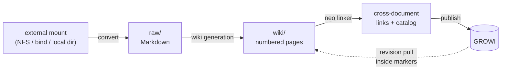

# llm-wiki-air

A self-contained document pipeline that turns a directory of source documents
(PDF, DOCX, PPTX, XLSX/XLSM, CSV, Markdown) into a cross-linked, LLM-rewritten
Markdown wiki and publishes it to [GROWI](https://growi.org) — with **no Git
repository anywhere in the loop**. Local state lives in plain files and SQLite
under `data/`, and GROWI itself is the collaborative editing surface.

The name "air" is the no-Git edition: `graph/` is copied from the upstream
factory allowlist, and `publisher/` plus `main.py` are the downstream pipeline.

## What it does



| Stage | Input | Output | Notes |
| --- | --- | --- | --- |
| **convert** | mounted source tree (`source_mount`) | `data/<target>/raw/*.md` | `.md` is copied as-is; other formats go through the external doc-parser service, `.xlsm` gets a static lineage pass first |
| **wiki** | one raw Markdown file | a folder of numbered pages + `_planning/` state | overlapping-window observation, seed-page planning, section-wise lossless rewriting; the model never decides what survives, Python does |
| **link** (neo/legacy) | the whole wiki batch | `<!-- llm-wiki-links -->` footers + SQLite catalog | chunks, metadata, embedding candidates, then per-page link decisions |
| **publish** | wiki tree | GROWI pages | only inside `<!-- chunk: ... -->` markers; links are rewritten to GROWI `/{pageId}` permalinks |

Everything runs through a single entry point, `main.py`. Each invocation
operates on exactly **one project** selected with `--project`, and every
project keeps its own data folder, linker catalog, and queue database, so
projects never touch each other's state.

## Read-only search service

[`growi-search/`](growi-search/README.md) is a separate, self-contained
**read-only** service: live GROWI keyword search, a reranker-augmented
retrieval pipeline, and a lead-agent + bounded subagent researcher with
streaming answers and citations. It has no local index, no graph, and no write
endpoints. See [`growi-search/README.md`](growi-search/README.md).

## Requirements and setup

- Python **3.13+** (see `pyproject.toml`; `uv.lock` is committed, `uv sync`
  creates `.venv/`)
- Reachable services on the company network: an OpenAI-compatible **chat**
  endpoint, an **embedding** endpoint, a **doc-parser** service (only needed
  for non-Markdown sources), and a **GROWI** instance with an API token

`.env` is committed in this repo and already points at those company endpoints,
so a fresh clone needs no setup beyond the virtualenv. `.env.example` exists
only as a list of variable names — edit `.env` itself when an endpoint moves.

```bash
uv sync            # creates .venv/
.venv/bin/python main.py check --project projectA   # ping every endpoint
```

Run every command in this file from `llm-wiki-air/`, using `.venv/bin/python`.
The defaults are `wiki` ingest mode with the `neo` linker.

### The doc-parser service runs somewhere else

This pipeline does **not** parse PDF/DOCX/PPTX/XLSX itself. The `doc-parser/`
directory in this repo holds that server's source — MinerU GPU conversion,
pandoc, headless LibreOffice media/vector conversion, and vision-model image
description — but in practice it is deployed on a **GPU host**, not here. The
only coupling is one URL: `WIKI_PARSER_BASE_URL`, which POSTs each original file
to `{base}/parse/llm-wiki` and reads back Markdown (`{base}/health` is what `check`
pings). Nothing is written to disk on the parser box, and nothing on the GPU
box knows about GROWI, the wiki, or the queue.

Consequences worth knowing:

- Set `WIKI_PARSER_BASE_URL` to the **remote** host; a Markdown-only project can
  leave it unset and never touches the parser.
- Parse calls are slow and long-lived, hence the 7200 s `parser_timeout`.
  `convert` prints a `waiting` heartbeat every 10 s under `-v`.
- The chat credentials from `.env`/INI are forwarded per request as
  `X-LLM-Base-URL` / `X-LLM-API-Key` / `X-LLM-Model` headers, so image
  description uses the same model this project is configured for.
- To run or modify the parser itself, see `doc-parser/README.md` and
  `doc-parser/SETUP.md`; it is an independent service with its own tests.

## Configuration

Two layers: a shared `.env` at the repo root, and one INI per project under
`configs/`. Later layers win:

```text
Settings defaults (graph/config.py)  ->  .env  ->  configs/<name>.ini  ->  CLI flags
```

Set `WIKI_CONCURRENCY` in `.env` to control planner, wiki/Excel generation,
ingestion, linker, and API-agent parallelism from one place.

## Structuring a project INI

Each source project is exactly one file under `configs/`, and the filename is
what `--project` selects — `configs/projectA.ini` is `--project projectA` (or
an absolute path to any `.ini`). A project file has two sections:

| Section | Required | Purpose |
| --- | --- | --- |
| `[project]` | yes | **structure**: where the sources are, where local state lives, where it publishes. These three keys are structural and must live here. |
| `[settings]` | no | **runtime overrides**: any `Settings` field name; beats `.env` for this project only. |

```ini
# configs/projectA.ini — the minimal complete project file
[project]
source_mount = /home/seigyo/mnt/projectA   # absolute; the mounted document tree
target_name  = Moove                       # one folder name: data/Moove/ + /Moove in GROWI
data_root    = data                        # absolute, or relative to the project root
growi_url    = http://10.160.152.235:3000/ # optional: beats GROWI_URL from .env
growi_token  = API Token:<token>           # optional: beats GROWI_TOKEN (prefix optional)
```

Rules enforced at load time (`graph/config.py::_project_paths`):

- `source_mount` must be **absolute** (the mount point itself, e.g. an NFS or
  `--bind` mount — see command 1). Sources stay there; nothing is copied into
  `data/`.
- `data_root` may be absolute or **relative to the project root** (the
  directory containing `main.py`, `README.md`, and `pyproject.toml`). It can
  still be overridden per invocation with `--data-root`.
- `target_name` must be a single folder name (no `/`, no `.`/`..`). It chooses
  **both** `data/<target_name>/` and the GROWI path prefix, so local tree and
  remote tree keep the same name.
- `growi_url` / `growi_token` here override `.env` for this project; omit them
  to use the global values. `API Token:` prefix is stripped automatically.

Then an optional `[settings]` section for per-project runtime overrides.
Values here take precedence over `.env`; omitted values continue to use `.env`:

```ini
[settings]
growi_url = http://growi.example:3000/
growi_token = API Token:<token>
growi_mode = attach
growi_timeout = 30
chat_base_url = http://llm.example:8000/v1
chat_api_key = local
chat_model = gemma-4-31B
embed_base_url = http://embed.example:8001/v1
rerank_base_url = http://rerank.example:8002/v1
parser_base_url = http://parser.example/agent/doc-parser/
parser_timeout = 7200
concurrency = 4
wiki_linker_enabled = true
wiki_linker_mode = neo
```

Any non-structural `Settings` field name can be overridden in `[settings]`;
values are type checked when the project is loaded. Keep `source_mount`,
`target_name`, and `data_root` under `[project]`. Unknown names fail immediately.

Each project writes to `data/<project>/{raw,metadata,wiki}`. Source files remain
in the external path; no `mount/` directory is created below `data/`.

Verify a project and its configured services:

```bash
.venv/bin/python main.py check --project projectA
```

An absolute INI path can be used instead of a name:

```bash
.venv/bin/python main.py check --project /srv/wiki/configs/smoke.ini
```

Relative paths outside `configs/` are rejected: pass only a config name or an
absolute INI path. One command invocation always operates on one project.

`--data-root /another/path` can be added before or after a command when an
isolated output tree is needed.

Service endpoints and tuning come from `.env` (`WIKI_CHAT_*`, `WIKI_EMBED_*`,
`WIKI_PARSER_BASE_URL`, `GROWI_URL`, `GROWI_TOKEN`, `WIKI_CONCURRENCY`, and
friends); `graph/config.py::Settings.from_env` is the authoritative list, and
the optional `[settings]` INI section overrides any of those fields per project.

## Project data layout

```
data/<target_name>/                 # e.g. data/Moove/
  raw/                              # converted Markdown, mirroring the mount tree
    <dir>/<stem>_<ext>.md           #   マニュアル/kdmパッケージ取扱説明書B改訂_pdf.md
  wiki/                             # generated pages, one folder per source
    <dir>/<stem>.<ext>/
      001-<slug>.md ...             #   numbered wiki pages
      _planning/                    #   manifest, coverage, links, linker state
  metadata/
    pipeline.json                   # publish ledger: source sha256 + per-doc/page
                                    #   publish state (the only record of what was pushed)
    convert.json                    # mount -> raw conversion log (size + mtime_ns)
    state/                          # per-document generation state (resume / repair)
    work/                           # scratch area for in-flight generations
    wiki-linker.sqlite              # linker catalog: chunks, metadata, edges
    watch-queue.sqlite              # watcher source tree + fast/slow job queue
    *.lock                          # flock files for pipeline / linker / worker
```

Source files always live in `source_mount`; nothing below `data/` mirrors them.
Deleting `data/<target_name>/` clears local generation and publish state without
touching GROWI (only `reset` removes GROWI pages).

## Commands

Quick map — the numbered sections below explain each command in detail:

| I want to … | Command |
| --- | --- |
| verify config and every service | `check` |
| redo only `mount -> raw` | `convert` |
| run the whole pipeline once | `sync` |
| rebuild wiki / re-link / both locally, publish nothing | `build wiki\|link\|all` |
| smoke-test one source end to end | `sync … "path/in/mount"` |
| keep a project continuously fresh | `watch`, or cron + `sync` |
| inspect or drive the queue by hand | `queue scan\|work\|status\|retry` |
| push the current wiki tree as it is | `publish` |
| refresh growi-search index pages | `index [<raw-rel>...]` |
| fix one document's links | `link relink <doc>` |
| remove this publisher's GROWI pages | `reset` |

### Refresh growi-search index pages

After any sync or publish, refresh the index pages read by growi-search
(`<document>/00-目次` per document plus `/<target>/00-目次`; `001-…` stays the first real page):

```bash
# publish per-document and root index pages
.venv/bin/python main.py -v index --project projectA
# dry run: write data/<target>/metadata/index/**/index.md only
.venv/bin/python main.py index --project projectA --no-publish
# remove the index pages
.venv/bin/python main.py index --project projectA --delete
```

### 1. Mount a source directory manually

If the selected project INI already points directly to the populated source
directory, no mount command is needed. To bind another local directory to the
configured path:

```bash
sudo mkdir -p /home/seigyo/mnt/projectA
sudo mount --bind /path/to/source /home/seigyo/mnt/projectA
findmnt --target /home/seigyo/mnt/projectA
```

Use the appropriate `mount` command instead of `--bind` for NFS, SMB, or a block
device. The configured directory must be readable by the process running the
pipeline.

### 2. Convert the mount to raw Markdown

This performs only `mount -> raw`; it does not build, link, or publish:

```bash
.venv/bin/python main.py -v convert --project projectA
```

Converted files are written below `data/Moove/raw/`. Non-Markdown documents
require `WIKI_PARSER_BASE_URL` in `.env`.

Macro-enabled `.xlsm` files are inspected statically before upload; macros are
never run and the original workbook is never rewritten. The watcher sends the
original file plus a sheet-lineage manifest. Workbook pages are ordered as all
`シート-*` pages first, then one `マクロ-*` code/reference page per VBA
procedure, then the `解説-*` pages. A sheet fits one page when it stays within
100 rows, 100 columns, and 100,000 rendered characters; otherwise it is split
into numbered parts. The explanation pages are not generated independently:
each parser-created sheet part is one indivisible observation unit, and those
units pass through whole-workbook planning, section planning, rewrite, and
validation stages equivalent to the PDF pipeline. Excel content is never split
again using the PDF pipeline's line-window size.
Their published provenance is the worksheet cell range (for example
`操作!A1:J100`), not parser Markdown line numbers. Formulas, cached values,
charts, images, hidden/intermediate roles, and lineage are retained. Other
files, including `.xlsm` files without VBA, use the unchanged parser path.

### 3. Run the manual end-to-end flow, including publish

Run the complete project once:

```bash
.venv/bin/python main.py -v sync --project projectA
```

This performs `mount -> raw -> wiki -> neo linker -> GROWI`. It does not require
step 2 because `sync` performs its own mount conversion.

### 4. Build wiki and linker output

Build all raw Markdown and then link the completed batch. Nothing is published:

```bash
.venv/bin/python main.py -v build --project projectA all
```

### 5. Build wiki only

Build all raw Markdown into wiki pages without running the linker or publishing:

```bash
.venv/bin/python main.py -v build --project projectA wiki
```

### 6. Build linker only

Link all pending wiki documents without rebuilding or publishing them:

```bash
.venv/bin/python main.py -v build --project projectA link
```

Use `--force` to relink documents already marked complete:

```bash
.venv/bin/python main.py -v build --project projectA link --force
```

### 7. Build specific targets

Build targets are paths relative to the project's `raw/` directory:

```bash
.venv/bin/python main.py -v build --project projectA all \
  "マニュアル/kdmパッケージ取扱説明書B改訂_pdf.md"

.venv/bin/python main.py -v build --project projectA wiki \
  "マニュアル/kdmパッケージ取扱説明書B改訂_pdf.md"

.venv/bin/python main.py -v build --project projectA link \
  "マニュアル/kdmパッケージ取扱説明書B改訂_pdf.md"
```

### 8. Run one mount target end to end for smoke testing

`sync` targets are paths relative to the configured mount:

```bash
.venv/bin/python main.py -v sync --project projectA --force \
  "マニュアル/kdmパッケージ取扱説明書B改訂.pdf"
```

This content-checks that source and then drains the durable project queue. If
other work is already queued for the project, it is completed in the same run.
The mount is rescanned after each batch, so changes made during a long batch are
queued before `sync` exits.

### 9. Watch one mount target for smoke testing

The watcher performs only a cheap `path + size + mtime_ns` scan every 10 seconds.
`--force` queues the target once at startup even when it is already up to date:

```bash
.venv/bin/python main.py -v watch --project projectA --interval 10 --force \
  "マニュアル/kdmパッケージ取扱説明書B改訂.pdf"
```

After that first pass, only new metadata changes are queued. Stop with Ctrl-C.
Use `--growi-interval 0` when the smoke test should not poll GROWI.

### 10. Watch a complete project

Run the persistent scanner and worker together:

```bash
.venv/bin/python main.py -v watch --project projectA --interval 10
```

The first scan starts from an empty metadata tree and queues every supported
source as one slow batch. The batch builds all wiki documents first, links them
together, and publishes only after both phases succeed. Later scans coalesce
adds and updates into the slow queue. Deletes use the fast queue and invalidate
an older queued or active operation for the same source.

The scanner keeps running in its own lightweight thread while a long build is
active. GROWI revisions are checked while the worker is idle every 300 seconds;
changed managed sections are pulled into local wiki state and marked pending for
the next linker batch. Set another interval with `--growi-interval SECONDS`, or
disable it with `--growi-interval 0`.

The persistent source tree and both queues live in
`data/<project>/metadata/watch-queue.sqlite`.

Pulled user edits are also copied into the generator's resumable page state. On
a later source update, untouched pages retain those edits; pages whose owned or
referenced source-line ranges changed are regenerated, so the source document
wins for overlapping changes.

### Run the watcher from cron

For a one-shot cron job, run `sync`. It performs a full content audit, retries
failed queue entries once, and drains the queue before exiting:

```cron
*/5 * * * * cd /absolute/path/to/llm-wiki-air && flock -n /tmp/llm-wiki-air-Moove-sync.lock .venv/bin/python main.py sync --project projectA >> data/Moove/metadata/sync.log 2>&1
```

Alternatively, cron can keep the long-running watcher alive; the watcher itself
performs the 10-second scans:

```cron
* * * * * cd /absolute/path/to/llm-wiki-air && flock -n /tmp/llm-wiki-air-Moove-watch.lock .venv/bin/python main.py watch --project projectA --interval 10 >> data/Moove/metadata/watch.log 2>&1
```

`flock` makes later cron invocations exit while the existing worker is alive. If
the worker exits, cron restarts it within one minute and returns interrupted
queue entries to pending state.

### Inspect and operate the queue manually

```bash
# One metadata-only scan; useful for testing the detector.
.venv/bin/python main.py queue scan --project projectA --settle 10

# Process one fast or slow batch, then exit.
.venv/bin/python main.py queue work --project projectA --once

# Run only the persistent worker (when a separate process runs queue scan).
.venv/bin/python main.py queue work --project projectA

# Inspect queued/running/failed operations and retry failures.
.venv/bin/python main.py queue status --project projectA
.venv/bin/python main.py queue retry --project projectA
```

Within a project, fast deletes always run before the next slow batch. Slow jobs
are FIFO and coalesced by mount-relative path; later edits replace older pending
edits instead of adding duplicates. Specific priority rules beyond fast-before-
slow are intentionally not assigned yet. A failed fast delete blocks slow work
until `queue retry` succeeds, preventing newer publication from passing an
unreconciled deletion.

## How each phase works

**Convert** (`graph/workspace/convert.py`). Cheap `size + mtime_ns` diff against
`metadata/convert.json`; supported extensions are `.md .docx .doc .pdf .pptx .xlsx
.xlsm .xls .csv` (`publisher/scanner.py`). Markdown files are copied; everything
else is POSTed to the doc-parser service unchanged. Word/Excel 97-2003 files are
converted by the parser service with LibreOffice; macros in `.xls` are not kept.
Removed sources delete their raw file.

**Wiki generation** (`graph/wiki/`). Deterministic partition plus section-wise
lossless rewriting: overlapping 250-line windows are described without
assigning ownership, planners compile one exact sequential seed partition, then
Python cuts each page into sections and the model rewrites one section at a
time — fences, tables and images are placeholder tokens the model must place,
and Python verifies identifiers and imported facts survived before a judge
call looks for semantic omissions. Every intermediate artifact is written
under the page's `_planning/` folder so a crashed run resumes instead of
restarting. `graph/formats/` adapts this per source kind (pdf, docx, pptx,
csv, xlsx/xlsm); XLSM gets the static lineage treatment described in step 2.

**Linker** (`graph/linker/`). One batch phase after the whole wiki is built.
Pages are chunked on H2 headings with one metadata call per chunk; candidates
are discovered by `legacy` (RRF over embeddings) or `neo` (deterministic
entity/behaviour discovery) and vetted by a per-page model call. Results are
stored in `metadata/wiki-linker.sqlite` and rendered into a managed
`llm-wiki-links` footer (plus inline see-also links) — pure footer rendering
and parsing lives in `render.py`, so relinking is idempotent.

**Publish** (`graph/growi/` + `publisher/`). Each generated page is wrapped in
`<!-- chunk: ... -->` markers before it is pushed. On write, only marked
sections owned by this publisher are replaced (`merge_marked_sections`), so
human text outside the markers on a GROWI page is never touched; `attach` mode
additionally refuses any write outside the project's GROWI path. Local links
are resolved before writing so published links are stable `/{pageId}`
permalinks, while the local tree keeps portable relative paths. The reverse
direction (GROWI revision check during `watch`) pulls edits made *inside* the
markers back into local wiki state.

## Code map (for agents)

Single entry point; every command is a thin `cmd_*` in `main.py` that imports
the real work lazily. `graph/` is the upstream factory copy and `doc-parser/`
is the source of the remote parse service — prefer changing `publisher/`,
`main.py`, configs, or prompts over editing either.

```text
main.py                      CLI: argument parsing + one cmd_* per subcommand;
                             also maps WIKI_CHAT_* env names onto Settings

doc-parser/                  separate service (FastAPI + MinerU/GPU, pandoc,
                             LibreOffice): its source lives here but it RUNS on
                             another host; reached only through
                             WIKI_PARSER_BASE_URL -> POST /parse/llm-wiki; it has its own
                             tests and is never imported by this pipeline

publisher/                   downstream no-Git pipeline (edit freely)
  pipeline.py                sync_once/build_raw/build_wiki_only/link_raw/
                             publish_only/reset_growi: one reconciliation pass,
                             per-source state machine (convert->wiki->link->publish)
  scanner.py                 content-addressed mount scan; SUPPORTED extensions
  queue.py                   persistent SQLite queue in metadata/watch-queue.sqlite:
                             scan / work_once / retry_failed / serve / worker_lock,
                             fast(delete) + slow(add/update) lanes, coalescing
  ledger.py                  metadata/pipeline.json: sources + published docs/pages

graph/                       upstream factory allowlist (avoid edits)
  config.py                  Settings: .env + configs/*.ini loading, validation;
                             app_concurrency(); field names = [settings] keys
  clients/                   OpenAI-compatible chat (`make_llm`, structured
                             JSON calls) and embedding client
  common/                    hashing, markdown sanitizers, async bridge, prompts
  formats/                   per-format page planning: pdf, docx, pptx, csv,
                             xlsx (+ workbook story), tabular tables, heading trees
  wiki/                      generation engine: pipeline.py (driver),
                             windows.py (overlapping observation), document_map.py
                             (seed plan), page.py (section split/check),
                             images.py, markdown_blocks.py, incremental.py (what a
                             source edit invalidates), storage.py (atomic IO),
                             prompts.py/schemas.py (versioned model contracts)
  linker/                    cross-doc linking: service.py (orchestration),
                             catalog.py (SQLite), chunks.py (H2 + metadata call),
                             legacy.py / neo.py (candidate discovery),
                             render.py (managed footer), prompts.py
  growi/                     client.py (REST v3, markers, attach/own path guard,
                             pull-side merge), publisher.py, paths.py
  workspace/                 project.py (Project paths: raw/wiki/metadata/state/
                             work, sqlite locations), convert.py (mount->raw),
                             parser_client.py (doc-parser HTTP), writer.py
                             (build/publish glue, wiki_up_to_date), xlsm.py
                             (static VBA/sheet lineage, macros never executed)

tests/                       stdlib unittest, no network: `python -m unittest
                             discover -s tests` (see Tests below)
data/<target>/               runtime state; git-ignored, safe to delete
configs/<name>.ini           one project per file
```

Good places to start for common changes: a new source type →
`publisher/scanner.py` (SUPPORTED) + `graph/formats/`; a behavior change to
published output → `graph/growi/publisher.py` (markers/link wrapping) and
`graph/linker/render.py` (footers); queue scheduling →
`publisher/queue.py`; CLI flags → `main.py::build_parser`.

## Other operations

```bash
.venv/bin/python main.py link --project projectA status
.venv/bin/python main.py link --project projectA relink \
  "マニュアル/kdmパッケージ取扱説明書B改訂.pdf"
.venv/bin/python main.py link --project projectA rebuild --mode neo
.venv/bin/python main.py publish --project projectA
.venv/bin/python main.py reset --project projectA
.venv/bin/python main.py -h
```

`reset` deletes only GROWI pages carrying this publisher's markers. Unmanaged
GROWI content is preserved.

## Tests

The suite is stdlib `unittest`, offline, and fast (~1 s):

```bash
.venv/bin/python -m unittest discover -s tests -q
```

- `test_pipeline_scope.py` — project selection, sync/build/queue scoping, ledger
- `test_xlsm_preprocessing.py` — static XLSM lineage and page ordering
- `test_wiki_reference_context.py` — wiki reference-selection prompts/contexts
- `test_growi_images.py`, `test_model_thinking.py` — GROWI image handling,
  chat-model thinking options

## Notes

Publishing resolves local pages before writing links, so generated links use
stable GROWI `/{pageId}` permalinks while local Markdown keeps portable relative
paths. GROWI edits inside publisher markers are pulled into unchanged local wiki
pages; simultaneous local and remote edits fail as conflicts.

Local generation and linking failures never start publishing. A source event
that changes while its batch is running cancels that batch at the next phase
boundary and prevents its publish step. GROWI itself has no multi-page
transaction, so a network failure during GROWI's page-by-page API writes can
still leave a partial remote publish; retry the failed queue item after fixing
the connection.

`graph/` is copied from the upstream factory allowlist. `publisher/` and
`main.py` contain the downstream no-Git pipeline. `data/` is runtime state and
is ignored by Git.
