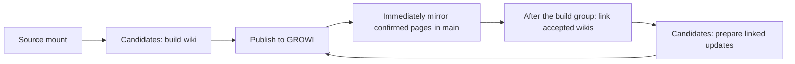

# Weekend fallback, skipping failures, and one final retry

This report has two implementation parts. **Now** is the conservative weekend behavior: parser fallback, document isolation, separate wiki/linker passes, failure logs, and one retry pass at the end of each pass. **Later** contains the remaining published-versus-pending storage refinements and speed improvements.

The Now part is the default behavior of `python main.py --project <project> sync`. It builds and accepts the base wiki for one source at a time without publishing it, skips failures, and retries those failures once. After every build has had its final attempt, it links the successful wikis, again skipping failures and retrying them once at the end, then publishes linker-complete documents. Use `--no-isolated`, `sync_isolated = false`, or `WIKI_SYNC_ISOLATED=0` only when the legacy batch behavior is specifically needed. Configure the optional parser with `parser_fallback_base_url = ...` or `WIKI_PARSER_FALLBACK_BASE_URL`. The fallback endpoint remains empty by default, and watch keeps its existing behavior. Cross-document concurrency remains deferred.

The goal for the weekend is to let healthy documents finish while failures remain visible and recoverable. No implementation can guarantee that a corrupt document or unavailable external service will succeed. The behavior we can make explicit and test is: a document-specific failure does not discard other accepted work, does not loop forever, and is reported accurately.

# Now

## 1. The smallest useful weekend scope

The isolated flow has two explicit passes:

**Build pass: extract one document → build and accept its local wiki with linking pending. No GROWI write occurs.**

**Linker pass: link one pending document in a candidate → accept it → publish that document and affected peers.**

A move and any content update belonging to the same document remain together. Linking starts only after the builder queue and its retry pass finish; each linker document uses its own candidate so a failure cannot damage the accepted base wiki. Existing revision checks, human-edit handling, and publication recovery stay in place.

The implemented weekend mode includes:

- An optional compatible fallback parser.
- One first attempt at each document, with failures deferred rather than retried immediately.
- One final retry pass over those failures after the first pass finishes.
- Independent outcomes and logs for each document.
- A loop that continues after ordinary document failures.
- Correct checks before accepting success or reusing extracted text.
- Recovery before cleanup whenever a previous publication is unsettled.

Parallel document workers, larger batches in one model request, and changes to link-selection logic belong in Later.

This behavior applies to `sync` by default. The `build` and `watch` commands keep their existing behavior, and `sync --no-isolated` remains available for an intentional legacy batch run.

## 2. Why fallback by itself is insufficient

The existing document-building loop already retries a failed document once at the end of that loop.

However, the later stages still decide success for the whole claimed group. One final document failure can prevent the group's linking/publication, mark every claimed job failed, and stop the main sync loop.

Adding another parser endpoint without changing that grouping would leave the weekend problem in place.

The conservative solution is to give the wiki builder one source job at a time. If B fails, B's operation is failed. A's already accepted operation stays accepted, and C can run next. Once the build retry pass ends, pending link work follows the same continue-then-retry rule.

Keep the existing all-or-nothing protection inside each operation. Do not remove a failure condition and then accept a candidate that contains unfinished output.

This approach avoids introducing successful and failed new source versions into the same candidate acceptance. It also avoids the early-publication records and smaller page-by-page recovery required in Later.

There is a cost: linking sees the accepted collection as it grows, so separate operations may revisit peer pages more often than a single successful large batch. Each model task stays the same size, but total link calls or elapsed time can increase. This is a tradeoff for isolation, not a measured speed improvement. The linker algorithm stays the same; the timing and available collection differ.

If preserving one final whole-collection linking pass is required even for this first patch, that is a larger change. It requires building and safely separating successful outputs from failed candidate state. I would not quietly include that redesign in a weekend fallback patch.

## 3. Exact first-pass and final-retry behavior

The weekend mode uses this bounded policy:

| Stage | What happens |
| --- | --- |
| First pass, primary parser | Try the primary endpoint once. |
| Primary extraction fails or returns rejected output | Try the configured fallback once. If there is no fallback, this document's attempt fails. |
| A usable extraction is available | Continue with the existing wiki-writing, linking, and publication stages. |
| Any ordinary document stage fails | Save its logs and mark its exact work version failed. Continue with the next document. |
| First pass finishes | Collect the failed documents from this run that are still relevant. |
| Final retry pass | Give each collected document one more attempt, including primary and optional fallback when extraction is still required. |
| Second attempt succeeds | Accept it normally and remove its failed result from the final unresolved list. Keep the earlier logs as history. |
| Second attempt fails | Leave it failed for the next sync. Do not run a third pass. |

This proposal replaces the earlier report's two immediate primary retries. The latest request is fallback plus one retry at the end. That is one primary attempt and at most one fallback attempt per document attempt.

For a document that fails extraction both times, the maximum is two primary calls and two fallback calls across the whole run. A missing or duplicate fallback endpoint does not create an extra independent parser attempt.

Do not stack this final pass on top of the existing automatic whole-document retry inside the build loop. There must be one owner of document retry scheduling. Existing bounded repairs inside an individual LLM task can remain; they are part of the current writer, not another document pass.

For example:

| Order | Result |
| --- | --- |
| A runs. | Extract, build, link, publish, and accept A. |
| B runs. | Primary and fallback fail. Log B and defer it. |
| C runs. | Complete and accept C. |
| D runs. | Writing fails. Log D and defer it. |
| First pass ends. | A and C are accepted. B and D remain failed. |
| B gets its final retry. | If it succeeds, accept B; otherwise retain the failure. |
| D gets its final retry. | If it succeeds, accept D; otherwise retain the failure. |
| Run ends. | Report final accepted and unresolved documents, plus log locations. |

The final retry is after the normal first-pass queue has drained. An ordinary sync uses the current sources; an endlessly changing mount can keep creating normal work. For a predictable weekend finish, use a stable selected input set. Do not introduce a brand-new snapshot scheduler just for this patch.

Retries must respect the selected project and source paths. A broad “retry all failed jobs” call must not revive unrelated work outside the requested selection.

Before the final retry, check the current queued version again. If a newer source version is already queued, handle that version rather than resurrecting an older failed snapshot. If the latest version has already succeeded, remove the outdated failure from the unresolved result. A rename or deletion must also replace the old retry target with the correct identity/path operation.

## 4. What skip must mean

Skipping means “this attempt failed; retain its evidence and continue eligible work.” It does not mean deleting the job, pretending it succeeded, or treating incomplete candidate content as accepted.

For an existing document:

- Before publication, main retains the previous accepted source, extracted text, wiki, and metadata.
- If the attempt fails before remote writes, its unfinished work stays outside main.
- If remote writes partly happened, settle or restore them through the existing recovery path before continuing publication.
- A failure must not undo an earlier successful document operation.

For a new document, failed generation creates no accepted wiki. Save what went wrong in the independent logs folder.

A failed deletion must not automatically hold all unrelated additions and updates behind it. Keep the old pages if deletion did not succeed, keep the failed delete for retry, and allow unrelated work once recovery is settled. Dependent work for the same identity still waits.

Keep the active linking scope tied to the current source job and the peer updates it requires. Do not drag every unrelated pending candidate into each isolated operation. Previously unfinished work must remain visible in its own queue or recovery record.

If a peer page cannot safely be updated, the current operation may fail. Do not bypass that page's ownership or revision check to force a successful result.

## 5. Parser fallback without changing document meaning

The fallback should use the same stable source copy as the primary attempt. It must return the same kind of information the current writer expects: extracted text, images, and any page/spreadsheet structure required by that format.

Keep the current parser profile. Switching to a generic text extraction route could silently remove image or spreadsheet information.

Validate the primary result and the fallback result equally. Invalid responses, missing or unusable text, unsupported-format responses, timeouts, and extraction rejected by the current size checks can trigger fallback.

Reopen the source for each upload so the fallback receives the complete document, not an already-consumed stream.

A parser response must not be accepted just because some non-text value can be converted into a string. Preserve current valid format handling and reject unusable output rather than generating a misleading wiki from it.

A source change, human-edit conflict, or cancellation is not a reason to try a different parser. Handle those through the existing source/version and revision protections.

Some failures happen during local spreadsheet preparation or image-description calls. Report the actual stage. Another extraction endpoint does not automatically repair a broken local workbook or an unavailable image model. Avoid blindly uploading the document again for a downstream image-description failure.

Markdown should keep its direct local-reading path. Do not expand the accepted file-extension list without a real supported format and a checked output path.

The fallback setting is optional and empty by default. Add it through the existing configuration loading so it works from a project configuration and environment consistently. A configured endpoint still needs to be checked for compatibility before the weekend run.

### Check the waiting budget before leaving it unattended

The current parser read-timeout default is two hours per call. One primary call plus fallback could spend roughly four hours waiting; repeating that during the final retry could spend roughly eight hours on one document, before writing/linking time is counted.

Bounded retries alone are therefore insufficient for a predictable weekend run. Review the actual configured parser and model timeouts. Choose generous but finite values using representative large documents; do not guess a short timeout that would fail valid files. Show elapsed time and the active stage in the logs so a slow attempt is distinguishable from a stopped process.

### Do not mistake older extracted text for a new successful extraction

The current records can store a newer source's attempted version after failure while older extracted text still exists. A later resume can then treat the older text as reusable for the newer document.

Record the source version that actually produced a successful, validated extraction separately from the attempted source version. Only reuse text when that successful version matches.

If the record is ambiguous, extract again. Do not invent proof that a failed attempt succeeded.

For the smallest weekend implementation, use a fresh candidate based on current accepted main for the final retry. Reusing work from a failed candidate after other documents advance main needs additional checks. Advanced reuse across those candidates belongs in Later.

This may repeat some valid work for a failed document, but it avoids copying an older whole project over newer accepted successes. It does not increase the reasoning assigned to any individual LLM call.

## 6. Necessary safety fixes around the existing operation

These are directly related to making skip/retry truthful. They should not be hidden under the phrase “just continue.”

| Existing issue | Required weekend behavior |
| --- | --- |
| Candidate cleanup can hide the original exception. | Preserve and report the original failure. Keeping a candidate must not suppress the error. |
| Success is checked against missing claimed paths after acceptance. | Verify that the selected source job really completed before accepting its candidate. A generation result alone is not proof of publication. |
| Cleanup can happen before an interrupted publication is examined. | Recover first. Preserve candidate evidence for uncertain remote writes until recovery is settled, even without a continue flag. |
| The scanner can silently miss read failures. | Log those paths. Do not call them successful or absent; retry discovery once during the final pass when possible. |
| An unreadable path can look like a removed source. | Keep its accepted output. Do not enqueue deletion because a read/stat or directory scan failed. If scanning is incomplete, hold uncertain deletion decisions. |
| A failed fast-lane delete can block all slow-lane work. | Allow unrelated ready work after the failed operation is safely settled. Preserve dependencies for the affected document. |
| A newer source request can arrive during an older attempt. | Finish only the exact job version that was handled. Do not delete or clear a newer request. |
| A recovered or continued candidate may contain an older multi-document operation. | Recover its original scope first. Do not reinterpret it as a fresh one-document candidate. |

An exact-path collision, broken shared journal, or unavailable project directory is different from a bad document format. If the system cannot safely identify or accept work, report the shared problem clearly rather than guessing.

If the publication was partly submitted and recovery cannot determine or restore its safe state, further publication must wait. Continuing remote writes through unresolved recovery would risk the project. Ordinary document errors should continue; unresolved shared publication state must not be disguised as an ordinary skip.

Keyboard interruption and genuine cancellation remain cancellation. They should not trigger a hidden final retry or a success report.

## 7. Logs and the final result

Save failures outside candidates:

**`logs/sync/<project>/<run>/<document-id>/`**

For each failed attempt, record:

- The source path and stable document identity.
- The source version being attempted.
- Whether this was the first pass or the final retry.
- The failed stage and full error details.
- Which parser endpoints were attempted and their timings.
- Relevant failed responses or validation evidence.
- Whether any remote write happened and whether recovery settled it.
- What remains accepted and what needs another sync.

Keep different source paths separate even if their filenames match. Save evidence before retry cleanup removes it. Keep credentials out of summaries.

The queue remains the authority for pending work. Logs explain the failures; they are not a second work queue.

The final report should distinguish:

- Accepted documents.
- Documents recovered successfully on the final retry.
- Unresolved document failures and their log paths.
- Any cancellation or shared recovery problem.
- Index failures that need another reconciliation.

A first-pass error recovered by the final retry should not remain counted as an unresolved failure. Conversely, “all eligible documents were attempted” does not mean “every document succeeded.”

Keep failed final attempts in failed state until the next sync. Do not requeue them on every scan. On a later sync they can receive a new bounded first pass and final retry.

Indexes should still be reconciled for accepted content after partial success. An index failure should be reported without rolling back already accepted document content.

## 8. Keep the weekend diff contained

Use the current stages and storage. Avoid new publication states, new prompts, and new concurrent workers in this patch.

| Existing area | Weekend change |
| --- | --- |
| main.py | Own the first pass and one final retry pass; continue after settled document failures; report the final unresolved result accurately. |
| publisher/queue.py | Offer isolated source-job claims for this sync mode; check completion before acceptance; keep exact-version completion; avoid unrelated failed-job gates; recover before candidate cleanup. |
| publisher/pipeline.py | Allow one document attempt per pass; distinguish successful extraction from attempted extraction; keep linking/publication scoped to the current job and required peer updates. |
| graph/workspace/parser_client.py and graph/config.py | Add optional compatible fallback and shared extraction validation without changing successful output handling. |
| publisher/history.py | Fix hidden exceptions while preserving the existing full-operation acceptance and recovery model. |
| publisher/scanner.py and the queue's source discovery | Record unreadable paths and prevent uncertain deletion. |
| A small failure-log helper | Store per-document, per-attempt evidence outside candidates. |
| Existing progress/index coordination and focused tests | Show honest outcomes, retain indexes for accepted work, and verify the behavior above. |

The queue's existing job identity/version and prepared/confirmed publication evidence can be reused. The normal writer and linker should not need an algorithm change for this mode.

Some orchestration changes are unavoidable. Fallback is a small parser/configuration change. Useful skip-and-retry also needs the queue and sync loop because their current batch-wide decisions otherwise block healthy documents.

## 9. Verification completed for the weekend launch

The implementation now has focused offline failure tests and a live rehearsal against `configs/diff_test.ini`. The checklist below remains the acceptance contract; the directly exercised items are described after it.

Use controlled parser/model/GROWI responses to demonstrate:

1. A succeeds, B fails, C succeeds. A and C remain accepted; B is attempted once more only after the first pass.
2. A parser failure calls the compatible fallback once. A successful primary call does not call fallback.
3. Missing or failed fallback does not stop C.
4. A failed document gets at most two attempts, with no extra inner whole-document retry. A successful first attempt gets no second attempt.
5. Final-retry success clears the unresolved result; final-retry failure remains queued for a later sync.
6. A failed newer extraction cannot reuse older raw text.
7. Failed generation cannot publish or promote its unfinished candidate.
8. A missing completion result is rejected before promotion.
9. A partly submitted publication is safely settled before unrelated publication continues.
10. Restart during an uncertain write preserves recovery evidence, including without a continue flag.
11. A failed delete does not block unrelated healthy work after recovery.
12. Unreadable files or incomplete scanning cannot cause accidental remote deletion.
13. Human edits and ownership checks are preserved for the source document and affected peers.
14. A newer job version survives completion/failure of the older attempt.
15. Selected-path scope applies to the first pass and final retry.
16. Failed logs survive cleanup, and the final index reconciliation includes accepted content.

Then check the actual fallback service's output on representative weekend formats. Include a deliberately failing document in a controlled rehearsal so “skip and retry” is exercised, rather than checking only successful examples. Use a designated disposable project for remote rehearsal.

Use a stable source set and the existing model concurrency for the first weekend run. Do not combine reliability changes with unmeasured GPU tuning.

### Test results from the implementation

The 18 new focused tests pass. They cover primary/fallback routing and validation, complete stream reuse, skip-and-continue ordering, one final retry, permanent failure retention, failed writes and deletes, selected-path isolation, unreadable mount entries, exact job versions, accepted-state preservation, interrupted-publication recovery, and rejection of incomplete publication evidence.

I also ran full test discovery before and after the implementation. Before the change, the repository had 281 tests with 12 failures, 5 errors, and 27 skips. After adding the 18 new tests, it had 299 tests with the same 12 failures, 5 errors, and 27 skips. In other words, all 18 new tests passed and the existing failure/error count did not increase.

The existing errors include unavailable external spreadsheet-lineage fixtures and older test fixtures that lack current publication arguments or required revision evidence. Other existing failures include a missing local `diff_test_local.ini`, a move fixture missing a current publisher method, and linker call-count/affected-page expectations.

Some are clearly mismatches between tests and current interfaces or behavior. The linker-scope differences still need explanation; they must not be assumed harmless just because they predate this proposed patch.

Do not weaken production revision or human-edit checks to make old fixtures pass. Correct an outdated expectation only after checking the current intended behavior. Any genuine failure affecting the proposed weekend path needs fixing and verification before treating the change as ready.

The live `diff_test` rehearsal started from 11 accepted sources, 11 published documents, 38 published pages, an empty queue, no unfinished transaction, and a remotely complete publication. It then completed all of these checks:

1. Moved the smallest accepted source, `registry.csv`, to a recoverable backup and synced its deletion. Its owned publication was deleted while the other ten documents remained unchanged.
2. Restored the exact original bytes and rebuilt, linked, published, and accepted the document successfully.
3. Added two copies. An injected first-pass parser failure for `weekend-fail.csv` was logged and skipped; `weekend-healthy.csv` then completed and published. Only after the first pass drained did `weekend-fail.csv` run again and succeed. The observed parse order was fail, healthy, fail-retry.
4. Added another copy with an unreachable primary parser and the configured real parser as fallback. The primary failed once, the fallback received the source and returned valid markdown, and the existing writer/linker/publication path completed. No final document retry was needed.
5. Removed all three temporary sources through isolated sync. Their temporary GROWI publications were deleted, the original mount was restored, and the failure log was retained under `logs/sync/diff_test/`.

The final check found the original 11 sources and 11 documents, an empty queue, no unfinished transaction, and a remotely complete publication. The rebuilt `registry.csv` produced four pages in this run, so the final page count is 40 rather than the initial 38; this is normal model-generated output from rebuilding the deleted test document, not leftover temporary pages.

The live fallback used the current real parser as the compatible fallback target. A future separate fallback service still needs the same profile and representative-format compatibility check before being used for an unattended run. No implementation can promise that every document or external service will succeed; this implementation makes those failures bounded, isolated, recoverable, and visible.

The concrete weekend contract is: healthy work continues after a safely settled document failure, one final retry is bounded, accepted content survives, and unresolved failures are visible. A green, explained test baseline plus the new failure-path checks is the basis for readiness.

# Later

Everything below is deferred from the weekend patch. It covers publishing base wikis before linking, making main reflect each confirmed remote page immediately, resuming published-but-unlinked work, and adding document concurrency.

The central rule for this phase remains: **main reflects confirmed GROWI content; candidates contain proposals.** New publication states and page-by-page acceptance/recovery must be implemented together.

## The places information should live

Keep the existing directory layout. Change what is allowed to move between these places.

The paths below assume the normal data folder. A different configured data location should use the same arrangement.

| Place | Its purpose | What belongs there |
| --- | --- | --- |
| Source mount | The documents people want processed. | Current source files. They can change while sync is running. |
| `data/.<project>-candidates/<operation>/<project>/` | Work in progress. | A stable source copy for the attempt, extracted text, unfinished or ready wiki pages, proposed links, and reusable intermediate work. |
| `data/<project>/` | The accepted project and its GROWI mirror. | Confirmed visible pages, accepted source history, and records that distinguish published work from pending work. |
| `logs/sync/<project>/<run>/<document-id>/` | The explanation of a failure. The stable document id is stored in the JSON beside the original source path. | Error details and relevant failed-attempt evidence. These survive candidate cleanup. |

The queue is the checklist of work still to do. Metadata means the supporting records about sources, pages, and progress. The queue lives in the main project's metadata. That is fine: it describes requested future work, rather than pretending that future work is already published.

### Inside the main project folder

| Existing location | What it should mean after this change |
| --- | --- |
| `wiki/` | The currently verified GROWI page collection, in the project's local Markdown representation. Never replace it with an unpublished proposal. |
| `sources/` | Source copies behind the fully accepted generated versions. A failed attempt on a newer source must not replace an older accepted source. |
| `raw/` | Successfully extracted text behind those accepted versions. A newer successful extraction can stay in candidates until its base wiki publication is accepted. |
| `metadata/state/` | Accepted writing progress and the original machine-generated pages needed to understand later human edits. |
| `metadata/human-sync/` | Exact remote page snapshots, human edits, and the earlier versions those edits were made against. |
| `metadata/pipeline.json` | Which source and pages have been accepted, which revisions are known, and whether a document's publication is complete or partial. |
| `wiki/<document>/_planning/linker.json` | Whether linking for the current published version is pending, partly published, complete, or disabled. |
| Other files under `_planning/` | Accepted page structure and link information. Proposed choices must stay distinguishable from visible, confirmed links. |
| `metadata/watch-queue.sqlite` | What needs to happen next, which attempt failed, and any publication that needs recovery. |
| `metadata/wiki-linker.sqlite` | A lookup collection built from accepted wiki information. It must not silently include unfinished candidate pages as accepted inputs. |
| `metadata/index/` | Records and copies corresponding to confirmed index publications. An unpublished replacement index belongs in working storage. |

If a document has several pages and publication succeeds for only some of them, wiki/ must reflect that actual mixture. The document's records must say “partly published.” Its old fully accepted source history remains separate from the newer unfinished attempt.

The main folder is therefore allowed to contain pending-work records. It must not contain pending page content presented as the current live page.

### Three copies of a page have different jobs

There are three useful versions to keep apart:

- **The original generated page:** what the writer produced before human changes and generated cross-document links.
- **The visible page:** what people currently see, including accepted human changes and published links.
- **The exact GROWI snapshot:** the remote page body and revision used to verify the visible copy.

GROWI publication changes some details, such as page links, image references, and ownership markers. The local Markdown may therefore look different while representing the same visible page. Keep the exact remote snapshot as well, so “matches GROWI” can be checked precisely.

A revision is GROWI's identifier for a saved page version. Remembering it lets the publisher check whether someone has changed the page since it was inspected.

A human edit should update the visible mirror and human-edit records. It should not overwrite the original generated page. That original is needed to understand what the human changed when the source is rebuilt later.

“Accurate mirror” means the page collection, paths, content, image references, and known revisions match the last verified remote state. Human edits made between checks become known at the next remote check; the report does not assume the local folder can see an edit before it is detected.

If the project boundary contains human-created pages too, an accurate whole-project mirror needs to include them. Mark them as human-owned. Reading and mirroring them must not give the bot permission to regenerate, delete, or adopt them. This is an additional inventory requirement if the current sync only knows its generated pages.

## The new journey through sync

At the start, settle any interrupted publication and refresh the known source and GROWI state. Then choose each document's next required stage.

Where this report says “reconcile,” it means compare the source, generated page, and human edits, then prepare an update that preserves the human's changes. If those changes cannot be combined safely, keep the live page and postpone that document.

The information moves like this:

For documents that need a new wiki:

1. Copy the source into a candidate so the attempt works from a stable version.
2. Extract the content using the bounded parser/fallback policy established in Now.
3. Build the wiki using the existing writing logic.
4. Keep all unfinished results in candidates.
5. When the full base wiki is ready, check that the source and relevant human edits still match the attempt.
6. Publish that document to GROWI immediately.
7. As each remote page write is confirmed, update its main-folder mirror and records.
8. Once the complete document publication is confirmed, accept its matching source, extracted text, and writing history into main.
9. Keep linking marked as pending.

“Base wiki” means a finished wiki whose cross-document linking stage has not yet been completed. It is useful published content, not a half-written page.

For example:

| Event | GROWI and main | Candidates and queue |
| --- | --- | --- |
| A finishes its wiki while C is still building. | A is published and mirrored immediately. A says “wiki published; linking pending.” | C continues building. A retains a linking task. |
| B fails parsing, including fallback. | B's old published wiki stays visible, if one exists. | B's attempt is failed and logged. A and C continue. |
| C finishes. | C is published and mirrored immediately. | C now has a linking task. |
| The selected build group has finished or failed. | Successful base wikis are already live. | Linking can begin against accepted wiki content. |
| A linked page is ready. | Publish that page and immediately mirror its confirmed version. | Other linking work continues. |
| The run finishes. | All confirmed successes remain accepted. | Failed or unfinished stages remain discoverable for the next sync. |

Use a fixed group of selected builds as the boundary before linking. New source events can form the next group, so a busy mount does not postpone every link forever. A new event for a particular document still makes that document's old pending links outdated: its new build takes priority.

Previously accepted wikis can remain part of the link collection even when their newer source attempts fail. The linker must use the accepted older wiki, not the failed new candidate.

### Keep the link decisions the same; deliver their results sooner

The linker currently first works out relationships across the documents. It then chooses and renders links for the affected pages. Even though several page decisions can run together, it waits for all of them before writing the rendered pages.

Keep the relationship-building pass over the accepted collection. Isolate failed document decisions before proceeding. Then keep the existing parallel page decisions, but take each completed page result as it arrives, prepare its full linked body in candidates, publish it, and mirror it immediately.

This avoids rerunning the whole linking process after every base publication. That could repeatedly reconsider the same peer page and change the decision process. The proposed change keeps the batch decisions while removing the wait for every page result before publication.

A document's linking is complete only when all remote updates required for its current version are confirmed, including affected peer pages. Completing the calculation alone does not finish it. If one page decision or update fails, preserve completed updates and record which work remains.

## What moves into main, and exactly when

### After a base wiki is published

Immediately copy the confirmed pages and update their page records. Do not wait for the linker or other documents.

When all required page writes and cleanup for that base wiki are confirmed, accept the rest of the matching document package:

- The source copy and its identity.
- The successful extracted text.
- The writing history and original generated pages.
- The human changes used in the published result.
- The published page list and their GROWI revisions.
- The record saying “wiki published.”
- The record saying “linking pending for this published version.”

The queue advances from building/publishing to linking. It is not simply deleted because generation finished.

### After a linked update is published

Copy only the confirmed updated page and its matching link information, human-edit evidence, and revision.

Do not replace source copies or extracted text for a linking-only update. They have not changed.

Linking A can also change a page in C. Such another document is called a peer below. If that happens, publish and mirror the affected page in C as its own confirmed update. C's record must describe the actual change too.

Do not copy a whole candidate project or its whole link database just because one page succeeded. It can contain unrelated unfinished work or an older copy of another document.

### After a deletion or move

Remove a page from main only after its removal on GROWI is confirmed. Until then, main must retain the page that is still live.

Likewise, reflect a moved remote path only when that move is confirmed. Preserve the document's identity so a rename does not become an unrelated new document.

The same rules apply to index pages. Update the index promptly for published base wikis, without requiring linking to finish. If its update fails, retain the old confirmed index and retry that index separately. Do not undo the document publication.

## What the records need to remember

Use the existing publication records, linker record, queue, and recovery records. Extend them rather than introducing a separate competing tracking system.

The exact field names can be chosen during implementation. Their meaning matters more than their spelling.

| Record | Questions it must answer | Where it belongs |
| --- | --- | --- |
| Accepted source | Which source version produced the fully accepted wiki? Which version was successfully extracted? | Main source records and accepted source/raw files. |
| Document publication | Is its wiki unpublished, partly published, or fully published? Which source version does the complete published wiki represent? | Main publication metadata. |
| Published page | What is its remote identity, path, visible content, and last verified revision? Is it bot-owned or human-owned? | Main page metadata and remote snapshots. |
| Human-edit history | What did the human change, and against which original generated version? | Main human-edit storage; candidate proposals stay separate. |
| Linking progress | Which published page version needs linking? Which version finished? Which required updates remain? | Main linker record, with pending work in the queue. |
| Next work | Should this document build, publish a ready wiki, link, publish ready linked pages, move, delete, or wait for a conflict to be resolved? | Main work queue. |
| Interrupted publication | What was about to be written? What definitely reached GROWI? What still needs copying into main? | Durable recovery records. |
| Failure | Which document and stage failed, and where are the detailed logs? | Queue/outcome summary plus the independent logs folder. |

A published source version and the newest requested source version are different facts. If version 1 is live and version 2 fails, the records must continue saying version 1 is live, with version 2 awaiting another attempt.

Similarly, “linker finished calculating” and “linked pages are confirmed live” are different facts. Only the second completes the linking task.

### Example: published wiki, unfinished links

Immediately after A's base publication, the main records should read in ordinary terms:

- A's wiki is published.
- It was built from source version 1.
- These are its confirmed pages and remote revisions.
- Linking is pending for this visible wiki version.
- The next queued task is linking.

On the next sync, unchanged source and unchanged human content mean A starts at linking. It does not parse or write its wiki again.

If its source changes, the queued task becomes rebuilding the new version before linking. If a human changes the wiki, reconcile that change before linking. The live mirror remains truthful throughout.

### What makes a pending link result reusable?

Its source must still be appropriate, its effective page content must still match, and its page identities and paths must still be valid. Relevant linker settings and accepted peer pages also matter.

A human edit can change the link input without changing the source document. A peer rename can invalidate a link destination without changing this document.

Generated link footers themselves should not count as new source content that triggers endless relinking. Compare the page content used to decide links separately from the link decoration added afterward.

## Publishing and mirroring must be one coordinated action

A remote write and a local copy cannot happen at exactly the same instant. A small durable record must cover the gap.

For each page publication:

1. Prepare the proposed page in candidates.
2. Check the latest source and remote revision. Preserve or reconcile human changes before writing.
3. Save what is about to be published and which page it affects.
4. Write the page to GROWI.
5. Record the confirmed remote result, including any changed links or image references.
6. Immediately copy that confirmed result into the main mirror and update its matching records.
7. Save an accepted recovery point before continuing with the next publication.

The publication owner must not move on as if a page were synchronized while its confirmed remote version has not been mirrored locally.

This owner is the one place allowed to accept published changes into main. Parallel build workers can prepare results, but should not independently replace shared project records.

### A multi-page document partly publishes

Suppose A has five pages. Three reach GROWI and the fourth fails.

Main must show the three confirmed new pages and the old remaining pages that are still on GROWI. A is marked partly published. Its new complete writing package stays in candidates, and the queue remembers the remaining writes and cleanup.

For each confirmed new page, also save its matching original generated ancestor and publication evidence in main's human-edit history. A human may edit that page before the rest of the document finishes. Keeping its true ancestor makes that edit understandable even while the complete source/writing package is still awaiting acceptance.

The usual recovery is to inspect uncertain writes and finish the remaining publication, provided its inputs are still valid. Do not roll back other successful documents. If a specific operation requires restoring a page, that restoration is another confirmed remote change and must be mirrored too.

Do not link the unfinished new document version. Complete or reconcile its base publication first.

### GROWI succeeded, but the process stopped before the local copy

On restart, recover this confirmed publication before starting new publishing. Fetch or verify the remote result, finish the main copy, and update the records.

Never discard this candidate or recovery evidence merely because the user did not pass “--continue.”

If the local mirror cannot be repaired because shared storage is unavailable, further publication must wait. Otherwise each new remote change would widen the known mismatch. A document-specific failure should still leave unrelated work eligible once the shared publication path is usable.

### A timeout leaves success uncertain

Do not assume the write failed and blindly repeat it. Inspect GROWI using the saved proposed write and known revisions.

If the write landed, mirror it. If it did not, retry when safe. If someone edited it afterward, capture that newer human version and reconcile it.

### Another document finishes while an older candidate is still building

Suppose A and C started from the same accepted project. A publishes first.

C's candidate still contains an older copy of A. When C finishes, accept only C's valid results against the latest main project. Never replace all of main with C's old working copy, which would lose A's publication.

This rule is necessary even before adding much concurrency: immediate acceptance can make a long-lived candidate older than main.

## How the next sync chooses where to resume

Recovery comes first. Then compare the actual source and remote pages before trusting any saved unfinished work.

For each document, use this priority:

| Check | Next action |
| --- | --- |
| Is a previous remote write uncertain or not yet mirrored? | Settle and mirror it first. |
| Was the source deleted or moved? | Handle the identity/path change before using old pending links. |
| Did a human change the live page content? | Mirror the edit and reconcile the document before linking. |
| Did source content or writing inputs change? | Build/update the new version, publish it, then link it. |
| Is there a ready unpublished wiki with matching inputs? | Publish it without repeating valid extraction and writing. |
| Is the wiki published, with pending links and unchanged inputs? | Link directly. |
| Are linked pages ready but not published, with matching inputs? | Publish those results without repeating valid link decisions. |
| Is the current version already completely published and linked? | No document work; repair derived indexes if required. |

“Link directly” is the next stage for that document. The requested build-before-link rule still applies to a selected group containing other required builds. If a resumed group contains only valid published wikis awaiting links, linking can start immediately.

Any real source edit should postpone that document's old links, including a small edit. A timestamp change alone should not: compare content, not just modification time.

A human edit also puts reconciliation ahead of linking. With an unchanged source, reuse the valid generated base where possible, apply the existing human-edit logic, and prepare the correct effective wiki. This does not require reparsing the source or making a full new LLM generation when existing work remains valid.

The current settings can prevent automatically applying human edits to rebuilt pages. Preserve that choice. Reading and mirroring a human edit is separate from permission to overwrite it. If a conflict or ownership question prevents a safe update, mark this document blocked and continue others.

Check again just before a remote write. A source or human edit may arrive after work started. Outdated linking results must be set aside and the latest required build/reconciliation queued.

If the edit arrives after a write was already submitted, first find out what actually landed and mirror it. Then leave the newer work queued. Finishing an older attempt must never erase a newer request.

“--continue” should mean “reuse still-valid unfinished work.” It should not mean “restore the whole older candidate over the current project.” Publication recovery is required on every restart, whether that option is present or not.

## Cases the implementation must cover

These cases explain both the local result and the next action. They should drive the implementation checks.

### Source changes and unfinished stages

| Situation | Required behavior |
| --- | --- |
| A new wiki is built but not yet published. | Keep it in candidates. Main gains no visible page until GROWI confirms it. Reuse and publish it if its inputs still match. |
| The wiki is published, links pending, source and human content unchanged. | Keep the live wiki in main. Resume linking only; skip parser and wiki writing. |
| The source changes while links are pending. | Keep the currently live wiki mirrored. Build/update and publish the latest source first; then link that new version. |
| Only source timestamps change, with identical content. | Refresh source details if needed. Keep valid pending links and writing work. |
| Extraction succeeds, but writing fails. | Retain successful extraction and useful writing progress in candidates. Resume from there for matching inputs. Main retains the old published wiki. |
| Extraction fails for a changed source while older extracted text exists. | Do not label the old extraction as belonging to the new source. Retry extraction next sync. |
| A source cannot be read. | Log a read failure and retain its published output. Do not mistake it for deletion. |
| A source is deleted. | Cancel its old link task. Handle deletion under the existing ownership/human-edit policy, remove main pages only after confirmed remote removal, and update affected peers. |
| A source is renamed with the same content. | Preserve its identity and reuse valid writing. Confirm remote path changes, mirror them, and refresh links that depend on those paths. |
| A source is moved and edited. | Reconcile the identity/path change and latest content before its new linking. Do not resume the old path's links. |
| A forced rebuild or changed writing settings makes old work unsuitable. | Keep the live wiki mirrored while rebuilding. Publish the new result before linking it. |
| Only linking settings change. | Reuse the published wiki and recompute affected links. If linking is disabled, record that clearly and skip link model work. |

### Human edits and other wiki pages

| Situation | Required behavior |
| --- | --- |
| A human edits a published wiki while its links are pending. | Mirror the verified edit, preserve its original generated ancestor, reconcile the effective wiki first, then link that version. |
| Both the source and a human change the document. | Understand the human edit against the previous generated version. Build/update from the new source, preserve or reapply the human change, publish the reconciled result, then link. A conflict blocks only this document. |
| The remote revision changes but visible content stays identical. | Refresh the revision evidence and recheck publication permissions. Reuse content-based work when still valid. |
| A human edit conflicts with the proposed update. | Keep the live human-edited page mirrored. Record the conflict and postpone that document's unsafe write; continue others. |
| A human deletes or moves a page, or removes its bot ownership marker. | Record the actual remote situation. Apply the existing policy before recreating, moving, or adopting it. Unclear ownership must remain explicit. |
| A human creates an extra page in the project. | Mirror it as human-owned. Do not include it in bot cleanup or generation. Use it as link context only if the configured policy allows that. |
| A peer wiki changes while linking is in progress. | Recheck affected destinations and decisions. Do not publish links to deleted pages or unfinished candidate pages. |
| A source or human edit arrives during link model calls. | Set aside outdated results for that document. Queue reconciliation/build first; unrelated valid work continues. |
| The edit arrives after a link write was submitted. | Settle and mirror the actual remote result, preserve any later human edit, and keep the latest work queued. Do not call the outdated target complete. |

If a remote page cannot yet be mapped safely to a local page, retain its exact snapshot and mark the mapping unresolved. Do not claim an accurate verified match while hiding that gap.

### Publication failures and restarts

| Situation | Required behavior |
| --- | --- |
| Parser and fallback both fail. | Fail and log this document's attempt. Preserve its old live wiki. Retry the failed stage next sync. |
| A ready wiki fails to publish before any remote change. | Main stays unchanged. Keep the ready candidate and retry publication after fresh checks. |
| Only some base pages publish. | Mirror the confirmed new/old mixture, mark the publication partial, and retain remaining work. Finish or reconcile base publication before linking. |
| Linking fails after the base wiki is live. | Keep the base wiki and already confirmed linked updates. Retry unfinished valid link work. |
| Link calculation partly modifies working link information before failing. | Remove or isolate that document's unfinished decisions before using the collection for other pages. Do not spread a failed half-result into peers. |
| Linked output is ready, but its publication fails. | Keep main at the confirmed remote version. Retry publishing the ready output if its inputs still match. |
| Some linked pages publish before interruption. | Keep them accepted in main and record partial linking. Continue only the remaining valid work. |
| Remote success is not yet copied locally. | Recover the remote result and repair main before new publishing. Keep the necessary recovery evidence. |
| A remote request times out. | Check whether it landed before retrying or accepting it. Do not guess. |
| Another document advanced main after this candidate started. | Retain that newer success. Accept only this candidate's compatible document/page results. |
| Index publication fails. | Keep the old confirmed index. Retry the index separately without rolling back successful document pages. |
| Sync restarts without “--continue.” | Still recover interrupted publications and discover pending links. Optional reuse of writing caches must not determine whether live pages survive. |

## How to make writing faster without changing its reasoning

For the later speed phase, overlapping different documents is the strongest first improvement. The outer document loop is sequential today, even though parts inside one document already run together.

The change is **scheduling separate tasks together**, while keeping each model request's task the same size. Do not combine several documents into one prompt.

### What is already parallel, and what depends on earlier work?

| Work | Current behavior | Recommended change |
| --- | --- | --- |
| Different documents | Their main parse/build work runs one document at a time. | Allow a small number of independent documents to build together. |
| Observation of one document | Several content windows can already be observed together. | Let windows from other documents fill unused model capacity too. |
| Planning consecutive regions | A later region uses context from the earlier region. | Preserve that order within a document; overlap another document's planning. |
| Plan preparation and checking | Later stages use earlier results. | Preserve those dependencies. |
| Writing different pages | Pages already run together. | Keep that behavior and share capacity across active documents. |
| Writing sections inside one page | Sections and their checks happen in sequence; the introduction uses the finished body. | Keep that sequence. |
| Independent hierarchy summaries | Separate parent groups are currently summarized in sequence. | Optional later improvement: run independent groups together while keeping each request unchanged. |
| Workbook preparation | Some sheet work already runs together. | Include it in the shared request allowance. |

Not every format uses the same planning route. Word, PowerPoint, PDF, workbooks, and CSV can have different paths. The scheduler should let each document use its existing route.

Some linker work also depends on information accumulated from earlier decisions. Keep that order in the first speed change. Parallelizing every loop would change behavior.

### Share one model-request allowance

The current stage limits are separate. Merely starting more documents can multiply the number of requests.

If the intended allowance is eight simultaneous model requests, all documents together should share those eight slots. Starting four documents must not silently become thirty-two requests.

For example, if A has only one region ready, B and C can use the spare slots. When A moves to page writing, its independent page requests share the same allowance.

A slot should be held while a model request is actually running, rather than reserved for an entire document. Keep the same prompts, response sizes, checks, and repair limits.

Cover both plain-text and structured model requests, plus alternative writing modes. Otherwise some calls would bypass the shared allowance. Parser concurrency needs a separate limit; the parser service may itself use GPU resources, so measure the combined load.

This gives the server more independent requests to process or batch. It can improve GPU use, but the size of the improvement depends on the server and documents and must be measured.

### Keep workers separate; accept results in one place

Start with two document workers, then try four using the same total model-request allowance.

Each worker prepares its own candidate work. They must not independently overwrite the main publication records, source identities, human-edit history, or shared link collection.

One coordinator receives finished documents in completion order. It publishes the first ready document immediately, copies confirmed results into main, and records acceptance before handling another publication.

If C finishes before A, publish C first. Do not wait merely because A appeared first in the input list.

The existing writer mixes some preparation with final export and human-edit updates. Those shared acceptance steps must be separated or serialized. Simply wrapping the current loop in parallel workers would risk losing records.

Keep the cross-document link collection under one owner initially. Its existing internal parallel calls can remain. Add build concurrency after publication and recovery rules are correct.

### Other speed gains that preserve the work

- Keep successful extraction and valid writing progress after later failures.
- Retry publication without rerunning observation, planning, and writing.
- Resume unchanged pending linking without rebuilding the wiki.
- Publish only the affected pages for linking-only changes.
- Refresh document indexes promptly, but combine repeated updates to shared parent indexes.
- Keep useful failed-work caches through ordinary next-sync retries when inputs still match. Save logs before cleaning obsolete candidates.

Candidates needed to settle uncertain writes must always survive until recovery. Optional caches can be cleaned when settled and no longer useful. Accepted live content must never depend on a candidate remaining present.

Compare one, two, and four document workers using the same documents, cache conditions, and total request allowance. Measure total time, time until the first wiki is live, actual simultaneous requests, model call count, retries, and GPU/server throughput. No speedup percentage has been measured here.

## Where the later changes belong

| Existing area | Later responsibility |
| --- | --- |
| publisher/pipeline.py and publisher/queue.py | Publish ready base wikis, retain link-phase work, choose rebuild-before-link when inputs change, and accept streamed page updates. |
| publisher/history.py and publisher/ledger.py | Accept confirmed document/page packages against the latest main state, with published-versus-pending records and recovery for partial publication. |
| graph/growi/client.py and publisher/human_changes.py | Mirror confirmed remote results promptly, preserve generated ancestors and human edits, and keep ownership and exact remote evidence explicit. |
| graph/workspace/writer.py | Expose complete base-wiki output and isolate shared acceptance from concurrent preparation. |
| graph/linker/service.py | Preserve batch relationship decisions, isolate failures, and deliver completed rendered pages for live publication. |
| publisher/index.py and publisher/progress.py | Include published base wikis before links finish and show confirmed/partial states accurately. |
| graph/wiki/model.py or a shared request wrapper | Share one model-request allowance across active document workers. |

Per-page confirmation, main mirroring, matching metadata, and durable pending work are one change. Moving a publication call earlier while keeping whole-batch rollback would make pages disappear after unrelated failures.

Implement early publication and its restart rules before adding concurrency. Then measure whether independent hierarchy summaries are a worthwhile further improvement.

## Checks for the later phase

- A base wiki is live and mirrored while another document is still building; its records say “published, linking pending.”
- An unchanged published wiki resumes at linking without parser or writer calls.
- Source or human changes put rebuild/reconciliation ahead of the old pending links.
- Completed linked pages become live while other page decisions continue, including affected peers.
- Partial base/link publications leave main matching the actual confirmed remote mixture and remain recoverable.
- A confirmed remote write followed by a stopped process is mirrored during recovery.
- Two candidates starting from the same project cannot overwrite each other's accepted successes.
- Human-owned mirrored pages stay outside bot generation and cleanup.
- Concurrent workers obey the same total model-request allowance and preserve shared records.

The detailed cases above remain required. They belong to this later acceptance model rather than the first weekend fallback patch.
