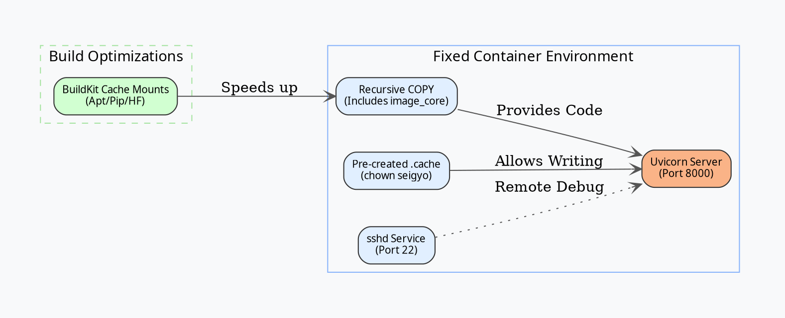

Based on our conversation, here is a summary of the problems you faced and the specific changes required to fix your Dockerfile for a stable, high-performance environment.

### 1. Summary of Problems Faced

*   **Incomplete Source Copying:** Using `COPY parser/*.py` only copied files in the root of the `parser` folder. This caused `ModuleNotFoundError` because the `image_core` subdirectory was missing inside the container.
*   **Missing Python Dependencies:** Several external libraries required by your code (like `langchain-openai`, `fastapi`, `pydantic`, and `uvicorn`) were not installed, leading to runtime crashes.
*   **Permission Denied for Caches:** vLLM and FlashInfer attempt to write to `/home/seigyo/.cache`. Since these directories didn't exist or were owned by `root`, the application crashed with a `PermissionError` when run as the `seigyo` user.
*   **SSH Server Absence:** While port 22 was exposed, the `openssh-server` was neither installed nor running, and the user password was not set, making VS Code remote connection impossible.
*   **Slow Build Times:** Heavy downloads (Apt packages, Pip wheels, and Hugging Face models) were being re-downloaded on every build instead of using BuildKit's persistent cache.

---

### 2. Visualization of the Fixes

This diagram illustrates how the components now interact correctly after the fixes.



---

### 3. Required Changes to the Dockerfile

#### A. Fix Source Copying
**Change:** Copy the entire directory instead of just `.py` files.
```dockerfile
# BEFORE: COPY parser/*.py ${APP_HOME}/
# AFTER:
COPY --chown=seigyo:seigyo parser/ ${APP_HOME}/
```

#### B. Complete Python Dependencies
**Change:** Add all missing libraries to your `pip install` command.
```dockerfile
RUN --mount=type=cache,target=/root/.cache/pip \
    python3 -m pip install --break-system-packages \
      "mineru[core]==3.4.4" \
      requests python-dotenv langchain-openai \
      pydantic fastapi "uvicorn[standard]" python-multipart
```

#### C. Fix Cache Permissions
**Change:** Pre-create cache folders and assign ownership to your non-root user.
```dockerfile
RUN mkdir -p /home/seigyo/.cache/vllm /home/seigyo/.cache/flashinfer /home/seigyo/.cache/huggingface && \
    chown -R seigyo:seigyo /home/seigyo && \
    chmod -R 755 /home/seigyo/.cache
```

#### D. Enable SSH Access
**Change:** Install `openssh-server`, set a password, and start the service in your entrypoint.
```dockerfile
# In Dockerfile:
RUN apt-get update && apt-get install -y openssh-server && \
    echo 'seigyo:seigyo@rikiseisan' | chpasswd

# In your start-parser script:
/usr/sbin/sshd
exec python3 -m uvicorn server:app --host 0.0.0.0 --port 8000
```

#### E. Optimize with BuildKit Caching
**Change:** Use `--mount=type=cache` for `apt` and `pip` to avoid re-downloading heavy files.
```dockerfile
RUN --mount=type=cache,target=/var/cache/apt ... apt-get install ...
RUN --mount=type=cache,target=/root/.cache/pip ... pip install ...
```

---

### 4. Final Verification Steps

1.  **Build with BuildKit:**
    `DOCKER_BUILDKIT=1 docker build -t doc-parser-rikiseisan:latest .`
2.  **Reset Host Key (on Windows):**
    If you see "Host Identification Changed," run:
    `ssh-keygen -R "[10.160.144.101]:51027"`
3.  **Run with Port Mapping:**
    `docker run --gpus all -p 8000:8000 -p 51027:22 doc-parser-rikiseisan:latest`

These changes resolve the `ModuleNotFoundError`, the `PermissionError` during model loading, and the SSH connectivity issues.
