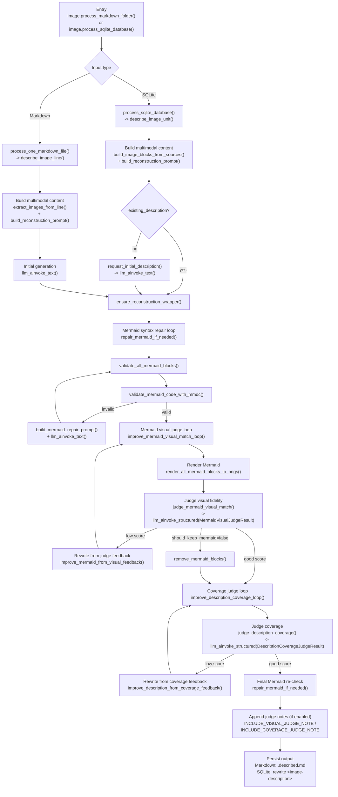

# Image Module Handoff

This parser image subsystem replaces Markdown image links (or `<image-unit>` blocks in SQLite) with reconstruction text generated by a vision LLM, then runs Mermaid + coverage judge loops to improve fidelity.

## File map

- `parser/image.py`
  - Compatibility entrypoint used by `parser/server.py` (`import image`).
  - Exposes mutable globals (model/base URL/concurrency/Mermaid toggles).
  - Syncs those globals into submodules, then delegates execution.
- `parser/image_core/pipelines.py`
  - Main orchestration for:
    - `process_markdown_folder()`
    - `process_sqlite_database()`
    - CLI `main()`
  - Handles file/DB traversal, task concurrency, and rewrite application.
- `parser/image_core/llm_judges.py`
  - `ChatOpenAI` client setup + invoke helpers.
  - Pydantic schemas and `with_structured_output` judge paths.
  - Mermaid repair loop + visual judge loop + description coverage loop.
- `parser/image_core/mermaid_media.py`
  - Markdown image parsing/path resolution/data URL helpers.
  - Mermaid block extraction, mmdc validation, PNG rendering.

## Runtime flow (high-level)

1. Build multimodal payload (image + instructions).
2. Generate initial reconstruction text.
3. If Mermaid exists: validate/repair, render, judge, improve.
4. Run coverage judge loop (missing/wrong text/elements).
5. Write result back to `.described.md` or SQLite `<image-description>`.

## Important integration note

If caller code mutates `image.py` globals (as `parser/server.py` does), always call through:

- `await image.process_markdown_folder(...)` or
- `await image.process_sqlite_database(...)`

These wrappers run the internal global sync before execution.

## Description Pipeline (Detailed Flow)

### Method-to-stage map (quick lookup)

- Entry/dispatch: `image.process_markdown_folder`, `image.process_sqlite_database`, `pipelines.process_markdown_folder`, `pipelines.process_sqlite_database`
- Per-image orchestration: `pipelines.describe_image_line`, `pipelines.describe_image_unit`
- Prompt/content assembly: `pipelines.build_reconstruction_prompt`, `mermaid_media.extract_images_from_line`, `pipelines.build_image_blocks_from_sources`
- LLM calls: `llm_judges.llm_ainvoke_text`, `llm_judges.llm_ainvoke_structured`, `pipelines.request_initial_description`
- Mermaid validation/repair: `llm_judges.repair_mermaid_if_needed`, `mermaid_media.validate_all_mermaid_blocks`, `mermaid_media.validate_mermaid_code_with_mmdc`
- Mermaid visual quality loop: `llm_judges.improve_mermaid_visual_match_loop`, `llm_judges.judge_mermaid_visual_match`, `llm_judges.improve_mermaid_from_visual_feedback`, `mermaid_media.render_all_mermaid_blocks_to_pngs`
- Coverage loop: `llm_judges.improve_description_coverage_loop`, `llm_judges.judge_description_coverage`, `llm_judges.improve_description_from_coverage_feedback`
- Persistence: `pipelines.process_one_markdown_file` (Markdown) and `pipelines.process_sqlite_database` + `pipelines.render_image_unit` (SQLite)
