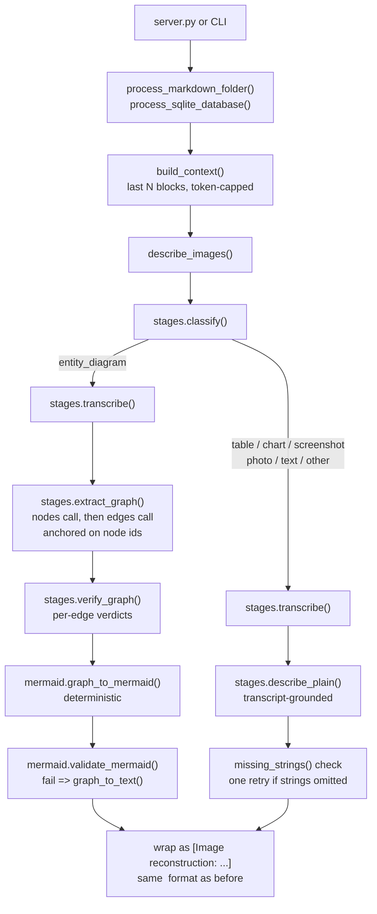

# Image Module Handoff

Replaces images in MinerU Markdown output or wiki SQLite databases with staged
text reconstructions, so a downstream text-only LLM can "see" them.

## Why staged (not one mega-prompt + judge loops)

The previous design (single giant prompt, then Mermaid repair / visual-judge /
coverage-judge LLM loops) is gone. Evidence basis:

- VLMs read node labels well but get edges/relations wrong when asked for
  everything at once ("Nodes Are Early, Edges Are Late", arXiv:2603.02865).
- Staged extraction with a confirmed node list measurably beats one-shot on
  flowcharts ("Arrow-Guided VLM", arXiv:2505.07864: 80%→89%).
- Mid-size open models (our gemma-class) drop to ~0.74 relation F1 one-shot
  ("Flowchart2Mermaid", arXiv:2512.02170).
- Mermaid is now emitted deterministically from an extracted graph, so syntax
  repair loops have nothing to repair.
- Structured outputs are schema-enforced by vLLM guided decoding
  (`response_format json_schema`, `guided_json` rescue) instead of parsed by hope.
  Thinking stays enabled; the grammar applies after the reasoning segment when
  the server runs a reasoning parser.

## File map

- `parser/image.py` — everything callers touch:
  - Module globals mutated by `parser/server.py` (model, URLs, toggles, context
    budget). Read into an `ImageConfig` at call time; no global syncing.
  - Markdown image helpers imported by server.py (`IMAGE_MARKDOWN_RE`,
    `find_image_line_indices`, `resolve_image_path`, `image_file_to_data_url`,
    `is_remote_url`, `get_response_text`, `normalize_invoke_url`).
  - Document-context builder (`split_context_blocks`, `build_context`).
  - `describe_images()` — per-image router shared by both pipelines.
  - `process_markdown_folder()` — MinerU `.md` → `.described.md`.
  - `process_sqlite_database()` + `main()` — fills empty `<image-unit>`
    descriptions in a working copy of a wiki SQLite DB, then invalidates FTS/vector
    indexes.
- `parser/image_core/config.py` — `ImageConfig` dataclass.
- `parser/image_core/llm.py` — langchain-openai wrapper: thinking client with
  no-thinking timeout fallback; `ask_text`; `ask_json` (json_schema →
  guided_json rescue). Structured-output failures raise; there is no fake-score
  fallback.
- `parser/image_core/stages.py` — Pydantic schemas + one function per LLM call:
  `classify`, `transcribe`, `extract_graph` (nodes then edges),
  `verify_graph` (per-edge audit applied in Python), `describe_plain`,
  plus deterministic `missing_strings` coverage check.
- `parser/image_core/mermaid.py` — deterministic `graph_to_mermaid` /
  `graph_to_text` emitters and one `mmdc` sanity check.

## Runtime flow per image

## Behavior notes

- Images are processed **sequentially in document order**; earlier replacements
  become context for later images. In the SQLite pipeline, document order comes
  from `follows`-edge chains (start node = no incoming `follows` edge); each
  description is spliced into the node body immediately and the rolling context
  window crosses node boundaries within a chain, so an image in chunk 3 sees the
  fresh descriptions from chunks 1–2. Same image in several nodes is described
  once (media-hash cache) and spliced everywhere.
- Context: last `CONTEXT_BLOCKS` blocks (line / table / image-unit units),
  trimmed oldest-first to `CONTEXT_MAX_TOKENS`. `CONTEXT_MAX_TOKENS=0` sends the
  image only. Env: `IMAGE_CONTEXT_MAX_TOKENS`, `IMAGE_CONTEXT_BLOCKS`; CLI:
  `--context-tokens`, `--context-blocks`. Context is terminology-only by prompt;
  base64 payloads are stripped before it is built.
- Relations are extracted from ANY visible cue (arrows, lines, touching,
  proximity, shared regions, color/legend, numbered references), not just
  arrows; containment becomes nested subgraphs.
- The `entity_diagram` route falls back to the plain route when extraction finds
  no entities or a stage raises.
- SQLite pipeline skips images that already have a description (legacy judge
  notes are stripped when checking).
- Call budget per image: entity diagram 5 calls, everything else 2–3.
  Old worst case was ~25.

## Server integration (unchanged contract)

`parser/server.py` sets `image.*` globals and calls
`asyncio.run(image.process_markdown_folder())`. It also imports the helpers
listed above. Do not rename these.

vLLM server side: run with a reasoning parser (e.g. `--reasoning-parser`) so
guided decoding applies after `</think>`; without it, structured calls still
work but the model answers in-schema without a thinking segment.
